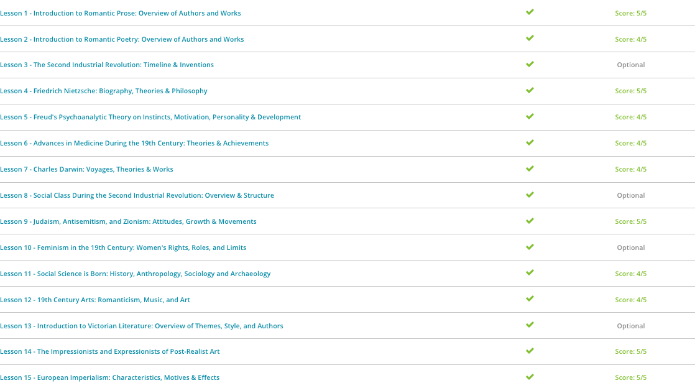

### Andrew Garber
### May 18 2023
### 1871 to 1914

#### Friederich Nietzsche
 - Nietzsche was born in 1844 in Röcken bei Lützen, a small town that was then part of the Prussian Empire in Saxony (modern-day Germany). Propitiously born on the same day as the Prussian King Friedrich Wilhelm IV, Nietzsche was named after his monarch.
 - Despite the good fortune that coincidence should have dictated, Nietzsche's early life was fraught with tragedy. His father, a local Protestant minister, died when Nietzsche was only five years old. His younger brother died six months later. Without his father's connection to Röcken as the town minister, Nietzsche and his mother moved in with Nietzsche's maternal grandmother and aunts in Naumberg an der Saale.
 - At 14, Nietzsche received a scholarship to attend a prestigious boarding school, originally intent on following his father and most of the men in the family by becoming a clergyman. He continued on this track after he graduated from boarding school, entering the University of Bonn in 1864 to study theology and philology. As his studies continued, however, he became more interested in philology and eventually dropped studying theology entirely.
 - As Nietzsche matured, he began writing papers and articles analyzing ancient texts. He became close friends with the composer Richard Wagner and entered into the elite intellectual circles of 19th-century Germany. He also spent an abortive year in the Prussian military where he gravely injured himself, allowing him to return to his university studies quicker than expected.
 - In 1872, he published his first work: The Birth of Tragedy, Out of the Spirit of Music. In it, Nietzsche identified certain factors within the human personality which make it impossible for man to adequately enjoy himself in modern society.
 - These 'Dionysian' energies, as he termed them, are naturally self-destructive and usually unconscious impulses the person has little control over. Over time, according to Nietzsche, these impulses have been contained by a societal tendency to encourage sobriety and rational thinking. This attempt at control, Nietzsche claimed, was unhealthy for both the body and mind - a superficial order imposed upon a naturally chaotic existence. Nietzsche continued this fight against what he considered unnatural order throughout his intellectual works. In his three-part 1883-1884 work, Thus Spoke Zarathustra, A Book for All and None, Nietzsche attacked the existing religious order and the values it had imposed upon contemporary society. According to Nietzsche, the ideal, virtuous man as preached by the Judeo-Christian world is irrelevant to reality as he is never found in the world.
 - Nietzsche rejected the religious idealism of yearning to be good in God's eye because he claimed God - if he ever existed at all - removed himself from the world soon after its creation. Longing for an idealism that did not exist was counterproductive to realizing man's actual potential. Indeed, according to Nietzsche, because nothing existed beyond this world, pain, suffering, and distress were not something to be endured in the hope of a better life in the next world but the features of this world that let us know we are truly alive.
 - While Thus Spoke Zarathustra was highly controversial in its day, arguably his most influential work was published in 1901 after his death. Based on his notes collected by his sister Elisabeth, the work The Will to Power continued to influence anti-idealists and existential philosophers throughout the 20th century. Whereas Thus Spoke Zarathustra was riddled with self-reflection and literary devices that made Nietzsche's purpose and meaning rather vague at times, The Will to Power was his anti-idealist and nihilist ethos masterfully laid out.
 - In it, Nietzsche rejected any law, code, or philosophy that had been artificially imposed upon humanity, namely the doctrines of Christianity. When a man achieves the ability to shirk these artificial constructs, he is no longer just a man, according to Nietzsche, but what he terms as a 'superman.' The highly theoretical work also posits that reality itself may not exist at a deeper level than what we see, and that the only thing certain to exist is the differences between objects and the endless push and pull between unnatural laws and our inner nature.
 - *My Personal Opinion On Nietzsche's Philosophy* I think his philosophy, specifically that of the ubermench, is extremely compatible with that of the Stoics in their drive for self-improvement - despite Nietzsche's outward disdain for Stoic Philosophy. 

#### Freud
 - Freud described two types of instincts. Life instincts are one motivational drive described by Freud. Freud also uses the term libido, or sexual energy, for life instincts. Life instincts serve the purpose of survival and encourage growth, development, and creativity. Freud considers all pleasurable acts life instincts. Death instincts are another type of motivational drive described by Freud. Death instincts account for our aggressive tendencies. Freud believed that managing this aggression is a major challenge of human nature.
 - Freud took his theories on personality and used them to form a developmental theory. He called this theory psychosexual development. Freud postulates five stages of chronological development that begin in infancy. These stages are oral, anal, phallic, latency, and genital. Key developmental tasks are characteristic of each stage. Freud believed the first three stages are the most important. These three stages occur before the age of six and form the foundation for personality development.

#### Medical Advances
 - Fortunately for us, medicinal practices and knowledge changed dramatically in the 19th century. One of the most important revolutions in medicine in the 19th century was the development of cell theory. Though cells were first discovered by Robert Hooke in the 17th century, it was not until the 19th century that advances in microscope technology allowed scientists to observe live cells for the first time. Cell theory, or the idea that all life on earth is made up of cells, grew out of this ability.
 - Numerous scientists began using the microscope to classify different types of cells and recognize the parts of each. With this cornerstone of medical knowledge achieved, scientists and doctors were able to discover myriad different things about the human body and disease. For instance, one prolific 19th century doctor, Rudolf Virchow developed theories concerning growth and reproduction, including egg fertilization, through studying cells. He also was the first doctor to realize that cell mutation and runaway cell growth was what caused cancer, perhaps becoming the first doctor to identify the disease which still plagues humanity today.
 - A concurrent and complimentary theory which emerged from the increased study of the human body and health was germ theory, the idea that sickness and disease is caused by microorganisms and can be spread from one person to another through the spread of infectious agents. Prior to the 19th century, mankind was relatively in the dark about what caused disease. Some thought the diseases generated spontaneously, while others contributed disease to foul-smelling air. However, in the 19th century, the enhanced power of the microscope and the enterprising research done by various sciences changed these conceptions.
 - For example, Louis Pasteur, a French chemist, first demonstrated that there are microorganisms everywhere - even in the air we breathe. Pasteur also pioneered the process which still holds his name today: pasteurization, or the heating of milk to kill the microorganisms which cause milk to go sour. Others contributed as well, such as the German Robert Koch, who successfully identified the bacteria that caused anthrax, cholera and tuberculosis. Koch also pioneered the first vaccines for these diseases and developed a system that allowed early doctors to test whether a bacteria was a disease-causing agent.

#### Darwin
 - Born in Shrewsbury, England, in 1809, Charles Darwin was the son of the local doctor and grandson of a famous botanist. His mother, Susanna, died when Darwin was only eight. Intending to follow in his father's footsteps, Darwin entered the University of Edinburgh in 1825, intending to apprentice as a doctor. Darwin went on to study at Cambridge, where he took an avid interest in the natural world and received a Bachelor of Arts degree in 1831.
 - After graduation, Darwin was unemployed only a short while, as his friend, mentor, and former professor John Henslow recommended him for a position aboard the H.M.S. Beagle as the ship's naturalist. The Beagle was slated to begin a five-year exploration of the world, and Darwin jumped at this opportunity of a lifetime.
 - The Beagle set sail on December 27, 1831. Over the course of the long sea voyage, Darwin had an enormous amount of free time in between ports to read, study, and think. Most importantly, Darwin later recounted that he had read Charles Lyell's Principles of Geology, which contradicted the contemporary belief that the world had been constructed in seven days by God, approximately 6,000 years ago. Lyell claimed that fossil evidence and geological formations suggested that the Earth was formed over a far longer period of time and was likely much older.
 - Darwin's major breakthrough came in the South Pacific when the Beagle stopped for supplies at the uninhabited Galapagos Islands. There, Darwin noticed that each island had its own species of finch, differentiated by beak size, shape, coloring, and other characteristics. Darwin realized that each species of finch possessed a beak that was tailored to enable the finches to crack the nuts, berries, or other food items present on each island.
 - When Darwin returned to England, he began publishing his findings concerning the Galapagos finches and his other observations of flora, fauna, and geology from his travels. He also personally explored theories as to how the finches could have come to have such different beaks.
 - Darwin worked on various theories for over 20 years. He eventually arrived at the idea of natural selection, meaning that each animal or plant which possessed the traits best suited to its environment were more likely to survive and thrive than other animals or plants with less advantageous traits. These traits can be anything: from size to coloration and everything in between.
 - Most importantly, according to Darwin's theory of natural selection, these more successful plants and animals were more likely to reproduce, thereby spreading their advantageous traits to the next generation, while the unsuccessful animals would die out. Over time, nature naturally selected the strongest, most fit members of each species, shaping each animal to its environment.
 - Darwin published his theory of natural selection in his 1859 work On the Origin of Species By Means of Natural Selection. Though Darwin waited over 20 years after his return to England to publish his theories, he probably arrived at the ideas long before publication. He bided his time, likely out of fear of potential backlash. After all, his theories concerning natural selection turned the contemporary, biblical interpretation of natural history on its head, even suggesting by logical extension that perhaps man, too, evolved over millions of generations, rather than being created as he was by a divine creator in the not-so-distant past.
 - Darwin's fears were well-founded. Darwin's book was highly controversial after its publication, and his theories were attacked by some contemporary scientists and especially religious figures. Despite these initial reactions, Darwin's theories gained acceptance within the scientific community relatively quickly. Indeed, others had been thinking along these same lines. For example, Darwin first revealed his theory of natural selection in 1858 at a meeting of the Linnean Society along with a fellow naturalist who had similar ideas, Alfred Wallace.

#### Judaism, Antisemitism, Zionism
 - Even prior to the 19th century, Jews had lived a pretty rough existence in Europe. Descendants of an ancient people who likely held an empire in the western Middle East, Jews had dispersed throughout Europe over the two millennia after the collapse of the Israelite Empire. They were often suspected of subterfuge and were periodically treated harshly throughout the continent.
 - In 1290, for example, King Edward I of England expelled all Jews from England, and they were expelled from France several separate times in the 14th century. Other nations periodically refused Jews entry or expelled the Jewish population at various times as well. Other draconian laws on Jews were passed in this period, too, including barring them from marrying or banning their Yiddish language.
 - Episodes of popular religious violence were also directed against Jews periodically. Seized by a religious fervor, medieval and early modern Christians at times attacked Jewish settlements or families claiming to exact revenge for the murder of Jesus Christ, whom the Bible claims was condemned by Jewish priests and elders.
 - Throughout the Medieval and Early Modern periods, Jews also gained a bad reputation as loan sharks and usurers. Though a small portion of the population was involved in money lending, it was by no means as widespread a practice as medieval Christians believed. However, so prevalent was the stereotype that Jews were admitted back into England in 1657 because the English state and the Lord Protector, Oliver Cromwell, were in bad need of a loan! 
 - However, as the Enlightenment and the Industrial Revolution radically changed Western society, there were reasons for Jews to be optimistic. Enlightenment ideas concerning universal equality tempered prejudices against Jews, and in France in 1830, Judaism was even recognized as an official religion acceptable to the state.
 - Unfortunately, antisemitism survived, especially in Germany and in Eastern Europe. Familiar tropes of antisemitic rhetoric and violence often appeared during periods of economic downturn when Europeans were seeking a scapegoat for their problems. For example, many of the political problems surrounding the unification of Germany in the 1860s were blamed by nationalist German writers on an international Jewish conspiracy that feared a unified Germany. Baseless accusations like these fueled antisemitism in Europe.
 - This rabid antisemitism throughout the continent in the 19th century is perhaps best encapsulated by the Dreyfus affair of the 1890s. A French military officer, Dreyfus was accused of selling military secrets to Germany. He was convicted less because of the evidence against him, which was flimsy at best, and more because of the strong antisemitism that existed in France. When the journalist  Emile Zola exposed the French government's antisemitic bent and lack of real evidence, Dreyfus was released after serving two years in prison.
 - Despite these displays of antisemitism in Central and Western Europe, nowhere was antisemitism more prevalent than in Russia. Russian Jews were held responsible for the assassination of Tsar Alexander II in 1881, despite it clearly being the work of socialist revolutionaries, and violence against Jews across the country began in earnest. Thousands of Jews died across Russia in the final decades of the 19th century, often at the hands of mobs of non-Jewish Russians. In 1894, violence against Jews in Russia became state-sanctioned when the heavily antisemitic Tsar Nicholas II took the throne and blamed nearly every political, economic, and social problem in Russia on Jewish subterfuge.
 - A product of the considerable antisemitic views in Russia and Europe in general, The Protocols of the Learned Elders of Zion was published in 1903 in Russia. A forged hoax, the work purportedly revealed a Jewish plot for world domination in the 20th century. The forged propaganda fueled further violence against Jews in Russia, and antisemites across Europe believed ardently in its authenticity.
 - In reaction to this considerable persecution, many Jews began to believe the only way to ensure their own and their community's safety was to begin organizing in solely Jewish enclaves. Many of these same Jews also believed in Zionism: the belief that the Jewish people should return to the Holy Land and establish a Judaism-centered state. By the mid-19th century, this region was largely inhabited by Arabs, many of whom were Muslim. The few Jews already living there were largely concentrated in Jerusalem.
 - As the Zionist movement grew, large groups of Jews began migrating to the Holy Land in the 1880s and setting up Jewish agricultural settlements. Only a decade later, Theodor Herzl began publishing a magazine promoting the creation of a Jewish state and held the first Zionist Congress in Switzerland in 1897. Herzl was the man whom many consider the founder of political Zionism.
 - Despite offers of territory in Africa from colonial Great Britain, Zionists wanted control of their ancestral territory in the Holy Land. Indeed, another large wave of Jewish immigration to the Holy Land from Eastern Europe took place when violence against Jews escalated once again in Russia after the publication of the The Learned Elders. Many of these new settlements were bankrolled entirely by wealthy European and American Jewish families, who believed the only way to save Jews in Europe from total extinction was emigration.

#### The advent of Social Science
 - What changed in the 19th century was the technique of history. Prior to the 19th century, any book written about a past event and claiming to be accurate was generally considered history, regardless of the authenticity of the evidence used to substantiate the book's claims. However, this changed with the life work of a German historian, Leopold von Ranke. Von Ranke emphasized the heavy use of primary sources; that is, accounts of events written by eyewitnesses and those actually experiencing such events. Without these, von Ranke claimed, it was impossible to get to the truth of the actual events.
 - Unlike history, which needed significant tweaking to be considered a modern social science, prior to the 19th century archaeology did not exist at all. Indeed, archaeology, or the study of prehistoric human society and the artifacts it left behind, was only of interest to anyone after the evolutionary theories of Charles Darwin had been largely accepted by the intellectual community.
 - Archaeology owes a good deal of its 19th-century start to the exploits of Napoleon Bonaparte, who was enamored with Egypt. After Bonaparte's French armies took control of Egypt in 1801, Bonaparte led a second figurative army there shortly after - this one made up of over 500 hundred scientists, chemists, and other intellectuals. Bonaparte's massive excavations and findings of various artifacts of ancient Egypt, including the famous Rosetta Stone, spurred interest in not just ancient Egypt but ancient human society in general.
 - Perhaps nowhere did modern archaeological practices advance the furthest than in England during the 19th century. There, early amateur archaeologists, like Richard Colt-Hoare and William Flinders-Petrie, developed delicate excavation techniques that preserved the artifacts as much as possible during the digging. Additionally, these men and their colleagues also kept scrupulous records, which aided in the analysis of those items.
 - Much of this analysis and theorizing behind what the early archaeologists found was done by intellectuals engaged in a similarly new discipline: anthropology, the study of mankind's origins, development, and beliefs. Theorizing about humanity's past became necessary even before Darwin's evolutionary theories; in the early 19th century, archaeologists began discovering human remains and artifacts, which, even without the benefits of modern dating technology, were clearly far older than the Bible suggested they should be. Darwin's theories later in the century suggested a basic framework for how man evolved. From there, anthropology took the torch and attempted to explain how early human societies had formed.
 - 19th-century anthropologists often explained early human society through the evolutionary lens, which was popular due to Darwin's theories. For example, early human technology and industry was first classified by the Danish archaeologist Christian Thomsen, who claimed humanity began in the Stone Age and then graduated over time to the Bronze Age and the Iron Age.
 - ust as Western intellectuals were beginning to theorize about humanity's earliest societies, scholars were beginning to discuss where contemporary society was headed. Sociology, the field of studying current society and possibly predicting future society, was pioneered by the Frenchman Auguste Comte, who coined the term in 1838. Comte believed that the scientific principles and objective investigation scientists were using to discover the universe's natural laws could similarly be applied to analyzing society. He envisioned a world where the leading men of society enlisted an army of sociologists to help educate the populace and improve living standards across society.
 - As a fledgling discipline, sociological works in the 19th century often included strains of other disciplines, such as history and philosophy. Much of Karl Marx's work, for example, is often simultaneously classified as philosophy, economics, and sociology. Like Marx's work, most early sociological works identified inequalities or wrongs in society as perceived by the author, while also proposing future fixes to these problems. By the late 19th century, sociology began to be taught in many Western universities.

 