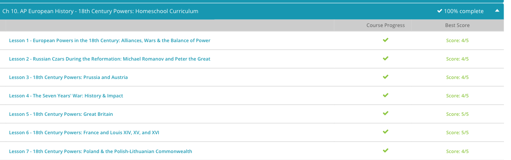

### Andrew Garber
### March 16
### 18th Century Powers

#### Balance of Power
 - The last Habsburg king of Spain, Charles II, died in 1700. He left no heirs, and because he had been greatly influenced by France, he willed his throne to Philip, the duke of Anjou, a Frenchman. This didn't set well with the Habsburg Leopold I of Austria, who had his eye on the throne for his son. France's Louis XIV supported Philip, who was his grandson. Before long, France and Austria found themselves in the midst of a war over who would sit on the Spanish throne.
 - Other countries quickly joined in. Great Britain and Prussia both sided with Austria. They didn't care for France's ambition. Spain actually allied with France. The Spanish people were perfectly willing to accept Philip as their king.
 - The War of the Spanish Succession lasted from 1701 to 1714 and was finally settled by the Treaties of Utrecht and Baden. Philip was allowed to remain on the throne, but he had to give up his place in French succession. Great Britain, which ducked out of the war a bit early, won some territory and a valuable contract to supply slaves to Spain. Austria received the Netherlands as a consolation prize, and Prussia's Frederick II received the title of king.
 - A shaky peace prevailed among the four major players until 1740, when Maria Theresa ascended to the Austrian throne. Frederick of Prussia saw a prime opportunity to grab some Austrian territory that he had had his eye on for quite some time, and his army marched into Silesia at the end of 1740. Maria Theresa wasn't about to accept that. She raised an army and set out to fight, and the War of the Austrian Succession began.
 - The two combatants were soon joined by allies. France sided with Prussia, while Great Britain, which was already at war with Spain over trade conflicts, supported Austria. Maria Theresa managed to save most of her Austrian lands, but no matter what she tried, she couldn't force Frederick out of Silesia. The 1748 Treaty of Aix-la-Chapelle confirmed Frederick's possession of Silesia and Maria Theresa's retention of her other traditional territories, but it left the Austrian monarch smoldering for revenge and did nothing to decrease the ever-growing tension between Britain and France.
 - This war put Prussia on the map as a near first-rate power in European politics, and fortified the ever militarized culture of Prussia. In the words of Voltaire, "While most states have an army, the Prussian army has a state."
 - Not surprisingly, war broke out again only eight years later in 1756. Frederick knew how badly Maria Theresa wanted Silesia back, but he wasn't about to let her have it. The Austrian monarch had recently made an alliance with her former enemy, France, and another deal with Russia for 80,000 troops. Frederick decided that he had better not wait any longer, and he made a preemptive strike into Saxony, between Prussia and Austria, on August 29, 1756, thus beginning the Seven Years' War.
 - Frederick found himself in a tight spot. He was surrounded by enemies, and his ally, Great Britain, was providing only monetary support. When Russia suddenly backed off, the Prussian king was able to win some stunning victories, but his triumph soon turned to near despair when the Russians returned. In the end, the 1763 Treaty of Hubertusburg allowed Frederick to keep Silesia, actually strengthened Prussia (which was now allied with the fickle Russia), and weakened Austria in the European balance of power.
 - Meanwhile, Britain was busy fighting France, especially in North America, where the conflict was called the French and Indian War. Britain started off strong with several naval victories that prevented a French invasion. The British then proceeded to snatch the French Canadian towns of Louisbourg, Quebec, and Montreal. They also swept through French colonies in the West Indies and captured a French base in India. Finally, the 1763 Treaty of Paris allowed Britain to keep all of France's North American colonies, while France regained its territories in the West Indies.

#### Russian Czars During the Reformation
 - In 1613, an assembly of Russian aristocrats declared Michael Romanov the new Czar of Russia. Michael, only 16 years old, was related to a previous czar through his mother, though he and his mother had been exiled from Moscow for nearly a decade. When Michael took the throne, he had his work cut out for him perhaps more than any other 16-year-old in history! Indeed, Russia was in a shambles. After the 1605 death of Boris Godunov, who had taken the throne for himself after being adviser to the Czar, central authority in Russia had disintegrated.
 - Multiple claimants to the throne vied for power, and the Russian landed aristocracy wavered back and forth between the would-be czars. To make matters worse, Russia's neighbors, Poland and Sweden, were exploiting Russian weaknesses to carve out Russian territory for themselves and creating chaos by throwing their own weight behind claimants that best suited their interests.
 - Michael's first task as czar was defeating the Western invaders, which had carved up portions of Western Russia for themselves. Sweden and Poland were both defeated within five years, and afterward, Michael's exiled father was allowed to return to Russia. Michael was not a particularly strong personality, and both his father and mother greatly influenced the early years of his rule. Nonetheless, under Michael's reign, the Russian economy improved and agriculture rebounded significantly.
 - Czar Michael was the first czar to invite the development of foreign industry and investment in Russia; for example, it was under Czar Michael that a Dutch company built a firearms manufacturing operation in Tula, Russia, a city which remains a hub of firearms manufacturing to this day. Czar Michael also oversaw the reorganization and education of the Russian military class in the 1640s - a precursor to the institution of a standing army. Michael died of an illness, which historians have yet to exactly identify, in 1645.
 -  While Michael Romanov was the first Romanov Czar of Russia, the reign of Peter I some decades later was quite possibly the greatest rule by a Romanov czar, earning Peter the nickname 'Peter the Great.' Like Michael, Peter spent his adolescence in exile. Though technically a joint czar with his half-brother, Ivan, Peter was virtually ignored by the Moscow elite. The exile allowed Peter to spend a great deal of time reading and learning - an education which greatly helped him later in life.
 - When Ivan died in 1696, Peter succeeded to the throne as Czar Peter I. Peter began his reign by breaking the power of those who had once excluded him, centralizing authority in himself and in the position of czar. Then Peter promptly went on a European tour of sorts, traveling in disguise at times while visiting shipyards, museums, schools, and other sites, all in an effort to learn about European practices.
 - When Peter returned, he was determined to implement some of these European policies to modernize Russia and make it a true European power. He sent young aristocratic boys to Italy to learn from master shipbuilders in order to construct a Russian navy. Even before his navy could set sail, however, it needed a port. To do this, Peter reorganized the Russian military, making it more efficient, better drilled, and making its offices more meritocratic. He then went to war several times with the Swedish Empire until he had won Russia a port on the Baltic Sea.
 - This port was not merely a place where Peter could dock his newly built navy. In addition, Peter used the port to encourage Russian trade with larger European powers to the West. Not only did trade increase, but Peter also fostered the growth of industry in Russia in an attempt to Europeanize the Russian economy. Peter also Europeanized the Russian aristocracy, forcing Russian nobles to cut the long beards typical of Russian nobility and conducting his court in a fashion more closely resembling France or England than his Russian predecessors.

#### Prussia and Austria
 - Prussia was a strange little country. For most of its life, it was all split up. Ducal Prussia in the East was held by the Elector of Brandenburg, while royal Prussia in the West was part of Poland. By the beginning of the 18th century, the Hohenzollern family held firm control over both Brandenburg and Ducal Prussia, but it was always seeking to expand and collect more territory. In 1701, Elector Frederick III received the title 'King in Prussia' as a reward for helping the Holy Roman Emperor and Austrian ruler Leopold I, and the Kingdom of Prussia officially began.
 - Over the next several decades, Prussia grew in power, politically and militarily. The next king, Frederick William I, who reigned from 1713 to 1740, built up a massive army. He started out with about 38,000 soldiers in 1713, but by the time of his death, Prussia was a military powerhouse with over 80,000 well-trained soldiers.
 - The king's successor, Frederick II, at first seemed unlikely to make good use of all that military might. The new king styled himself as an 'enlightened' monarch. He studied the ideas of the Enlightenment, wrote essays on political philosophy, played and composed music and patronized the arts. 
 - Meanwhile, in Austria, Leopold I of the Habsburg family held sway until 1705. He was followed quickly by two sons, Joseph I, who died in 1711, and Charles VI. Charles VI soon faced a problem. His only son died in infancy, and he was left with two daughters. His late brother, Joseph I, also only had two daughters. With no male heirs, Charles was left wondering who would reign in Austria. Basically, women could be the ruler only in last resort.
 - After the War of Austrian Succession and the following Seven Years' War, both sides were plainly exhausted. After the war, Prussia and Austria both set about making reforms at home. Frederick rebuilt his country's economy, boosted agriculture, standardized education, introduced a new law code and supported the growth of the arts and sciences. In 1772, he finally annexed royal Prussia, uniting his territories and strengthening his nation even further. Frederick died in 1786, leaving his throne to his nephew Frederick William II.
 - In Austria, Maria Theresa died in 1780, and her son Joseph II assumed the throne. He considered himself an 'enlightened' monarch like Frederick, and he developed a series of social and legal reforms. When he died in 1790, his brother Leopold took over. By this time, both Austria and Prussia were looking nervously towards France, which was in the midst of the French Revolution. Soon the two old enemies would find themselves united against a new power: revolutionary France.

#### Britain
 - Politically, the 18th century was an active era for England. In 1707, the Act of Union officially created Great Britain by uniting Scotland and England. Around the same time, two political parties were gaining power: the Whigs, who were typically liberal, focused on internal reform and placing more power in the hands of the people, and the Tories, who tended to be conservative, were devoted to concentrating power in the hands of the monarch and government. As the century progressed, the Whigs, supported by the Hanover kings, became dominant, while the Tories, some of whom supported the Jacobites, faded into the background. Leading Whig ministers of the day included the powerful Robert Walpole and William Pitt.
 - Great Britain was a rapidly growing nation in the 18th century. Its population doubled between 1721 and 1821, jumping from 7.1 million to 14.2 million. The economy was already strong as the century dawned due to steady agriculture, a solid commercial and manufacturing sector, and several scientific advances. As the century progressed, industrial development skyrocketed, especially in the iron and textile industries. Factories sprang up across the country, boosted by new discoveries in manufacturing techniques and fuel sources. Transportation networks spread rapidly. Cities boomed. Trade blossomed. Even agriculture continued to expand in productivity. Britain was well on its way to becoming a fully industrialized nation.
 - In this same time period, the South Sea Company headed by John Blunt was formed. The company was a joint-stock company, which meant that it was owned by a group of investors who bought shares in the company. The company was formed to trade in the South Seas, but it quickly became a bubble. The company's stock price rose dramatically, and many investors bought shares in the company. When the company's stock price fell, many investors lost their money. 
 - By this time, Britain was already starting to have some problems with its 13 North American colonies. Colonists were quickly becoming tired of taxes and British heavy-handedness. The mother country insisted that the colonies should help pay for the recent wars, and between 1764 and 1767, it imposed a series of taxes on such products as sugar, tea, and stamps. Colonial voices quickly raised the cry of 'No taxation without representation!'
 - Britain backed down for the most part, repealing all the taxes except for the one on tea, but the rebellious colonial spirit only grew, breaking out in the Boston Tea Party on December 16, 1773, when upset colonists tossed 342 chests of tea into Boston Harbor. Repercussions fell quickly, but they only increased colonial resistance. War soon broke out, and the colonists declared their independence on July 4, 1776. In 1783, the British army surrendered at Yorktown. The American Revolution was over, and the humiliated Britain withdrew from the new United States of America and went home to deal with new issues and threats, including ever-growing industrialization, Irish rebellion, and soon, a new conflict with revolutionary France.

#### Poland & Poland-Lithuania
 - Poland was a rather odd country both in composition and in government. First off, what we call Poland was actually the Polish Lithuanian Commonwealth. In 1569, the Union of Lublin had officially united the Kingdom of Poland with the Grand Duchy of Lithuania. The result was a republic of sorts.
 - Poland's king was elected by the nobility and sharply limited in his powers. He could not make war or peace; he could not collect taxes; and he could not change any laws. Those duties were left to the Polish legislature, which was called the Sejm. Made up of completely nobles, the Sejm met every two years and functioned on the basis of a consensus rule. In other words, if one member didn't approve a potential law, he could independently kill it by veto. Nothing became law unless every member of the Sejm agreed.
 - This system was often abused, for members could be bribed to use their veto power generously. Further, when the nobles elected the king, they were inclined to choose someone, often a foreigner, who was unlikely to challenge them too much. With such a system of government, as well as a lack of both a national army and a strong national policy, Poland opened its door wide to foreign influences on all sides.
 - Foreign powers were only too happy to walk right through that open door, and that put Poland right in the middle of all sorts of conflicts. For instance, when Russia and Sweden went to war in the 17th century, Poland ended up a battle ground militarily and politically. At one point, Russian, Swedish, Prussian, Cossack, and Transylvanian armies all invaded Poland in one fell swoop. The already weak Poland found itself on a swift downhill slide.
 - In 1697, Polish nobles, bribed by Russia, Prussia, and Austria, elected Duke Augustus of Saxony as their king. Augustus II, as he was known, allied himself closely with Russia and quickly led Poland into the middle of another war between Russia and Sweden. When the Swedish won a decisive victory in 1704, they put Stanislaw Leszczynski on the Polish throne. The Russians returned the kingship to Augustus in 1709.
 - By 1717, a conflict between Augustus and the Sejm led Poland to the brink of civil war. Russia quickly stepped in to 'mediate' and basically told the nobles to shut up. Poland was placed under Russian protection as a 'client state.' Foreign influence further increased in 1732, when Russia, Prussia, and Austria formed the Alliance of the Three Black Eagles to make sure that Poland remained weak and controllable.
 - After settling the civil war in Poland, the Russians turned aggressively toward Austria. Prussian king Frederick II decided that the best way to calm everyone down was to give each country a little treat, namely, part of Poland. By this time, Poland was too weak to resist, and Frederick himself had his eye on some Polish territory for a quite a long time anyway - he saw his chance and he took it.
 - On August 5, 1772, Russia, Prussia, and Austria signed a treaty to partition Poland for the first time. The members of the Sejm ratified the treaty with Russian troops standing by to squash them if they refused. In an instant, about a quarter of Poland's territory and about half of its population passed into Russian, Prussian, and Austrian hands.
 - The remaining Polish people were shocked and horrified. Some of them decided that they had better make some changes if they wanted to keep the rest of their country. In 1791, when Russia was distracted by a war with Turkey, the Sejm passed a new constitution that replaced consensus rule with majority rule, created a standing army, made Catholicism the state religion, and improved the condition of the Polish peasants.
 - Of course, others opposed these reforms and called on Russia for help. The Russian army quickly crushed the Polish defenders of the new constitution. As punishment, Russia, joined by Prussia, partitioned Poland for a second time in 1793, reducing Poland to only a third of its original size and population.

