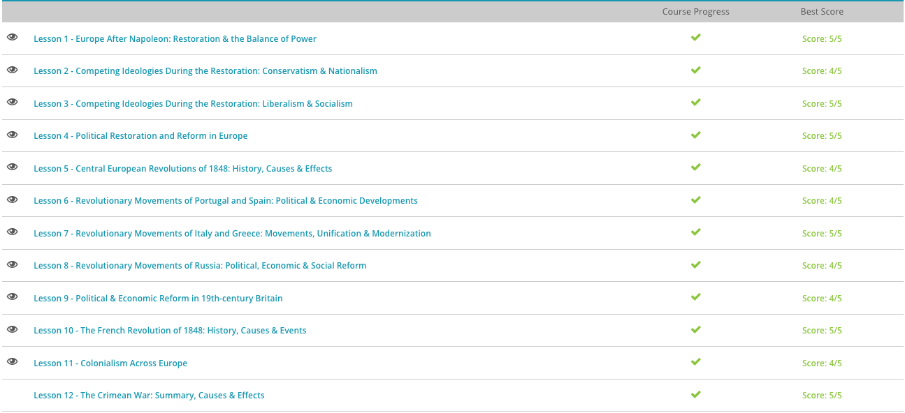

### Andrew Garber
### April 6
### 19th Century Revolutions

#### Europe after Napoleon
 - The decade of Napoleonic and French dominance in Europe left the leaders of Europe with significant questions concerning what post-Napoleonic Europe would look like. In response to the end of the French Empire, the powers that had defeated Napoleon convened the Congress of Vienna in September of 1814 to determine how the territories France had conquered would be divided.
 - The main objectives of the congress were to divvy up territory in a way that pleased all parties and created a balance of power such that pan-continental conflict would become impossible. Additionally, the congress sought to restore the French Bourbon monarchy, return the borders of Europe as much as possible to its pre-1793 boundaries, and eliminate the possibility of events such as the French Revolution from happening elsewhere in Europe.
 - Regardless of the desire to return Europe to its pre-1793 boundaries, certain geopolitical conditions made this impossible. For example, the Holy Roman Empire, a loose conglomeration of German and central European states, had ceased to exist after Napoleon's conquest. In its place, the congress created the German Confederation, which consisted of 39 German-speaking states formerly of the Holy Roman Empire.
 - Other territorial changes were made as well, and several were made in the interest of creating a 'balance of power' in Europe in which the power of all other states would preclude the aggression of a single state, thereby making aggressive wars, such as Napoleon's, that much harder to successfully execute. For example, within the new German Confederation, Prussian power and territory was expanded westward to provide a powerful opponent on France's eastern border. For partially the same reason, the Netherlands and the Southern Netherlands (ruled by Austria prior to the 1793 French conquest) were reunited under the Dutch House of Orange, further solidifying another state on France's eastern frontier.
 - As Prussian power was expanded in northern Germany, Austria was given further territory in what is today northern Italy to expand Austrian power in opposition to Prussian power. Poland, which had been annexed out of existence in the late 18th century, was reconstituted but placed firmly under Russian control. France, meanwhile, was stripped of all territorial acquisitions it had made since the beginning of the French Revolution in the 1790s. France, however, maintained all of pre-Revolutionary France, largely due to the achievements and influence of France's representative at the congress, Charles-Maurice de Talleyrand.

#### Conservatism vs Nationalism
 - Nationalism for a single person is the pride in oneself and those who share like traits. This usually refers to all the citizens of a country, but it can also extend beyond borders to those sharing similar linguistic, ethnic, or cultural heritage. The 19th century in Europe saw an enormous growth of regional nationalism in several areas, especially in parts of Europe that were politically fragmented, such as the German or Italian-speaking states in central and southern Europe.
 - Nationalism in Europe had two basic manifestations. The first was the type with which most people in America identify today: national pride. Nationalism in this sense was more inclusive, championing the home country and accepting as its citizenry anyone who worked toward the greater glory of the state. The second manifestation, however, was far more exclusive, and defined a 'nation' not in the political and territorial sense that we do today, but rather as a homogeneous ethnic and linguistic culture. It was not territory, but ethnicity that defined this more extremist view of nationalism.
 - 19th-century political conservatism, on the other hand, was a reaction against these new nationalist movements and other more abstract political theories that arose out of 18th and 19th-century philosophy. Indeed, nationalism was partially a product of the Enlightenment, and political conservatives in Europe railed against Enlightenment political philosophy. After all, things like democracy, universal voting rights, and other Enlightenment-based features of modern Western governments were viewed as politically subversive at the time. Conservatives in the 19th century were part of the political establishment and, therefore, invested in maintaining the current monarchies and constitutional monarchies of Europe.

 - The French Revolution terrified the conservatives of Europe: if the people of France could achieve so much when they embraced Enlightenment ideals and nationalism, what could a motivated and reform-minded populace possibly achieve in their own countries? The answers were chilling, and in order to safeguard against the possibility, the powers of Europe tried to devise a system in 1815 that would stop popular nationalist movements from threatening European monarchies.
 - This occurred at the Congress of Vienna. The chief objective of the congress was to peacefully settle the territorial disputes that arose between states in the aftermath of Napoleon's European conquest and create a balance of power that would preclude a European conquest from ever happening again. The second most important objective to the congress was undermining liberal and nationalist movements in European countries that could undermine the traditional monarchies. For example, in France, the Bourbon monarchy was replaced by the Congress of Vienna as the rightful rulers of France.

#### Liberalism and Socialism
 - 'Liberalism' today is almost a dirty word in American politics, and it's often associated with Democrats. It is actually more of a centrist economic philosophy in American politics.(Neither espicially Republican or Democratic in modern American politics) Indeed, 19th-century liberals trusted in the virtues of the free market and believed that, if left to its own devices, the market would largely regulate itself. Additionally, property and property rights were considered incredibly important by liberals. Many of the economic concepts 19th-century liberals believed in were first formulated by the 18th-century English philosopher and economist Adam Smith.
 - Hand-in-hand with this belief in economic freedom was liberalism's belief in greater political freedoms for the population. Among these were various things we today consider commonplace: universal voting rights, the right to due process of law, and freedom of religion, speech, and the press. Though we may enjoy all of these rights today, few if any of these things were standard under the monarchies of the 19th century.
 - Liberals often radically stated that sovereignty resided not in the state but in the individual, implicitly attacking the legitimacy of European monarchies. By extension, liberals believed personal freedoms were more important and more essential than the power of the government. According to liberals, the government received its power only through a group of people consenting to be governed by the government's laws. This idea was considered dangerous at the time - it undermined the traditional power structure of the monarchies where power was based at the top in the king and not in the people.
 - Liberalism's chief rival, socialism, was the product of 19th-century philosophers like Karl Marx and Friedrich Engels. Whereas liberalism largely focused on the rights of individuals, socialism had a more collectivist mindset. Through focusing on the betterment of society as a whole and not just the predicament of individuals, socialism hoped to correct social inequality and other effects of the Industrial Revolution.
 - Socialism hoped to do this through reversing the property rights liberals so highly prized; rather than ensuring the right of the individual to own personal property, socialists believed that all property should be owned by the state. This idea was meant to confront the rampant exploitation of workers witnessed during the Industrial Revolution. Workers during the Industrial Revolution worked long hours (often 60 hours a week or more) and were paid little. According to socialists, capitalist factory owners could do this because they owned the factories, property, and resources in which the workers - the vast majority of the population - worked. The solution to this was simply to wrest control over the means of production away from the capitalists.
 - According to socialists, once the state had taken control of property, it was the duty of the state, as entrusted by the people, to distribute the resources of the state equally amongst the populace. Each person would receive adequate compensation according to their need, which would allow each worker to live and work free from worry about monetary concerns and instead focus on their work.

#### Political Restoration and Reform in Europe
 - Germany was perhaps the state that changed the most as a result of the congress. After all, the Holy Roman Empire, a state that had loosely governed most German territories since 800 A.D., no longer existed. In its place, the leaders of Europe created the German Confederation. The confederation consisted of 39 loosely affiliated German-speaking states that had all previously been part of the Holy Roman Empire.
 - The German states within the confederation remained entirely autonomous of one another. There was no central authority that governed all of the German states and no uniform judiciary - the courts and laws of each state remained in effect in each separate state. Indeed, the states of the confederation were only united for mutual defense against future aggression.
 - The two most powerful states within the new confederation were Prussia and Austria. The leaders of both Prussia and Austria were staunchly opposed to the rise of German nationalism, a movement they saw as akin to the French nationalism that had led to the French Revolution and Napoleon's invasions of Europe. They feared the growth of nationalism would foster the formation of a greater German state, which would undermine the power of their traditional monarchies. As a result, leaders of many German states signed the Carlsbad Decrees in 1819. These laws suppressed the growth of nationalism throughout Germany by censoring radical political pamphlets and disbanding various radical student organizations, which often instigated pro-nationalist demonstrations.
 - Though these laws and other measures suppressed German nationalism for a time, they could not eliminate the movement. In 1848, for example, a nationalist uprising swept across the German states. Liberal thinkers and middle-class nationalists alike held massive demonstrations across Germany and forced some reform upon their monarchical overlords.
 - The Netherlands also underwent significant changes as well after the Napoleonic Wars. As part of the Congress of Vienna, the northern Netherlands and southern Netherlands (modern-day Belgium) were reunited in 1815. William I, the patriarch of the ruling Dutch House of Orange, was proclaimed king of the combined country. Under William, the country continued to make strides toward industrialization and became once again an important center of European commerce, as it had been prior to its conquest by Napoleon.
 - Reuniting two halves of a country that had been properly separated for over a century proved increasingly difficult. For example, while the northerners were primarily Dutch speakers, the southerners spoke equal parts Flemish and French. In addition, there was a slightly larger population in the north, which largely subverted the political interests of the south to those of northern voters in the Dutch constitutional monarchy. For example, William I's attempt to make Dutch the national language of the entire country was heavily opposed in the south.
 - As a result, by 1830 the southerners were ready to break away from the north yet again. War broke out between William's forces and the southern rebels later that year, despite British attempts to mediate a peaceful solution to the crisis. Though the fighting largely stopped after 1833, Belgium did not officially separate from the Netherlands until 1839. 

#### 1848 - Year of Revolutions
 - In Germany, radical groups began calling for the unification of German states. When Kaiser Friedrich Wilhelm IV of Prussia folded under the demands to create a Prussian assembly, the people of the German provinces became hopeful for themselves. Soon, radicals from all over the German states convened at the Frankfurt Assembly in order to work toward the unification of the German provinces. Although the assembly did make some progress, the lack of a strong leader kept their hopes from becoming a reality.
 - A similar scene played out in Central Europe as the people called for freedom from Prince Metternich and his Austrian Empire. At first, things looked rather promising for the revolutionaries. Vienna was taken by groups of revolutionary students and common-class workers, while the nationalist Lajos Kossuth inspired the people of Hungary to call for a constitution. It seemed like the people of the Austrian Empire might just get their freedom. However, with the help of a strong army, the Austrian Empire regained control. From Vienna to Prague to Budapest, rebellion was crushed within the Empire.
 - Southern Europe also caught the revolutionary fever, but unfortunately, its fate was the same. Fueled by the revolutionary spirit, the radicals of Italy moved to create their own democratic state. Like their other European counterparts, the middle class Italians called for the unification of an independent Italy, free from Rome and the grips of the Austrian Empire of the north. For some time, these rebels experienced success.
 - However, they pushed their luck a bit too far when they decided to rebel against the Pope, even going as far as to declare a guy named Mazzini as the Head of the Republic of Rome. All seemed well for these rebels up until the point when Catholic France rode in to rescue their precious Pope and restore him to power. As the rebels were no match for the French, the revolution in Italy met the same fate as the others.

#### Portugal and Spain find revolution
 - The defeat of Napoleon produced a power vacuum in both Spain and Portugal, which both countries' revolutionary liberal and republican movements rushed to fill before the monarchies could be successfully reestablished. In Spain, for instance, in the chaos of the final years of the French occupation, a group of liberal Spaniards gathered together to write a Spanish constitution in 1812. The constitution was extremely progressive for its time, including guarantees for universal male suffrage, freedom of the press, and establishing Spain as a limited constitutional monarchy.
 - Though the constitution was incredibly popular with Spain's liberals, it had little effect on Spanish society while the war with Napoleon's France continued. Furthermore, once Napoleon was finally defeated, the prospect for Spain's progressive constitution got bleaker. In a matter of weeks after the Spanish king, Ferdinand VII, retook the throne in 1814, he denied the Constitution's viability and dismantled any changes which it had already made.
 - In the ensuing decades, revolutionary liberals across Spain organized into militias plotting to overthrow Ferdinand's government and reintroduce the 1812 constitution and its liberal ideals. The most formidable of these plots occurred in 1820 when a liberal-minded military general, Rafael del Riego, mutinied against the Spanish government with an entire battalion of Spanish troops. Within a few short months, Riego's revolt had inspired uprisings across the country. In March, Ferdinand was forced to recognize the 1812 constitution.
 - Unfortunately for Riego and Spain's liberals, the rest of Europe took notice. Deciding that Spain's liberal revolt might encourage liberal revolts elsewhere on the continent, France invaded on behalf of the rest of Europe in 1822. Before long, Riego's liberal government fell and he himself was imprisoned and executed in 1823.
 - The decades following Riego's death were alternating periods of civil war and peace, and the fortunes of the revolutionary liberals waxed and waned with the inclinations of Spain's various rulers and power brokers. For example, liberals experienced harsh persecution for the decade following Riego's death. After that, a civil war connected to the accession of the three-year old Queen Isabella further hurt the liberals' hopes for government reform as they sided with the ultimately losing side.
 - The goals of the liberal revolutionaries were finally realized when an army mutiny in 1868 was joined by most of the Spanish forces and Queen Isabella resolved to flee. The army sided with the cause of Spain's revolutionary liberals and in 1869 a new, progressive constitution was written which enshrined many of the same rights that the 1812 constitution had.
 - Portugal's 19th-century experience was similar in that a group of disaffected liberals wanted to create a new constitution, but different in circumstance. For example, whereas Ferdinand returned to rule Spain soon after Napoleon's defeat, the Portuguese ruling family remained in Brazil for several years. Indeed, from 1814-1820, much of the Portuguese government was administered by British soldiers and officials who had remained in the country!
 - This situation changed in 1820 when liberals across Portugal organized and demanded a new, liberal constitution. By 1821, these liberals expelled the remaining British from Portugal and notified the Portuguese king, John VI, of the new constitution which severely limited his powers over the Portuguese government, effectively making Portugal a constitutional monarchy.
 - John returned from Brazil and reluctantly embraced the constitution. However, his son, Dom Miguel, refused to sign the constitution. He gathered a group of absolutist sympathizers largely made up of the traditional landowners whose rights were stripped by the constitution and rebelled against his father. The ensuing civil war outlasted both men before Queen Maria II was confirmed as Queen of Portugal in 1834.

#### Italy and Greece find revolution
 - Sometimes, the same event can have different results in different places. For example, election fraud in the United States often results in court cases, new elections, arrests, and sometimes even jail sentences for the perpetrators. In other, less stable areas, election fraud can cause civil war. The same thing can be said about 19th century nationalism in Europe. Nationalism, or the pride in one's own country and its common language and/or values, manifested itself across the continent in the 19th century. In two such places, Italy and Greece, nationalism had significantly different obstacles in results, as both fought for the creation of their own independent states.
 - For most of the Medieval and Early Modern Periods, the territory that makes up modern Italy was a fragmented region, often under control of monarchs elsewhere in Europe. While the Pope carved out states around Rome as his own personal kingdom, northern and southern Italy often alternated between rule by local kings and periods under control by foreign powers, like Austria, Spain, France, or the Holy Roman Empire. This political reality had created large regional differences between different parts of the peninsula, though most of the region still came from a similar ethnic background and shared similar customs and the Italian language.
 - The man with the real political power and acumen to unify Italy was Camilo Benso di Cavour, the prime minister of the most powerful independent Italian state in the early 19th century, Sardinia. In addition to the island of Sardinia, the state also controlled Savoy, Piedmont, and Nice in northern Italy. Cavour realized that the most powerful nation in northern Italy in the mid-19th century was Austria, who possessed the large and rich territory of Lombardy. Knowing Sardinia could not defeat the Austrians by themselves, Cavour tried to position Sardinia in a politically advantageous position by entering the Crimean War on the side of France, Great Britain, and the Ottoman Empire in the mid-19th century.
 - Meanwhile, Cavour continued to strengthen Sardinia and its territories from within, building railroads and improving the military. Though Sardinia joined the war late and made very little real impact on the outcome, Cavour's move had gained Sardinia powerful international friends in Great Britain and France, who were simultaneously upset with Austria for steadfastly refusing to get involved in the Crimean War. With help secured, Cavour stirred up nationalist rebellions in the territory controlled by Austria. Cavour's troops invaded from the Sardinian territory of Piedmont and Napoleon III of France immediately sent French troops to aid in the Sardinian effort.
 - The conflict did not take long and Austria surrendered Lombardy to Sardinia. At the same time, Italians in Parma, Tuscany, and other central and northern Italian states rebelled against their independent rulers and joined Sardinia in the hope of creating a pan-Italian state. With northern Italy now largely under the Sardinian flag, Cavour sent Giuseppe Garibaldi with a small force to southern Italy in 1860. Garibaldi was a long-time Italian revolutionary and had been part of a force that had attempted to set up a republic in Rome in 1848. Garibaldi's forces were wildly successful, but the assault on the southern territories nearly stopped before it even began.
 - After learning that in return for French help against the Austrians, Cavour had ceded Savoy and Nice to France, Garibaldi was furious with Cavour and Sardinia. Garibaldi was from Nice and was outraged: the very city with which he was hoping to unite Italy was now French. Somehow, Cavour placated him and Garibaldi began his campaign, swiftly conquering Sicily before crossing to the southern Italian countryside, encountering little resistance along the way.
 - Garibaldi finished his campaign in October of 1860, turned his conquests over to Victor Emmanuel of Sardinia. In 1861, Victor Emmanuel proclaimed all of his territory to be the 'kingdom of Italy'. In 1866, the new Italian state annexed Venice and the remaining Papal States reluctantly joined Italy in 1870, largely creating the Italian borders we know today.
 - While prior to Italian unification Italy had been controlled by various states, Greece had for centuries been under the auspices of a single power: the Ottoman Empire. Despite this, the Greek language, culture, and the Greek Orthodox Church had endured and Greeks still maintained a sense of cultural and ethnic identity. As nationalist movements grew in Europe during the 19th century, Greeks began organizing their own organizations promoting Greek independence, the most important of these being Philiki Etaereia, or the 'Friendly Brotherhood'.
 - The timing of the growth of Greek independence movements during the 19th century was fortuitous. In prior centuries, independence movements would likely have been easily quashed by the Ottoman military. However, in the 19th century, the Ottoman Empire was considerably weaker than in previous centuries. Numerous wars with other European powers like Austria and Russia during the 18th century had cost the Ottomans territory in Europe and in central Asia. Additionally, the loss of territory and costs of war had drained the Ottoman treasury, who were in significant economic straits by the time Greeks began clamoring for independence. In addition, military or economic reforms that would change Ottoman fortunes were hard to enact because conservative elements in the Ottoman military and bureaucracy had deeply entrenched interests in maintaining the status quo.
 - As a result, Greeks were optimistic when the revolt began in March of 1821. The leader of the Friendly Brotherhood, Alexandros Ypsilantis, began an open revolt with a small contingent of troops in Moldavia. Though he was soon defeated, the movement spurred further revolts across Greece. By early 1822, the rebels had firm control over Peloponnesus, enough that they felt comfortable declaring the independence of Greece from the Ottoman Empire in January of 1822.

#### Revolution in Russia
 - Despite the modernizing reforms of Peter the Great in the early 18th century, Russia still lagged behind its European contemporaries at the start of the 19th century. The country's economy was still heavily based on agriculture. Nearly a third of the Russian people (roughly 22 million out of 70 million) were still landed serfs, a vestige of medieval government which essentially tied farmers and peasants to the land. Serfdom had been abolished elsewhere in Europe in previous centuries, but in Russia it remained. The Industrial Revolution was also incredibly late in Russia(compared to the rest of Europe), and the country was still largely agrarian. Indeed, at the close of the 19th century, Russia was only beginning to embrace the industrial advances that Great Britain had implemented at the century's outset.
 - This Russian Empire was ruled in 1801 by the newly-crowned Czar Alexander I. Alexander had been raised by his grandmother, Catherine the Great, to embrace the liberalism and enlightened philosophy prevalent in the rest of 18th-century Europe. Considering this, there were reasons for Russians who wanted reform and change to be optimistic. Initially, Alexander made good on this promise, relaxing laws on censorship, allowing some serfs to buy their own freedom, and prohibiting torture. The education system was reformed, giving the population greater access, and the bureaucracy was shrunk and standardized to improve its efficiency.
 - After the Napoleonic Wars, however, Alexander's opinion of reform changed. It was thought at the time that the French Revolution and its subsequent empire under Napoleon Bonaparte were the direct result of the growth of nationalism and the spread of Enlightenment-era ideals like republicanism and liberalism. The nobility across Europe, including in Russia, did their best to tamp down nationalism and other sources of popular rebellion. As a result, Alexander reversed several of his previous reforms, reintroducing censorship of the press and ending his plans for the drafting of a Russian constitution.
 - The next wave of reform in 19th-century Russia occurred in response to the Crimean War, from 1853 to 1856. The war began due to Nicholas I choosing to occupy Ottoman territory in the Balkans. Great Britain and France rushed to Ottoman aid, resulting in a protracted, bloody conflict. Russia eventually lost the conflict, though not due to any significant military defeats. Russia lost the Crimean War largely due to its inferior, serf- and agriculture-based economy's ability to provide enough tax revenue to pay for the costly conflict.
 - This reality, coupled with the accession of the far more liberal monarch, Alexander II, instigated further reform. The press was granted complete freedom and education programs in the country were expanded even more than they had been previously. Alexander II's largest measure, however, came in 1861 when he abolished serfdom. The move was highly controversial; he was encouraged by Russia's growing group of liberals, but Alexander angered the landowners and aristocrats who largely surrounded Alexander at court.
 - In order to try to please both sides, Alexander II created a long, highly detailed document which described the exact parameters for the freeing of the serfs. While the serfs were all to be free, they were not to be given the land on which they had likely worked their entire lives, but instead were given the opportunity to buy it. Few, if any, serfs had the money to do this.
 - As a result, both sides were upset with Alexander II; the serfs now had their freedom but were still hopelessly poor and now without jobs, and the landowners had lost their free labor. Despite the commotion it caused, the reform stuck, and Alexander II's administration introduced a plethora of other educational, judicial, and political reforms to address the other issues that arose after freeing a third of the population from serfdom.
 - Alexander II's freeing of the serfs radically altered Russian society, but it was his relaxation of censorship laws and political repression which eventually proved his undoing. The relaxation of these laws allowed for the growth of nationalism and other political dissident groups - the very thing his grandfather had feared. In addition, Alexander II's sweeping social reforms had alienated much of the landowning aristocracy and regular Russians alike, and several assassination attempts were made before Alexander was finally murdered when his carriage was bombed in St. Petersburg in 1881.
 - The murder of arguably Russia's greatest reformer was followed by a period of fierce repression. Alexander II's son, Alexander III, scaled back many of his father's liberal-minded reforms and fiercely suppressed political organizations in addition to forcing other ethnicities within the Russian Empire to learn Russian and stop observing their own cultural practices. A fervent anti-Semite, Alexander also encouraged violent, popular attacks against Jewish enclaves. These pogroms, as they are called, were so widespread many consider late 19th-century Russia a key motivator in the ensuing Zionist movement where many Jews were encouraged to relocate from Europe to Palestine.

#### Political & Economic Reform in 19th-century Britain 
 - Most of the reform movements that cropped up in Great Britain in the 19th century were in reaction to the extreme social change caused by the Industrial Revolution. The Industrial Revolution impacted British society far quicker than the rest of Europe as the Industrial Revolution largely began on the island nation. Indeed, in the second half of the 18th century, factories sprang up in many British cities, driven by the invention and innovation that made the high volume production of everyday goods possible. Everything from household goods to industrial products was now produced in incredible quantities at a fraction of the former price.
 - The factories and innovations that spurred this burst of industrial productivity required an enormous amount of men, women, and children to man the machines used in production. As a result, Great Britain underwent a major demographic shift in only a couple generations as entire families flocked to cities where the factories were based. Whereas in 1800, most of Britain still resided in small, farming communities, by the 1850s over half of the British populace lived in cities and worked in industrial production. These cities were often ill-equipped to deal with the rapid influx of people, and sewage and water systems were taxed to the breaking point as families set up makeshift dwellings and overpopulated what housing existed.
 - For some, the dangerous working conditions and deplorable living standards large portions of the British population now endured were too much to bear. Early labor leaders gained some sympathy in progressive parliamentarians, though any government interference in the factories was met with vehement opposition by the factories' owners and industrialists. Nevertheless, several laws throughout the 19th century addressed working conditions.
 - The earliest acts regarded child labor. Many poor children under the age of ten worked in British factories in the early 19th century, considered 'pauper apprentices' according to British law. For example, in the cotton industry, where small and nimble fingers were needed for the intricate work, it is estimated that one-fifth of laborers were under the age of 13. Early legislation, fostered by the wealthy factory owner and parliamentarian Robert Peel, encouraged better conditions for children in factories, as well as preventing apprentices under 21 to work longer than 12 hour shifts.
 - The first major inroad into improving conditions was the 1833 Factory Act. The Factory Act forbade any factory owner from working children under the age of 16 longer than ten hours per day. In addition, children under the age of 13 were to receive at least two hours of education each day. Most importantly, the Factory Act was the first parliamentary measure to provide for factory inspectors to roam the British cities and factories, ensuring that factory owners complied.
 - In early 19-century England, only men who owned land with a value of at least 40 shilling per annum were allowed to vote - about two percent of the population. It was a system that not only favored the wealthy but was based on the agrarian society of England's past without any caveats being made for the industrial centers. Additionally, many voting districts were hopelessly out of date, failing to keep pace with the changing demographics of England during the Industrial Revolution.
 - For example, one voting borough in Wiltshire in the southwest of England had only one male eligible to vote, yet sent two representatives to Parliament. Meanwhile, in Lancashire, several huge industrial metropolises, like Manchester, Bolton, and Oldham, were all represented by only two MPs. Calls for change were initially rebuked and political demonstrations were violently put down. However, these shows of violence, such as the Peterloo Massacre, galvanized those calling for change.
 - In 1832, these protesters got their change as several boroughs were redrawn and the vote was given to petty male landowners and tenants as well. As a result, the electorate nearly doubled overnight. Piecemeal measures throughout the century continued to expand voting rights until 1884, when effectively every British male possessed the right to vote for their representative in Parliament.
 - Economically, 19th-century Britain slowly embraced laissez-faire capitalism. This is perhaps best exemplified by the Corn Laws. The Corn Laws were enacted soon after Napoleon's fall in order to protect British grain and corn producers. During the Napoleonic Wars, Britain had been unable to access grain and corn from the European continent, and British producers feared that with the defeat of Napoleon, cheap European grain would flood Britain and ruin British producers. In response, the Corn Laws imposed artificially high tariffs on imported European grain.
 - While this safeguarded British corn producers from financial ruin, it caused corn and grain prices within England to skyrocket. The working and agricultural poor, who were already living hand-to-mouth, were increasingly unable to buy even the basic staples to feed their families. In the 1840s, faced with substantial opposition from both the working poor and intellectuals who embraced greater free market economics, the British Parliament repealed the Corn Laws. Another example(of many) of the failure of mercantilism and the success of free trade.

#### The French Revolution of 1848
 - To get the French Revolutionary ball rolling, let's take a look at Louis Philippe, France's king at the onset of this bloody year. To put it mildly, Louis Philippe was not a fan favorite of the French middle class, known collectively as the bourgeois. To them, Philippe was the epitome of a wealthy, out-of-touch king who cared only for the elite. The fact that much of the middle and common class lacked the right to vote, only increased, if not proved, their opinion of the monarch. As the middle class strove for more rights, the aristocracy fought to hold their positions of power. However, by 1848, the bourgeois of France had endured. They were hungry for change.
 - Unfortunately for the people of France, their hunger was not merely metaphorical. The years leading up to 1848 had seen horrible harvests, causing a food shortage and a devastating spike in food prices. As people began to physically go hungry, and as jobs evaporated, riots filled the streets of French cities. The middle class began calling for reform, demanding fair wage and work practices, as well as the end to inflationary pricing. However, their cries fell on deaf ears and with each hungry mouth, and each riot, political unrest grew. Revolution was in the air.
 - As usually happens in times of political unrest, France's aristocracy worked to suppress rebellion by further limiting the rights of the disenfranchised. An excellent example of this occurred when the monarchy of Louis Philippe refused to allow a group of political dissenters to hold a banquet celebrating their revolutionary spirit. This could, perhaps, be labeled as one of the straws that broke the camel's back. In violence, the middle class took to arms, and King Louis Philippe was ousted from power. With this, the way was paved for the Second Republic of France.
 - Unfortunately for the country, their problems were not solved by the ousting of their king. Soon new political factions began to form from the very bourgeois that had incited the rebellion. On one side were those who felt voting rights were the primary concern of the new government. On the other were those who believed economic reform was of utmost importance. This latter group, which favored economic reform, was led by Louis Blanc. Under his leadership, national workshops were established, which provided much needed job opportunities.
 - However, when those more committed to voting were elected to power, they closed the national workshops created by Blanc and his followers. This threw France into even more violence, as the angry workers took to the streets in violence, protesting the closing of their places of employment. Occurring in June, this bloodshed claimed thousands of French lives and has come to be known as June Days.
 - Facing such chaos, the Second Republic of France chose to elect a president as a strong central leader. Although this move helped stem the bloody year of 1848, it saw France jump out of the frying pan and into the fire. Ironically, the man they elected was the infamous Napoleon Bonaparte III, who within a few years would strip the French of their political rights and declare himself emperor. (A man who saw himself as the great inheritor of the legacy of Napoleon Bonaparte I, but was certainly not.)

#### Colonialism
 - As travelers began to increase in number, people in Europe, Africa, and the Americas naturally began to learn about each other's culture and share products. People shared new kinds of food and livestock like horses, sheep, goats, and cattle. Native Americans taught Europeans about new farming techniques and produce. Europeans learned to harvest tobacco, corn, beans, nuts, tomatoes, and potatoes. In return, Native Americans learned about wheat, oat, rice, and grapes and melons. However, along with these new products came new diseases. The exchange of goods, techniques, and disease among Europeans, Africans, and Native Americans is known as The Columbian Exchange.
 - Colonization could occur in three different ways. Empires of conquest sought to take over the natives of a new area by using them as slaves. Spain saw natives as a source of free labor. France, however, believed the natives provided an opportunity for trade and partnership. France's efforts in the new areas were based more on a system of commerce than conquest. They found success by creating a fur trade market. Other countries, like England, attempted to simply remove natives from new areas and replace them with their own people. English and Scottish people used this system of settlement to colonize the Americas.
 - Spain and Portugal were dominant in the Americas for a long time. However, many countries began to expand after 1600. France continued to base its expansion mostly on commerce with the Native Americans. They also developed a peaceful relationship with them. France, however, had a considerably smaller amount of people settling in the new areas. Most of the French settlers were men who came to trade or were Jesuit priests. Eventually, English settlers came to dominate North America.
 - Colonial economies during the 17th century were varied based on their location. In the south, the economy was based mostly on crop production. In northern colonies, the economy was more diverse and included more trade. It was during this time that the reliance on white indentured servants shifted to African slave labor. By 1700, the labor force in the south was growing to include more slaves.
 - In Virginia and Maryland, most income came from isolated farms and tobacco plantations. In North and South Carolina, larger plantations generated income by producing rice, coffee, cotton, and sugar. Unlike the large plantations of the south, northern colonies contained smaller farms and more urbanized areas. Urban cities allowed for fishing, crafts, and trade across the Atlantic.
 - One reason many English people came to settle in the Americas was to escape religious persecution. One group of people known as Puritans, because they were Protestants who supported purity in worship and doctrine, came in masses to settle in the new land. Many settled in northern colonies of America, leading to its moniker of New England. Another group known as Quakers, who believed in personal religious experiences with the deity and stressed conversion, settled mainly in areas like Pennsylvania, New Jersey, and Rhode Island. Maryland became a refuge for Roman Catholics. Many other religious groups followed suit and fled to the new area in search of freedom.

