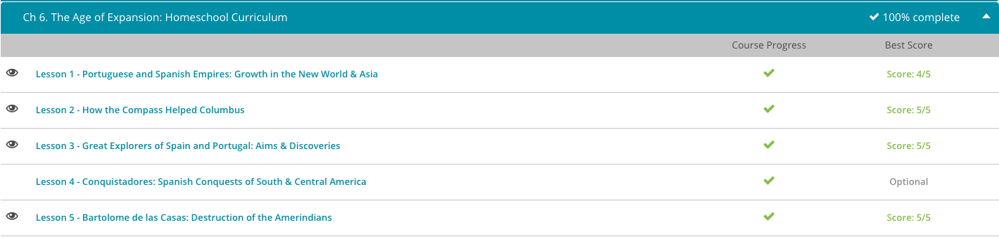

#### Andrew Garber
#### Age of Expansion
#### Feb 23

### Portugal and Spain
 - The Portuguese took the lead. Inspired and backed financially by Prince Henry the Navigator, Portuguese explorers sailed south, down the coast of Africa, in hopes of finding a route to the Far East. Along the way, they discovered plenty of ways to make a profit from their voyages, and pretty soon they were leaders in the gold and slave trades. They established posts in Guinea and Angola and a few island plantations to support their business ventures.
 - The Portuguese did not emphasize colonization in their new territories. They were far more interested in trade, and before long, they had carried millions of Africans away from their homes as slaves. The money flowed freely, but they still hoped to find a way to the East.
 - In 1488, Bartholomeu Dias managed to make his way around the Cape of Good Hope at the southern tip of Africa. He might have gotten all the way to India if his crew hadn't mutinied. Finally, Vasco de Gama arrived in India and came back with a nice, profitable load of spices in 1499. The Portuguese were very pleased by this achievement, and they soon dominated the East Indies trade. Spices, fabrics, and other luxuries flowed into Portugal and out to other European countries, and the Portuguese treasury swelled.
 - Nearly everybody remembers that 'In fourteen hundred ninety-two Columbus sailed the ocean blue,' and indeed, Christopher Columbus, sponsored by Spain, did make his first voyage in 1492 and bumped into a completely new continent on his way to the Far East. Columbus made a total of four voyages to the New World, but he honestly believed for the rest of his life that he had found the Far East.
 - It didn't take long for other Spaniards to realize that Columbus had stumbled upon something completely new, and they decided to stay. There was plenty of room to spread out, interesting cultures and landscapes to explore, natives to Christianize, and even better, economic opportunities galore, including new sources of gold and silver. The Spanish quickly set out to explore, conquer, and colonize, which was bad news for the Amerindians who got in their way as they launched their empire.
 - In 1521, Hernando Cortés conquered the Aztecs in Mexico, gaining a territory that was larger than Spain itself. South American settlement began in 1523 in Venezuela, and in 1524-1526, the Spanish marched through Central America, exerting their control from Guatemala to Nicaragua.
 - The Spanish looked south in the 1530s and 1540s. Francisco Pizarro subdued the Incas of Peru in 1533. Ecuador and Columbia fell to Spain later in the 1530s, and Chile succumbed in the 1540s.
 - The Spaniards moved north, too. In the 1540s, Francisco Vásquez de Coronado crossed the Rio Grande and traveled up the Colorado River. Other explorers made their way up the California coast and across the American southeast. Settlements sprang up at St. Augustine, Florida, in 1565, and in New Mexico in 1609.

#### How the Compass Helped Columbus
 - In the first half of the 15th century, Prince Henry of Portugal, also known as Henry the Navigator, began encouraging the use of the magnetic compass several decades before Columbus sailed under the Spanish flag. These magnetic compasses became extremely important navigational tools, combining their needles with magnetized lodestones, or pieces of naturally magnetized minerals, to determine a ship's direction in reference to the magnetic north. Prince Henry encouraged cooperation between sailors and mapmakers, hoping to create more accurate maps of the seas.
 - On August 3, 1492, Columbus and his men set sail across the ocean blue in the Nina, the Pinta, and the Santa Maria. With him, he took the star of our lesson, the compass, which greatly improved navigational success in the areas of (first) dead reckoning and (second) celestial navigation.
 - During the times of Columbus, most sailors navigated by dead reckoning. In dead reckoning, the navigator would calculate a current position by using a previous position, measuring the course and the distance traveled in segments. For instance, before leaving port, the navigator measured out his expected course and the distance he would like to travel in that day. He'd then estimate his speed, and from that estimation he'd place a pin on the map, marking where he believed he'd stop at the end of his day. This ending point would be his starting position for the next day.
 - This dead reckoning method was fraught with danger, especially since a miscalculation one day could spell disaster for all the following days. For instance, if winds began to blow in contrary directions, the course of a ship would also change, making large or small variation in a ship's trajectory. These mistakes, even small ones, would soon become cumulative, causing sailors to be miles and miles away from their expected targets, leaving them adrift at sea with little to no provisions.
 - Columbus added to the importance of the compass by being recognized as the first to discover the difference between true north and magnetic north. Along his voyage, Columbus realized his compass did not directly align with the North Star, but was instead always off by a few degrees. On September 17, 1492, his journal reads - and again I'm going to paraphrase it to make it easier to understand -
 - 'The pilots observed the north point, and found that the needles turned a full point to the west of north. So the mariners were alarmed and dejected, and did not give their reason. But the Admiral knew, and ordered that the north should be again observed at dawn. Then they found that the needles were true. The cause was that the star makes the movement, and not the needles.'

#### Great Explorers
 - When word got out that there were new lands to be had, the rest of the world joined the race. Not wanting to settle for silver, Portuguese ships headed west. In the year 1500, the Portuguese Pedro Alvares Cabral became the first European to reach Brazil. With this, Portugal began establishing a vast and profitable colony that would become larger than Portugal itself.
 - Although competition was fierce, Spain kept up its quest for first place. In 1513, Spaniard Vasco Nunez de Balboa traveled beyond the Isthmus of Panama, becoming the first European to 'dip his toes in the Pacific Ocean.' Not satisfied with just enjoying the waters, he claimed them and all the lands that touched them for his precious Spain.
 - In 1519, the Portuguese Ferdinand Magellan began the journey that would take him through the Straits of Cape Horn to the Pacific Ocean and beyond. Upon reaching the Pacific, he and his crew continued west to the Philippines where, unfortunately, Magellan died. However, his crew returned to Europe, being the first expedition to circumnavigate the globe, a 'win' Magellan is still credited with to this very day.
 - Unfortunately, the race for the Americas was also a deadly one. Around the year 1520, Hernan Cortes conquered the Aztec Empire of Mexico for Spain. Of course, this was a great win for Spain and its economy but was devastating to the native populations. In the 1530s, his fellow countryman, Francisco Pizarro, dealt the same fate to the Incas of Peru, scoring another win for Spain. With each territory conquered, Spain sent royal representatives to administrate the newly conquered lands. Cruelty ensued as the Spanish disregarded ancient cultures, forced conversions to Christianity, and gathered gold for the crown.
 - With the great wealth amassed in the Southern Americas, sights were set toward the north. In this region, it seems Spain took the lead. The 1500s saw Francisco Vasquez de Coronado explore into the areas of Arizona and New Mexico, claiming these lands for Spain. Cabeza de Vaca joined him by exploring Texas for Mother Spain, while the famous Spaniard Ponce de Leon searched Florida for the fabled Fountain of Youth.
 - These explorations culminated in Spain establishing the first North American settlement. The credit for this feat goes to the Spaniard Pedro Menendez de Aviles, who founded St. Augustine, now in Florida, in the year 1565. In time, all of Europe would realize it was not gold that North America offered but a land of moderate climates, rich vegetation, and very fertile ground.

#### Bartolome de las Casas
 - Spain's conquest of the New World was largely driven by prospect of wealth, especially in gold and silver. Along the way, the Spaniards sought to Christianize the native peoples, or Amerindians, they encountered as they spread out across the continent. Spain sponsored many exploratory expeditions, which were led by military commanders called conquistadors.
 - As rewards for their service and successful missions, the king granted encomiendas to these conquistadors, as well as to other officials, soldiers, and colonists. These grants entitled their holders, who were called encomenderos, to tribute from the Amerindians of a particular region. The natives were required to provide produce and gold, but especially labor for the encomenderos' mining operations and other projects. In return, the encomenderos promised to protect the Amerindians and convert them to Christianity.
 - Not surprisingly, many Amerindians resisted the encomienda system, which resulted in violence as the Spanish enslaved, tortured, and massacred the rebellious natives. Most Spaniards paid little attention to the brutality. In their eyes, the Indians weren't really human anyway, so they were beneath their care. One man, however, disagreed. His name was Bartolome de las Casas.
 - Bartolome was born in Spain in 1484. His father traveled with Columbus on the explorer's second voyage, and he brought back treasures and stories that sparked his son's curiosity. In 1502, Bartolome headed for the New World for the first time. The young man impressed the governor so much by his hard work and leadership that he earned his own encomienda.
 - Pretty soon, though, Bartolome began to be appalled by the Spaniards' treatment of the Amerindians. He despised the atrocities he witnessed, and he hated to see the natives forced to accept Christianity against their will. Bartolome returned to Spain to study for the priesthood, received his ordination in 1507, and went back to the New World as a catechist to the Amerindians. In 1514, he renounced his encomienda and started preaching against his former way of life.
 - Bartolome often spoke and wrote about a better way to convert the Amerindians to the Christian faith. He wanted to convince them through love rather than by force and slavery. He figured that maybe if Spaniards and Amerindians could live peacefully side by side, the natives would be more willing to embrace the Spanish religion and way of life.
 - In the early 1520s, Bartolome decided to put his ideas into action. He founded a colony in Cumaná (modern Venezuela) that consisted of several villages where Spaniards and Amerindians lived and worked together freely. The experiment might have worked, but neighboring encomenderos did not appreciate Bartolome's new way of treating the native peoples. They incited their own Amerindians to attack, and that was the end of Bartolome's little colony.
 - Discouraged, Bartolome joined the Dominican order in 1523. He decided that he would concentrate on telling the Amerindians' story through writing and preaching and trying to gain legal protection for them. His thunderous sermons echoed through the Spanish Empire, earning him enemies and sometimes an order of silence from the government. Bartolome didn't give up. When he didn't preach, he wrote, advocating the peaceful spread of Christianity, describing the abuses suffered by the Amerindians, calling for humane treatment of the natives, and recounting the history of the New World.
 - In 1537, Pope Paul III issued a document declaring that the Amerindians were human beings who were not to be deprived of their freedom or property. Bartolome worked hard to spread the pope's document and enforce its decrees. In 1540, he returned to Spain to petition King Charles V on behalf of the Amerindians. The king actually listened. In the New Laws of 1542, he abolished slavery and ended the encomienda system.

