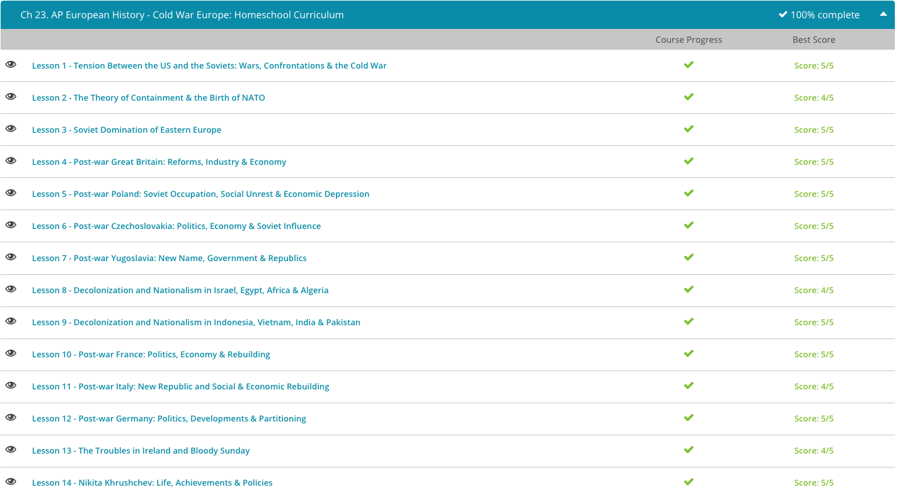

### Andrew Garber
### June 12
### Cold War

#### Tensions between the US and Soviets
 - Rivalries exist between nations based on political and philosophical differences as well, only the implications for these rivalries turning sour can be far worse. Perhaps no rivalry between different nations had greater implications for the entire world than that between the United States and the Soviet Union in the second half of the 20th century. Separated by vastly different political, economic, and social philosophies, tensions between the Soviet Union and the United States, a period historians term the Cold War, had the potential to lead to the end of the world as we know it.
 - When World War II (WWII) ended, the United States, the United Kingdom, and the Soviet Union had already decided what post-war Europe would look like. At various conferences, the most important of which were at Yalta and Potsdam, the three powers split Germany and its capital Berlin in two, with the eastern portion controlled by the Soviet Union and the western portion controlled jointly by the United States, the United Kingdom, and France. Additionally, the Soviet Union was given influence over the governments of several Eastern European states, where they promptly set up loyal, communist puppet regimes. These client states, though technically independent, were effectively part of the Soviet Union, sharing its communist economy and single-party political structure.
 - The United States and the West feared the creation of this Eastern Bloc, as Western journalists and government termed it, and the further spread of communism and/or totalitarian states in the rest of the world. U.S. foreign policy became one of containment - essentially, stopping the spread of communism wherever it could. This was in direct opposition to the Soviet Union's policy of fostering the spread of communism, especially in its Asian neighbors. For example, Soviet agents had spent significant time with Mao Zedong's fledgling Communist Party in China in the 1930s and 1940s, where communism eventually prevailed and created the People's Republic of China in 1949.
 - The tensions between the world's two biggest superpowers ratcheted up with the advent of nuclear weaponry. The United States had already obliterated two Japanese cities and hundreds of thousands of Japanese civilians with atomic bombs to end fighting in the Pacific theater in WWII, and in the late 1940s and 1950s both the United States and the Soviet Union pioneered even larger hydrogen bombs capable of producing explosions thousands of times more powerful than atomic bombs.
 - Though these two countries never fought an all-out war, they fought numerous proxy battles around the world. For example, the entire reason the United States got involved in Vietnam in the 1960s was to contain the spread of communism. Though the Soviet Union never sent troops to Vietnam, they funneled arms and weapons to the communist North Vietnamese and American pilots often faced Russian-made MiG fighter jets.
 - However, there were several times when the United States and the Soviet Union came dramatically close to open conflict. In Berlin in 1961, soon after the Soviet Union erected the Berlin Wall to separate the Western-controlled half of Berlin from the Soviet half, a dispute over U.S. officials entering and leaving East Berlin led to a standoff that nearly began World War Three. After a U.S. diplomat was turned back at the border by East German officials, another diplomat was led through East Berlin by an armed escort.
 - Despite the stunt, East German officials continued to claim control over who entered and left East Berlin. As a result, the U.S. general in command of the area, General Lucius Clay, ordered several U.S. tanks to a border post known as Checkpoint Charlie. Viewing this measure as a threat, Soviet premier Nikita Khrushchev ordered Soviet tanks to the same checkpoint. The standoff between the two groups of tanks, separated only by about 100 yards of no-man's land, continued for the next 16 hours. After some secret negotiations between Moscow and Washington D.C., the tanks slowly pulled back, one by one, averting further conflict.
 - But the following year, the two superpowers were involved in yet another tense standoff. In October 1962, a U.S. spy plane spotted Soviet ballistic missiles being erected on the island of Cuba. Cuba had only recently become a communist nation in 1959 when Fidel Castro seized power from the corrupt but American-supported Fulgencio Batista. Castro had allied himself with the Soviet Union, and a failed U.S.-backed invasion at the Bay of Pigs in 1961 had irrevocably severed relations between the U.S. and the island nation only 90 miles from the U.S. coast. With Soviet missiles now on the island within close enough range to strike any target on America's eastern seaboard, the American government sprang into action.
 - Thankfully, all-out nuclear warfare was avoided between the superpowers in the 1950s and 1960s. Though the superpowers remained hostile to each other throughout the 1970s, that decade saw a cooling of tensions from the height of the early 1960s. For example, in 1975 Soviet cosmonauts and American astronauts met on the Soviet space station and shook hands, an event seen as symbolic of the better relations between the two superpowers. The 1980s saw the Soviet Union slowly decline, wracked with internal economic and political problems. Reforms were unable to fix the deep problems, and the Soviet Union dissolved in 1991.

#### Soviet Domination of Eastern Europe
 - During World War II (WWII), and especially once it became apparent Germany would lose, leaders of the United States, the United Kingdom and the Soviet Union met at several conferences to determine what post-war Europe would look like. The most decisive of these conferences took place at Yalta in the Southern Soviet Union. At Yalta, President Franklin Roosevelt and Prime Minister Winston Churchill made key concessions to appease the Soviet leader Joseph Stalin and hopefully secure his participation in the United Nations, which the Western governments instituted soon after the war.
 - In return, the United States and the United Kingdom agreed to recognize the annexation of the Baltic nations the Soviet Union made before and during WWII. Additionally, and most importantly, the Western governments agreed to recognize Soviet influence over the governments of several Eastern European states. The Soviets claimed they needed this influence to create a series of buffer states to protect the Soviet homeland from future Western aggression.
 - After the war ended, with Soviet troops still occupying most of Eastern Europe, the Soviet Union saw to the creation of Soviet-friendly communist parties and governments within each state, and engineered their election. The Soviets essentially created client states out of most of Eastern Europe in states such as Poland, East Germany, Czechoslovakia, Hungary, Romania, and Bulgaria. This group of states became known to the West as the Eastern Bloc. Yugoslavia was also a communist state, however it was not allied with the Soviet Union, and Albania began the post-war era as a Soviet client state, but broke off relations early in the 1960s.
 - Soviet control of the governments and economies of these Eastern European countries was almost complete. Though all Soviet client states had their own independent governments, the communist parties, which controlled these governments, were closely allied with the Soviet Union and directly connected to Moscow. Additionally, the Eastern European states were integrated into the centrally controlled command economy of the Soviet Union, and external trade with Western Europe or the United States was forbidden.
 - This relationship between the Soviet Union and its client states in Eastern Europe was further solidified in 1955 with the creation of the Warsaw Pact. The Warsaw Pact was an agreement between all of the Soviet client states and the Soviet Union for mutual military protection; that is, if one country was invaded or attacked, all of the other nations would rush to aid that country.
 - The Warsaw Pact was little more than a show; with the Soviet Union in firm control of the entire region, any incursion by a Western country into any Eastern European country would surely have been met with a Soviet counterattack, Pact or no Pact. In fact, one of the countries involved in the agreement, East Germany, had no military presence to speak of as part of the treaties which ended WWII! The creation of the Warsaw Pact was largely a response to the West's formation of NATO, a mutual military treaty organization between most of Western Europe and North America.
 - The Soviet Union's firm grip upon the other nations in the Warsaw Pact is perhaps best exemplified by the Brezhnev Doctrine. Named for Leonid Brezhnev, Soviet premier and leader of the Communist Party from 1964 until his death in 1982, the Brezhnev Doctrine stated that all communist countries in Eastern Europe were responsible for promoting the health of the communist parties throughout the region. Any perceived weaknesses in a national communist party or any attempted relaxation of communist measures were to be met with military intervention by all other Warsaw Pact countries.
 - The strictness of this policy was made all too apparent in Czechoslovakia in 1968. In the face of a struggling economy and popular distaste for communist measures, the Czechoslovakian Communist Party removed its leader and replaced him with Alexander Dubcek. Dubcek was a reformer, by communist standards, and he ended censorship of the press in 1968 and enacted some liberal economic reforms. The relaxation of press censorship allowed for greater public debate concerning communism and anti-communist demonstrations erupted across the country.
 - Fearing the unrest in Czechoslovakia might spread, Moscow resolved to invade Czechoslovakia and reinstall a more conservative communist government. Soviet forces faced minimal opposition as they rolled across Czechoslovakia, swiftly taking control of major cities. Before long, the Soviets had forced Dubcek to step down and imposed a strict form of communism and ended the short-lived freedom of the press. Though guerilla movements fought Soviet troops in the countryside for another year or so, communist order was well and truly restored in Czechoslovakia.
 - In this way, Communist states were now only Communist in name - they were very much run-of-the-mill authoritarian regimes, with adherence to Communist economic policy being a distant second to the need to maintain power.
 - The Soviet Union maintained its firm grip upon Eastern Europe until well into the 1980s. However, by the 1980s the Soviet economy was floundering, and Mikhail Gorbachev's attempted reforms - ironically some of which were similar to those tried in Czechoslovakia in 1968 - only hastened the decline of Soviet control over the rest of Eastern Europe. In the late 1980s, communist governments across Eastern Europe fell to reform movements and Moscow made no attempts to retake the countries. The Soviet Union itself dissolved in December 1991.

#### Post WW2 Great Britain
 - At the end of WWII, Great Britain found itself at a major crossroads. Millions of its young men were returning home from fighting on the continent and needed jobs, medical care and help returning to the normalcy of peacetime. Furthermore, parts of Britain needed to be rebuilt after having been heavily bombed during the war, especially London, where Germany dropped thousands of bombs in less than a year during the London Blitz.
 - Among Britons, there was a general consensus that the country's first post-war priority should be meeting these domestic needs of its citizens and cities before anything else. Historians have termed this general sense among the British public the post-war consensus. It was these motivations that led to Britain shocking the rest of world when Winston Churchill, the Conservative Prime Minister who had led Britain to victory in WWII, was defeated heavily in the July 1945 parliamentary elections. Churchill's Conservative Party lost nearly 200 seats in the government, returning a parliamentary majority for the Labour Party led by Clement Attlee.
 - Attlee, who had been appointed Britain's first ever Deputy Prime Minister during the war, won the election through claiming the Labour Party could rebuild Britain after the war better than the Conservative Party, whom he branded as a party fit only for wartime leadership. He was elected based on campaign promises that the Labour Party would focus on achieving and maintaining full employment in Britain, nationalize key industries and create an entirely free National Health Service. (Churchill was actually a supporter of welfare programs, and had argued loudly for them in the early 1900s when he was still a Liberal.)
 - Attlee's calls for improved social services and an improved standard of living for all Britons did not come out of the blue; rather Attlee was continuing the policies of several Labour and Liberal ministers and leaders of the early part of the 20th century. For example, Liberal Party Prime Minister H.H. Asquith, in partnership with his Chancellor of the Exchequer David Lloyd George, introduced a variety of reforms, including unemployment insurance and old age pension for Britons 70 years of age or older without the means to care for themselves.

What was different about Attlee's plans for social reform is the overwhelming support his policies had from the public. Indeed, many of Attlee's goals were taken directly from the Beveridge Report, published in November 1942. The Beveridge Report, produced by the Keynesian economist William Beveridge, addressed the social inequalities in British society at the time. The report categorized the needs of British society into five 'great evils': squalor, want, ignorance, idleness and disease. The report also proposed large plans to combat these evils, mainly through the creation of a national social safety net to help those without the means to help themselves.
 - The Attlee government used the Beveridge Report as a manifesto of sorts after the 1945 election. Indeed, only a month after its election, the Attlee government passed the Family Allowance Act, which granted each family a small monthly stipend per month for each child to aid in the child's care. The following year they passed the National Insurance Act, which established an extra income tax for all workers to pay into funds they could access later in life, such as unemployment insurance and a retirement pension.
 - Only two years later in the summer of 1948, the Attlee government instituted its most ambitious social program yet: the National Health Service. The NHS intended to bring free healthcare and cheap prescriptions to all British citizens regardless of their socio-economic class. The NHS was incredibly popular at the outset and remains one of the cornerstones of British society for many Britons. Attlee's decisive actions built upon the work of his predecessors, and in conjunction with the post-war consensus, helped build what many have called the British welfare state.
 - The irony that the British government was now extending massive social service programs, while at the same time fighting the effective bankruptcy of the nation following the expenditures of the war was not lost on the Attlee government or the people, and various economic measures were taken to ensure the government could afford the new programs.(some successful, others not-so-much.)
 - While internally the British were coming together, externally their once mighty empire was falling apart. Soon after the end of WWII, following nearly a century of unrest and conflict with Indian nationalists and the Indian National Congress, led chiefly by the non-violent protester Mahatma Gandhi, Attlee's government partitioned the expansive British Empire's territory in South Asia into India and Pakistan and granted both their independence from Great Britain in 1947.
 - The British further withdrew from the Middle East when they eliminated their mandate over Palestine and the newly founded state of Israel the following year.(Israel was almost immediately invaded by nations on its borders.) Furthermore, the British Empire suffered a major embarrassment when then Prime Minister Anthony Eden engineered a joint Israeli-French-British invasion to retake the Suez Canal, which had been nationalized by the Egyptian government in 1956. The invasion was condemned internationally, and after threats from several nations, the British withdrew their forces.
 - In the 1960s, the British government slowly allowed most of its remaining holdings in Asia and Africa to declare independence peacefully. Whereas the British government had once controlled nearly half of the entire African continent, by 1970, the Seychelles Islands were the only African territory still a British possession, and even that small nation declared independence in 1976. By the end of this period, the once mighty British Empire was largely confined to the British islands and several small islands around the world.
 - The demise of the post-war consensus came in the 1980s with the surprise 1979 election of Britain's first female Prime Minister, Margaret Thatcher. A staunch conservative, Thatcher guided Britain through a difficult economic period. Only, instead of championing social investment like Clement Attlee, she preferred free market economics and did her best to dismantle as much of the social safety net as she could.
 - For instance, even prior to her premiership when she was Education Secretary, she removed the free school milk program in British schools, earning her the derisive moniker, Margaret Thatcher the Milk Snatcher. In her time as prime minister, she cut taxes, abolished certain social programs and even tweaked the popular NHS to allow for increased competition in the system. Thatcher's ultra-conservative policies earned her many political enemies - even within conservative circles - and she was removed from power by her own party in 1990.

#### Poland
 - After the defeat of Germany in WWII, Poland remained more of a concept than a reality. Under staunch Soviet control and with borders already somewhat amorphous, the victorious allies had to decide what to do with Poland. In the end, the United Kingdom and the U.S. agreed to the Soviet Union's plans to annex the eastern territories of Poland to the Soviet Union, and in recompense, Poland received East Prussia and other German territories, roughly 80% of the size of the territory it lost in the East to the Soviet Union. Poland was also recognized as being part of the Soviet 'sphere of influence' within Eastern Europe.
 - The Polish people had no voice in the discussions and certainly were not asked if they preferred being under Soviet influence or not. Regardless, millions of Poles were directly affected by the new borders, as the Soviet Union forced the mass migration of Poles from the formerly Polish territory in the new Soviet borderlands. It relocated many of these Poles to the lands the new Polish state had received from Germany, where the Soviet Union also expelled millions of Germans. In all, nearly six million Poles were relocated by 1949. Furthermore, despite the arbitrary nature with which these borders were drawn, they largely remain the borders of the Polish state today.
 - As the closest state to the Soviet Union and well within the U.S. and U.K.-recognized Soviet sphere of influence, Poland stood little chance of gaining complete control over its own affairs after WWII. Indeed, the Polish government was reconfigured to foster the growth of communism and increase Soviet control. For instance, in 1946, the Polish provisional government held a national referendum which approved the nationalization of Polish industries and created a single-house representative assembly - one that the communists could easily dominate. The results of this referendum were likely doctored by Soviet officials.
 - In the first post-war elections in 1947, the communist government, led by the Soviet-backed Wladyslaw Gomulka, won a vast majority of the seats in the Polish government, though this was largely engineered through fraudulent election results and intimidation of opposing politicians. Gomulka promised to lead Poland to socialism and communism slowly, in a way that aligned with Polish values and needs. The true extent of Soviet control in Poland was displayed the following year, however, when the Soviet Union decided Gomulka's plans were too slow moving. In 1948, Gomulka was removed from the leadership of the Polish communist party in favor of Boleslaw Bierut, who initiated a more rapid communization of Poland.
 - As a result, Poland became increasingly integrated into the Soviet economy along with the rest of Eastern Europe. The country was rapidly industrialized and agricultural land was collectivized and nationalized. The Soviet-backed Polish government even began instituting Six-Year Plans in 1950, mimicking the Five-Year Plans the Soviet Union used to set goals for industrial output.
 - Poles did not necessarily flock to communist principles in the way the Soviet puppet government hoped, and by the mid-1950s, unrest was sparked when some 15,000 industrial workers rioted over the failure to be paid properly. The riot was initially put down by troops, killing dozens of demonstrators. Whereas in the past the Soviet regime would have mercilessly quelled the rebellion, the new Soviet regime of Nikita Khrushchev negotiated with Gomulka, who was returned as leader of the Polish government during the crisis. Gomulka reassured Khrushchev he could successfully end the strike and riots without further bloodshed.
 - Cycles of protest and riot remained a problem for the Polish communist government over the following decades. In 1968, riots broke out in Warsaw after an anti-Russian play was banned from being performed, and Gomulka only staved off Soviet invasion by lending Polish troops to the Soviet Union to be used in the Soviet repression of demonstrations in Czechoslovakia. Only two years later, riots again broke out across Poland's major cities when food prices rose dramatically.
 - The riots spread to the countryside and Gomulka was removed from power. His successor managed to quell the unrest only through placing strict price controls on food. These piecemeal measures only led to a concurrent rise in foreign debt, which nearly bankrupted Poland, and by 1976, strikes and riots again broke out when food prices jumped 60% because the price controls bankrupting the country were removed.
 - The economic depression and unrest led to the creation of Solidarity in 1980. Solidarity was a trade union independent of the government founded in Gdansk with Lech Walesa proclaimed the leader. The Solidarity movement quickly gained popularity throughout the country, and in 1981, the communist government declared martial law and outlawed Solidarity.
 - Unfortunately for the Polish communists, at the same time Mikhail Gorbachev was relaxing controls on political freedoms in the Soviet Union, which undermined the communists' attempts to clamp down on Solidarity. With the newfound ability to speak relatively openly about politics from the mid-1980s onwards, Poles began discussing the nature of Polish communism and the best way forward for Poland. In 1988, the country held a Soviet-sanctioned free election, which returned a massive majority for the Solidarity movement and calls immediately began for a return to democracy in Poland. In December 1990, Solidarity's leader, Lech Walesa, was sworn in as President of the new Polish democracy.

#### Czechoslovakia
 - Prior to the beginning of World War II (WWII), Czechoslovakia was annexed by Germany. It was agreed to in Munich by the leading European powers of the day in the hopes that granting Germany this territory, which they wanted due to the large German population in the Sudetenland, would placate German imperialism, avoiding conflict and ending future aggression. The Czechoslovakian government was not privy to the negotiations, and as a result has since referred to the agreement as the Munich Betrayal.
 - After Germany took possession of Czechoslovakia in 1938, its president, Edvard Beneš, resigned. He soon set up a Czechoslovakian government in exile in France and moved it to London after the German invasion of France. During the war, German occupation grew increasingly strict in Czechoslovakia, and politicians that had remained or activists who stirred up trouble were routinely arrested by German police and the Gestapo. As the war progressed and the Holocaust increased in intensity, Czech and Slovak Jews were deported, and areas of Czechoslovakian cities were transformed into Jewish ghettos.
 -After the defeat of Germany in WWII, Beneš returned triumphantly to Prague in 1945, where the republican Czechoslovakian government was restored. The harsh treatment of Czechs and Slovaks by the German occupiers was not forgotten. Soon after the restoration of Czechoslovakia, Beneš' government began deporting any Germans remaining in Czechoslovakia, especially those living in the Sudetenland. In all, 1.7 million Germans were deported to the American occupation zone in West Germany, and an additional 750,000 were deported to Soviet-controlled East Germany. Additionally, the land and companies of any Nazi collaborators were confiscated and nationalized.
 - Unfortunately for the Czechoslovakian republic, the country fell firmly within the sphere of influence the United Kingdom and the United States had agreed to grant the Soviet Union. When the Czechoslovakian republic made moves to begin accepting Marshall Plan aid and better relations with the West, the Czechoslovakian Communist Party, or KSC, began stirring up trouble at Moscow's behest. As a result, the KSC began using its control of the Ministry of the Interior to purge the police and security forces of non-communists.
 - In the first few months of 1948, the KSC used its control of the police and security forces to take control and occupy key ministries and posts of the Czechoslovakian government. Before long, non-communist government officials were denied speaking time on any major Czechoslovak radio or television network. On February 25, 1948, Beneš resigned the presidency, fearing that any resistance from his republican allies would lead to a Soviet invasion of Czechoslovakia. He died later that year, having seen his dreams of a democratic, republican Czechoslovakia crushed twice in his lifetime.
 - Soon after the KSC took control of the Czechoslovakian government, they began implementing Marxist principles and strengthening their already close ties with the Soviet government in Moscow. Most sectors of the economy and society were brought under state control. All heavy industry was nationalized, and all schools were controlled by the government. Furthermore, the government was purged of any remaining democratic officials. Even within the KSC itself purges occurred, as any communists not sufficiently radical for Stalin's and Moscow's liking found themselves arrested. Czechoslovakia was soon integrated into the Soviet economy and was tightly controlled by Moscow, regardless of technically remaining a separate state.
 - In the 1950s, communist Czechoslovakia rapidly expanded its heavy industry as dictated by Moscow. By the 1960s, however, the Czechoslovakian economy had slowed, and some within Czechoslovak communist circles began clamoring for change. The Moscow-preferred communist leader was deposed in 1968. In his place Alexander Dubcek, a moderate communist reformer, took the presidency. Dubcek relaxed some of the stricter communist measures in the Czechoslovakian economy hoping to encourage growth, and he removed the censorship of the press. This led to mass demonstrations against communism across Czechoslovakia.
 - These developments alarmed the Soviet Union, who feared the failure of communism in Czechoslovakia could lead to rebellions elsewhere in communist Eastern Europe. As a result, Soviet premier Leonid Brezhnev ordered Soviet troops into Czechoslovakia. Soviet forces rolled through the country largely unopposed, taking control of most major cities in a matter of days. Soon after, Dubcek was forced to resign, and a more communist-friendly regime was installed at the head of the Czechoslovakian government.
 - Only two decades later, the Soviet economy was floundering, and Mikhail Gorbachev ironically instituted some of the very same reforms the Czechoslovakians had attempted in 1968. As the Soviet Union's tight grip over Eastern Europe began to falter, anti-communist protests and demonstrations broke out across the region, including in Czechoslovakia. The anti-communist movement in Czechoslovakia was largely led by students and other members of the educated public.
 - Many historians have contributed the students' fervency to being too young to remember 1968, and therefore unafraid of possible Soviet reprisals. Vaclav Havel, a former playwright, emerged as leader of the opposition in the streets of Prague. In 1989, only days after the Berlin Wall fell in Germany, the communist government of Czechoslovakia quietly and bloodlessly handed over the reins of government to Havel, which has become known as the Velvet Revolution due to the peaceful regime change.
 - The fall of communism was not the final momentous event in the history of Czechoslovakia. Indeed, before the end of the millennium, Czechoslovakia itself would cease to exist. The two regions of the country were different ethnically and economically: the western half inhabited mainly by ethnic Czechs and far richer, as opposed to the eastern half, which was poorer and inhabited mainly by ethnic Slovaks.
 - Soon after the Velvet Revolution, Slovakian nationalists formed the Slovakian Nationalist Party and pushed for further decentralization from Prague. Despite the wishes of its politicians, the majority of both Czechs and Slovaks did not wish for the country to split. Regardless, the government pushed through with several resolutions in late 1992 at the behest of the separatist party, and on January 1, 1993, Czechoslovakia dissolved, becoming the Czech Republic(now renamed Czechia) and Slovakia.

#### Yugoslavia
 - If you've ever baked a cake, then you know how incredibly important it is to have the exact proportions of ingredients. Having too much or too little of one ingredient or, worse, forgetting it altogether can ruin a cake, tart, or batch of cookies. Though postwar Yugoslavia was made up of numerous different ethnic and linguistic groups, its cohesion was balanced like the icing on a cake by the rule of Josip Broz, the head of Yugoslavia's communist dictatorship. When Marshal Tito (as Broz was nicknamed) died and his strong arm left the seat of Yugoslav power, the entire confederation began to unravel.
 - Yugoslavia was created in the aftermath of WWI. Prior to WWI, the Balkans had largely been the military playground of two major powers of early modern Europe: Austria-Hungary and the Ottoman Empire. However, WWI destroyed what remained of the once mighty Ottoman Empire and drastically weakened the Austro-Hungarian Empire. This created a power vacuum in the Balkans, one many Slavic intellectuals hoped would be filled by a new, pan-Slavic state. Through the work of several nationalist groups working with Western countries, the Slavs got their wish and founded the Kingdom of Yugoslavia, which was officially and internationally recognized in May 1919.
 - Yugoslavia's early history was tumultuous, as ethnic conflict arose often between ethnic Serbs, Croats, and Slovenes. The government under the king was dominated by a rivalry between Serbs and Croats and their competing political philosophies: Serbs preferred a strong, central government, which they would likely dominate, while Croats preferred a decentralized federation of states.
 - These concerns created numerous problems, but the issues became secondary with the rise of a strong, aggressive Germany in the late 1930s. After Germany consolidated its control of Eastern Europe in the late 1930s and began WWII with its invasion of Poland, Germany invaded Yugoslavia in April 1941. It only took 11 days for the German army to completely overrun the country, and over 300,000 Yugoslav troops and officers were taken prisoner by the Germans.
 - The German occupation of Yugoslavia gave rise to a communist movement in the pan-Slavic state. Indeed, the communists were the chief organizers of the anti-German resistance movement during WWII, and the Yugoslav communist party (named the Partisans) reorganized its leadership for that purpose in July 1941. Later that year, Josip Broz - Marshal Tito - began organizing Albanian communists in the South and conducted guerrilla movements against German military installations throughout Yugoslavia. When the tide of the war turned, it was Tito's communists who fought alongside Russian troops, pushing the Germans out of Yugoslavia.
 - Tito's Partisans emerged from the war the most powerful political force in Yugoslavia, and soon after the war's end, most Western countries recognized Tito's government as the legitimate government of Yugoslavia. Earlier in 1945, Tito's government had held 'free' elections, though most political parties boycotted the elections in response to the tactics of Tito's Partisans, who suppressed non-communist publications and hindered non-communist politicians' ability to campaign. The overwhelmingly communist government which was elected adopted a Soviet-style communist constitution later that year. Though the constitution set up many of the offices of a federal republic, including multiple ministries and various administrative freedoms given to the non-Serbian provinces, in reality, most actual power within Yugoslavia was concentrated in the presidency and Marshal Tito.
 - Tito's postwar government followed Soviet examples and collectivized and nationalized most large landholdings in the country, whether they were held by large landowners, banks, churches, or other groups. They even instituted Soviet-style 5-year plans, which set out incredibly ambitious goals, intending to rapidly industrialize the Yugoslav economy and enrich and empower the incredibly poor majority of the population in the rural areas of Yugoslavia.
 - Despite the Soviet-style communism practiced in Yugoslavia, Yugoslav relations with the Soviet Union were surprisingly poor. Soviet premier Joseph Stalin and the Moscow government expected Yugoslavia to fall in line and follow Soviet directives, much like the other communist governments under Soviet influence in Eastern Europe. However, Marshal Tito resisted integration into the Soviet economy, fearing an unfair trade balance that would undoubtedly favor the Soviet Union. Resentments between the two countries due to looting and rape by Soviet troops in Yugoslavia during WWII further strained relations. When Yugoslavia refused to attend a conference between the Soviet Union and its client states in 1948, the Soviet Union expelled Yugoslavia from its group of communist nations and called for Yugoslav communists to overthrow Marshal Tito's government.
 - However, Tito's power was never threatened in Yugoslavia. The vast majority of communists in Yugoslavia supported Tito, and his government openly suppressed opposing politics, at times jailing and executing political prisoners or foreigners accused of attempting to subvert communism in Yugoslavia. Despite this early radicalism, Yugoslavia slowly softened its communist stance in the 1960s. The economy was slowly liberalized, and Tito even allowed for the devolution of some power to the regional republics within Yugoslavia. In 1970, the country even signed an initial economic treaty with the European Economic Community.
 - In 1980, Marshal Tito died just three days short of his 88th birthday. Tito's strong hand and popularity proved crucial to Yugoslavia. Furthermore, his policy of dispersing Serbs - by far Yugoslavia's largest ethnic group - throughout the country had prevented Serb domination of the Yugoslav government. The death of Tito renewed many of these ethnic anxieties concerning the future of the Yugoslav government.
 - The 1980s were also a time of economic trouble for Yugoslavia, as the same problems that plagued the rest of the communist East also affected Yugoslavia. These economic troubes were largely caused by Tito taking out huge debts from international lenders, with the belief that he would bascially never have to pay them back because capitalism was doomed. When the debts came due, and capitalism was alive and well, Yugoslavia didn't have the money. Inflation and unemployment were rampant, and living standards within the country fell. These issues, coupled with ethnic tensions, caused many republics within Yugoslavia to begin pushing for more decentralization and eventual independence. In 1981, for instance, Yugoslavia sent troops into its Southern republic of Kosovo to silence calls for independence there.
 - Tensions grew even higher when the fears of Yugoslavia's smaller ethnic groups were realized in 1989. That year saw the Serb Slobodan Milosevic take power and begin calling for increased centralization in Yugoslavia. Its other republics began almost immediately making preparations for independence. On June 25th, 1991, Slovenia and Croatia both declared independence from Yugoslavia, and Bosnia-Herzegovina did the same the following year. Though Slovenia's war for independence lasted less than two weeks, in Croatia and Bosnia the fighting lasted several years. Fighting in Croatia and Bosnia-Herzegovina was often ethnically-based, as the independence movement ignited age-old rivalries between Croats, Serbs, and Bosnian Muslims. Several instances of ethnic-cleansing occurred during the fighting, where Serbian troops raped, tortured, and murdered entire villages of civilians based solely on their ethnicity. Several Serbian generals have since stood trial in European courts for war crimes because of these actions.
 - Bosnia-Herzegovina and Croatia both achieved recognized independence as part of the Dayton Accords in November 1995. Additionally, NATO and the UN established a peacekeeping mission in the region to hopefully avoid future ethnic conflict. However, this did not stop the disintegration of Yugoslavia. In the late 1990s, the Kosovo Liberation Army fought for independence from the Serbian-dominated Yugoslav government. Serbians responded by invading once again and persecuting Kosovo's majority ethnic Albanian population. This time the international community responded in force. NATO and U.S. bombs fell upon the country, at times hitting targets in the capital Belgrade. The bombing campaign forced a hasty Serbian retreat, and by 1999 Kosovo's independence was recognized.

#### Israel and the Middle East
 - One region of the world which was not only colonized by a Western European power but entirely transformed by it was Palestine. Palestine was only under British control since World War I (WWI). The Holocaust had created worldwide sympathy for the Jewish people and the Zionist cause. In 1947 the newly formed United Nations (UN) passed a resolution calling for the creation of two states, Arab Palestine and Jewish Israel, out of the British mandate. The resolution divided Palestine into two states and left Jerusalem under UN control. While the Jewish population in Palestine and abroad rejoiced, the existing Arab population of Palestine was outraged.
 - Violence between Jewish settlers and Arabs in Palestine escalated in the territory and both sides armed themselves. The Arab League nations of Egypt, Transjordan, Syria, Iraq, and Lebanon declared war on the new Israeli state. The Israelis themselves mobilized quickly and combined their many paramilitary groups into the Israeli Defense Forces. Despite initial setbacks from the pan-Arab invasion, Israeli forces slowly took back territory, eventually occupying even territory the UN intended to be part of Palestine.
 - When the armistice between Israel and the Arab states was signed in early 1949, Palestine was only left the West Bank and the Gaza Strip, and even these were held by Jordanian and Egyptian troops, respectively. Since then, Israeli relations with its Arab neighbors and the Palestinian population within Israel has alternated between contentious peace and all-out war. For example, in the late 1960s, Israel launched a preemptive strike against Egypt and Syria and quickly took control of the Golan Heights, all of Jerusalem, and most of the West Bank, virtually eliminating the Palestinian state from territorial existence.
 - One of Israel's chief enemies was also a country once colonized by the British: Egypt. Egypt had been a British colony since Great Britain had forced the French out of Egypt in the 1800s. Great Britain maintained control in Egypt for several decades before officially declaring Egypt a protectorate of the British Empire just after the beginning of WWI in 1914. The British used Egypt as a cheap source of labor and resources during the war, conscripting over a million Egyptians into the British forces, often to do menial hard labor.
 - The treatment of Egyptians during the war angered many and some, led by the Wafd Party and its founder Saad Zaghlul, began calling for independence. The British were not willing to give up their colony, however, and Zaghlul and other Wafdists were routinely arrested and at one point even exiled to Malta. While Zaghlul was in exile, the Wafdists that remained began organizing student protests, general strikes, and massive displays of civil disobedience agitating for Egyptian independence.
 - In 1922, with Zaghlul recently returned from exile and British officials realizing only massive military intervention would quell the uprising, Great Britain granted Egypt its independence. The newly independent Egypt created a constitution in 1923, and in the 1924 elections the Wafd Party received an overwhelming majority of the seats in the new Egyptian Parliament.
 - Africa was unique among continents after WWII in that virtually the entire continent was under colonial rule. Indeed, over the past few hundred years France, Portugal, Great Britain, Germany, Belgium, and Italy had divvied up its territory and resources between themselves. As a result, the African experience of decolonization varies wildly. For example, many British colonies were granted their independence with little bloodshed in the late 1950s and early 1960s. In contrast, Portuguese colonies that became the states of Angola and Mozambique were required to fight long, hard wars of independence.
 - The decolonization of Africa - be it through war or peaceful means - took place mainly between 1956 and 1975, with its most intense period occurring in the early 1960s. In these years, most British and French colonies in Africa were peacefully granted their independence. One major exception to this rule was Algeria. Though Algeria did gain its independence from France in 1962, it fought a bloody eight-year conflict to gain that independence.
 - The French public valued its colonies for the prestige they brought France. The French worried that if the country were to lose its African holdings, especially Algeria, it would lose its influence internationally. For example, four years into the conflict a national poll showed a majority of the French people favored fighting to hold onto Algeria - even to the point of integrating Algeria into the French state - rather than allowing the colony to separate.
 - Ironically, it was mainly Algerians living in France that financed the war. The National Liberation Front (FLN) taxed Algerians living in France and focused their guerrilla attacks on softer French targets. The war in Algeria led to a political crisis in France in 1958, and Parliament responded by asking Charles de Gaulle, the former French commander and President of the post-WWII provisional government, to retake the presidency. De Gaulle consented, became president, and renewed the conflict.
 - After several offensives failed to eliminate the FLN and take full control of Algeria, the French people grew increasingly weary of the war and some even started sympathizing with the rebel cause. In 1961, President Charles de Gaulle resolved to hold a referendum in Algeria to settle the issue once and for all. Over 99% of the votes cast voted for independence, and de Gaulle began making preparations to remove French troops from Algeria. In July 1962 Algerian independence was internationally recognized.

#### Indonesia, Vietnam, India, Pakistan
 - Decolonization in South Asia was a long process. Facets of Indian society had been peacefully fighting for Indian independence from Great Britain since the 19th century. For example, the foremost organization calling for Indian independence, the Indian National Congress, was created in 1885. As a result, the movement for independence was likely farther along in India by WWII than in any other country. Non-violent organizers, like Mahatma Gandhi, had mobilized large portions of society, and several violent suppressions of protests by British officials, such as the Amritsar Massacre in 1919, had turned popular sentiment against the colonizers.
 - Recognizing both domestic Indian cries for independence and worldwide anti-colonial sentiment, British Prime Minister Clement Attlee realized maintaining peaceful British control over India would be impossible, and he agreed to grant the expansive territory its independence. Before doing so, however, Attlee and the British government partitioned the colony into two states: India for the Hindus and Pakistan for the Muslims. This resulted in the mass migration of millions of Hindus and Muslims, who suddenly found themselves on the wrong side of the border. The partition did not end the violence in the region either, as the two countries fought over the border region of Kashmir, which still remains a contentious territory today.
 - Whereas India managed to avoid a major military struggle, in Southeast Asia, the world's largest archipelago, Indonesia, required several years of war to free themselves from Dutch control. Ironically, the Dutch did not even have control of Indonesia at the end of World War II. Indeed, Japan had controlled most of the Dutch colonial archipelago during WWII, and two days after the Japanese surrendered, Indonesia declared its independence from Japan and from their erstwhile Dutch colonizers on April 17, 1945.
 - The Netherlands had no intention of surrendering their colony easily but were in a tough position: their country and military were devastated by the German occupation during WWII, and despite making claims to Indonesia, the Netherlands had little resources or means to physically retake control of the archipelago. As a result, the British forces under Admiral Mountbatten attempted to hold the territory in the name of the Netherlands. However, nationalists maintained Indonesian independence, and fighting occurred in October 1945 between British forces and Indonesian nationalists who largely equipped themselves with abandoned Japanese equipment.
 - Not wanting to fight someone else's war, the British crafted an agreement between the Netherlands and the Indonesian nationalists in November 1946 that effectively split the archipelago between the two parties. Neither side was very happy with the agreement, and in July 1947, the Netherlands invaded the rest of the archipelago. By December 1948, the Netherlands had regained control of nearly the entire country and even captured Indonesia's president and vice-president. Despite the setbacks, Indonesian nationalists continued to make guerrilla strikes on soft Dutch targets.
 - Indeed, Indonesia might still be a Dutch colony today if not for the ensuing international intervention. The harsh tactics used by the Dutch military aroused the ire of the UN Security Council, in particular the United States. Newly independent Asian countries, like India, also vocally supported Indonesian nationalists in the international arena. In January 1949, the UN Security Council passed a resolution requiring the Netherlands to reinstall the Indonesian government. In the face of international sanctions, the Netherlands reluctantly agreed to relinquish control of Indonesia in July 1950, and by December, the Indonesian nationalist government was recognized internationally as the sovereign government of Indonesia.
 - The other hotspot of decolonization in Asia was Vietnam. The Vietnamese had been clamoring for independence from the French since before WWII. After WWII, armed conflict routinely broke out between Vietnamese guerrillas and French forces. In the 1950s, the United States began tacitly supporting the French and later the democratic South Vietnamese government in order to hinder the spread of communism. Meanwhile, the communist north, led by Ho Chi Minh, was secretly being supported by the Soviet Union and China.
 - After a U.S. naval vessel was attacked in the Gulf of Tonkin in 1964, the United States began bombing North Vietnam and sent troops to the former French colony the following year. After nearly a decade of fierce and internationally controversial violence, the United States withdrew its troops in 1973, and the North Vietnamese united the country under the communist government when it took the southern capital, Saigon, in 1975. The country remains united under its communist government today.

#### France
 - I already know this, I did it for a paper in Poli-sci
 - [label](../POLI_SCI/types_of_government_summary_session.md)

#### Italy
 - Immediately after WWII, Italian society was largely divided as to how to move forward. For some, the main priority was abolishing the monarchy and establishing a republic, while others wanted to nationalize the northern industrial sectors and implement socialism and communism in Italy. The range of opinions was diverse. The first major post-war political decision in Italy took place in June 1946 when 54% of Italians voted to abolish the monarchy in a popular referendum. In order to prevent possible royalist uprisings, the royal family was expelled from Italy and banned from living within Italian borders.
 - Italians also elected a Constituent Assembly in 1946 tasked with creating the Italian constitution. The vote returned mainly members of the Christian Democrats Party, the Socialist Party, and the Communist Party, with the Christian Democrats led by Alcide de Gasperi holding a slight edge over its left-leaning compatriots. The constitution this assembly drew up created a bicameral parliamentary republic in Italy with separate judiciary and executive branches, the latter being headed by a president elected by parliament.
 - The new Italian constitution went into effect January 1, 1948, and set Italy's first open parliamentary elections for later that year. This election was heavily influenced by the United States. At this point, the United States was gifting huge sums of money to Western Europe through the Marshall Plan in the hopes of rebuilding the infrastructure and economies of Western Europe and also hopefully warding off the spread of communism westward from Eastern Europe. Indeed, the United States provided huge sums of money to the Christian Democrats in their campaign and the Marshall Plan's architect, U.S. Secretary of State George C. Marshall, even publicly warned that if the socialists or communists came to power all U.S. aid to Italy would be suspended.
 - With U.S. help, the Christian Democrats won nearly half of the popular vote and received a majority of the seats in Italy's first republican parliament. With a pro-Western government in charge and U.S. aid secured, Italy rapidly became an economic powerhouse in Europe in the 1950s and 1960s. At the end of the WWII, Italy was a largely rural, agriculture-based society, but with the influx of U.S. cash Italy rapidly industrialized and gained important trading partners throughout the world. Indeed, Italy became a founding member of the European Coal and Steel Community in 1951, an organization which formed the basis for the wider European Economic Community and today's European Union, organizations which fostered and foster economic growth and prosperity throughout the region.
 - Italy's prosperity led to a softening of politics of the Italian left, and the socialists even joined the coalition government in 1963. Italian communists also began moving to the political center. For example, in the early 1970s communist leader Enrico Berlinguer campaigned on the idea of Euro Communism, stating he wanted Italy to become a communist state but have zero affiliation with the Soviet Union.
 - However, the prosperity of the 1950s and 1960s did not last forever. International increases in food and gasoline prices, along with diminished demand for Italian-produced goods, led to an economic downturn in Italy in the late 1970s and early 1980s. The decrease in the standard of living and the lost wages and jobs led to riots and strikes in several major Italian industrial centers. Socialist and communist parties enjoyed a resurgence in popularity during this period, and the political hegemony of the Christian Democrats was threatened, though never seriously. Several radical left-leaning groups broke away from the communist or socialist party, upset with their respective party's moderation in the past decades. One such group, the Red Brigade, turned to terrorism and guerrilla warfare, even kidnapping and assassinating former Italian Prime Minister Aldo Moro in 1978.

#### Germany
 - Once this settlement had been realized and Western and Soviet troops had taken control of their respective zones, the rebuilding of Germany began with its further dismantling. Indeed, Germany was largely to blame for the two major wars of the 20th century, World War I (WWI) and WWII, both of which cost millions of lives. As a result, all sides wanted to make it nearly impossible for Germany to ever start a war in Europe ever again.
 - German states, regardless of their occupying country, were outlawed from keeping any sort of standing army or military presence whatsoever, and any factories in Germany's industrial military complex not already destroyed in the war were dismantled. Furthermore, the main industrial sector of Germany, the Rhine Valley in the southwest, was turned into a quasi-police state under French control.
 - As tensions between the West and the Soviet Union increased, Germany found itself on the front lines of the Cold War. Indeed, the Soviet occupation zone and the three Western occupation zones were completely cut off from one another. A few years after the end of WWII, Germany was officially separated when the Soviet Union set up the communist government in East Germany and the Western three occupiers fostered the creation of West Germany.
 - Over the following decades, the West German government was largely allowed to operate as an independent state with democratic republican institutions, although the Western military presence remained and they were still not allowed to have a domestic military. For example, West Germany became a founding member of the European Coal and Steel Community (ECSC) in 1957. This six-nation agreement facilitated the exchange of resources between Western European countries and promoted economic growth throughout the region. The ECSC was the earliest formation of what later became today's European Union.
 - East Germany, though technically its own state, was essentially a client state of the Soviet Union. The East German government was dominated by a Communist Party that was closely allied with Moscow and further outlawed the existence of any other political party. Whereas West Germany developed a strong capitalist economy fully integrated with the rest of Europe, East Germany was fully integrated into the Soviet communist economy. Over the next few decades, these different economic philosophies would lead to huge economic disparities between the two Germanys - the West's economy eventually being far healthier than the East's.
 - The West's economic productivity and Soviet-U.S. tensions led to the creation of arguably the most recognizable symbol of the Cold War: the Berlin Wall. The Berlin Wall was built in only two weeks in 1961 to separate East and West Berlin. It was built by the Soviet Union in order to prevent the constant emigration of young, East Berliner professionals who could make more money and live a better life in the capitalist West than in the communist East.
 - After several decades of moving in wildly different directions politically and economically, the possibility of reunifying Germany came surprisingly quickly. In the 1980s, the Soviet economy, with which East Germany was fully integrated, was floundering. Soviet premier Mikhail Gorbachev's attempted reforms did little to solve the crisis and the relaxation of political suppression gave citizens of Eastern Europe greater freedom to protest communism.
 - As demonstrations broke out across Eastern Europe, the East German government actually began banning Soviet publications within its borders in a vain attempt to hold onto power. However, after East Germany's neighbors like Czechoslovakia and Hungary began opening their borders to the West, East Germans flocked to their neighbors to permanently resettle in West Germany.
 - Destabilized by these developments, East Germany erupted in protest in 1989. On November 9, the Berlin Wall fell and soon after East Germany's communist regime collapsed. Both East and West Germans wanted their country to be reunified, and after East Germany held its first free elections in March of 1990, a joint East-West Bundestag passed several laws during the summer of 1990 preparing to reunify Germany. The reunification became official in October 1990.
 - Though reunification was joyously celebrated across Germany, spending nearly a half-century separated caused some problems moving forward. After all, the Western two-thirds of Germany had been fully integrated into the capitalist global market since WWII, while East Germany was ill-prepared to enter the Western markets and its industry was grossly inefficient by capitalist standards. As a result, economic conditions got worse in eastern Germany before they got better. This exacerbated the already stark disparities in wealth between eastern and western Germany, a situation that is still somewhat present today.

#### Ireland
 - The story of Northern Ireland goes back several centuries. Indeed, England had controlled Ireland in varying degrees since the Norman conquest of Ireland in the late 12th century. For centuries afterward, English control was nominal, and England only had effective control of Dublin and its environs. However, in the late 16th and early 17th centuries, various Tudor and Stuart monarchs began taking a greater interest in Irish affairs, largely because although England had become a Protestant country during the reign of Henry VIII, Ireland had remained a staunchly Catholic island. Many Protestants feared that attempts to impose Catholicism upon England would likely come from Ireland.
 - In addition to military campaigns, England also began taking land from rebellious Catholic Irish nobles and importing English or Scottish Protestant settlers into the seized territory. An opportunity for an enormous settlement opened up in 1607, when several Catholic earls fled from Ireland to Europe. These earls owned huge tracts of land in the North of Ireland in Ulster. With English settlements in Ulster, these Northern Counties evolved into a bastion of Protestantism in largely Catholic Ireland.
 - This became incredibly important when Irish independence from England finally became attainable in the years after WWI. In January 1919, Ireland declared independence from England, and the Irish Republican Army (IRA) began fighting a guerrilla war against the occupying British troops. Despite attempts at declaring martial law and maintaining British rule in Ireland, the British agreed to a truce in 1921 and recognized Irish independence in 1922. However, before doing so, the British Parliament partitioned Ireland, creating Northern Ireland out of the six largely Protestant Northern Counties. According to the law, Northern Ireland remained part of the United Kingdom. 
 - This did not sit well with the new state of Ireland who wanted the entire island unified under the Irish flag. Additionally, the minority Catholic population in Northern Ireland wanted to be part of the Irish state. The majority Protestant population, however, was relieved to remain part of the U.K., and the ensuing Northern Irish government became dominated by these Protestant unionists.
 - Catholics were openly discriminated against in Northern Ireland, and the Protestant government refused to address these issues. Violence often broke out between Catholics and Protestants in Northern Ireland. The unrest became so prevalent that in 1968, the British Parliament suspended Northern Ireland's ability to legislate for itself and began directly controlling the country.
 - Violence continued, however, as the Provisional IRA, a Northern Irish nationalist paramilitary organization, refused to accept any solution to the crisis other than complete British withdrawal and reunification of the six Northern Counties with the rest of Ireland. Until its demands were met, the IRA was determined to conduct a guerrilla war against British troops in Northern Ireland. In response, Protestants formed their own paramilitary organizations to oppose the IRA. The increased violence and intermittent warfare between Catholic and Protestant paramilitary groups, and at times British troops, continued for nearly three decades, a period of time that came to be called 'The Troubles.' British troops were unwelcome by either side; Catholics viewed the British presence as yet another impediment to Irish unification, and many Protestants feared the British might intentionally weaken the Protestant position in Northern Ireland, hoping to placate the IRA and end the violence.
 - British troops did themselves little favors in their actions on Bloody Sunday, arguably the most iconic event of the period. On January 30, 1972, approximately 10,000 Irish Catholics and nationalists conducted a civil rights rally in the Northern Irish town of Derry, protesting against the treatment of Catholics in Northern Ireland and also implicitly supporting the movement to reunite all of Ireland. When British troops cut off the rally's original route in the hope of containing the demonstration, small skirmishes broke out between groups of disaffected youths and the British troops. When violence escalated, British troops began attempting to arrest members of the crowd, and in the process, they opened fire, killing 13 men and wounding 13 others. The Catholic community in Northern Ireland was outraged and viewed the incident as a massacre, and tensions were only worsened when a British government inquest into the incident largely blamed the victims for their own death.
 - After Bloody Sunday, secret disarmament talks the British government had been having with the IRA broke down. In 1973, the Sunningdale Agreement attempted to return some power of governance back to the Northern Irish government, while also providing a role for the Irish government in Northern Irish affairs. The agreement appeased neither side, and the institutions it set up dissolved the following year. Meanwhile, violence continued unabated. Terrorist attacks and car bombs became routine, including a particularly bloody incident in May 1974 when four car bombs in Dublin and Monaghan killed 33 people and wounded hundreds. In an attempt to control the violence, British troops began arresting and imprisoning any person suspected of being part of either a nationalist or unionist paramilitary group.
 - The impetus for peace in the conflict grew only through a weariness of bloodshed. Indeed, by the late 1980s, both the British government and the Irish nationalists realized that military victory was virtually impossible. The growth of the Irish nationalist political party, Sinn Féin, gave the British government an engaged political group with which to negotiate, as the British government refused to negotiate with either paramilitary group. While this certainly goaded the process along, it was the IRA's agreement to lay down its arms and announce a ceasefire in 1994, which opened the door for lasting peace.
 - Despite initial unionist refusals to negotiate with members of Sinn Féin, peace talks ramped up in 1996, aided in part by the United States. The resulting Good Friday Agreement of 1998 returned total control over Northern Ireland's governance to Northern Ireland. The key part to the agreement stated that any changes to the Northern Irish constitution - namely, unification or separation with the Irish state - would have to be agreed to by a majority in both Ireland and Northern Ireland. The Good Friday Agreement marks the effective end of The Troubles in Ireland, though continued unrest over the same issues do still occur today, often surrounding religious and cultural holidays.

