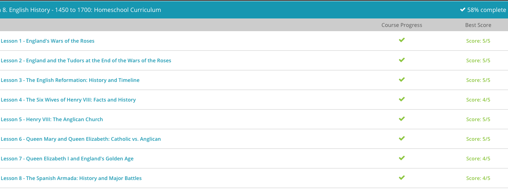

### Andrew Garber
### March 2
### English History

#### War of the Roses
 The Wars of the Roses is history's name for a series of civil wars that wreaked havoc in England during the second half of the 15th century. It was a fight for power between the two main branches of English royalty, the Houses of York and Lancaster.
 - Its pretty sounding name is a bit misleading, since it was a bloody conflict spanning decades. The name, Wars of the Roses, has its origin in the white rose, which was the emblem of the House of York. Although tradition holds the red rose was held by the House of Lancaster, this is probably more fiction than fact, made popular by Shakespeare's Henry V. In his masterpiece of historical fiction, Shakespeare has the nobility of England choosing sides by picking either a white or red rose to show their allegiance. No matter the name, the war was born out of a desire for power and some seriously messed up family dynamics!
 - First, the Wars of the Roses was fought between the English Houses of York and Lancaster. Second, the people of England held very tightly to the belief in the divine right of kings, which I'll explain later on. And third, the Wars of the Roses eventually brought about the powerful Tudor dynasty. If you can grab these three main points, we'll be in really good shape.
 - The first king we will discuss is Henry IV, from the House of Lancaster. Henry IV came to power by overthrowing his cousin Richard II. Although Richard II was pretty much a tyrant, the English had always given credence to the divine right of kings, or the belief that a king is subject to no earthly authority, deriving the right to rule directly from the will of God. Even though Richard II was a cruel despot, he was still the people's king, given the title by God and heredity. When Henry IV deposed him, he ignored the principle of the divine right of kings. This move made him a thief in the eyes of many, causing his rule to never be truly accepted.
 - Lucky for the House of Lancaster, King Henry IV's son, King Henry V, was a charismatic leader who gave his subjects a common enemy to despise. He found this enemy in the country of France and led the British to a triumphant victory over the French at the Hundred Years' War's Battle of Agincourt in 1415. This, along with his marriage to Princess Katherine of France, made him a national hero. The house of Lancaster had not only given England a military victory, they had also gained a place in French succession through Henry V's politically savvy marriage to Katherine, daughter of the King of France. Finally, the line of Lancaster had gained acceptance as England's ruling house.
 - In early adulthood, Henry VI was married off to the French Margaret of Anjou, a politically minded woman who had no trouble manipulating her timid husband. Margaret soon rallied those around her who would increase her wealth and power. Under her rule, the English treasury was nearly bankrupted and much of the gains made by the war hero, King Henry V, were lost. Two of her most famous advisors were the Duke of Somerset and the Earl of Suffolk. These men encouraged Margaret to alienate any noble who may have eyes on the throne, especially Richard of York, from, yes, you guessed it, the House of York. Richard, just like Henry VI, was a direct descendant of royal blood who could potentially lay claim to the throne.
 - In 1453, King Henry VI, the then hen-pecked ruler, suffered from a serious mental disorder and was unable to continue his royal duties. As Margaret held no birthright to the throne, Richard of York, the guy she tried to alienate, was made Protector of the Realm. With this move, Margaret, Somerset, and Suffolk were tossed to the side, and Richard of York became the de facto ruler of England. Score one for the House of York.
 - Richard, like Margaret, had an advisor of his own, a man named Neville, known as the Kingmaker. History tells us this guy was a real power monger who quickly worked to increase the power of the House of York. However, before he could succeed at making Richard of York the new king, King Henry VI, the mentally-unstable real king, somehow recovered from his mental lapse. Upon his return to the helm, Henry quickly returned Margaret and her posse to power, throwing the Yorks out on their ears and working to strip them of all power and worth.
 - Richard, prompted by Neville, refused to go quietly into the dark night. In a move of self-defense, Richard and his clan took up their arms, thus beginning the first official battle of the Wars of the Roses, The Battle of St. Albans. This battle was a decisive victory for Richard and the House of York. In fact, Somerset, Margaret's advisor, was killed, and King Henry VI was captured. However, Richard did not usurp the throne, but instead listed his grievances to the King. This brought about a very delicate truce that lasted for just a few years.
 - Fighting quickly resumed. Although both sides traded victories, the House of York won a decisive victory at the Battle of Northampton in 1460. Tradition states that at this time, Richard made a move to depose Henry VI but smartly realized the divine right of kings still stood in his way. Instead, he settled for being named Henry's heir.
 - Of course, this really angered Margaret, since it cut her children off from the throne. Not one to sit quietly, Margaret continued her fight against York. In December of 1460, the warring forces met at the Battle of Wakefield. Here Margaret's forces got the better of Richard of York, killing him and defeating Neville the Kingmaker.
 - With Richard dead and gone, this should have spelled victory for the Lancaster brood, but unfortunately for them, Richard had a son who was a very charismatic leader. He soon rallied the House of York and defeated the House of Lancaster at the Battle of Mortimer's Cross in 1461. With this defeat, Margaret and Henry of Lancaster were forced into exile, and Richard's son claimed the throne as King Edward IV, yet another score for the House of York.
 - Now, after all this fighting, you'd think the House of York would be ready to sit back and enjoy the throne. Sadly, this was not the case, for it seems the House of York couldn't even get along with each other. Not long after being crowned, King Edward's own brother, George, began challenging his rule. These challenges soon escalated into full-blown battles, this time between the two brothers of York. Fortunately for King Edward, he was able to maintain his rule and George was forced to flee to France. Listen to this: Ironically, George decided to join forces with none other than Margaret and Henry VI, the exiled troublemakers from Lancaster! Together, these three returned to England, drove Edward into exile, and returned King Henry VI to the throne… Huge, crazy score for the House of Lancaster!
 - The coronation of King Henry VII brought to power the great Tudor dynasty, which would include the powerful Henry VIII and the famous Queen Elizabeth, both of whom had the House of York and Lancaster running through their veins.

#### The Tudors
 - During today's lesson, we will be examining these five Tudor monarchs, highlighting their specific contributions to English society. The first Tudor monarch was Henry VII. Next was his son, the famous Henry VIII (with all the wives). After Henry VIII came his rather sickly son, Edward VI. After this guy, the story gets very interesting with the two female monarchs, Queen Mary (known to most as Bloody Mary) and Queen Elizabeth I (the famous 'Virgin Queen' who ushered in England's Golden Age).
 - The Tudor dynasty of England came to power at the end of England's bloody civil war known as the Wars of the Roses. This conflict was a fight for power between the English houses of York and Lancaster. The first Tudor king, Henry VII, took the crown in 1485 after defeating Richard III in the final battle of these damaging wars. Henry VII, being a distant cousin of the House of Lancaster, healed the rift between Lancaster and York by marrying a daughter from the House of York, combining the white rose of York and the red rose of Lancaster into the Tudor Rose.
 - After coming to the throne, Henry VII brought peace to a bedraggled England by instituting government reform and increasing royal control. Using his strong centralized power, he improved the infrastructure of England, which had been devastated by years of war. Being a lover of knowledge and a statesman, he also sent scholars to Italy to learn the Greek and Latin languages. In fact, many historians attribute his reign to the beginning of the English Renaissance, in which England began taking an interest in the classical cultures of Greece and Rome. Thus, King Henry VII gave England a stable royal house, an improved infrastructure and the beginning of the English Renaissance.
 - Next we have his son, the very infamous King Henry VIII , who is best known for his quest for a son, his six wives and his nasty habit of beheading a few of them. However, when he wasn't marrying, divorcing or executing, he was also contributing to the betterment of England.
 - Coming to the throne in 1509, Henry was hardly a man, being given the crown at the age of eighteen. Despite his youth, Henry VIII was a talented statesman and administrator. He took great interest in the progress of Parliament, including them in major decisions. Although he kept them firmly under his control, his repeated dealings with them lent credence to the institution in the eyes of the people. Henry VIII also continued his father's love of progress by improving the Royal Navy, building modern ships, making it a symbol of power throughout the world. As England's position as a world power increased, so did its trade and commerce. In turn, the economic status of England and its people continued to improve.
 - Speaking of Henry VIII's great gifts, we'll now get to his children. Edward VI was the only surviving son of King Henry VIII. Edward came to power in 1547 after his father's death. Because he was only nine, several dukes acted as Protectors of the Realm, basically ruling England for many years. These men were staunch Protestants who upheld the split from the Pope and worked to encourage the Reformation.
 - In 1553, Edward, still a teenager, became ill with a terminal disease. At the urging of his advisers, he named Jane Grey, a Protestant cousin, as his successor to the throne upon his death. This move bypassed his half-sisters, Mary and Elizabeth, and would soon lead to much more bloodshed. Although Edward VI's reign was very short, it did contribute to England by solidifying the power of Protestantism and continuing the Reformation.
 - Poor Jane Grey did take the throne as de facto ruler, but this only lasted nine days before Mary I, also known as Bloody Mary, overthrew her and later had her executed for treason. Mary was a staunch Catholic who quickly set about to re-establish Catholicism. Upon taking the throne in 1553, she had hundreds of Protestants executed in what came to be known as the Marian Persecutions, hence the name 'Bloody Mary.' She also re-instituted mass and overturned the pro-Protestant legislations of her father and her brother. She further thumbed her nose at Protestants by marrying Philip, the Catholic Prince of Spain.
 - Having died without an heir, Mary's crown passed to her sister, Elizabeth I, in the year 1558. Elizabeth's reign has come to be known as the Golden Age of England. Working to repair the damage done by her sister, the Elizabethan Religious Settlement of 1559 was enacted. In this legislation, Elizabeth was also declared the Supreme Governor of the Church of England. The act also allowed for both Protestant and Catholic interpretations of Church tradition, specifically communion. With these compromises, it's as if Elizabeth was saying 'Can't we all just get along? I've got a country to run here, people!'
 - Because of her desire to unite her subjects under one throne, her reign is marked as a time of peace. During this peace, she encouraged self-sufficiency in England through the growth of agriculture as well as overseas trade. This newfound wealth helped to usher in a renewed love of the arts. Under this peace and prosperity, England flourished, giving the world the brilliance of Shakespeare's theatre and the New World explorations of Sir Walter Raleigh.

#### Elizabeth I and England's Golden Age
 - The Elizabethan Era of English history was a remarkable time now coined England's Golden Age. Queen Elizabeth I, from the illustrious Tudor dynasty, reigned for 45 years. During her reign, it was a time of relative political stability, exploration, and creativity in which art flourished.
 - Coming to the throne in 1558 after the violent reign of her Catholic half-sister, Mary I - known infamously as Bloody Mary - Elizabeth worked to heal her land of the violent clashes between Catholics and Protestants. Though Elizabeth honored many of the Protestant reforms set up by her father, King Henry VIII, she also made significant concessions to the Catholics of her realm. In 1559, the Elizabethan Religious Settlement was enacted. In this legislation, Elizabeth was declared the Supreme Governor of the Church of England. This act also allowed for both Protestant and Catholic interpretations of church tradition.
 - England's wool trade also began to boom during Elizabeth's Golden Age. With the increase of wool, the face of farming changed, bringing about the process of land enclosure, in which the traditional open field system ended in favor of creating larger closed areas of land that required fewer workers. Although these new ranches of sorts were extremely profitable, the fact that they required less labor induced many workers to leave their villages for the employment found in towns. Thus, towns and cities burgeoned under Elizabeth's rule.
 - These inn-yards, being very profitable, soon grew into full-blown theatre houses. Among the most famous is the Globe Theatre of London. This theatre, built to mimic the Roman amphitheaters, was home to the original works of London's most famous playwrights.
 - Speaking of playwrights, not only did the Golden Age of England produce lots of wool, it produced some of the most revered playwrights of all time. There was Christopher Marlowe, made famous by his play, The Jew of Malta. To him we can add Thomas Kyd, known for his Spanish Tragedy. Of course, there's William Shakespeare, whose name has become synonymous with the word 'playwright.' To England's Golden Age and to high schools across the globe, he gave works like Hamlet, King Henry V, and the tragic Romeo and Juliet.
 - Along with a thriving economy and the flourishing arts, England's Golden Age opened an entire new world to the English realm through scientific study. Men like Sir Francis Bacon, who structured the idea of a defined scientific method, worked in England's Golden Age. To Bacon, we can also add Dr. John Dee, a famous alchemist, or in today's terms, chemist, who studied under Elizabeth's rule.
 - As scientific exploration boomed, so did overseas exploration. Up until this time, Spain and Portugal had dominated the New World's seas, but Elizabeth's Golden Age saw the emergence of English explorers onto the scene. There was Sir Francis Drake, the first European to pass from the Atlantic coast to the Pacific coast of South America. He also sailed around the world in his ship, the Golden Hind. We also have Henry Hudson, who discovered the Hudson River of New York, or Sebastian Cabot, the Italian-born explorer who sailed for England and searched for the illusive Northwest Passage across North America.
 - In 1588, Elizabeth would prove her backbone was as strong as any man's with the defeat of the Spanish Armada, an attack by well over 100 Spanish ships toward the English coast. Not only would this famous encounter prove Elizabeth could hold her own, it would establish England as preeminent over the seas.

#### Jamestown
 - In 1606, the Virginia Company of London, a group of investors, was given a charter, or a written grant, by King James I to settle the parts of North America not already claimed by Spain and France. Desiring a place that would be easy to defend, the company chose land near a river in the Chesapeake Bay region. In honor of their king, they named the river the James and the settlement Jamestown.
 - Within a very short time, the English settlers met with serious problems. First, they had settled near lands occupied by the powerful Powhatan natives, a chiefdom of well over 10,000 members. Although trade was established between the English and the natives, the relationship was shaky at best. Adding to the woes of the settlers were undrinkable water, lack of food and a very unfamiliar climate. Making matters worse, many of the settlers were from the upper-crust of English society, and were unaccustomed to manual labor. Put this together with the fact that they had no farming skills, and it's no wonder things went poorly.
 - Fortunately, Captain John Smith emerged as the settlers' leader in 1608. One of his first acts of business was to let everyone know those who didn't work, didn't eat! Unfortunately, Smith's role as leader was short lived, as in 1609 he sustained an injury and returned to England. Once Smith left the scene, things went further downhill. A period of warfare between the settlers and the natives, as well as the deaths of many English from starvation and disease, ensued. This has come to be known as The Starving Time.
 - In 1610, the few surviving settlers had reached their limit and decided to abandon Jamestown and head back to England. Ironically, as the exhausted settlers made their way up the James River, they were met by an English ship bringing not only supplies, but a second charter from King James. It seemed Mother England and the Virginia Company were not willing to give up their investment quite so easily. The exhausted settlers were ready to run from further conflict, but England was poised to keep up the fight.
 - However, this time Mother England would play a larger role as the second charter called for stronger central leadership. Along with supplies, the new ships brought a governor who would rule the settlement through military law. This allowed for harsh punishment of any dissenters and brings us to Scene Four - The Military Rule. On an interesting side note, this governor was none other than Thomas West, the Lord De La Warr, whom the state of Delaware is named after.
 - Under this rule, the governor's first action was to force the bedraggled survivors to return to Jamestown for another go at settlement. In order to make Jamestown a success, England's appointed governor had a plan. Rather than simply rely on trading with the natives for food, the new settlers tried their hand at things like glassmaking and woodworking. However, it wasn't until one of the colonists, the famous John Rolfe, introduced tobacco in about 1613 that things started to really hum.
 - In 1622, these conflicts came to a major head with the 1622 Massacre, in which the Powhatan attacked the settlement and killed over 300 settlers, including women and children. When news of the massacre reached England, it responded by sending more supplies, men and weapons. With this, all constraints seemed to lift from the settlers, and they began killing the natives en masse. During this time, English soldiers wiped out entire native villages.

#### The English Civil War
 - For centuries, England held to the Divine Right of Kings, the belief that kings are given the right to rule by God. Therefore, kings are accountable to God alone. To put it mildly, the English crown has given us some remarkable characters, not the least of whom would be King Charles I. Although he doesn't currently get as much press as this Charles or the wife-killing Henry VIII, he is a central figure in England's history. Not only did he lead England to its 17th-century civil war, he was executed for doing it! Yes, you heard that right. A king of England was actually executed by his people!
 - Charles' first swing and miss came in the form of religion. In the mid-16th century, King Henry VIII split with the Roman Catholic Church and declared himself head of the Church of England. Although there were a few attempts to bring the country back to Catholicism, Protestantism remained the religion of the state. Of course, this was a huge bone of contention with English Catholics, who were marginalized and even persecuted in the name of Protestantism. This strife led to mistrust as each side suspected the other of foul play.
 - With this background in mind, it's not surprising the Protestant Parliament was outraged when Charles chose a Catholic princess as his bride. Their concerns were obvious. If such a marriage occurred, would the next king or queen be raised as a Catholic? Even worse, his bride was from France. Would the marriage give Catholic France a foothold in England?
 - First, he used the Star Chamber, or an English court of law in which the upper class was tried, to raise money for his own purse. During his reign, the Star Chamber inflicted heavy fines on those brought before it. Charles also used the court to bribe the wealthy to buy noble titles. If they refused, they too were fined.
 - Second, he forced all of England to pay Ship Money. Ship money, which was a tax used for the upkeep of the English navy, was historically only paid by coastal towns. However, Charles decided everyone should pay this tax since everyone benefited from the navy. Although he may have had a point, this unilateral decision infuriated the powerful men of the nation.
 - Strikes one and two were pretty big deals. However, strike three was one for the record books! It occurred in 1629, when Charles actually refused to let Parliament meet. Not only did he refuse them once, Charles kept Parliament from meeting for over a decade! This came to be known as the Eleven Years' Tyranny, or Charles I's Personal Rule. This didn't end until 1640, when Charles got into a tangle with Scotland and needed Parliament's money to fund the war. They made him go through an enormous list of demands, mostly meant to humiliate the king, before giving him any money.
 - With his chief advisor dead and his money dwindling, Charles' hatred for Parliament grew. In 1642, he marched on Parliament with about 300 soldiers. His goal was to arrest a few of his biggest critics. Unfortunately for Charles, he had misread the loyalty of his fan base! Although many didn't agree with Parliament, the people still considered this body to be the representatives of the people. If Charles was free to arrest the powerful men of Parliament for criticizing him, how would the common men of England be safe from his whims?
 - In the first years of the war, the Royalist forces, those loyal to the king, had the upper hand. However, the tides turned when the Parliamentary forces made a military alliance with the Scots. Things got even brighter for them when Oliver Cromwell came on the scene. Cromwell, an educated member of the upper class, restructured the Parliamentary forces. Under his leadership, a soldier's placement in the military was based on his ability and not his status in society. In other words, the guys with the most skill made the starting line-up. This became known as the New Model Army. With this restructuring, the Parliamentary forces became a force to be reckoned with. At the 1645 Battle of Naseby, this New Model Army won the day! 
 - King Charles I was tried and convicted of high treason against England, the country that had for generations held to the Divine Right of Kings. In the year 1649, King Charles I, of royal blood, was beheaded by his very own subjects.

#### The Commercial Revolution
 - For starters, the Commercial Revolution was a period of European economic expansion, which began in the 16th century. The catalyst for this expansion was Europe's discovery and colonization of the Americas. As trade routes grew between the New World colonies and Old World Europe, the European continent was transformed. Although there were many factors that led to this, today we're going to highlight mercantilism, banking and joint-stock companies.
 - Mercantilism is an economic system used to unify and increase the power and monetary wealth of a country by strict government regulation of trade and foreign trading monopolies. Under this system, colonies existed merely for the benefit of their mother country.
 - Also under mercantilism, colonies were only allowed to import from or export to the European country that governed them. For instance, if Jamestown, governed by England, wanted to import wool from the Dutch, they could not. Even if the Dutch price was substantially cheaper, Jamestown was stuck buying wool from England. Further hamstringing the Jamestown colonists, all the goods produced by the colonies went to England. England then sold the goods to other countries at a substantial markup, which the crown, not the colonists, kept! In other words, the colonies did the work, while England reaped the profit.
 - First, the Commercial Revolution changed Europe from a local economy to a global one. Before the revolution, most goods were produced for family use or to be sold within local towns and villages. Other than a few traveling merchants, there was really no way to peddle goods to a larger population. However, once trade routes blossomed between European countries and their colonies, a whole new market opened up. Realizing there was money to be made, people began producing goods to be sold outside of their small communities. In other words, the incentive for profit replaced simply producing for survival.
 - The Commercial Revolution created the need for more banks within Europe. These banks provided money-lending services to parties interested in getting in on the blossoming trade. They also began issuing bills of exchange. These worked like our modern-day checking accounts. Rather than lugging around piles of gold, banks allowed merchants to deposit their earnings and receive a bill of exchange. A couple of iterations of improvement to this system later, and modernish fractional reserve banking appears.
 - Along with banks, the Commercial Revolution saw the creation of joint-stock companies. A joint-stock company is a business owned by shareholders. Each shareholder owns a part of the company determined by the amount of their initial investment. Since most individual Europeans didn't have the capital needed to launch large trading ventures, joint-stock companies were used to raise capital for larger projects. This also made starting a business less risky! An excellent example of this was England's East India Company, a joint-stock company that monopolized England's trade with the East Indies. Yes, the investors had to share their profits, but they also got to spread out their losses!
 - As goods were traded in greater quantities, money flowed into the European economy. Since more money was available, industries and merchants began asking higher prices for their goods. In short, inflation soon occurred. For the wealthy merchant class, inflation was a bump in the road; for the poor it was insurmountable.

