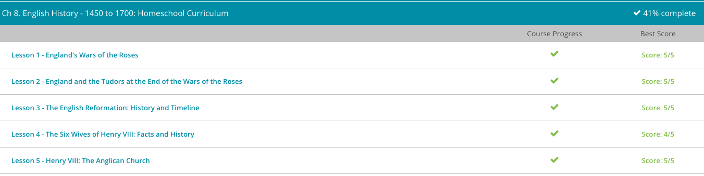

### Andrew Garber
### March 2
### English History

#### War of the Roses
 The Wars of the Roses is history's name for a series of civil wars that wreaked havoc in England during the second half of the 15th century. It was a fight for power between the two main branches of English royalty, the Houses of York and Lancaster.
 - Its pretty sounding name is a bit misleading, since it was a bloody conflict spanning decades. The name, Wars of the Roses, has its origin in the white rose, which was the emblem of the House of York. Although tradition holds the red rose was held by the House of Lancaster, this is probably more fiction than fact, made popular by Shakespeare's Henry V. In his masterpiece of historical fiction, Shakespeare has the nobility of England choosing sides by picking either a white or red rose to show their allegiance. No matter the name, the war was born out of a desire for power and some seriously messed up family dynamics!
 - First, the Wars of the Roses was fought between the English Houses of York and Lancaster. Second, the people of England held very tightly to the belief in the divine right of kings, which I'll explain later on. And third, the Wars of the Roses eventually brought about the powerful Tudor dynasty. If you can grab these three main points, we'll be in really good shape.
 - The first king we will discuss is Henry IV, from the House of Lancaster. Henry IV came to power by overthrowing his cousin Richard II. Although Richard II was pretty much a tyrant, the English had always given credence to the divine right of kings, or the belief that a king is subject to no earthly authority, deriving the right to rule directly from the will of God. Even though Richard II was a cruel despot, he was still the people's king, given the title by God and heredity. When Henry IV deposed him, he ignored the principle of the divine right of kings. This move made him a thief in the eyes of many, causing his rule to never be truly accepted.
 - Lucky for the House of Lancaster, King Henry IV's son, King Henry V, was a charismatic leader who gave his subjects a common enemy to despise. He found this enemy in the country of France and led the British to a triumphant victory over the French at the Hundred Years' War's Battle of Agincourt in 1415. This, along with his marriage to Princess Katherine of France, made him a national hero. The house of Lancaster had not only given England a military victory, they had also gained a place in French succession through Henry V's politically savvy marriage to Katherine, daughter of the King of France. Finally, the line of Lancaster had gained acceptance as England's ruling house.
 - In early adulthood, Henry VI was married off to the French Margaret of Anjou, a politically minded woman who had no trouble manipulating her timid husband. Margaret soon rallied those around her who would increase her wealth and power. Under her rule, the English treasury was nearly bankrupted and much of the gains made by the war hero, King Henry V, were lost. Two of her most famous advisors were the Duke of Somerset and the Earl of Suffolk. These men encouraged Margaret to alienate any noble who may have eyes on the throne, especially Richard of York, from, yes, you guessed it, the House of York. Richard, just like Henry VI, was a direct descendant of royal blood who could potentially lay claim to the throne.
 - In 1453, King Henry VI, the then hen-pecked ruler, suffered from a serious mental disorder and was unable to continue his royal duties. As Margaret held no birthright to the throne, Richard of York, the guy she tried to alienate, was made Protector of the Realm. With this move, Margaret, Somerset, and Suffolk were tossed to the side, and Richard of York became the de facto ruler of England. Score one for the House of York.
 - Richard, like Margaret, had an advisor of his own, a man named Neville, known as the Kingmaker. History tells us this guy was a real power monger who quickly worked to increase the power of the House of York. However, before he could succeed at making Richard of York the new king, King Henry VI, the mentally-unstable real king, somehow recovered from his mental lapse. Upon his return to the helm, Henry quickly returned Margaret and her posse to power, throwing the Yorks out on their ears and working to strip them of all power and worth.
 - Richard, prompted by Neville, refused to go quietly into the dark night. In a move of self-defense, Richard and his clan took up their arms, thus beginning the first official battle of the Wars of the Roses, The Battle of St. Albans. This battle was a decisive victory for Richard and the House of York. In fact, Somerset, Margaret's advisor, was killed, and King Henry VI was captured. However, Richard did not usurp the throne, but instead listed his grievances to the King. This brought about a very delicate truce that lasted for just a few years.
 - Fighting quickly resumed. Although both sides traded victories, the House of York won a decisive victory at the Battle of Northampton in 1460. Tradition states that at this time, Richard made a move to depose Henry VI but smartly realized the divine right of kings still stood in his way. Instead, he settled for being named Henry's heir.
 - Of course, this really angered Margaret, since it cut her children off from the throne. Not one to sit quietly, Margaret continued her fight against York. In December of 1460, the warring forces met at the Battle of Wakefield. Here Margaret's forces got the better of Richard of York, killing him and defeating Neville the Kingmaker.
 - With Richard dead and gone, this should have spelled victory for the Lancaster brood, but unfortunately for them, Richard had a son who was a very charismatic leader. He soon rallied the House of York and defeated the House of Lancaster at the Battle of Mortimer's Cross in 1461. With this defeat, Margaret and Henry of Lancaster were forced into exile, and Richard's son claimed the throne as King Edward IV, yet another score for the House of York.
 - Now, after all this fighting, you'd think the House of York would be ready to sit back and enjoy the throne. Sadly, this was not the case, for it seems the House of York couldn't even get along with each other. Not long after being crowned, King Edward's own brother, George, began challenging his rule. These challenges soon escalated into full-blown battles, this time between the two brothers of York. Fortunately for King Edward, he was able to maintain his rule and George was forced to flee to France. Listen to this: Ironically, George decided to join forces with none other than Margaret and Henry VI, the exiled troublemakers from Lancaster! Together, these three returned to England, drove Edward into exile, and returned King Henry VI to the throne… Huge, crazy score for the House of Lancaster!
 - The coronation of King Henry VII brought to power the great Tudor dynasty, which would include the powerful Henry VIII and the famous Queen Elizabeth, both of whom had the House of York and Lancaster running through their veins.

#### The Tudors
 - During today's lesson, we will be examining these five Tudor monarchs, highlighting their specific contributions to English society. The first Tudor monarch was Henry VII. Next was his son, the famous Henry VIII (with all the wives). After Henry VIII came his rather sickly son, Edward VI. After this guy, the story gets very interesting with the two female monarchs, Queen Mary (known to most as Bloody Mary) and Queen Elizabeth I (the famous 'Virgin Queen' who ushered in England's Golden Age).
 - The Tudor dynasty of England came to power at the end of England's bloody civil war known as the Wars of the Roses. This conflict was a fight for power between the English houses of York and Lancaster. The first Tudor king, Henry VII, took the crown in 1485 after defeating Richard III in the final battle of these damaging wars. Henry VII, being a distant cousin of the House of Lancaster, healed the rift between Lancaster and York by marrying a daughter from the House of York, combining the white rose of York and the red rose of Lancaster into the Tudor Rose.
 - After coming to the throne, Henry VII brought peace to a bedraggled England by instituting government reform and increasing royal control. Using his strong centralized power, he improved the infrastructure of England, which had been devastated by years of war. Being a lover of knowledge and a statesman, he also sent scholars to Italy to learn the Greek and Latin languages. In fact, many historians attribute his reign to the beginning of the English Renaissance, in which England began taking an interest in the classical cultures of Greece and Rome. Thus, King Henry VII gave England a stable royal house, an improved infrastructure and the beginning of the English Renaissance.
 - Next we have his son, the very infamous King Henry VIII , who is best known for his quest for a son, his six wives and his nasty habit of beheading a few of them. However, when he wasn't marrying, divorcing or executing, he was also contributing to the betterment of England.
 - Coming to the throne in 1509, Henry was hardly a man, being given the crown at the age of eighteen. Despite his youth, Henry VIII was a talented statesman and administrator. He took great interest in the progress of Parliament, including them in major decisions. Although he kept them firmly under his control, his repeated dealings with them lent credence to the institution in the eyes of the people. Henry VIII also continued his father's love of progress by improving the Royal Navy, building modern ships, making it a symbol of power throughout the world. As England's position as a world power increased, so did its trade and commerce. In turn, the economic status of England and its people continued to improve.
 - Speaking of Henry VIII's great gifts, we'll now get to his children. Edward VI was the only surviving son of King Henry VIII. Edward came to power in 1547 after his father's death. Because he was only nine, several dukes acted as Protectors of the Realm, basically ruling England for many years. These men were staunch Protestants who upheld the split from the Pope and worked to encourage the Reformation.
 - In 1553, Edward, still a teenager, became ill with a terminal disease. At the urging of his advisers, he named Jane Grey, a Protestant cousin, as his successor to the throne upon his death. This move bypassed his half-sisters, Mary and Elizabeth, and would soon lead to much more bloodshed. Although Edward VI's reign was very short, it did contribute to England by solidifying the power of Protestantism and continuing the Reformation.
 - Poor Jane Grey did take the throne as de facto ruler, but this only lasted nine days before Mary I, also known as Bloody Mary, overthrew her and later had her executed for treason. Mary was a staunch Catholic who quickly set about to re-establish Catholicism. Upon taking the throne in 1553, she had hundreds of Protestants executed in what came to be known as the Marian Persecutions, hence the name 'Bloody Mary.' She also re-instituted mass and overturned the pro-Protestant legislations of her father and her brother. She further thumbed her nose at Protestants by marrying Philip, the Catholic Prince of Spain.
 - Having died without an heir, Mary's crown passed to her sister, Elizabeth I, in the year 1558. Elizabeth's reign has come to be known as the Golden Age of England. Working to repair the damage done by her sister, the Elizabethan Religious Settlement of 1559 was enacted. In this legislation, Elizabeth was also declared the Supreme Governor of the Church of England. The act also allowed for both Protestant and Catholic interpretations of Church tradition, specifically communion. With these compromises, it's as if Elizabeth was saying 'Can't we all just get along? I've got a country to run here, people!'
 - Because of her desire to unite her subjects under one throne, her reign is marked as a time of peace. During this peace, she encouraged self-sufficiency in England through the growth of agriculture as well as overseas trade. This newfound wealth helped to usher in a renewed love of the arts. Under this peace and prosperity, England flourished, giving the world the brilliance of Shakespeare's theatre and the New World explorations of Sir Walter Raleigh.

