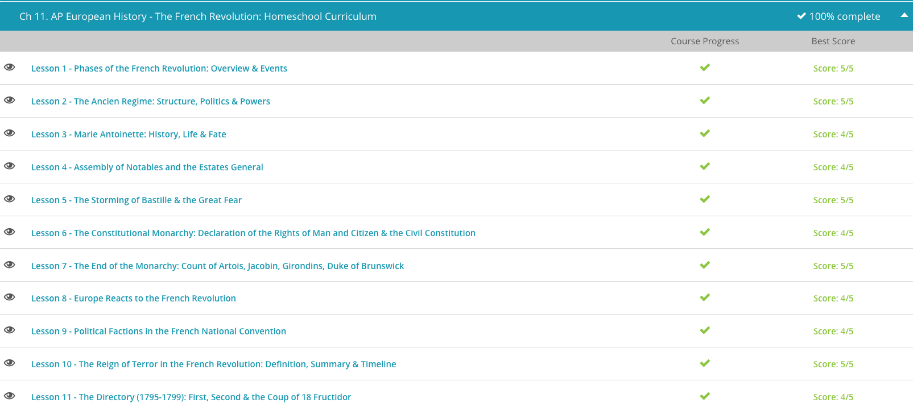

### Andrew Garber
### March 27 2023
### The French Revolution

#### Phases of the French Revolution
 - The triggering event for such a revolution occurred in May of 1789 when King Louis XVI called an assembly of the Estates General. The king was almost bankrupt, and he could only receive more money by meeting with the three estates: the nobles, the clergy, and the Third Estate, or commoners. The members of the Third Estate, however, were fed up with the conditions in France. They wanted change, and they wanted it right away. The assembly gave them the perfect opportunity to push for reform, and before long, the French Revolution began.
 - The revolution commenced with a so-called moderate phase, at least by comparison with what would happen later. The members of the Third Estate had created so much ruckus that they had been barred from the assembly, but they were not ready to give up. Instead, they met on the tennis court at Versailles on June 20, 1789, took an oath not to disband until they got a new constitution, and eventually formed themselves into the National Constituent Assembly.
 - Meanwhile, public unrest was growing in Paris, and it overflowed when a mob stormed the Bastille prison on July 14. Paris descended into panic as the Bastille's commander and the city's mayor were beheaded.
 - The defiant National Constituent Assembly used this unrest to their advantage and obtained its new constitution as well as limitations on the monarchy and the Declaration of the Rights of Man, which proclaimed freedom, natural rights, and government by the people. The Assembly, however, still could not solve the country's economy problems, and conditions continued to deteriorate. Suspicions rose on all sides, especially against the nobility. The king became a prisoner in his own nation, violent uprisings rocked the countryside, and France entered into a war with Austria and Prussia. An elected Legislative Assembly took control of the government in 1791 but didn't do any better than its predecessor. The situation was about to explode.
 - On August 10, 1792, the Legislative Assembly fell to mob violence, and soon the new National Convention took its place. The Convention was far more radical than the Assembly, and on September 21, it abolished the monarchy and declared France a republic. To emphasize that the monarchy was really defunct, the Convention executed Louis XVI in January of 1793.
 - Radical leaders like Maximilien de Robespierre and Georges Danton rose to take power. Under their control, France entered a period of radical secularism. The Convention closed Christian churches, set up a new calendar, and opened temples to the 'goddess of reason.' In March of 1793, the Reign of Terror began when the dictatorial Committee of Public Safety, which had more control over France than the Convention, started executing so-called 'traitors' - in other words, anyone who disagreed with the new regime. Over the next ten months, thousands of people fell to the guillotine.
 - This new constitution created the Directory, a five-man executive board of dictators. The terror abated a bit, but the Directory proved to be weak and unpopular. Uprisings and attempted coups broke out everywhere, and the army had its hands full trying to control them as well as fight a strenuous war against Austria, Great Britain, Russia, and Turkey.
 - The Directory had to rely completely on the military to keep order, but that backfired. On November 9, 1799, a popular, young officer named Napoleon Bonaparte carried out a successful coup d'état, which overthrew the Directory and landed Napoleon in the new executive position of consul. 

#### The Ancien Regime
 - French society in the Ancien Regime was divided into a hierarchy, or ladder, of several distinct social classes. On the top rung, we find the king, who claimed to rule the country absolutely by divine right, or the will of God. All the people of France were his subjects, and he held the power of law in his person. At least, he thought he did. In actuality, the king relied quite a lot on the support of the nobility and France's governmental structures. On the eve of the Revolution, Louis XVI of the Bourbon dynasty was France's reigning monarch.
 - Next came the First Estate - the Catholic Church. France was a Catholic country to the core, and the Church was in charge of the nation's religious life as well as charitable works, education, and record keeping. The Church, which was exempt from taxation, was very wealthy, and some people within the Church became corrupt. The higher clergy, like bishops and archbishops, were often advisers to the king and held an abundance of political power. Lower clergy, like parish priests, were more involved in the lives of the common people, and they could better identify with the sufferings and struggles of the lower classes.
 - As we move down the ladder just a little bit, we find the Second Estate - the nobility. Nobles were people with hereditary titles like duke, count, viscount, baron, and chevalier. Some noble families came from a military background, stretching back to the days of the medieval knights. Others held top positions in government. Still others had once been commoners and purchased their titles with wealth they had earned through commerce. Most nobles were land owners with large estates, and many were very wealthy. They lived in luxury with the best of everything, from clothing to art to entertainment. As a whole, the nobility was a privileged class that exercised significant power, but avoided taxation.
 - On the bottom of the ladder, we find the Third Estate - the common people. While this class made up about 96% of the population, even it was divided. The bourgeoisie were the wealthier commoners, who were involved in business or other professions. They had some money and could sometimes purchase a noble rank or a lower-level governmental office. They often resented higher classes and especially the burdensome taxation that fell heavily on them.
 - Below all of these were the peasants, who made up the vast majority of the population. They were the poorest of the population, and lived in continual poverty - despite that, they were heavily taxed.
 - These classes interacted with each other through France's various social and political structures. For example, some nobles and peasants participated in the seigneurial system. Noble seigneurs owned large estates on which peasants worked. Each peasant received the use of a section of land in return for rent and labor. On top of that, the seigneurs often taxed the peasants heavily, expecting them to pay for necessary services, like flour mills and communal bake ovens. The seigneurs also held courts to pass judgment on troublesome peasants.
 - On a larger scale, France was divided into 37 provinces, each with a local government that was in charge of enforcing laws, collecting taxes, and managing daily life. Most office holders in these local governments were nobles or wealthy bourgeois. Thirteen parlements also served France as supreme courts that registered and enacted royal decrees.
 - On the eve of the French Revolution, France was a mess. The Ancien Regime was falling apart from the inside out as years of governmental mismanagement, class resentments, war, debt, taxation, and bad harvests took their toll. In the century before 1789, France had been involved in wars with England, wars on the European continent, and wars in America. These conflicts racked up some major debt. By 1780, in fact, half of the nation's budget only just met the interest payments on its loans.
 - Taxation became heavier and heavier and heavier, especially on the Third Estate, most of whom could not afford to pay all the new taxes government officials thought up. There were taxes on each family, duties on various products, poll taxes, and special taxes to meet specific needs. The Third Estate bore the brunt of them while the First and Second Estates were mostly exempt. On top of everything, the church required a tithe, or 10% payment, from its members. Resentment among the lower classes grew quickly, especially when they saw the king, nobles, and some churchmen living in luxury.

#### Marie Antoinette
 - Maria Antonia Josepha Joanna, better known as Marie Antoinette, was born November 2, 1755, to Maria Theresa, the empress of Austria, and François I, the Holy Roman Emperor. As a member of the royal Hapsburg family, the little princess led a carefree life surrounded by luxury. She was educated, as most royal girls of her day, with an emphasis on religion and morality more than academic achievement. When Marie was 10 years old in 1765, her mother arranged for her marriage to 11-year-old Louis Auguste, the grandson of French King Louis XV. Maria Theresa was seeking a political alliance that would end the rivalry between the Hapsburgs and the French Bourbon dynasty once and for all, and she didn't hesitate to involve her young daughter in the plan.
 - Maria Antonia Josepha Joanna, better known as Marie Antoinette, was born November 2, 1755, to Maria Theresa, the empress of Austria, and François I, the Holy Roman Emperor. As a member of the royal Hapsburg family, the little princess led a carefree life surrounded by luxury. She was educated, as most royal girls of her day, with an emphasis on religion and morality more than academic achievement.
 - When Marie was 10 years old in 1765, her mother arranged for her marriage to 11-year-old Louis Auguste, the grandson of French King Louis XV. Maria Theresa was seeking a political alliance that would end the rivalry between the Hapsburgs and the French Bourbon dynasty once and for all, and she didn't hesitate to involve her young daughter in the plan.
 - On August 10, 1792, an angry mob stormed Tuileries. The French Revolution had entered into its radical Reign of Terror, and people were being beheaded right and left. The royal family ended up as prisoners in the Temple Tower, but most people didn't even acknowledge them as royalty anymore. France's National Convention had abolished the monarchy and declared France a republic. French leaders were clamoring for the king's execution, and Louis XVI met his fate on the guillotine on January 21, 1793.
 - Marie was confined to a dark dungeon six weeks later, and after a two-day trial on trumped up charges of treason, adultery, and even incest, she was found guilty and sentenced to death. In reality, French leaders viewed the queen as a liability that needed to be eliminated. Marie faced her death bravely, saying, 'I am calm as people are whose conscience is clear.' On October 16, 1793, Marie Antoinette was led to the guillotine.

#### Assembly of Notables and the Estates General
 - The king turned to his finance minister, Charles de Calonne, to come up with a plan to fight the finanical cricsis. Calonne could see only one solution to France's financial crisis: tax the nobles, especially on their land holdings. Louis XVI agreed. The nobles, represented by the 13 parlements, or supreme courts, definitely did not. The king decided to gather the nobility together to explain to them why they would have to pay more taxes, and the best way he could do this was to call an Assembly of Notables.
 - The 144 members of the Assembly of Notables met for the first time in February of 1787. Most of the members were nobles, so they were annoyed by Calonne's financial presentation. Calonne offered the Assembly a choice. They could either agree to impose new taxes on the nobility or consent to force the nobles to give up their exempt status and pay the taxes currently in place.
 = Predictably, the Assembly refused both options and insisted that the government could not raise taxes or change the system at all without the approval of the Estates General, an assembly of delegates from France's three estates: the clergy, the nobility, and the common people. The assembly closed in May without making any progress in solving the financial crisis. Before they left, the members pressured the king to sack Calonne, which he did.
 - Calonne's replacement, Etienne Charles Lomenie de Brienne, tried very hard to avoid calling the Estates General. The parlements, however, were set on this option. They figured that the nobles and clergy working together could foil the king's taxation plans once and for all. The annoyed Louis XVI dissolved the parlements, but the nobles continued to dig in their heels.
 - Finally, the king realized that he had no other choice. He would have to give in to the nobles and call the Estates General if there was to be any chance to pull France out of its deepening financial emergency. He pulled former financial minister Jacques Necker out of retirement to help. Necker had a knack for interacting with the various groups, and the king needed that kind of person by his side.
 - The Estates General met for the first time since 1614 on May 5, 1789. The estates' members reflected the hierarchical French society. All three estates - the clergy, the nobles, and the common people - were represented, but the treatment of the three was not at all equal. While the clergy and nobility sat at the front of the meeting hall and dressed in full regalia, the members of the Third Estate, mostly fairly wealthy bourgeoisie dressed in somber black robes, were squished in the back of the room where they were hard pressed to see and hear what was going on.
 - After a month of deliberations, the Estates General was no closer to solving France's problems. The Third Estate felt more left out than ever because the clergy and nobility often met in private, excluding the commoners, who were becoming more and more frustrated. Finally, the Third Estate's delegates decided to take matters into their own hands. They represented the majority of the nation, after all, and that, they felt, should give them the authority to rule. On June 17, 1789, the Third Estate broke away from the Estates General. Calling themselves the National Assembly, the delegates declared taxes illegal and demanded a new constitution.

#### Storming of the Bastille
 - Paris' famous Bastille was built in 1370 as a medieval fortress designed to protect the city from outside attack. By the 17th century, it had been converted into a state prison, and when the French Revolution began in 1789, the Bastille was home to mostly noble prisoners, often spies and those detained for political reasons. A major feature of Paris' cityscape, the Bastille was an imposing structure with thick, hundred-foot walls, an eighty-foot-wide moat, eight towers, and two drawbridges.
 - Although it had been designed and intended as a symbol of security and order, many Parisians came to despise the Bastille as a symbol of despotism and tyranny. When they surveyed the massive structure, they remembered the absolute monarch who was in control of it. They recalled all the troubles that had plagued France: the class struggles, the unequal treatment and sufferings of the common people, the debt, the high taxes, the wars, and the bad harvests. The Bastille reminded Parisians of everything that was wrong with their country.
 - Naturally, the crowds turned their attention to the symbol of everything the people resented, namely, the Bastille. The prison's commander, Bernard-René Jordan de Launay, was awfully nervous by the morning of July 14, 1789. He had already received some reinforcements, but he knew that he simply didn't have the manpower to hold the Bastille against a massive, angry mob. What's more, only two days before, the government had sent 250 barrels of gunpowder to help defend the Bastille. That action proved to be a mistake, for it only made the Bastille a more tempting target. The soldiers in residence worked hard to reinforce the prison while dodging pot shots from the crowds below, and the intensity of the situation continued to heighten.
 - Early in the morning on July 14, a mob armed with muskets, swords, and various homemade weapons gathered at the Bastille. They were intent upon seizing the newly-delivered gunpowder and freeing the prisoners, who, at the moment, numbered only seven. The crowd demanded Launay's surrender, but he refused. He tried to reason with the people, sending delegations to say that while he would not give up the Bastille, he would order his soldiers to hold their fire. He even showed the mob that the prison's cannons were not loaded.
 - That was another big mistake. It only gave the angry people more confidence, and three hundred of them stormed over the prison's outer wall into the courtyard. They opened the first drawbridge to admit the rest of the mob and tore off toward the second drawbridge. Launay's soldiers opened fire, killing or wounding about a hundred people. The crowd's fury only increased.
 - Around 3 p.m., a company of deserters from the French army arrived with five cannons. They vigorously joined in the attack against the Bastille and Launay knew that he was in big trouble. There was no way he and his few men were going to stop this enraged mob. Hoping for safety for himself and his soldiers, Launay decided to surrender.
 - The crowd quickly overran the Bastille, grasped Launay and the prison's other defenders, freed the prisoners, and seized gunpowder, weapons, and anything else they could carry. Soon, they were marching triumphantly through the streets. Chaos reigned in the city, and Launay's hope for safety turned to despair. He was executed by the mob along with many of his men.

#### The Constitutional Monarchy
 - By 1791, Louis XVI realized that things were not looking good for the monarchy. In June, he tried to escape to Austria with his family, but his attempt failed. In September of 1791, the Assembly finally presented the new constitution it had been wanting for over two years.
 - The constitution did indeed bring major changes for the monarch. Louis was still the king, but now he faced some serious limitations to his power. No longer an absolute monarch governing by divine right, he was now a constitutional monarch, whose power came from the law and the legislature. He was required to cooperate with the new Legislative Assembly, which replaced the National Assembly and in which the sovereignty, or ruling power, resided. It was a harsh blow to Louis, but the new Assembly was positive that it was the right move for the country.
 - The new constitution also determined voting rights. Only active citizens, male residents of France who were over 25 years old and who paid taxes, could vote. While this new designation increased the number of enfranchised Frenchmen, it still denied the vote to the majority of the common people. The long-awaited constitution of 1791 proved to be short-lived. 

#### The End of the Monarchy
 - By the middle of 1791, King Louis XVI knew that things were looking very bad for the French monarchy. He decided that his best course of action was to sneak out of France and organize some sort of resistance to the revolution from afar. After his escape attempt failed in June of 1791, however, he lost the faith of the French people. They simply couldn't stomach a king who seemed to be running away from his responsibilities.
 - Other nobles, army officers, and members of the royal family were more successful than Louis in getting out of France. Since the fall of the Bastille in July of 1789, these émigrés had scurried out of the country like rats off a sinking ship. They traveled to sympathetic nations like Austria and Prussia, where they worked to drum up support for the French monarchy. Among the émigrés was the king's brother Charles-Philippe, the Count of Artois.
 - Spurred by the Count and his fellow Frenchmen, Austria and Prussia warned the French government against harming Louis in any way or risk the threat of war. In September of 1791, France adopted a new constitution that established a new executive body, the Legislative Assembly - a constitutional monarchy which sharply limited the king's power. The monarchy was sliding downhill quickly.
 - There were many factions in the emerging revolution, which hadn't become full-scale revolution yet, including the Girondins, led by Jacques-Pierre Brissot. Members of this faction, who were mostly bourgeois, supported the revolution, but they were moderates. They realized the necessity of a constitutional monarchy for the stability of the country, and they hoped to set up a decentralized government that would not have much influence on the economy. The Girondins tended to talk a lot, but not do much.
 - The Jacobins, on the other hand, proved to be more radical revolutionaries. Led by Maximilien de Robespierre, these members of the bourgeois longed for a republic. They wanted to get rid of the monarchy once and for all and develop a centralized government that would have control over the economy. Unlike the Girondins, the Jacobins were aggressive; they were ready to act.
 - Finally, we have the sans-culottes, literally 'those without breeches,' who were lower class peasants and urban workers. The sans-culottes despised the upper classes, who vainly tended to wear knee breeches rather than the long pants of the common people. Violent and unpredictable, the sans-culottes were willing to work with bourgeois leaders to a point, and they could be quite helpful to revolutionaries.
 - As tension rose throughout France, the king was subject to numerous threats, especially on June 20 when an angry mob attacked the royal family's residence. Such insults enraged the émigrés and their allies. On July 5, the Duke of Brunswick, who was in command of the Prussian-Austrian army, issued his Brunswick Manifesto. He warned the French government that if the king and his family were hurt or humiliated in any way, the city of Paris would be subject to an 'ever memorable vengeance' of 'military execution and complete destruction.'
 - His warning went unheeded. On August 10, a mob of Jacobins and sans-culottes stormed the royal residence, captured the king and his family, and hauled them off to prison. For good measure, they overthrew the Legislative Assembly and set off a series of riots and massacres that rocked Paris in September. Over a thousand nobles and priests were killed, and chaos reigned. 
 - The new ruling body, the National Convention, was dominated by radical revolutionaries. On September 21, it abolished the monarchy. The next day, it declared France a republic. Louis and his family languished in prison, but not for long. The king, now called 'Citizen Louis Capet,' went to trial in December on a charge of treason. He was found guilty by a unanimous verdict and sentenced to death on the guillotine.

#### The Reign of Terror in the French Revolution
 - Though many consider the execution of the king, and the subsequent beheading of Marie Antoinette and many political prisoners who had supported the monarchy, as the start of the Reign of Terror, the Terror did not really get into full swing until the creation of the Committee of Public Safety. The Committee was first created in April 1793 and led by one of the men who engineered the coup of 1792, Georges Danton. The Committee was charged with stabilizing France, ending the civil strife within the country, and defending France's borders from impending invasions from foreign powers.
 - The Committee initially attempted to do this through peaceful measures, but after its failure to adequately provide for the military, the Committee was recalled and reconstituted in July with a considerably more radical membership. Led by Maximilien Robespierre, a determined leader of the Jacobin movement, Robespierre and his Committee made it their personal mission to eliminate any enemies of the Revolution, though exactly who and what constituted an enemy of the Revolution was never made concretely clear.
 - To make matters worse, by the end of the summer, the democratic constitution drawn up by the Convention had not been put into effect and warfare within and without France's borders continued unabated. In response, the Committee set up a provisional government wherein the Convention was reduced to merely approving or disapproving of the Committee's suggestions.
 - With a radical agenda and near dictatorial powers over the French state, Robespierre and the Committee set about eliminating those whom they viewed as subverting the Revolution, beginning first with their rival political faction, the Girondins. After executing the Girondin leaders, Robespierre famously published the Law of Suspects in September 1793. The Law of Suspects essentially made anyone who spoke, wrote, or acted in any way contrary to the ideals of the French Revolution liable to be arrested, imprisoned, and likely executed in the name of safeguarding the Revolution.
 - Subsequently, Robespierre and the Committee set up Watch Committees all over France to report on suspected opponents of the Revolution, people Robespierre termed 'enemies of liberty.' What resulted was the arrest, trial, and execution of thousands of prisoners all over France, from the fall of 1793 into the summer of 1794.
 - In nine months, approximately 16,000 French men and women, including 2,400 in Paris alone, were beheaded by the guillotine - nicknamed the 'National Razor' in this period - and many others were summarily executed. Historians' best estimates are that 30,000 people lost their lives in the year-long period from Robespierre's installment as the head of the Committee of Public Safety in July 1793 until the Terror's end in July 1794.
 - Considering these achievements, Robespierre certainly believed the ends - a successful and solvent France - certainly justified his rather grisly means. In February, for instance, Robespierre gave a famous speech where he equated terror and the virtues of the French Revolution, claiming one could not be had without the other.
 - Despite Robespierre's fervency, many within the French government began to oppose the Terror. In the spring of 1794, the Committee of Public Safety's original leader, Georges Danton, stood in the Convention and spoke in opposition to Robespierre's tactics. In response, Robespierre had Danton and his political colleagues arrested and he executed them only days later.
 - The French military victory in June further made the case to many French leaders that the Terror needed to end, since the very reason for the commission of the Committee of Public Safety no longer existed. This end came in July 1794 when an impromptu verbal assault of Robespierre and his deputies during a meeting of the Convention led to his arrest. Within hours, the Convention declared Robespierre an outlaw and executed him the following day without a trial. Ironically, the final victim of the Reign of Terror was its orchestrator.

#### The Directory, and the coups
 - The French people quickly grew tired of the radicalism and terror controlling their country. Many were still devout Catholics, and they rebelled against the attacks on their church. No one felt safe, for Robespierre even executed his fellow radicals. The tide began to turn, however, when Robespierre tried to establish a 'republic of virtue,' abandoning Christian morality for a new set of values that Frenchmen simply couldn't accept. The backlash led Robespierre himself to the guillotine in July of 1794.
 - After his death, radicalism began to falter, and moderates resumed some control of the National Convention. A few royalists even sneaked back into France and started to reassert themselves. Most people agreed that it was time for some sort of new government.
 - On August 22, 1795, the Convention ratified a new constitution, which set up a new system of government. The constitution established two legislative houses. The Council of Five Hundred was the lower house that initiated legislation, and the Council of Ancients, the upper house with 250 members, approved or rejected the laws started by the lower house.
 - France also received a new executive branch in the form of a 5-man Directory, which could appoint men to fill government positions. While the Directory technically didn't have much power, it had wide influence. The members of the legislature and Directory were to be elected annually in hopes of retaining a balance of power and avoiding abuses and corruption. 
 - Unfortunately for France, the new government struggled from its very beginning. Plots and factions rose up on all sides, vying for control. The royalists raised their voices to call for a restoration of the monarchy. The radical Jacobins clamored to regain the influence they had under the old National Convention. The members of the Directory soon found themselves walking a fine line between these two groups as they struggled to maintain moderation and influence.
 - It didn't take long for the situation to move from bad to worse. The Directory was not at all happy with the results of the election of 1797, for too many royalists and Jacobins had won seats in the legislature. Three Directory members decided to take matters into their own hands.
 - On September 4, 1797, they declared the election results void and used the military to oust the new legislators and the other two members of the Directory. The Coup of 18 Fructidor, referring to the date on the French calendar on which the action took place, established the Second Directory, a revised executive committee, which was made up of the three original members and two hand-picked additions who were determined to assume greater control over the French government.
 - The Coup of 18 Fructidor received a nod of approval from a young, up-and-coming army general by the name of Napoleon Bonaparte. Napoleon was popular with the French people for his military victories in the wars that France had been carrying on throughout Europe. He threw his support and that of the army behind the Second Directory.
 - As confidence in the French government dropped to a new low and the abuses of the Second Directory increased, Emmanuel-Joseph Sieyès was appointed to the Directory in May of 1799. He realized that the Second Directory was failing miserably, and he decided that France once again needed a new system, something more powerful, perhaps something military. Sieyès knew just to whom he would turn - the popular Napoleon Bonaparte.
 - With Sieyès' support, Napoleon carried out a successful coup d'état against the Second Directory on November 9, 1799 - the Coup of 18 Brumaire according to the French calendar. He overthrew the Second Directory, suspended the legislature, and established a 3-man consulate with himself as the most powerful first consul. With this act, France entered into yet another new era, leaving the French Revolution behind and looking toward Napoleon for guidance and protection.

