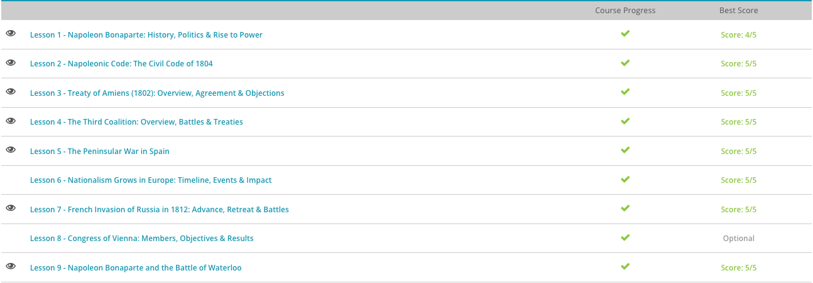

### Andrew Garber
### March 30
### Napoleon Bonaparte

#### Early Life
 - Napoleon Bonaparte, the future general of the French army and emperor of France, was born on August 15, 1769, on the island of Corsica to Carlo Buonaparte and Letizia Ramolino. Napoleon was far more Italian than French in his family heritage. Until the year before his birth, Corsica had belonged to the Italian city of Genoa. In fact, Napoleon's father had actively resisted French occupation, at least at first. His defiance quickly faded when the new French regime appointed him as an assessor for one of Corsica's judicial districts.
 - After getting settled in France, Napoleon rejoined the military. This time he met with success in his chosen career. Victory over the British in 1793 earned him a promotion to brigadier general, and by 1796, the French government appointed him commanding general of the French army in Italy. The soldiers were rebellious, underfed, and disgruntled, but Napoleon turned them around, and pretty soon, led by their charismatic general, the French army was winning victories and capturing territory. In 1797, France made peace with several European countries thanks to Napoleon's success.
 - France did, however, remain at war with Britain, and Napoleon seriously considered invading his island enemy. After carefully analyzing the matter, he decided it would be too much of a risk to face Britain's naval strength. Napoleon knew his limits. Instead, he turned his attention to Egypt in 1798 with the hope of disrupting Britain's communication and trade with her colonies to the east.
 - Although Napoleon won some initial victories, the French fleet was eventually defeated by the British. The general suffered another loss in Syria in 1799. The disgusted Napoleon decided to make a change. He had greater possibilities on his mind. It was time to return to France.
 - While Napoleon was furthering his military career, France was locked in the throes of the French Revolution. The Reign of Terror, in which thousands of French citizens met their deaths on the guillotine, was just beginning when Napoleon moved his family to France. Wisely, the new Frenchman decided to align himself with the radical revolutionaries currently in control. Napoleon knew how to get in the good with the right people.
 - Even though he was briefly imprisoned when the radical government fell in 1795, Napoleon soon made allies with the new five-man executive body, the Directory, which recognized his military prowess and launched him to the apex of his career as a general. The Directory, however, was weak, corrupt, and unpopular. Without the support of the French people, it turned to the military for protection, and its reliance on Napoleon and his troops grew as the years passed.
 - In early 1799, a shrewd statesman by the name of Emmanuel-Joseph Sieyès joined the Directory. He firmly believed that the current leadership was failing miserably and that France needed a new government. In other words, Sieyès took his seat on the Directory with the intention of overthrowing the Directory, and he turned to Napoleon for help. The general knew an opportunity for advancement when he saw one and quickly agreed to assist Sieyès with his coup d'état.
 - The Directory hurried to appoint Napoleon as commander of the army in Paris in hopes of saving the Republic. Then Sieyès and two other members of the Directory resigned. The other two members were arrested. So far everything was going as planned. Napoleon was in position to take control. All he needed was support from the two houses of the legislature.
 - The next day was almost a disaster. The legislature's upper house, the Council of Ancients, supported Napoleon, but the lower house, the Council of Five Hundred, resisted. Its members voiced their support for the current constitution and demanded details about Napoleon's plans. Napoleon gave a long, rambling, almost incoherent speech, which didn't satisfy the councilmen at all. Cries of 'Down with the Dictator! Down with the Tyrant! Bonaparte: Outlaw!' rang throughout the hall, and Napoleon was soon dodging various hurled projectiles.
 - Luckily, Napoleon's brother Lucien was in the perfect position to intervene, for he was the president of the council. Lucien acted fast, calling in Napoleon's soldiers and ordering them to 'Throw out this rabble!' Councilmen scattered in panic and Napoleon had control.

#### Napoleonic Code
 - By 1800, France's legal system was a mishmash of old and new laws. The provincial laws left over from the days before the French Revolution were still intact in many places, with Roman law dominating in the southern provinces and medieval common law holding sway in the north. At the dawn of the Revolution, the French people could be subject to 400 different legal codes depending on where they lived.
 - When Napoleon Bonaparte took control of France as the powerful first consul in 1799, he decided that the French legal system required some vast revisions. There should be one law for everyone, Napoleon believed. In 1800, he appointed a commission to help develop a unified code of law that would apply to all French people in every part of France. Headed by legal expert Jean-Jacques-Régis de Cambacérès, this commission met 87 times to discuss, design, and draft this new legal code. Napoleon himself took part in 36 of these meetings to make sure that the commission was including his own agenda and ideas.
 - By the second half of 1801, the commission was ready to draft the new code. Four writers worked on the project, led by lawyer Jean-Etienne-Marie Portalis, who composed several key portions of the code, including the sections on marriage and property. By the end of the year, the code was finished, but its publication was delayed until March 21, 1804. On that day, France officially received its new Civil Code, which later became known as the Code Napoleon or Napoleonic Code.
 - The new code consisted of 2,281 articles in three books. The first book, Of Persons, dealt with civil rights, French citizenship, residence, marriage and family, and divorce. The second book, Of Property, and the Different Modifications of Property, focused on property rights and servitude. The third book, Of the Different Modes of Acquiring Property, concentrated on business, contracts, and inheritance. These books and articles applied to everyone equally. Gone were the days of various legal codes for various provinces. The French legal system was now unified.
 - The Civil Code retained many of the human and civil rights established during the French Revolution. French citizens, at least male citizens, were equal before the law and could freely exercise their rights. They could practice free speech and religious dissent, and they were entitled to property rights, including 'the right to enjoy and to dispose of one's property in the most absolute fashion.' Furthermore, the privileges of the aristocracy, including the feudal systems, were wiped out. All Frenchmen, at least in theory, had equal standing despite their class or wealth.
 - Further, the Civil Code opened the door for the return of slavery in the French colonies. While the code did not mention slavery explicitly, it did include clear statements about property rights. Slave owners were quick to argue that slaves were indeed property, and, therefore, they had the right to do with them whatever they wished.
 - It also made some extremely strong concessions to husbands and fathers, in the control of their wives and children. 
 - Napoleon Bonaparte was proud of the Civil Code and considered it one of his most outstanding achievements. In 1804, the code was firmly in place in France and all of France's colonies. It remained in force even after Napoleon's defeat. The code also migrated to other European countries. Belgium, Italy, Poland, the Netherlands, and sections of Germany all adopted versions of the French code.
 - Some citizens in France and elsewhere were upset by various sections of the code. Catholics especially renounced the code's interference in marriage and openness to divorce. Others, however, welcomed the code. Up-and-coming bourgeoisie, for example, applauded the code's protection of property rights.

#### Treaty of Amiens
 - The 1802 Treaty of Amiens ended a war between France and Great Britain that had been waged for nine years. Let's take a look at the events leading up to this treaty. It all began in 1793 when leaders of several European countries, including Britain, decided to combat the spread of the French Revolution and put an end to French aggression. The wars of the First Coalition ended in a shaky peace between France and Austria in 1797, but Britain remained at war.
 - That peace didn't last long anyway. France continued its drive for power and territory. Its army soon resumed a campaign in Italy and slipped into Egypt in 1798, hoping to disrupt Britain's trade and communications with its colonies to the east. In 1798 and 1799, Britain joined forces with Austria, Prussia, Russia, Turkey, Portugal and Naples to form the Second Coalition. These countries planned a three-pronged attack against France. Britain would strike through Holland, Austria through Italy and Russia through Switzerland. It seemed like a good strategy, but the Coalition didn't count on the power of France's favorite general and first consul, Napoleon Bonaparte.
 - The Coalition met with some success at first, especially in Italy where the Austrians recovered some of the territory they had lost in the previous war. Then France began to push back, defeating the British in Holland in 1799. The tide turned against Austria, as well. On July 14, 1800, the French, led by Napoleon, routed the Austrian army in the Battle of Marengo despite the Austrians' superior numbers. The two countries formed a shaky truce.
 - Meanwhile, the Russians, under Tsar Paul I, were quickly losing confidence in the Coalition. The tsar rather admired Napoleon's aggressive leadership, and he soon left the Coalition and initiated friendly relations with France. Napoleon, living up to the tsar's estimation, began another push against Austria, marching toward Vienna and trouncing the Austrians at Hohenlinden on December 3, 1800. This time, Austria agreed to a new treaty in February of 1801, and once again, Britain stood alone against France.
 - Both countries had their advantages in the conflict. France had a larger population, but Britain maintained a decisive naval supremacy. The British decided to push their advantage and control the seas, preventing France from carrying on a thriving international trade. British ships were soon guarding ports all over Europe to block French ships from entering.
 - This soon became a problem for countries that were losing out economically from the blockade. In 1800, Russia, Sweden, Prussia and Denmark formed the League of Armed Neutrality with the goal of protecting their ports and reopening trade with France. Britain took this as an act of war, and on April 2, 1801, the British navy attacked Copenhagen, Denmark, destroying ships and damaging shoreline defenses. Denmark quickly surrendered, and the League fell apart.
 - By this time, however, both sides were exhausted and ready to talk peace. Napoleon wanted to concentrate on matters at home, and the British wanted to focus on their own economic troubles and manufacturing. By October 1, 1801, French and British representatives had agreed on peace terms, which were made official by the Treaty of Amiens on March 25, 1802.
 - Britain agreed to return nearly all the French, Spanish and Dutch overseas territories it had occupied during the years since 1793. Further, Egypt would return to Turkish control, and Malta would revert to the Knights of St. John. France, for its part, agreed to pull out of Naples and the Papal States in Italy, stay out of Egypt and recognize the independence of the Ionian Islands off of Greece. Both sides consented to abandoning all hostilities.

#### Third Coalition
 - Only 14 months had passed since France and Great Britain made peace in the Treaty of Amiens in March of 1802, when, in May of 1803, Britain once again declared war on France. Neither country had been very successful at honoring the provisions of the treaty. They could not work out a trade system. France, led by first consul Napoleon Bonaparte, kept sneaking into new territories and Britain refused to give up some of its holdings. In the midst of all the bickering, peace simply could not last.
 - For a while, both sides did a lot of posturing and nothing much happened in the way of violence. Napoleon crowned himself emperor of France in 1804, and by early 1805, he was ready to take some major action against Britain. He decided to invade his enemy. This would not be easy, however, because Britain's strong navy guarded the English Channel, which French soldiers would have to cross.
 - Napoleon figured that his best bet would be to lure Britain's navy away by diversionary tactics. France's Admiral Pierre-Charles Villeneuve proceeded to lead Britain's Admiral Lord Horatio Nelson across the sea on what amounted to a wild goose chase. France lost out in the end when 27 British ships decimated the larger French fleet at the Battle of Trafalgar off the cost of Spain on October 21, 1805. Britain's naval supremacy was secure and Napoleon had to scrap his invasion plans. Nelson would forever be known as a hero for his victory at Trafalgar.
 - Britain had formed the Third Coalition with Russia, Austria, Naples, Sweden, Portugal, and a few German states, and they were all determined to stop Napoleon from expanding his French Empire across the continent. They didn't count on the size and strength of Napoleon's army.
 - On October 16-19, 1805, the Austrians and the French met at the Battle of Ulm. Austrian general Karl Mack von Leiberich believed that he had plenty of soldiers to claim victory over Napoleon, but in reality, his over 40,000 men were no match for the nearly 200,000 Frenchmen bearing down on them. The French army quietly surrounded and cut off the Austrians, who didn't even realize what was happening. Mack was forced to surrender without even firing very many shots.
 - Austria had suffered a major blow, but its leaders weren't ready to give up yet. Joined by the Russian army, the Austrians met Napoleon again on December 2, 1805 in the Battle of Austerlitz. Napoleon was his usual tricky self. He feigned weakness and evacuated his troops from a plateau in the center of the battlefield. When the Austrians and Russians saw this, their confidence soared and they attacked the French on the right and the left. The French held off their enemies on both sides.
 - Events unfolded just as Napoleon had hoped. The Austrian-Russian army was now split in two, and the French charged up the middle onto the plateau, stunning their enemies. The Austrians and Russians were soundly defeated, losing about 25,000 men in the battle. Their armies broke ranks and fled. The Austrians surrendered on December 4. The Russians headed for home. It was time to talk peace.
 - French and Austrian representatives signed the Treaty of Pressburg on December 26, 1805. Austria officially left the Third Coalition, which was defunct by this time anyway, and handed over quite a few of its territories to France. It also agreed to pay a large indemnity of 40 million gold francs. France was quite clearly victorious.
 - Napoleon was not finished yet. In 1806, he organized the Confederation of the Rhine, which included all German states except Austria and Prussia. The old Holy Roman Empire, which had held sway in Europe for so long, collapsed without German support. Essentially, Napoleon was redrawing the European map to suit his preferences.
 - Finally, the French emperor had to deal with Russia and Prussia. He did so through the Treaties of Tilsit in July of 1807. Russia agreed to become France's ally. Prussia lost land and was forced to pay a steep indemnity. This fermented hatred from the Prusisans, which wouldn't be satiated fully until Bismarck's Prussian Empire soundly defeated France more than half a century later. The only enemy left was Britain, which was now excluded from nearly all influence and trade on the continent. The stage was set for yet another war.

#### The Peninsular War in Spain
 - By 1807, French emperor Napoleon Bonaparte had emerged triumphant from his battles against Austria, Russia and Prussia. He was pretty much in charge of events and alliances on the European continent, but one nemesis remained: Great Britain. Napoleon figured that he might be able to crush Britain financially, so he ordered other European countries not to conduct trade with his enemy. Most of them obeyed. Portugal did not.
 - Napoleon decided to put Portugal in its place. In the fall of 1807, he sent 100,000 soldiers into the Iberian Peninsula. They marched through Spain on a mission to invade Portugal and take control of it. The six-year-long Peninsular War had begun. Portugal's royal family fled in terror as the French army rolled into their country. Napoleon, however, was not satisfied with merely capturing Portugal. Sneaky as always, he also left some troops in Spain to put pressure on the already unstable Spanish monarchy, which soon collapsed. By the end of June in 1808, Napoleon's own brother, Joseph Bonaparte, was the king of Spain, just as Napoleon had planned.
 - This, of course, did not please the Spanish people. Uprisings broke out through Spain as the people violently protested their new French king. Napoleon sent more of his troops to quell the rebellion, but the Spanish turned to guerrilla warfare, and confusion reigned everywhere. This drain on resources and manpower was not good for Napoleon's war efforts, and for his greater aims on the continent.
 - Then Britain decided to enter the fray. British troops, led by Sir Arthur Wellesley, later the Duke of Wellington, arrived in Portugal in August of 1808. After two British victories, Wellesley had driven the French out of Portugal. He then returned to Britain.
 - Meanwhile, Napoleon himself arrived in Spain to lead his army as it hammered the Spanish into submission. From October of 1808 through early 1809, French soldiers marched through the Spanish countryside, gaining territory and control as they went. As they approached the Portuguese border, British troops, now led by Sir John Moore, came out to meet them. This time, the French rolled over the British, driving them back and following them right into Portugal.
 - Thankfully for the British, Wellesley soon returned to the battlefield. Under his command, the British army once again pushed the French back out of Portugal and then headed into Spain to assist the Spanish army and their guerrilla counterparts. While the combined forces met with some success at first, winning the Battle of Talavera in July of 1809, conflict soon arose between the British, who wanted to focus on traditional battlefield tactics, and the Spanish, who were more concerned with disrupting French supply lines. Wellesley retreated to Portugal and began construction on the defense lines of Torres Vedras, which, he hoped, would hold back Napoleon's forces in the future. 
 - Much of 1810 and 1811 passed as Wellesley attempted to keep France out of Portugal, and France worked hard to enter the country. Wellesley also pushed into Spain, sometimes sending the French into retreat and sometimes retreating himself. Campaigns and battles were frequent, but they didn't lead to much in the way of results. The two armies flanked each other, clashed, then pulled back to lick their wounds.
 - After two years of this seesaw motion, Wellesley decided to make a major offensive into Spain. In early 1812, he captured Ciudad Rodrigo and the Fortress of Badajoz and then pushed on to a major victory at the Battle of Salamanca on July 22, 1812. His success didn't last. Before long, the French rallied and forced the British back to Portugal.
 - Then something important happened. Napoleon lost a major campaign in Russia, and the Russians, Prussians and Austrians were driving him hard on his Eastern front. He needed more men there, so he pulled 30,000 French troops out of Spain and stopped sending reinforcements to replace them. It was just the opportunity Wellesley had been waiting for. The relative equality of force between the two powers was over, and the British were now ascendant. 
 - Wellesley took advantage of this new turn of events. He led his forces back into Spain and attacked the much-weakened French army. This time there was no stopping him. After defeating the French at the Battle of Vitoria on July 21, 1813, the British marched through Spain, pounding the French every chance they got. By October, Wellesley had pushed France completely out of Spain.
 - He kept right on going. On October 7, the British crossed the French border, and over the next few months, they defeated the French army in several battles as they progressed through the countryside. By April, they were in Toulouse, winning yet another victory over the floundering French.
 - Napoleon was caught between the proverbial rock and a hard place. The Russians, Prussians and Austrians were closing in on him from the east, and the British could not be stopped. The emperor was faced with a major decision, and on April 6, 1814, Napoleon chose to abdicate his throne. Wellesley soon received word of this development, and after six long years, the Peninsular War was finally over. 

#### Invasion of Russia
 - Napoleon tried diplomacy for a little while, but his heart was set on invading Russia and putting the tsar firmly back in his subordinate position. Against the advice of his closest advisers, the emperor began building a vast army, which eventually numbered about 600,000 French, German, Italian, and Polish soldiers.
 - Napoleon planned to invade Russia, fight a major battle, squash the Russian army (which was about a third of the size of the emperor's force), and make Alexander eat crow. The emperor figured that this whole process wouldn't take very long, maybe 20 days at most. His army was invincible after all, or so he thought. He would only bring a few supplies, about 30 days worth of food. His men could live off the land if necessary. Napoleon's calculations, however, missed the mark by a long shot, and he would soon be in for a proverbial rude awakening.
 - Does this mirror another invasion of Russia? A short victory in just weeks in one decisive battle? Yes, it does. 
 - Napoleon began his quest in late June of 1812 when he and his army crossed the Nieman River and entered Russia. Right from the beginning, nothing went according to the emperor's plan. First off, the Russians refused to fight. Alexander understood that if he engaged Napoleon directly, his smaller force would be crushed, so he applied a defensive strategy.
 - The Russians led Napoleon along, but they scorched the earth as they went, burning crops in the fields and deliberately destroying the food that Napoleon's army needed to survive. They even let the emperor's forces capture several cities, but they burned them as they left, depriving the enemy of necessary supplies.
 - The summer was a hot one, and hunger and disease ran rampant among Napoleon's soldiers. As many as 5,000 per day dropped over dead. By the time two months had passed, over 150,000 soldiers were out of commission, many of them permanently. Even Napoleon had to admit that things weren't going very well, but he pushed his army forward nonetheless.
 - The two armies met in their first major battle at Borodino on September 7, 1812. It was a blood bath. Between the artillery fight and the charges of both armies, who clashed head to head, at least 70,000 and perhaps even up to 108,000 men lay dead or wounded by the end of the day. Neither side won a decisive victory, and the Russians slipped away, leaving open the road to Moscow, 75 miles in the distance.
 - Napoleon pushed on to Moscow, hoping to find a city packed with the food and supplies his army so desperately required. When he arrived on September 14, he was disappointed. Moscow was already in flames, for the Russians were determined to destroy anything that the emperor's army could use. Napoleon also hoped that Alexander would open peace negotiations, but the tsar steadfastly refused.
 - By October, even Napoleon knew that the time had come to leave Russia. His army was steadily dwindling, and there was little food. Winter was setting in, too, and no one wanted to get caught in a Russian winter. The emperor had planned to return home by a southern route, but the Russian army cut him off, so he was forced to retreat the same way he came. The army would march 500 miles over scorched earth.
 - Soon winter was in full swing: the wind howled, temperatures dropped down to 20 degrees below zero, and snow piled up. Soldiers died in droves. Those who survived ate their horses and wrapped themselves in the animals' skins to try to stay warm. Finally, in mid-December, what was left of Napoleon's army, only about 100,000 men, staggered out of Russia and limped off toward their homes.
 - Napoleon had failed. His invasion of Russia was a bust. Now he was in danger, for the Russian army had followed him, gathering up allies, including Prussia and Austria, along the way. Napoleon immediately began building a new army, but these soldiers were green and inexperienced. They were not the hardened veterans who had perished in Russia.

#### Waterloo
 - After his defeat in April of 1814, deposed French emperor Napoleon Bonaparte lived in exile on the island of Elba, off the west coast of Italy. Napoleon was restless: he didn't like what was going on in France. The new king, Louis XVIII, was a bit of a bumbler and rather arrogant, and the French people didn't like him very much.
 - Napoleon chafed at his confinement, longing to return to his throne and restore France to glory. He began to make some plans. At the end of February, in 1815, Napoleon put his plans into action. He left Elba and arrived in France on March 1. It didn't take long for the French army to rally behind their old commander; they were not fond of their new king.
 - In fact, when confronted by a group of soldiers sent out to capture him, Napoleon proudly challenged them saying, 'Soldiers, if there is one among you who wants to kill his general, his Emperor, here I am.' The men responded, 'Long live the Emperor! Long live the Emperor!' With the army's assistance, Napoleon reached Paris on March 20 and resumed his reign as emperor of France. Louis XVIII fled to Belgium.
 - The rest of Europe shuddered at Napoleon's return, knowing that it would upset the balance of power they were trying so hard to establish. Great Britain, Prussia, Russia, and Austria formed the Seventh Coalition to stop Napoleon and remove him from power. British troops under Sir Arthur Wellesley, the Duke of Wellington and Prussian troops under General Gebhard von Blucher(for whom the Admiral Hipper class Heavy Cruiser would be named) soon entered Belgium and prepared for a fight.
 - Napoleon was monitoring the situation closely, and he decided that the best way to defeat his enemies would be to employ the old method of divide and conquer. He would trounce the British and Prussians separately before they had a chance to unite their forces. The emperor's plan seemed successful, at least at first: French troops marched into Belgium and forced a Prussian retreat at Ligny on June 16, 1815, effectively preventing Blucher from meeting up with Wellington.
 - Napoleon then turned his attention to the British, and the stage was set for a showdown at the Battle of Waterloo. Napoleon had about 72,000 men to Wellington's 68,000 soldiers. On June 18, the two armies faced each other across the battlefield, but the morning passed without any fighting. Napoleon hesitated to begin his attack because the wet ground prevented his artillery from moving into a solid position. His delay helped his enemy, for Prussian reinforcements were already on their way.
 - At about 11:30 AM, Napoleon gave the order to begin an artillery barrage. By this time, Wellington's troops were snugly burrowed behind a ridge right in front of their battle line. The French fire didn't affect them much at all. Then the French infantry charged. Wellington met them with a counter-charge, and the French staggered back in confusion.
 - By this time, the first ranks of the Prussian army were beginning to arrive. Napoleon knew he had to take drastic measures, so he sent in the French cavalry under Marshal Michel Ney. The horsemen charged the British line again and again, but Wellington's men held fast and nearly destroyed the entire French cavalry. Prussian soldiers began to emerge from the smoke covering the battlefield.
 - Napoleon had one last chance to win the battle. He deployed his famous Imperial Guard, the toughest soldiers in the French army. They were the brave men who never retreated; enemies cowered before them; if anyone could save the day, they were the ones. Wellington watched them approach. He waited until they closed in and then ordered his troops to fire. About 400 Frenchmen fell, and the famous Guard drew back in panic.
 - The British general had also noticed that the Prussians were approaching. Finally, when they were close enough to support his army, he gave the order for a final charge. British troops swept down upon the French, and the Prussians joined in. The French line broke, and soldiers scattered in all directions.
 - Napoleon turned and fled the battlefield, while his soldiers dashed away with the Prussians in hot pursuit. Napoleon was finished and he knew it: about 25,000 of his men were dead or wounded and another 9,000 had been taken captive. Even though his enemies had lost about 23,000 men of their own, they were still strong enough to seize their victory.
 - He died in exile on the island of St. Helena in 1821.
 