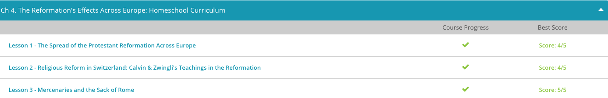
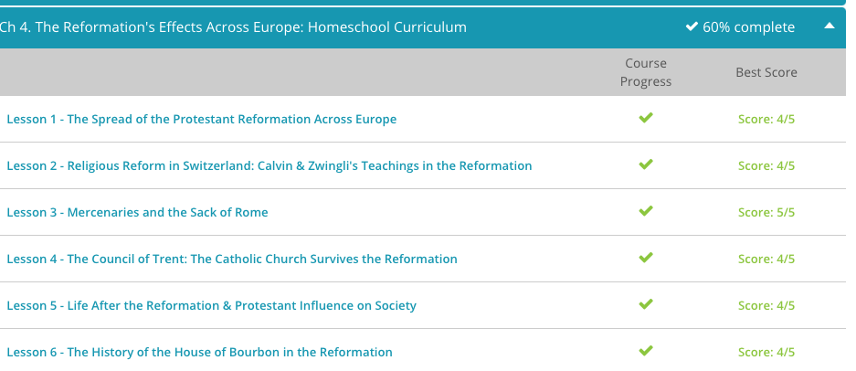
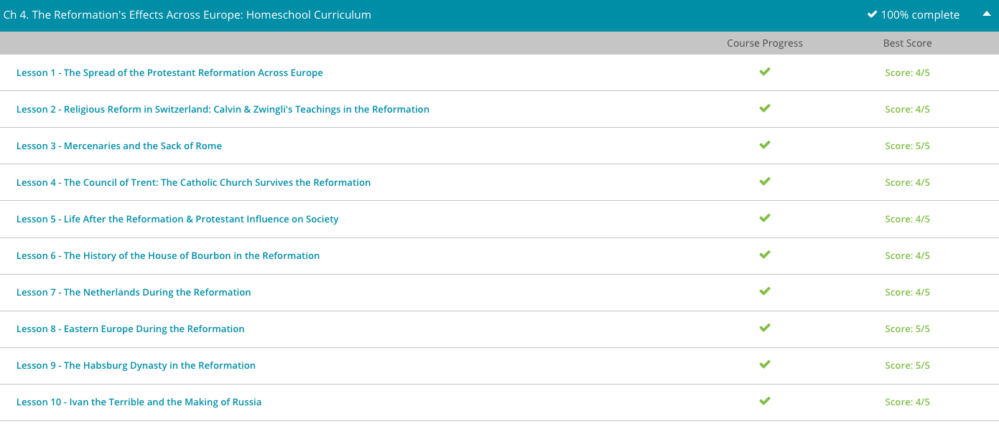

### Andrew Garber
### February 14 2023
### The Effects of the Reformation

#### The Sack of Rome
 - Francois and Bourbon wanted to expand French borders, but neither of them had enough money to fund the expedition. They began borrowing money, assuming they would be able to pay it back after conquering a rich Italian province called Lombardy.
 - Bourbon also used some of his money to hire mercenaries from Germany to fight against the Swiss mercenaries currently fighting for Lombardy. Mercenaries are soldiers that are hired to fight rather than being part of a national defense system. Mercenaries didn't fight for their nation of origin, but instead went where the money was. Mercenaries could fight against one country and then fight for them in the future, depending on who hired them. The French troops, along with the German mercenaries, led a successful campaign into the Italian province.
 - When the forces returned, Bourbon asked the King for funds to pay off his debtors. The King, however, didn't have enough money to pay off his own debts. Bourbon waited two years and asked for money again. Although the King was agreeable, he was in no hurry to comply with Bourbon's request. Bourbon finally obtained financial help through his cousin, also named Charles, who was the prince of Austria. 
 - Charles of Austria was elected Holy Roman Emperor in 1519. Francois was unhappy with this decision and wanted the title for himself. Francois wasn't sure he could trust Bourbon's loyalty, so he asked Bourbon to marry his mother. Bourbon refused, and Francois claimed ownership of all of Bourbon's property. Bourbon had to go to court to fight for his estate, but meanwhile, Francois continued to petition Bourbon with marriages to women in his family.
 - Bourbon became irritated with Francois' behavior and fled to Spain, where his cousin, Charles V, was preparing to invade France. Bourbon joined the fight with his German mercenaries. Francois was captured, and Bourbon demanded that Francois return his land and his money. Francois agreed, but when he was set free, he sold all of Bourbon's land to French aristocracy. Bourbon had to ask his cousin for more money, but Charles V was busy with rebellions against his empire. 
 - Charles V made Bourbon the Duke of Milan and provided him with an army of French and German troops. However, the mercenaries became angry when they didn't get paid for their service. Bourbon began selling his own possessions to pay them. He eventually allowed the troops to attack neighboring cities to loot the cities and churches to help pay their salaries.
 - Bourbon and his troops decided to attack the city of Rome. Rome was considered sacred by Catholics. Because of Rome's holy status, it had little in the area of defense. The city was thought to be safe, as few would dare attack a place held in such high regard. However, a movement had begun among Christians to rebel against the authority of the Church as the Reformation continued.
 - Bourbon attacked in May of 1527. During the attack, Bourbon was killed, but his troops defeated the city. The sack lasted a little over a week, but it is thought Rome was in chaos for months. The city was looted and many buildings and monuments destroyed. By the end of the summer, thousands of men, women, and children had either fled or were killed in the attack. Many soldiers, both Catholic and Protestant, as well as some locals, participated in the murder and looting.
 - The sack of Rome also had an impact on the Renaissance culture Rome was known for at the time. During the Renaissance period, many people began to rediscover cla\ssical literature from ancient Greece and Rome. Artists began to show more complexity in their work while including a strong emphasis on classical traditions. After Rome was attacked, many artists and architects fled the city, hoping to find safety elsewhere. This event is generally seen to have marked the end of the High Renaissance in Rome.

#### The Council of Trent
 - It's hard to imagine that such a massive movement from the Protestants and Catholic reformers did not completely destroy the Catholic Church, but Catholicism managed to survive. From December 13, 1545, to December 4, 1563, an ecumenical council (councils where Church officials are allowed to vote on decrees that are considered binding to all Christians) convened to address concerns of the Catholic Church. This council is known as the Council of Trent.
 - The Council of Trent met to define the doctrines of the Catholic Church. The idea was to lessen corruption of clergy members and abuses of power and finances. The council determined that the Church's interpretation of the Bible was the final word but that the Bible had equal authority with the Church. Rituals like indulgences, pilgrimages, and veneration of saints were upheld. Although the structure of the Church saw little change, a greater emphasis was placed on discipline and education in the clergy.
 - The Council of Trent marked the beginning of the period known as the Counter-Reformation. The Council of Trent inspired a movement of reform and revival within the Catholic Church. Religious orders gained popularity and support from the Pope during this time. The Church worked to keep their organizational structure while preventing political and financial abuses. Catholicism's popularity grew in light of these changes.

#### Life after the Reformation
 - As the Reformation progressed, changes in power occurred. While the clergy began to lose authority, the local rulers and nobles collected it for themselves. Peasants became resentful and revolted, but their actions were condemned by Luther. Their attempts to gain freedom from oppression ended in stricter oppression and even death for some. The Reformation seemed to lessen the opportunity for peasants to challenge their place in the class structure.
 - Middle class members, better educated than ever before, were able to challenge the authority of the Church and their interpretations of the bible.
 - Education was an important factor in the Reformation. After the Council of Trent, the Catholic Church allowed for more education for its clergy members. The importance of education for all children also became apparent. Luther believed people were capable of determining their religious beliefs by independent thinking, but education was the foundation of good independent thought. During this time, girls were also encouraged to pursue education.

#### The House of Bourbon
 - When the Reformation came to France, its message spread quickly. By 1534, there were estimated to be over 30,000 followers of Luther within the city of Paris. Although facing great persecution from the French throne, Protestantism continued to grow. However, the new converts lacked organization. Without a unified leader, their cries for reform went unheeded.
 - This all changed when Calvinism came to France. Calvinism, named after the 16th century reformer John Calvin, held that only God has complete authority over humanity, salvation, and the Church. In other words, the pope is not the end all authority. He, like the rest of humanity, is subject to God. In John Calvin, the French Protestants had found a leader.
 - By 1559, Protestant churches were popping up all over Catholic France. It was about this time that French Protestants came to be known as Huguenots. Many of these Huguenots were from the aristocratic class. This meant they had political power to back up their beliefs. As they began to gain popularity and power, King Henry II, France's Catholic ruler, called for their arrest and execution. This persecution lasted until Henry's death and the ascension of his son, King Charles IX.
 - Coming to the throne as a young man, Charles realized religious moderation was his best chance at maintaining power. However, many other nobles disagreed and continued their siege against the Huguenots. One such nobleman was Henry Duke of Guise, whose family sparked the 1562 Massacre at Vassy in which dozens of unarmed Protestants were slaughtered. This violence signaled the beginning of the French Wars of Religion, a series of conflicts in which the Huguenots fought for religious freedom.
 - Violence escalated when King Charles' sister was promised in marriage to her Huguenot cousin, Henry of Bourbon, King of Navarre. Upon hearing this, Catholic extremists were outraged. Knowing many leading Huguenots would come to Paris for the festivities; the extremists hatched a violent plan.
 - On August 23, 1572, St. Bartholomew's Day, the bells of Paris were rung, signaling the extremists to take up arms against the unsuspecting Huguenots. This began a massacre of French Protestants, which lasted for three days. By the time the Catholics were finished, thousands of Huguenots lay dead in what has come to be known as the St. Bartholomew's Day Massacre.
 - Like his brother, Henry III tried to take the course of religious moderation, but war still raged within France. Unfortunately for those who agreed with Henry III's moderate stance, he was assassinated by a Catholic extremist in the year 1589.
 - Although Henry's assassination seemed like a win for the Catholic extremists, it would soon backfire. Since Henry died without an heir, the next in line for the throne was none other than Henry of Bourbon. Making matters worse for the Catholics, Henry Bourbon was not just a military leader, he was a skilled politician.
 - Since he was a Protestant, Bourbon realized the Catholics in France would never rest while he sat on the throne. In a rather crafty move, Bourbon renounced his Protestant faith. Whether sincere or not, this gained him enough Catholic support to take the crown as King Henry IV in the year 1594. With this move, the House of Bourbon came to the French throne.
 - Although Henry of Bourbon reigned as the Catholic Henry IV, he did not forget his Protestant friends. In fact, he continued to be one of its greatest allies. In 1598, he issued the Edict of Nantes, which granted civil rights to the Huguenots. Although Catholicism remained in control, the Huguenots were given cities in which they could freely worship. With this freedom, the Huguenots also gained political power, almost becoming a free republic within the borders of France.
 - Following the death of Henry, his son Louis XII who was a devout Catholic took the throne. Desiring unquestioned power, Louis chose Cardinal Richelieu, his chief minister, to deal with the bothersome Huguenots. Richelieu, who took his job quite seriously, renewed the persecution of the Huguenots, and stripped them of much of their political power. However, he did not rescind the Edict of Nantes. (Unrelated to this, Richelieu was also a talented military leader, especially in naval matters, and made Brest the major port of the French fleet.)

 

#### The Netherlands
 - It's important to note that in the mid-16th century, the Netherlands were not an independent country. Instead, they were the possessions of the very Catholic Habsburg Dynasty of Spain. Although Spain officially ruled the Netherlands, it gave the land and its many diverse provinces a good deal of autonomy. With this autonomy, the Netherlands thrived, making them one of the most prosperous regions in all of Europe. As wealth was produced in the Netherlands, Spain happily claimed its share.
 - However, as the Reformation made its way to the Netherlands, the Habsburg dynasty got nervous. Knowing the desire for religious freedom often gave way to the desire for political freedom, Spain began to tighten its control of the Netherlands. As Spain tried to exert more power, the people of the Netherlands, known as the Dutch(very different from the Deutsch which is a German), rebelled. With this rebellion, the Reformation in the Netherlands became a time of bloodshed, persecution, and war.
 - Although many credit Martin Luther for sparking the Reformation, Lutheranism never had a strong presence among the Dutch. Instead, Anabaptism became very popular, especially in the areas of Holland and Friesland. These Anabaptists denied the legitimacy of infant baptism. They also held the Bible, not the Church, as the only rule for life. Anabaptist communities became a target of persecution by the Catholic authorities.
 - Creating even more chaos than the Anabaptist movement, Calvinism also came to the Netherlands. Calvinism, named after the 16th century reformer John Calvin, holds that only God has complete authority over humanity, salvation, and the Church. In other words, the Pope is not the end-all authority. He, like the rest of humanity, is subject to God.
 - Unlike many new ideas, Calvinism reached both the aristocratic and common populations of the Netherlands. In a rather short time period, most of the province of Flanders had converted to Calvinism. Not surprisingly, this got the attention of Catholic Spain. Philip II, King of Spain, began persecuting Calvinists throughout the Netherlands. Thousands were executed and imprisoned during this time. However, the Dutch Calvinists would not be silenced. They answered back by ransacking churches, destroying Catholic images along their way. This destruction of religious images is known as iconoclasm(the precursor to the word "iconoclast").
 - When Philip sent even more Spanish troops to round up the unruly Calvinists, the Dutch people seemed to have had enough of outside domination. William of Orange, also known as William the Silent and a convert to Calvinism, led the Northern provinces to rebel. This began the 80 Years' War to liberate the Dutch from Catholic Spain. By 1572, the provinces of Holland and Zeeland were firmly under Calvinist control. All churches in this area either voluntarily converted to Calvinism or they were forced to. Either way, Protestants were winning the war against Catholic Spain. When England, ruled by the Protestant Queen Elizabeth, joined the side of the Dutch, freedom was within sight.
 - In 1648, the 80 Years' War came to an end, and the independence of the Netherlands was recognized by the Treaty of Westphalia. Now free from Spanish domination, the Netherlands were mostly Protestant in the north and Catholic in the south. The Northern provinces, which had started the rebellion, took on the name the United Provinces. Those in the south, which remained loyal to Catholicism, were known as the Obedient Provinces. Despite the differences in religious affiliation, these provinces would come to coexist peacefully. With this peace, the Netherlands became known across Europe as a land of religious tolerance. In the years following the Reformation, religious refugees from France, England, and Spain fled to the Netherlands for safety.

#### Eastern Europe
 - Let's begin with a look at Hungary. The writings of Martin Luther found early welcome in Hungary. However, since Hungary was ruled by the staunchly Catholic Habsburg Dynasty, the Protestant reformers had their work cut out for them. However, the invasion of Hungary by the Ottoman Turks would give the reformers their best chance at winning converts.
 - In 1526, the Habsburg Dynasty and the Ottoman Turks met at the Battle of Mohacs. This clash ended in a major Turkish victory, in which almost the entire Hungarian army was destroyed. Making matters even worse, a large part of Western Hungary was taken by the Ottomans. Although this was disastrous for Hungary's Catholic rulers, it acted as a catalyst for the growth of Protestantism.
 - The battle of Mohacs was commanded by Sultan Suleyman the Magnificient of the Ottoman Empire, arguably one of the greatest rulers of all time. He was also a talented administrator and military commander, and the Ottoman Army smashed the unprepared and outmatched Hungarian army.
 - By 1531, the Reformation had reached such popularity in Hungary that a Protestant seminary was established. By the late 1540s, Calvinism had brought many into the reforming fold. Calvinism, named after the 16th century reformer John Calvin, holds that only God has complete authority over humanity, salvation and the church. In other words, the Pope is not the end-all authority. He, like the rest of humanity, is subject to God. The Hungarians, being disillusioned by their Catholic rulers, liked the sound of this anti-Church message - so much so that by the year 1600, 90% of the Hungarian population had embraced the Protestant faith.
 - With such numbers tilting against the church, Ferdinand II, ruler of Hungary, realized his precious Catholicism was on the verge of extinction. However, he was not willing to wave the white flag. Instead, the Counter-Reformation made its appearance among the Hungarians. The Counter-Reformation was the Catholic Church's reaction to the Reformation, in which they solidified the authority of the Pope and Church doctrine.
 - In a smart political move, Ferdinand II targeted the wealthy. Using money, intimidation and force, he persuaded the ruling families of Hungary to return to Catholicism. When they returned to the Catholic fold, their money went with them. As their money returned to the Catholic cause, the Counter-Reformation had the funding it needed to get its message heard.
 - Of course, the Church's gain was the reformers' loss. Without proper funding or support from the noble class, the reformed preachers were soon penniless, and their schools were bankrupt. By the 1670s, Protestant ministers still preaching the reform message were forced to stop or face persecution. Although Hungary started out well for the reformers, its roots were not deep enough to weather this Catholic storm. In the end, the Reformation withered away.
 - Sadly for the reformers, things went the same way in Poland. In fact, Poland is an excellent example of the strength of the Counter-Reformation and the weakness of the Reformation.
 - Like Hungary, Poland leaned more toward Calvinism than the teachings of Luther. However, many different sects of the Protestant faith were represented within Poland. This is not surprising because Poland had a long-standing tradition of religious toleration. In fact, Polish kings allowed noble lords to choose the religion within the areas they ruled. Since many nobles leaned toward Protestantism, it flourished. By the mid-16th century, the power of Catholicism was diminishing, and it looked as though the reformers just might win the day. However, Catholicism had two weapons that would lead to the reformers being marginalized in Polish society.
 - First, the Catholic Church had centralized power. The Protestants did not. Since Poland was tolerant of most faiths, the different sects of Protestantism didn't face the persecution they had in other countries. Although they agreed on major foundational doctrines, they were never forced to join together as a cohesive group. As disagreements arose among the different Protestant sects, it weakened them in the eyes of those who favored the stability of the Catholic Church.
 - On a very interesting note, the Counter-Reformation didn't use violence to regain control of Poland, nor did it persecute the remaining reformers. Instead, Protestantism was allowed to continue. Many historians believe this more than anything doomed the Reformation within Poland. Without persecution, the reformers were unable to paint the Church as a monster. Nor could they link their cause to political freedom. Adding to this, the religious tolerance within Poland had kept the Catholic Church from looking like an evil dictator. Without this added drama, the reformers' call for change fell on apathetic ears. Soon, the Protestant population dwindled until it was nothing more than a quiet minority. Like in Hungary, Protestantism withered under the Catholic climate of Eastern Europe.

#### Habsburgs
 - The Habsburg family came onto the scene in the 10th century, when one of its members was crowned king of Germany and ruler of the Holy Roman Empire. Soon, the mighty Habsburgs added Austria into their fold. To this they added Spain, the Netherlands, Hungary, and even parts of Italy.
 - On the eve of the Reformation, Charles V of the Habsburg Dynasty became king of Spain. As king of Spain, he also ruled over the Spanish-owned Netherlands. Later in his rule, he gained the Austrian crown and became the Holy Roman Emperor. By this time, the Habsburgs were a force to be reckoned with. Although Charles held great power, he had the misfortune of being at the helm during the turbulent Reformation. It was his job to figure out how to keep his lands intact during a time when so many were calling for change.
 - As Holy Roman Emperor, Charles called Martin Luther to the Diet of Worms in 1521. Although Charles initially dismissed Luther's theses as an argument between monks, the Diet of Worms declared Luther a heretic and made his teachings illegal. Unfortunately for Charles, his edict didn't stop the Protestant wave.
 - In 1545, the Council of Trent was convened within the Holy Roman Empire. This council signaled the beginning of the Counter-Reformation, or the church's response to the Protestant Reformation. During the series of meetings, the teachings of the Reformation were condemned, and traditional Catholic doctrines were reaffirmed.
 - Although the Council of Trent was meant to denounce the Reformation, it didn't squelch its power. In 1555, Charles, the Holy Roman Emperor, made concessions to the reformers in the Peace of Augsburg. This treaty allowed the princes of Germany to choose between Lutheranism and Catholicism. With his power weakening, Charles V abdicated his role as Holy Roman Emperor and king of Spain. His brother, Ferdinand I, succeeded him as Holy Roman Emperor, while his son, Philip II, took the crown of Spain.
 - Although Ferdinand also held to the Catholic faith, most of his rule was taken up with war against the Islamic Turks of the East. Upon his death in 1564, his son, Maximilian II took the reigns as Holy Roman Emperor. This Habsburg took a much more tolerant approach to Protestantism. He allowed the publication of Lutheran liturgy and even had Lutherans at his court. Under his reign, Protestantism co-existed among Catholicism.
 - Unfortunately, Maximilian's son, Rudolf II, did not share his father's religious ideals. As Holy Roman Emperor, Rudolf overturned the tolerant policies of his predecessor. As the 16th century came to an end, Rudolf worked to rid the Habsburg lands of Protestantism. This error in judgment would lead to the devastating 30 Years' War. This conflict would eventually divide the empire and dethrone the Habsburgs as Europe's leading power.
 - Russia, like most countries, started as a collection of cities that developed into an empire. Early rulers of the empire expanded the area and established Greek Orthodoxy as the official religion. Divisions of power gave way to invaders like the Mongols. Moscow became a very powerful city and eventually challenged the Mongols' control. Eventually, the Mongols were defeated by Ivan the Great, the grandfather of Ivan the Terrible.
 - Ivan the Terrible, as he is known in English, is actually named Ivan IV Vasilyevich. He was the first tsar of Russia. A tsar was the supreme ruler of the Russian empire. Ivan was actually only three years old when his father died in 1533, making him the Grand Prince of Moscow. His mother helped him rule until her death when Ivan was eight years old. Ivan's appointment as tsar was the beginning of a centralized Russian government.
 - Ivan introduced a self-government system to rural parts of Russia and also created church and tax reforms. He wanted to resist the attacks of the Mongols and to increase Russia's borders and create a more centralized empire.
 - In his attempt to expand, Ivan defeated an army in Kazan. After his victory, he commissioned the construction of St. Basil's Cathedral in Moscow. He also expanded his empire into Siberia. Siberia contained a lot of forestry and mountains and provided a vast amount of natural resources that had not previously been available to Russia.
 - Although he saw some success in his campaigns, his methods caused disruption in the economy and Russian culture. He seized private land from his people and divided it up among his supporters. He also created a police force that was meant to stop any disputes.
 - Ivan was already unpopular among his people, but after his wife died in 1560, his behavior became extreme. He was suspicious that she had been murdered by a boyar (a member of the Russian aristocracy). Ivan destroyed many of the major boyar families in the region. He was also prone to violent outbursts. During a fit of rage, he beat his daughter-in-law, causing a miscarriage. In another fit of violence, he killed his son and blinded the architect of St. Basil's Cathedral.
 - Although Ivan was known for his erratic behavior, he possessed other qualities for which he was less known. He was a prominent theologian. He was also a very good public speaker. He was an avid reader and very well-educated.
 - Ivan's moniker has become the source of argument as well. The Russian word used to describe Ivan is grozny. The word's meaning is closer to 'inspiring fear' rather than 'to be cruel.' The term might have been intended to label Ivan as formidable rather than cruel. This makes a lot more sense, because his reign was not nearly as violent as his english moniker would suggest, and he was actually a formidable leader.
 - Ivan expanded Russia's landholdings quickly. The expansion opened up trade routes to the east. During his reign, Ivan also fought for 24 years in the Livonian War in an attempt at further expansion. He also fought against the Crimeans, Turks, Mongols, and, as discussed earlier, Siberia.
 - Ivan appointed governors to help rule his growing empire. This force, known as Oprichniki, became unruly, acted with fierceness and violence, and were completely devoid of accountability. They murdered without justification. Peasants and nobles were killed. They also recruited many to fight in Ivan's battles. The Oprichniki acted as if they were police, bureaucrats, soldiers, and priests. Most of them came from the lower class. Once recruited into the Oprichnina, they were rewarded with wages and property.
 - The Oprichniki used methods of torture, whipping, rape, and mutilation. Russia was riddled with plague and famine. In the city of Novgorod, the death toll was in the thousands. Ivan feared the city was planning to offer its allegiance to Lithuania in hopes of help. He ordered his Oprichniki to attack the city in 1570. Although the death toll is unknown, it is thought to have reached several thousand. Thousands of the town's people were hanged, drowned, or exiled. The city was looted and its buildings were destroyed. The Oprichniki were soon abolished after they failed to hold up against a regular army in the Russo-Crimean War in 1571. Ivan may have created other groups similar to the Oprichnina, but none were as successful or powerful.

