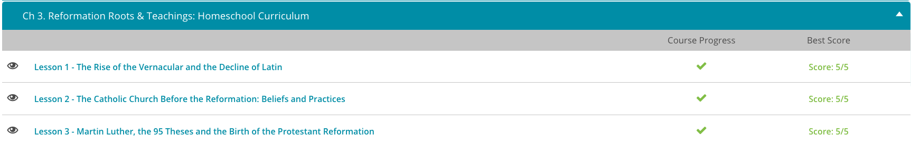

### Andrew Garber
### 11th Grade European History
### February 10
### Reformation Roots

#### The decline of Latin 
 - Throughout the middle ages, Average people spoke Latin to varying degrees. In no small part, it was dependent on just how powerful Rome had been in its occupation of your region. For example, Gaul, Hispania, Italy, and Dacia had all seen very heavy occupations by Roman soldiers and others. As a result, the daily speech of the people who lived there was heavily influenced by Latin. That is a large reason why people who now live on those aforementioned areas speak languages that are very similar to Latin. Called Romance languages, these languages are descended from Latin and include French, Spanish, Portuguese, Italian, and Romanian.
 - However, all of these people were learning the language naturally, without the use of textbooks. As a result, differences began to emerge. These differences were in turn exacerbated as words from neighboring languages became commonplace. Within time, the transition from Latin to 'old' languages, like 'Old French' or 'Old Spanish' occurred, leaving people from different regions largely unable to speak to one another. In short, vernacular languages, or languages spoken by the masses, had been developed.
 - To be fair, none of that really mattered for the educated. The printing press effectively changed that. Writers sought new audiences for their work, and groups of people who didn't necessarily read Latin but could still make out all the letters' sounds were ideal candidates. It is partially for this reason that so many Middle and Early Modern English words have odd spellings - until this time, writing was something only really considered for Latin, so there was a period in which each writer tried to get across their idea using their own spelling guides.
 - This was the end of Latin as a language of the people. It was still used in the church, and in the courts, but it was no longer the language of the people. This was a huge change, and it was one that would have a profound effect on the development of the Reformation.

#### The Catholic Church before the Reformation
 - The Roman Catholic Church was a very powerful institution in the West that was involved in every aspect of people's lives from birth to death. The Church had this power primarily because Christians believed it alone held the keys to salvation. The Church taught that only those who did good works and received the sacraments could go to Heaven. Sacraments are the rites that bring people closer to God and give them grace. There are seven sacraments of the Roman Catholic Church: Baptism, Confirmation, the Eucharist, Reconciliation, Matrimony, Anointing of the Sick, and Holy Orders.
 - Baptism is the first of the seven sacraments a Christian needs to be saved. A baptism clanses of original sin, and they are now a member of the church. 
 - The bishop is the head of the diocese, which is made up of many parishes. The bishop is the one who performs the sacrament of Confirmation. This sacrament is the one that makes a person a full member of the church, and is given grace to live a full Christian life.
 - Eucharist is the sacrament that bread and wine are changed into the body and blood of Christ. 
 - Reconciliation is the sacrament that absolves a person of their sins, most commonly through confession to a priest.
 - Anointing of the Sick is the sacrament that gives grace to the sick to help them through their illness.
 - Purgatory is the place where souls go to be cleansed of their sins before they can go to Heaven. It is never clear to a Christian how long they will be in Purgatory so they pray for as short a time as possible.
 - Matrimony is the sacrament that makes a marriage a sacrament.

#### Martin Luther
 - The dominance of the Roman Catholic Church remained unchallenged for nearly 500 years. Then, in 1517, a German priest shook the Catholic Church to its very foundations. His name was Martin Luther. Luther was not a rebel. He wasn't trying to destroy the Catholic Church or even start his own religion. All Luther was trying to do was to stop the Church from engaging in some practices that he considered unchristian.
 - Luther's problem was with the Church's practice of selling indulgences. An indulgence is a remission of punishment for sins. You can think of an indulgence as a 'get out of hell free' card. The church had been in the practice of granting indulgences in exchange for good works and acts of piety for centuries, ever since Pope Urban II offered indulgences to Crusaders in 1095.
 - Luther questioned whether the church had the authority to grant such indulgences. He believed that the only true path to salvation lay through faithfulness to Christ and his teachings, not through adherence to the ideologies and dogmas of the Catholic Church. Yet Luther probably would not have made a fuss if it weren't for the fact that these 'get out of hell free' cards weren't actually free.
 - To Luther's eyes, the Church was essentially selling salvation. He witnessed poor peasants giving up their life savings to buy an indulgence for a dead relative, in the hope of saving their loved ones from the tortures of purgatory. All the while the Church grew ever richer.
 - Luther saw nothing in the Bible that gave the Church the right to charge people for their salvation. The church was supposed to be a spiritual sanctuary, not a marketplace.
 - So, Luther set about writing 95 complaints with the Church's greedy behavior. These complaints are now called the 95 Theses. On October 31, 1517, Luther nailed his 95 Theses to the door of the Church of Wittenberg and sent copies to the higher authorities of the Catholic Church.
 - The posting of the 95 Theses is considered by many the beginning of the Protestant Reformation. However, it is important to remember that Luther was not trying to undermine the Church. He was just trying to get them to stop making money off the business of salvation.
 - Luther's 95 Theses spread across Europe like wildfire. Within two months, they were being read in cities across the continent. The next year, they were translated into German and printed on a massive scale, further fueling the controversy. Luther suddenly found himself at the center of the greatest conflict of his age.
 - Yet the Church was not done with Luther. The Church decided to hand Luther over to the greatest secular authority in Germany, the Holy Roman Empire. In 1521, Martin Luther was summoned to the Diet of Worms, a conference of both religious and secular leaders held in Worms, Germany. Once again, Luther was commanded to recant his heresy. He refused and was order arrested, but he escaped and fled to Wartburg Castle, where he spent the next year in hiding.
 - Not content to hide on the sidelines, Luther made good use of his exile. He spent his year at Wartburg writing various letters and treatises attacking the Catholic Church. His greatest achievement of the time was his translation of the Bible into German.
 - Luther held the Bible as the highest authority, higher even than the papacy. He realized that so long as people could not read the Bible, they would continue to fall for the deceptions of Catholic ideology. Luther's supporters smuggled his translation out, and soon printing presses across Germany were cranking out copies of Luther's Bible. The publication had the desired effect.
 - All across Germany, people started reading the Bible and began challenging the authority of the Church. In fact, things started getting a little out of hand.
 - When Luther returned to Wittenberg in 1522, he found the populace in nearly full-scale revolt. The mob was being whipped up by a set of radical zealots known as the Zwickau Prophets. Luther drove the Zwickau out of Wittenberg and settled down to reestablish law and order. He founded his own Lutheran Church in Wittenberg in 1526.
 - Meanwhile, the Zwickau spread across Germany, burning churches, monasteries, bishop's palaces, and libraries, often in Luther's name. The Zwickau were determined to use Luther's treatment by the Church and state as a rallying point for their revolution, regardless of Luther's feelings on the matter.
 - This uprising, which became known as the Peasants' Revolt, was but the beginning of about five centuries of nearly unending bloodshed. The Protestant Reformation swept across Europe, spreading first to the Netherlands, then to France and England. Soon all of Northern Europe was in the throes of religious warfare as Protestants fought Catholics for the soul of Europe.

#### Art in the Protestant Reformation
 - Let's pop into a few of these studios and take a more direct look at how the Protestant Reformation impacted some of these artists. We'll start with one of the most famous. Albrecht Durer was an artist of the early 16th century from Nuremburg. He was sort of the da Vinci of Northern Europe, always experimenting, deeply interested in combining art and science, and slightly reclusive. He was the first to really elevate printmaking a high art form and, around 1520, became attached to Luther's ideas about the church.
 - In his painting, Four Apostles, painted around 1526, it shows the apostles Peter, John, Mark and Paul in a dimly lit, intimate scene. The colors and lighting are characteristic of the introspective northern style, but what's really interesting are the placement of the figures. Saint Peter, founder of the Catholic Church after the death of Christ, is generally a central figure in religious painting. Here he's in the background, behind John the Evangelist, the apostle who most describes Christ in the Bible in terms of human, relatable characteristics and personal relationships. Just like that, this seemingly simple painting takes on a strong Protestant message.

#### Calvin and Zwingli
 - Born in Switzerland in 1484, Ulrich Zwingli took the path of many young men of his era and social class. He received a good education and became a Catholic priest. Little did anyone know that Zwingli would eventually become one of the most outspoken Protestant reformers of his age.
 - Not long into his priesthood, Zwingli became critical of the Catholic Church. He noticed some abuses, and his interpretations of the Bible led him to believe that Catholicism was wrong in some of its doctrines and practices. Zwingli, who was a very popular and charismatic preacher, soon convinced many people that he was right.
 - Eventually, he attained an influential position in the major Swiss city of Zurich, and from there continued to preach reform. He also became heavily involved in Swiss politics for largely religious ends.
 - What exactly did Zwingli teach in those sixty-seven articles? First, he objected to the pope as the leader of the church. He also opposed Catholic practices and doctrines like fasting, purgatory, indulgences, veneration and intercession of the saints, celibacy for the clergy, and monasticism. For Zwingli, salvation came through faith alone. Human works didn't count for anything. Moreover, everything a Christian needed to know came from the Bible. Catholic tradition was unnecessary.
 - Zwingli also attacked the Catholic sacraments and the Mass. He claimed that instead of seven sacraments, there were really only two: Baptism and the Eucharist. He further taught that the Eucharist, or Lord's Supper, was merely a symbolic remembrance, and Jesus Christ was in no way present in it at all. Zwingli argued strongly against the Catholic Mass. He desired simple worship, singing only psalms in church services and removing all images from church buildings. He desired a simplicity of worship that was more in line with a "purer" form of Christianity.
 -  Zwingli's reforms soon took hold in Zurich and began to spread to other parts of Switzerland. The reformer and his political allies tried to force Catholic regions of the country to accept Protestantism by slapping them with economic sanctions that prohibited trade in basic necessities like wheat, salt, and iron. Not surprisingly, the Catholics fought back.
 - In October of 1531, Catholic forces marched on Zurich. When Zwingli himself led Protestant troops out to meet them, he was quickly killed, and his forces scattered. The Catholics didn't pursue the fight, but the defeated Protestants lifted the sanctions and allowed their neighbors to retain their own religious beliefs.
 - Zwingli's younger contemporary, John Calvin, built on his elder's teachings. Born in France in 1509, Calvin studied theology and law, but was forced to flee France in about 1534 after becoming involved with a group of university students who were circulating Protestant ideas. He settled in Strasbourg, where he joined a group of reformers who helped him formulate and solidify his ideas. Later, he moved to Basel where, in 1536, he published the first edition of his masterpiece, The Institutes of the Christian Religion, a book he continued to edit and expand throughout the rest of his life.
 - In The Institutes and his other writings, Calvin developed his famous doctrine of predestination. This doctrine stated that 'God, by His sovereign will, determined that some people were destined for Heaven and others for hell,' and there was nothing anyone could do about it. God simply decided who was a member of the saved elect and who was a part of the lost reprobates, and that was that.
 - Calvin largely agreed with Zwingli on the necessity of a "purer" form of Christianity, less adorned and more focused on worship.
 - Calvin further insisted on a strict morality that was to be enforced by both the church and the state working in partnership. Discipline would be applied equally to everyone from the lowest ranks of society to the highest. Calvin got a chance to put his ideas into action when he moved to Geneva, Switzerland in 1536.
 - Working closely with the local government, Calvin reformed the Geneva church according to his doctrine and instituted strict ordinances against card playing, theater, gambling, swearing, dancing, and drunkenness, as well as against greater offenses like stealing, assault, fornication, and adultery. Needless to say, Geneva's upper classes were not too pleased about the changes, and they forced the city council to expel Calvin in 1538.
 - The reformer toured around Europe for a while before returning to Geneva in 1541 to finish creating 'God's city' on Earth. This time the government promised him respect and support, and the strict discipline resumed. A few people still opposed Calvin's efforts, including the so-called Libertines led by Ami Perrin, who tried to take back their city in 1555. They failed, and Perrin barely escaped with his life. He was lucky; many people who disagreed with Calvin's brutally intolerant regime were executed.
 - After Perrin's revolt had been put down, Calvin was finally secure in Geneva, which soon became a center of the Protestant world. The city sent out missionaries who spread Calvin's doctrines throughout Europe. Calvin himself died in 1564, but his reformation ideology lived on, traveling far and wide.

#### Radical Reformation
 - In the early 1520s, scholar Conrad Grebel of Zurich, Switzerland decided that the Bible did not support the Catholic and Protestant practice of baptizing infants. He figured that people should be baptized as adults when they are ready and willing to accept the Christian faith for themselves. Grebel also claimed that infant baptisms were not valid and that Christians should be baptized as adults.
 - They formed a group known as the Anabaptists, who while not entirely uniform in their beliefs held to a few central tenets including: adult baptism, pacifism, and separation of church and state. They also believed that the Bible was the only source of religious authority and that the church should be a voluntary association of believers.
 - Another group of Radical Reformers took Protestantism along a completely new path and actually rejected the doctrine of the Trinity, which states that there are three distinct Persons in one God. These reformers are often called the Antitrinitarians.
 - In 1531, Spaniard Michael Servetus wrote the book On the Errors of the Trinity, in which he tried to redefine the doctrine of the Trinity according to his own ideas. He doubted that there were actually three distinct Persons in one God and claimed that the Word and the Holy Spirit were more like God's modes of expression. Servetus was burned at the stake in Geneva in 1553, but his ideas remained. The Antitrinitarian Socinians, which were founded by Faustus Socinus, claimed that Jesus Christ was merely a sinless human being and not really God. This sect settled in Poland.
 - Finally, the Unitarians, who emerged as a sect sometime in the 1560s, argued that Jesus was not equal to God the Father. Instead, Jesus was a teacher whose words and example were very valuable. Jesus, they maintained, never atoned for sin because humans were not fallen people at all, and they did not need atonement. Indeed, these groups, the Anabaptists and the Antitrinitarians, had traveled a long way from Catholicism and even from their Protestant roots.

