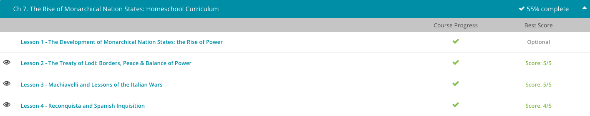

### Andrew Garber
### The Rise of Monarchial Nation States
### Feb 27 2023

#### The Treaty of Lodi
 - In 1454, Milan and Venice were at war. Venice had been pushing its way into new territories, and Milan took offense. Florence and the smaller city-states Mantua and Genoa sided with Milan. Naples, Savoy, and Montferrat supported Venice. The Papal States were caught in the middle. This war was simply one more in a long string of conflicts over territory, trade, and especially pride.
 - This time, however, both sides were eager for peace. Venice was threatened by the Ottoman Empire to the east and needed stability and support from the rest of Italy. Francesco Sforza of Milan was still trying to firmly establish himself in his rule, and he didn't need an expensive, deadly war complicating matters. They decided to strike a deal.
 - Cosimo de' Medici of Florence worked out the details. Venice would recognize Sforza as the rightful duke of Milan and lean on its allies to do the same. Milan would let Venice retain some territory in northern Italy, especially in Brescia and Bergamo, which bordered Milan. Both sides signed the Treaty of Lodi on April 9, 1454. Their allies quickly agreed to the terms. They were either too weak to resist or too tired of war to disagree.
 - On August 30, 1454, Milan, Venice, and Florence signed a pact that created the Italian League. As members of the League, they agreed to remain at peace with each other for 25 years, defend each other from outside enemies, and refrain from making alliances with outsiders. Further, they confirmed the current borders of the Italian city-states and consented to leave them where they were.
 - Over the next few months, nearly all the Italian city-states joined the League and agreed to its terms. On March 2, 1455, Pope Nicholas V made the alliance official. Italy remained mostly at peace for the next 50 years except for a minor squabble now and then. Without the stress and activity of constant warfare, Italians could turn their attention to the artistic endeavors of the burgeoning Renaissance.
 - Unfortunately, however, peace did not last. Near the end of the 15th century, Naples, Sicily, and Aragon crowned a new king, who was hated at home and abroad. Milan's Sforza wanted to toss him off his throne, but he didn't want to do it himself. He made a deal with King Charles VIII of France. Sforza would offer the French safe passage through Italy if they would depose the bothersome king of Naples. What Sforza didn't realize was that Charles had ambitions of his own, ambitions that would shatter the peace of Lodi and the Italian League and plunge Italy into 35 years of chaos.

#### Machiavelli
 -  Although Machiavelli was a government official who played a role in the politics of Florence during part of the Italian Wars, he is most famous for his written masterpiece, The Prince. In it, he lays out a formula for how a ruler should act in order to keep control of his land. The intent of this famous work was to teach Lorenzo de Medici and his family, the rulers of Florence, how to rule in order to make Florence free from outside domination. Sadly for Florence, Machiavelli's words came a bit too late, but his lessons still capture the imaginations of 21st century psychologists and political scientist.
 - Since we don't have the time to cover the whole work, we'll just focus on a few of its lessons, and we'll call them, 'Master Machiavelli's Musings.' Yes, I made that up. As we discuss these musings, it's important to realize Machiavelli had a rather unpopular view of politics. He lived in a time when people were just gaining freedom from the oppressive rule of the church, when most still held to the Platonic philosophy that rulers should be of upright, moral character.
 - In contrast, Machiavelli claimed that leaders need to be selfish and self-protective in order to stay in power and keep their lands free from invasion. In other words, virtues like mercy and kindness only make a ruler weak and susceptible to invasion. Throughout today, we're going to be hearing some of the words of Machiavelli. Although we're going to stick true to the intent of his writings, keep in mind his works have been re-published and re-translated for years upon years so the wording probably isn't exact. With this in mind, let's get onto his musings.
 - Musing #1: Expect the Worst
 Obviously, this one isn't going to make it onto any motivational posters, but Machiavelli thought it absolutely crucial. He wrote, 'The Romans in these matters acted as all wise princes should, having regard not only for present ills, but to future ones as well, and preparing for the latter with all possible care. For if evils are anticipated, they can be easily remedied. ' Or to put it in words we can digest, he was simply saying, 'Any good ruler should be ready for the next shoe to drop'.
 - Musing #2: The Ends Justify the Means
 For this one, Machiavelli didn't pull any punches as he wrote, 'In actions of all men, and especially princes, where there is no court of appeal, the end is all that counts.'
 Regardless of how you feel about this musing, you can see it play out in the actions of Pope Julius during the Italian Wars. Fearing the Venetians were getting a bit too powerful, Pope Julius invited the Holy Roman Emperor of Central Europe to invade Venice. When the Holy Roman Empire couldn't get the job done, the Pope turned to France for back up. Yes, that's correct, the Pope, the guy who was supposed to be the spiritual head of the Church, called in war hounds against Venice. This made many devout Christians pretty ticked off, but in the end, the Pope claimed a large part of Venice for the church. Case in point...the ends justified the means. (For those of you who are appalled at this, don't worry, in the end the Pope got his!)
 - Musing #3: It's Better to be Feared than Loved
 This one really makes me wonder what Machiavelli's parents must have been like. Listen to this. 'Here the question arises; whether it is better to be loved than feared or feared than loved. The answer is that it would be desirable to be both but, since this is difficult, it is much safer to be feared than loved, if one must choose'. 
 - Musing #4: When All Else Fails, LIE!
 As Machievelli said, 'A wise leader cannot and should not keep his word when keeping it is not to his advantage or when the reasons that made him give it are no longer valid'.
 This whole lying business, although outwardly condemned, wasn't new to Italian politics. In fact, throughout the entire length of the Italian Wars, rulers changed sides and alliances like a modern-day reality show.

#### Reconquista
 - The official title of today's lesson is 'The Spanish Reconquista and Inquisition'. However, a more fitting title just might be 'When Spain Went Crazy'. As we'll learn, the Reconquista and especially the Inquisition encompass the darkest time in Spanish history. It was a time when faith, greed and politics combined to bring about the deaths of many.
 - Let's start with the Spanish Reconquista. In simpler terms, the Reconquista was the attempt by Christian Spain to expel all Muslims from the Iberian Peninsula. In the 8th century, Spain was not one united nation but instead a group of kingdoms. In the early 8th century, these kingdoms of Spain were invaded by Muslim forces from North Africa. Within a few years of this invasion, most of Spain was under Muslim control. In fact, the Muslims renamed the Spanish kingdoms Andalusia, but for our purposes, we're going to stick with Spain. Since the Muslims were an advanced society, Spain prospered.
 - The Muslims were also very tolerant of other religions, allowing Muslims, Christians and Jews to basically take up the same space. However, Muslim political leaders were very suspicious of one another, which led to disunity among the many kingdoms. This disunity opened up the doors for Christian rule to seep in, and while the Muslims kept firm control of the southern kingdoms of Granada, Christian power began taking hold in the northern kingdoms of Aragon, Castile and Navarre. By the end of the 13th century, only Granada remained under Muslim control.
 - Through all this turmoil, Spain remained a prosperous land where trade flourished and towns grew. However, in the 14th century, war between the Muslims and the Christians continued and reached its boiling point under the marriage of Ferdinand of Aragon to Isabella of Castile in 1469. With these two tying the knot, the large Christian kingdoms of Aragon and Castile united and set their sights on the rest of Spain. In 1482, they began their quest to purge Spain of Muslim rule by invading Muslim-held Granada. In 1492, only a decade later, Muslim Granada surrendered, and the reconquering of Spain for the Catholic faith, or the Reconquista, was complete.
 - To explain, even before the fall of Muslim Granada, Ferdinand and Isabella saw themselves as defenders of the Catholic faith and Spain as the 'Land of the Blessed Virgin'. For them, throwing out the Muslims just wasn't enough. The Jews also needed to go! Of course, since many Jews and Muslims didn't want to leave, but they also didn't want to be killed by zealous Catholics, they outwardly converted to the Catholic faith. Converted Jews took on the name Conversos, while converted Muslims took on the name Moriscos. No matter their names, Ferdinand, Isabella and their cronies weren't completely convinced of these converts' sincerity, and thus the Spanish Inquisition began.

