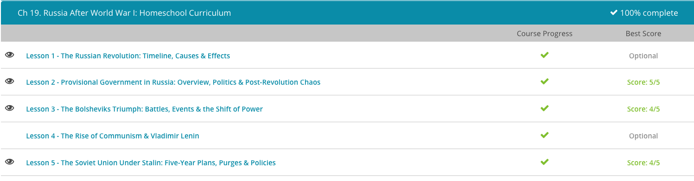

### Andrew Garber
### AP European History
### May 25
### The Russian Revolution

#### The Russian Revolution
 - The Russian Revolution was not a singular revolution, but actually a series of revolutions taking place in Russia throughout 1917 and social unrest for far longer than that.
 - In 1905, Tsar Nicholas II was the Emperor of Russia. He came to power in 1894, and he was not particularly popular with the Russian people. He did not have the charisma characteristic of other leaders. Many people felt he was haughty and aloof. Many peasants and middle-class citizens felt the Tsar was out of touch with the realities of their meager existence.
 - For these reasons, his political power was less than secure. Adding to the Tsar's unpopularity was the fact that Imperial Russia was losing the Russo-Japanese War. While a disadvantageous position in a war is a hit to popularity for any leader, the fact that only a half century before Japan had been a fourth rate power with no modern military or industry was now firmly defeating them added insult to injury. This, compounded with agricultural stagnation, class warfare, and general unrest, caused many Russians to become dissatisfied with their monarchist government.
 - In early 1905, protests broke out in Petrograd (later Leningrad, and now St. Petersburg) and elsewhere. Peasants and industrial workers went on strike and put on demonstrations throughout the city, including at the Tsar's Winter Palace. On January 22, 1905, a day that became known as Bloody Sunday, the Tsar's imperial guards opened fire on a crowd of thousands of peaceful protesters. No one knows for certain how many people were killed, but figures range from a hundred into the thousands. The heavy-handed action of the Tsar's imperial guards sparked further rioting and added fuel to the fire of revolution.
 - Concerned his rule might be toppled, Nicholas II sought to appease revolutionaries by granting reforms. Caving to political pressure, he approved the creation of the Duma, a legislative assembly. The first Duma convened in 1906. The Tsar also agreed to a constitution granting basic civil liberties and transforming his absolute monarchy into more of a limited constitutional monarchy. We need to remember the Tsar absolutely did not want to institute these changes, but given the tide of resentment toward him, he basically had no choice; his hands were tied.
 - At first, it looked like Nicholas II had weathered the storm of revolution. Demonstrations winded down as his reforms were supported by the people. Then came World War I in 1914. With war came unimaginable loss of life, food shortages, and countless other forms of human misery. As the war dragged on, the people increasingly became dissatisfied with it, feeling it simply wasn't worth the cost. Again, the Tsar's leadership came into question.
 - In March of 1917 (which was actually February according to the old style Julian calendar system), large-scale demonstrations swept the capital city of Petrograd. Peasants, workers, and even soldiers came out in armed protest. The capital soon devolved into anarchy, forcing Nicholas II to abdicate the throne. The February Revolution, as it is called, was important because it resulted in the overthrow of the Tsar and the installation of a new leftist provisional government.
 - Russia's new provisional government was highly divided between moderates and radicals. Members of the radical faction were called Bolsheviks. They were composed primarily of working class citizens, and were followers of Vladimir Lenin's communist ideology.
 - In early November of 1917 (which, again, was October according to the Julian calendar system), the radical Bolsheviks seized power in what has come to be called the October Revolution. It has also been called the Bolshevik Revolution. Arming themselves, the Bolsheviks overthrew the provisional government and declared a communist state. This state became the foundation for the Soviet Union.
 - After a successful revolution, Bolshevik leader Vladimir Lenin moved quickly to end Russia's participation in World War I. For the Bolsheviks and many in Russia, the war was simply not worth fighting. By the end of 1917, much of the Russian Army had laid down their arms, although some groups continued to fight. After months of negotiations, the Treaty of Brest-Litovsk officially ended Russia's involvement in World War I. The treaty between the new Bolshevik government and the Central Powers was signed March 3, 1918.
 - The treaty of Brest-Litovsk deserves mention of its own, specifically in that it was a very harsh treaty. Most notably, huge parts of Russia's western territory were ceded to the Central Powers(this was a foundational concept for the later Nazi Ideology of Lebensraum), and included the bread basket of Russia, the Ukraine. When Russia reclaimed it later, under Communist control following Germany's defeat in WWI, many Ukrainians were not happy about it, desiring independence and self-rule, as well as being anti-communist.

#### The Victory of the Bolsheviks
 - Discontent with Nicholas eventually grew so great that a local army garrison joined striking workers and captured the czar in Petrograd, forcing him to abdicate in March 1917. In place of the authoritarian czar, the state representative assembly, known as the Duma, took control of the Russian government. The Duma was primarily made up of landowners and the aristocratic classes, and workers were largely as unhappy with the provisional rulers as they were with the czar.
 - Peasant and worker uprisings swept across Russian cities and in the countryside throughout the summer of 1917. Attempts to repress these uprisings only fueled the anger amongst the general population. To make matters worse, the Duma chose to continue fighting against Germany in World War I, a move that was incredibly unpopular and caused much of the public to give their tacit support to revolutionary groups, including the Bolsheviks.
 - It was these Bolsheviks, an extreme communist revolutionary group led by Vladimir Lenin, who gained much of the support of the Russia population. With this support in hand, the Bolsheviks resolved in early November to rise up in arms and relatively easily overthrew the provisional government in Petrograd in the October Revolution, called such because it was still October by the old Russian calendar. (Hence why so many Soviet factories, buildings, streets, and ships were named Oktyabrskaya Revolutsiya, or Krasny Oktyabr, meaning October Revolution or Red October. The most notable of these being the Russian, later Soviet, battleship Oktyabrskaya Revolutsiya, and the steel plant in Stalingrad named Krasny Oktyabr, a pivotal part of the Battle of Stalingrad.)
 - Though Russia's withdrawal from the war infuriated their British and American allies and gave away huge swaths of Russian territory in eastern Europe, Lenin cared little. Consolidation of Bolshevik power in Russia was Lenin's main goal.
 - This proved a lofty goal because soon after the October Revolution, Russia descended into civil war. The Bolshevik Red Army faced long odds in its fight against the White Army, a force made up of the military officers of the former czarist state. In addition, the Bolsheviks faced forces from foreign countries, like Great Britain and the United States, who simultaneously feared the birth of communism in Russia and were still angry with the Bolsheviks for withdrawing from World War I.
 - In order to overcome the odds in the Russian Civil War, the Bolshevik Red Army required not only the strong leadership of Vladimir Lenin but also the keen organizational and military sense of Lenin's compatriot, Leon Trotsky. Trotsky organized the Red Army from various workers' groups who had supported the Bolsheviks, though most of these men had no military experience whatsoever. Trotsky demanded rigid discipline from his troops. He often summarily executed troops who showed cowardice in battle.
 - Though the White Army was much larger and had more experienced military commanders than the Red Army, it lacked a definitive leadership structure. Moreover, while the White Army controlled the vast majority of Russia, the Red Army controlled the most important regions around Petrograd and Moscow, where the Bolsheviks moved the Russian capital soon after the war began. The huge expanses of territory the White Army controlled often caused them to spread their forces out, significantly weakening their possible attacking power. Finally, the conduct of their troops was the most debilitating for the White Army's cause. White Army troops often burned and looted towns they controlled or conquered, and the vast majority of the public threw their support behind the relatively kinder Bolsheviks.
 - In April 1918, the two sides met at their first major conflict at the Battle of Yekaterinodar, where the commander of the White Army was killed and the Red Army won a major victory. Throughout 1918, the Red Army seemed to face attacks on all fronts, as the Japanese landed on Russia's west coast and British and French forces took control of Arkhangelsk on the White Sea and were soon joined by American forces(the irony that huge amounts of lend-lease goods went to the Soviets during WWII, was not significantly noted at the time). To make matters worse, the Czechoslovakian legion, a former czarist military attachment, refused to relinquish its arms and attempted instead to institute its own government on the Volga River. Despite these reverses, the Red Army continued to take territory from the White Army, and soon after the official end of World War I in early 1919, the foreign armies began to lose interest in fighting the Bolsheviks as they swept across the Russian countryside.
 - The final conflict between the two sides took place in November 1920 at the Battle of Perekop. A crushing victory for the Red Army, what remained of the White Army evacuated the country, leaving the entire country under the control of the Bolsheviks Soviet Union.

#### Stalin
 - Stalin was born in 1878 in what is today Georgia, but was then part of the Russian Empire. Though originally a student at the local seminary for the Georgian Orthodox Church, Stalin was expelled in 1899 and soon after became active in the Marxist underground in Russia. For this activity, Stalin was imprisoned multiple times in the first decade of the 20th century, even spending a period in exile in Siberia. Undeterred by this experience, Stalin continued to rise through the ranks of the fledgling Bolshevik Party, becoming a key figure in the Russian government after the October 1917 Bolshevik Revolution.
 - Stalin was a key aide to Vladimir Lenin, the leader of the Bolshevik Party. When the Soviet Union was instituted in 1922, Stalin was installed as Secretary General to the Central Committee of the Communist Party. After Lenin's death in 1924, Soviet and communist leadership was in limbo. Through complex and often backroom political maneuvering, Stalin won out against his rivals within the party by 1928, many of whom he soon imprisoned and/or exiled.
 - Soon after assuming full control of the Soviet government, Stalin set out to build Russia into an economic and industrial giant. He considered Russia 50 years behind the rest of the world in terms of industry and technology, and he resolved to close this gap through a forced and rapid modernization process.
 - However, in order to force such a wholesale transformation of the economy, Stalin needed total control of the Soviet economy. Fortunately, the Marxist principles Stalin's Communist Party expounded called for precisely the command economy Stalin needed. Under Stalin, the Soviet government assumed control of what few industrial complexes it didn't already own, but the most violent upheaval to the Soviet economy was Stalin's forced collectivization of agriculture.
 - At the time of Stalin's rise to power, the Soviet Union was still a predominantly farming-based society. In order to create a labor pool for Russian industry and have direct control over the Soviet food supply, Stalin seized ownership of millions of farms. Those farmers who resisted were forced into exile or summarily executed.
 - This brutal treatment was not restricted to uncooperative farmers; Stalin maintained a firm grip on power through terrorizing millions of Soviets and even Communist Party members. A secret police force roamed the Soviet countryside and cities rooting out 'enemies of the revolution' who were exiled or imprisoned for the smallest action or offhand comment that could be construed as anti-Soviet or anti-communist.
 - In the late 1930s, for example, Stalin instituted the Great Purge, which he claimed was to rid the Communist Party of subversive and foreign agents, but in reality targeted thousands of Stalin's political enemies and rivals. Correspondingly, the fabled Soviet Gulag prison camp system expanded enormously in the 1930s, where those imprisoned were often worked to death or simply executed. Some of these included many of the Red Army's most talented and forward-thinking generals, which would hamper the Soviet war effort in the early years of World War II, which would be first proven by the Soviet failures in Finland.
 - With totalitarian control over the Soviet economy and people, Stalin's regime began its modernization projects through instituting a series of Five Year Plans. The Five Year Plans set relatively outrageous goals for everything - from total goals for each sector of the economy to individual expected outputs from each factory. Most of these goals were impossible to meet, and factory and government officials often fudged the numbers to meet their quotas. Conditions in these factories were terrible for the workers, who were often paid in food rations and were worked to the bone.
 - With the forced industrialization of Russia in full swing, Stalin looked to expand Soviet influence outward into territory the Russian Empire had lost after World War I (WWI). Soon after Stalin signed a non-aggression pact with Hitler, he annexed Lithuania, Estonia, Latvia and invaded Eastern Poland and parts of Romania. He also invaded Finland. However, when Hitler broke the pact and invaded the Soviet Union in 1941, Stalin allied with the British and French, and later the Americans.
 - As a result, Stalin had a seat at the negotiating table with American President Franklin Delano Roosevelt and British Prime Minister Winston Churchill in deciding the makeup of post-war Europe. Through keen negotiating skills, Stalin expanded the Soviet Union when the Western countries recognized Soviet possession of the states Stalin had annexed and invaded during the chaos of World War II (WWII). Additionally, the Soviet Union gained control of several Eastern European states which Stalin claimed it needed as a buffer from future central European aggression.
 - After WWII, Stalin continued to hold an iron grip on power in the Soviet Union and encouraged the growth of communism elsewhere, especially in the Korean peninsula. Imprisonment and exile in the Soviet Union became even more common than it had been before the war, as Stalin became more and more paranoid of Western invasion. He died in 1953; he was 74 years old.
 
 