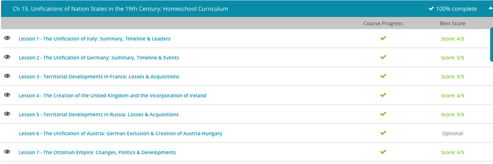

### Andrew Garber
### April 21 2023
### Unification of Nation States

#### Italy
 - Whereas Mazzini might have had the fervor, the next man with the real political power and acumen to unify Italy was Camillo Benso di Cavour, prime minister of the most powerful independent Italian state in the early 19th century: Sardinia. In addition to the island of Sardinia, the state also controlled Savoy, Piedmont, and Nice in northern Italy. Cavour had been prime minister of Sardinia since 1850. Cavour's original intentions were simply prestige and power for Sardinia, but his goal - uniting more Italian territory under the same flag - was one and the same with those who wanted an Italian state. Moreover, Sardinia had a moderate king in Victor Emmanuel II who ruled jointly with the Sardinian parliament - a political system those wanting an Italian republic would likely accept.
 - Cavour realized the most powerful nation in northern Italy in the mid-19th century was Austria, who possessed the large and rich territory of Lombardy. Knowing Sardinia could not defeat the Austrians by themselves, Cavour tried to position Sardinia in a politically advantageous position by entering the Crimean War on the side of France, Great Britain, and the Ottoman Empire in the mid-1850s. Meanwhile, Cavour continued to strengthen Sardinia and its territories from within, building railroads and improving the military.
 - Though Sardinia joined the war late and made very little real impact on the outcome, Cavour's move had gained Sardinia powerful international friends in Great Britain and France, who were simultaneously upset with Austria for steadfastly refusing to get involved in the Crimean War. With help secured, Cavour stirred up nationalist rebellions in the territory controlled by Austria. Cavour's troops invaded from the Sardinian territory of Piedmont, and Napoleon III of France immediately sent French troops to aid in the Sardinian effort.
 - The conflict did not take long, and Austria surrendered Lombardy to Sardinia. At the same time, Italians in Parma, Tuscany, and other central and northern Italian states rebelled against their independent rulers and joined Sardinia in the hope of creating a pan-Italian country.
 - With northern Italy now largely under the Sardinian flag, Cavour sent Giuseppe Garibaldi with a small force to southern Italy in 1860. Garibaldi was a long-time Italian revolutionary, and had been part of Mazzini's force that attempted to set up a republic in Rome in 1848. Garibaldi's forces were wildly successful, but the assault on the southern territories nearly stopped before it even began. Garibaldi was furious with Cavour and Sardinia, after he learned that in return for French help against the Austrians, Cavour had ceded Savoy and Nice to France. Garibaldi was from Nice and was outraged - the very city for which he was hoping to unite Italy was now French!
 - Somehow, Cavour placated him and Garibaldi began his campaign, swiftly conquering Sicily before crossing to the southern Italian countryside, encountering little resistance along the way. Garibaldi finished his campaign and in October of 1860, turned his conquests over to Victor Emmanuel of Sardinia. In 1861, Victor Emmanuel proclaimed all his territory to be the Kingdom of Italy.
 - The only parts of modern Italy which remained outside this new country were the Papal States and Venice. Realizing a direct attack on the pope would lead to international intervention, Cavour secretly encouraged riots and protests in the Papal States and before long two of the three states joined Italy, leaving Rome standing alone.
 - Rome was protected by the French, and Venice was still under Austrian control. The new Italian state (of which Cavour was the first prime minister) bided its time. In 1866, with Austria at war with Prussia, Italy saw their opportunity and joined the Prussian cause. After Prussia's victory, Italy annexed Venice.(This was a Bismarck plan, he didn't really want Venice and was more than happy to trade 1 Venice for Italian help against Austria)

#### Germany (Bismarck doing Bismarck things)
 - The common criticism of the precursor to modern Germany, the Holy Roman Empire, was that it was neither holy, nor Roman, nor an empire. Indeed, though Germany as we know it today was nominally united under an imperial crown for almost a millennium, in reality, the German lands were composed of approximately 300 individual principalities and city-states that largely operated in independence of one another.
 - Though certain powers dominated different parts of the German lands throughout the Holy Roman Empire's history, it was not until the 17th century that early modern Germany's two greatest powers, Prussia and Austria, began to expand and incorporate more and more German territory under their respective flags. In the early 19th century, Napoleon's conquest of the German lands ended the Holy Roman Empire. After Napoleon's defeat, the German states created the loosely-associated German Confederation in 1815, containing all territories of the former Empire with majority German speakers. Power within the Confederation was dominated by Prussia and Austria.
 - Perhaps no other statesman was in such a fine position to make this dream a reality as the Chancellor of Prussia during the mid-19th century, Otto von Bismarck. Bismarck was a fervent German nationalist who wanted a German nation, but specifically one dominated by his Prussia. As a result, once appointed, Chancellor Bismarck set out to strengthen and improve the Prussian army and gain international allies that would help Prussia on its way to unifying Germany. (The road to Chancellor Bismarck was not easy nor apparent to many in his own time, he was sent as an envoy to the Tsar in St.Petersburg, a way to get him out of Berlin)
 - After gaining the Chancellorship in 1862, Bismarck began improving Prussia's diplomatic position to ensure Prussia's dominance over Austria. In 1863, when Russia experienced a revolt in its Polish territory, Bismarck and Prussia supported Russia in its violent suppression of the rebellion. This endeared Prussia to Russia, who was traditionally an ally of Prussia's German rival, Austria.
 - The neutralization of Russian interest in German affairs came in handy just a few short years later. After Bismarck encouraged the uprising of German nationalists in Schleswig and Holstein and wrested the two territories from Denmark in the 1864 Danish War, Prussia turned its eyes on Austria. Austria had joined the Danish War in the hopes of supplanting Prussia as the defender of German nationalists, but only succeeded in becoming entwined in the defense of territory, which was far away from its home in South Central Europe.
 - Indeed, after the Danish War, Austria and Prussia were considered joint defenders of Schleswig and Holstein, and in order for Austria to defend the two principalities it had to cross Prussian territory. Prussia denied Austria the right to do so, and when the rest of the Confederation supported Austria, Bismarck declared the Confederation defunct, declared war on Austria and invaded other Northern German lands.
 0 The ensuing conflict lasted only seven weeks, and Prussia defeated Austria resoundingly, due in part to both diplomacy and military superiority. Indeed, Prussia possessed a better-trained and better-equipped army than the Austrians, but it was Prussia's neutralization of Austria's potential allies of Russia (due to Prussian help in the Polish rebellion) and France (due to Prussia's promises of territory) that really made Prussia advantageous. Additionally, Prussia guaranteed the new Kingdom of Italy the Austrian-controlled territory of Venice, and in doing so, gained a strategic ally south of Austria.
 - With Austria neutralized, the final obstacle to Prussia's unification of Germany was France. France still controlled territory on the border of the new, Prussian-dominated German Confederation, which Prussia considered German. Moreover, France was equally ambitious to expand eastward into German lands and simultaneously was worried about the growth of Prussian power at its doorstep. To provoke war, Bismarck released the now famous Ems Telegram, which appeared to insult the French ambassador and France itself.
 - Outraged, Napoleon III declared war on Prussia in the summer of 1870. This would prove a grave mistake for the French. After only six weeks, the better supplied and well-organized Prussian military had defeated the French and captured its main army, including Napoleon III, at Sedan. After a siege of Paris, the Prussians marched into the French capital in January 1871 victorious.
 - General Helmuth von Moltke the Elder, who led the Prussian forces in this war(and was perhaps as capable at warfare as Bisamrck was at diplomacy) was the uncle of the General Helmuth von Moltke who would disastrously lead Prussian forces in WWI. 
 - The war did more for Prussia than simply gain the territory it considered German, mainly Alsace and Lorraine. In the buildup to the war, the Southern German states outside the confederation asked to join the Confederation out of fear of French attack. With all this territory now in Prussian control and its borders secure, Bismarck declared the German Empire in 1871, crowning the King of Prussia, Wilhelm I, as Kaiser of Germany. The ceremony took place in Versailles, the traditional seat of French power, further humiliating France.

#### France
 - Despite a brief period of a few months where Napoleon returned from exile, was popularly reinstalled as the emperor, and renewed the fight before being defeated and deposed again, the French Empire was well and truly dead. However, the vast expanses of territory and states the French Empire had conquered left many territorial questions for Europe to answer in the wake of Napoleon's final defeat.
 - As a result, the major European states of the 19th century met at the Congress of Vienna in 1815, where the territorial lines of Europe were redrawn with the hope of creating a balance of power that would make future conquests such as that by the French Empire impossible. France, as the defeated party, was invited to the congress, but largely did not have a meaningful role in the proceedings, and as such received little from the congress. In fact, France was stripped by the congress of all the territories it had gained during the Napoleonic Wars and during the French Revolution. It also lost several possessions on the frontier with Germany to the new German Confederation.
 - France remained in this state for nearly a half century before it would again begin exchanging territory on its eastern border. France began regaining territory mainly due to its astute exploitation of European geopolitics. For example, in the 1850s and 1860s the Kingdom of Sardinia-Piedmont was attempting to unify the entire Italian peninsula to create Italy. Sardinia-Piedmont faced substantial opposition in this effort from Austria, who controlled territory in what is today northern Italy. The French ruler, Napoleon III (the nephew of Napoleon Bonaparte), agreed to aid Italy against Austria, and in return France regained control of Savoy and Nice.
 - However, the creation of another nationalist state in Central Europe, Germany, caused France to lose territory. During the 1860s, Prussia was on its own mission to unite all German-speaking principalities, states, and territories (excluding Austria) into a pan-German state. According to Prussia, this included a territory in eastern France with many German-speaking inhabitants, Alsace-Lorraine.
 - As a result, Prussia invaded France in July 1870. France was heavily defeated and humiliated. Prussian forces were in Paris in less than a year, declaring the Prussian King the emperor of the new German Empire in France's own Palace of Versailles. As a result of the defeat, France lost Alsace-Lorraine to Germany, though it would regain the territory following World War I and it is still part of modern France.

#### UK
 - Wales, for example, has been under English control for the longest of any current UK nation. Wales was effectively conquered by King Edward I in the 1270s and 1280s. Edward I conquered Wales largely through the building of fortresses and strongholds in English-controlled territory from where he could direct attacks against troublesome Welsh lords.
 - Wales remained a separate political entity, but entirely under English control, for a few more centuries until King Henry VIII and the English Parliament formally united Wales with England in the 1530s and 1540s through the Acts of Union. Welsh districts were created, modeled on the English system, and these districts were given representation in the British Parliament.
 - Scotland was a tougher nut to crack than Wales. Scotland had a long history of border and territorial disputes with England throughout the Medieval period. Additionally, Scotland possessed an important alliance with England's traditional continental enemy, France. Scotland and England were reluctantly brought closer when the Scottish king, James VI of Scotland, inherited the English throne from his cousin, Queen Elizabeth I.
 - In 1603, James VI of Scotland also became James I of England. Having the same king, however, did not make union a foregone conclusion. Indeed, in the mid-17th century, Scotland invaded the English north yet again, an event which in part instigated the English Civil War, leading to the public execution of the king, Charles I!
 - The union of the crowns, however, was formalized just over one hundred years after James VI of Scotland first took the English throne. Enacted in 1707, the Articles of Union formally combined the Scottish and English Parliaments into the Parliament of Great Britain and further formalized the Scottish-English crown that had already been combined for over a century. This created, for the first time, what we know today as the United Kingdom.
 - Ireland was an even larger thorn in England's side. Ireland was conquered by England in the late 12th century. However, whereas in Wales, English authority was felt and the Welsh lords were closely monitored, English authority in Ireland was largely nominal throughout the Medieval and Early Modern periods. Though England claimed Ireland, the English really only had control over events in Dublin and the area immediately surrounding Dublin, known as The Pale.
 - Ireland was largely left to its own devices until the reign of Henry VIII in the mid-16th century. Henry VIII switched England from being a Catholic country to a Protestant country, largely due to his personal wish for a divorce from his wife - a procedure not allowed by the Catholic Church. Although England embraced the change, Ireland remained a staunchly Catholic country, and Henry worried that Ireland might become a launching point for a European, Catholic invasion of England.
 - Throughout the next half-century, various English monarchs slowly reconsolidated English control in Ireland, bringing Irish lords to heel and attempting to introduce Protestantism on the island. This was done through the confiscation of Irish land, particularly in the northern province of Ulster, which was then given to English and Scottish Protestant settlers.
 - This, naturally, did not make the native Irish Catholics very happy. Over the subsequent centuries, Ireland intermittently rebelled against the renewed English presence in Ireland, and England often took advantage of the rebellions to demonstrate the need for further direct English control of Irish affairs. This issue came to a head in 1798 when the English put down a formidable rebellion.
 - Afterward, British parliamentarians, under the leadership of William Pitt the Younger, took advantage of this rebellion to renew calls to fully incorporate Ireland into the United Kingdom and remove the ambiguities that resulted from the Irish having their own parliament that was separate and quasi-subordinate to the British Parliament. In 1801, legislation was passed that incorporated Ireland into the British state.
 - The war was largely a guerrilla conflict, as the Irish Republican Army tried to avoid open conflict with the better equipped and more mobile British regulars. Before long, the British public tired of the war, and pressure mounted on parliamentarians and other decision-makers to end the conflict peaceably. However, the UK government refused to abandon the Protestants in the north of Ireland who were largely anti-Republican.
 - As a result, in May 1921, the British Parliament partitioned Ireland, separating the northernmost six counties of Ulster into the new country of Northern Ireland. When the truce was signed two months later, Great Britain granted the rest of Ireland its independence while maintaining Northern Ireland as part of the United Kingdom. The Irish Free State - as the rest of Ireland was now called - never formally recognized this partition, and the separation of Northern Ireland from Ireland caused numerous political problems and significant social unrest later in the 20th century.
#### Russia
 - Though the Congress of Vienna was convened with the express purpose of creating a balance of power in Europe, which was sustained peace on the continent, war broke out between Russia and other European states in the 1850s. This occurred after Russia began pressuring the ailing Ottoman Empire to grant special privileges to members of the Russian Eastern Orthodox Church, who lived in Ottoman territory in the Balkans.
 - The Ottomans largely ignored these requests and in response, Russia invaded and occupied Ottoman territory in Moldavia and Wallachia. The Ottoman Empire was outraged at this encroachment on its territory and declared war on Russia in October 1853. Despite being able to quickly mobilize their forces, the Ottoman fleet was smashed by the Russians in the Black Sea, forcing the Ottomans back to port on Asia Minor.
 - The other powers of Europe were worried that Russian advances into the Balkans and possibly even the Middle East would ruin the precarious balance of power devised earlier in the century. As a result, Britain and France demanded Russia leave Ottoman territory by March of 1854 and sent fleets to the Black Sea in early 1854 to secure Ottoman ports and trade routes. When Russia failed to leave the territory, Britain and France declared war on Russia. Eventually, Russia did evacuate the territory in the summer of 1854, but only after Austria threatened to join the allies if Russia failed to heed the demands.
 - Despite this threat, France, Britain, and the Ottomans landed forces in Russia, in Crimea on the north shore of the Black Sea, in September of 1854. Though some fighting did occur in the Baltic Sea, most of the military action occurred here as the allies conducted a long siege of the city of Sevastopol. After over a year of heavy fighting in and around the city, the Russians resigned themselves to defeat and left Sevastopol. However, they also blew up forts, munitions, boats at port; essentially anything they could not take with them on their retreat.
 - With heavy casualties taken on all sides, the allies' nominal victory in Crimea was the only result of nearly two years of conflict. In order to force peace favorable to the allies, Britain and France prepared an invasion fleet in the Baltic, threatening to land at St. Petersburg. Though they likely had little intentions of actually going through with the invasion, the buildup of the force had its intended effect. Russia signed the Treaty of Paris in March of 1856. According to the Treaty, Russia had no claims to the Ottoman territory they had invaded. In addition, Russia was outlawed from keeping any kind of military presence in the Black Sea and lost some territory in the Balkans.

#### Ottomans
 - The problems for the Ottoman Empire - by now being called by many commentators 'the Sick Man of Europe' - were not only military defeat and territorial loss. The numerous wars the Ottoman Empire had fought in the 18th century had left its economy hopelessly depleted and its bureaucracy too stilted and entrenched to adequately meet the problems.
 - In prior Ottoman administrations, positions and promotions within both the bureaucracy and the army had been based on merit, but by the 19th century, this system had given way to one that made appointments hereditary, which had a largely detrimental effect on governmental efficacy. To make matters worse, the Ottoman Empire suffered under a succession of weak and ineffectual monarchs who were ill-equipped to rule and surrounded by advisors who, by and large, served their own interests rather than those of the state.
 - These bureaucratic problems were compounded by a severe economic crisis in the Ottoman Empire. Not only had the wars cost the empire dearly, but a severe agricultural crisis in the late 18th and early 19th centuries further hurt the empire's wallet. The Ottoman Empire had experienced these crises before, but in previous generations the Ottoman economy had been supplemented by the income that came with prior Ottoman territorial conquests. With the empire now losing territory, this was no longer a possibility.
 - Though these problems were significant, this did not stop Ottoman rulers from trying to implement positive reform. For example, in 1827 Sultan Mahmud II eliminated the troublesome and conservative Janissary army, replacing it with an entirely new army under his direct command. Administratively, the bureaucracy was made more efficient and various departments and offices were created for the specialized management of sectors of the Ottoman Empire, such as trade or agriculture. New educational standards were also introduced, which promoted higher education for the elite and a wider reach of primary education for the population at large. Further reforms were attempted in the 1830s by Mahmud's successor, called the Tanzimat Reforms, but many of these largely failed.
 - 

 