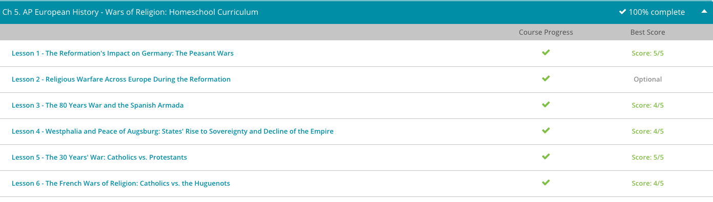

### Andrew Garber
### Feb 22
### Wars of Religion

#### Peasant Wars
 - The life of a peasant at this time was not easy. Because of high taxes and the ownership of all land belonging to royalty, peasants were basically slaves who worked the land without receiving any benefit from it. Peasants faced the heaviest taxes. The clergy and the nobles were exempt from taxes. In addition, costs for basic necessities rose consistently.
 - As people began to feel freedom from the authority of the Church, they hungered for freedom from the oppression of their landlords and nobles. Peasants began to revolt against their oppressors, claiming the same divine right that gave Luther the right to rebel. Some peasants even built armies to support them. These uprisings are known as the Peasant Wars. Although many peasants participated in these uprisings, they didn't have firm leadership.
 - Uprisings took place in various areas. It began in southwestern areas in Germany and spread into what is now Austria. The peasant armies lacked an overall structure and adequate weaponry. Many of the fighters had no experience in military or war tactics. The lack of discipline and organization led to the loss of many peasant lives.
 - During the wars, monasteries were burned down and their possessions stolen or destroyed. Peasants also attacked the nobles, destroying much of their land and homes. After taking over the town of Weinsberg, the peasants captured the castle and forced the ruling Count and about 70 other nobles to run a gauntlet of pikes, which meant to run between two lines of men with swords continuously attacking their victims. However, at Frankenhausen, thousands of peasants faced a prince's army along with mercenaries. Without adequate weaponry and leadership, thousands of peasants were slaughtered.
 - While Luther withdrew his support of the peasant uprising, the peasants did find support in a well-known Protestant minister named Thomas Müntzer. Müntzer was very supportive of the rights of the peasants and travelled across German provinces to encourage the rebels. Luther, accordingly, also made it known he disagreed with Müntzer's ideals.
 - While the peasants in Germany were revolting, Charles V's empire was facing much unrest. Between 1546 and 1547, Charles V fought against the Schmalkaldic League. They were a group of people who formed an alliance to collectively defend their territories against Charles.
 - Although Charles defeated the peasants, he still needed to address the unrest caused by the Reformation. A treaty known as the Peace of Augsburg was eventually signed in 1555. This treaty gave the ruler of each German state the right to pick his own religion (Catholicism or Protestantism) as the official religion of his territory. This brought a temporary religious peace to Germany.

#### The 80 Years War
 - To start out, let's grasp an understanding of the 80 Years' War. As already mentioned, this long conflict was the revolt of the Netherlands, also known as the Dutch, against Spain. During the 14th and 15th centuries, the Netherlands had slowly been absorbed into the Habsburg dynasty of Spain. By the 16th century, the Netherlands were an extremely prosperous and wealthy region within the Habsburg Empire.
 - However, while the Netherlands were busy creating wealth, Spain was busy spending it on wars with France, Turkey and Germany. Making matters worse, many of the countries Spain chose as enemies were trading partners with the Netherlands. Not only were the Netherlands forced to foot the bill for these wars, they were losing trading partners left and right. By the late 1560s, the Netherlands' aristocrats and merchants had had enough and were ready to tell King Philip II of Spain to find someone else to fund his wars.
 - Adding to all of this, Protestantism was gaining ground in the Netherlands. Although Catholicism was still the main religion of the Dutch people, Protestants were openly tolerated within the Netherlands. However, King Philip II of Spain was a staunch Catholic who felt it was his duty to squelch Protestants at every turn. Eventually, Philip sent troops into the Netherlands to round up unruly Protestants who were practicing iconoclasm, or the destruction of Catholic religious images. With this invasion, the Netherlands' dislike of the Spanish turned into a full-blown fight for independence in the year 1568. To head this revolution, William of Orange, also known as William the Silent, emerged as the leader of the Dutch forces.
 - By the early 1570s, the Spanish had suppressed much of the rebellion throughout the Netherlands but then pushed their luck by levying new taxes onto the Dutch. This new tax rekindled the fire of rebellion. In 1572, the rebels captured Brielle, giving them a foothold in the north and inspiring Protestants all over the region to once again take up arms. With William of Orange at the helm, the Netherlands continued gaining ground in the north. The Dutch momentum was further helped by Spain's inability to pay their soldiers. 
 - With the war going downhill for them, the Netherlands turned to the English for help. Up to this point, England had been supporting the revolution, but from behind the scenes - never outwardly choosing sides. In 1585, Elizabeth I of England decided to openly get involved by sending the Earl of Leicester to lead several thousand English troops to aid the Netherlands in their fight against Spain. Although Leicester proved to be a poor leader, his simple presence was enough to enrage Spain.
 - To begin, Philip had been married to Elizabeth's sister, Queen Mary I. Working together, Mary and Philip had persecuted English Protestants so severely that Mary was given the title 'Bloody Mary'. When Mary died without producing a child, Elizabeth ascended to the throne. After refusing Philip's offer of marriage, which would have kept Philip in the English limelight, Elizabeth sent Philip packing. She then added insult to injury by re-instituting Protestantism in England.
 - As if all this wasn't enough, Elizabeth also sponsored many raids against Spanish ships. Using men like Sir Francis Drake, known as the English Sea Dog, England robbed Spain of a huge amount of silver and gold. While all of this was occurring, Philip was preparing to invade England and return it to Catholicism.
 - As the Armada reached the English Channel, it was attacked by an English force led by the Sea Dog Sir Francis Drake. Although Drake's forces didn't do much damage to the huge Spanish ships, they did succeed in making Spain waste time and ammunition. With this, and also some very bad weather, the Spanish were forced to break their military formation and make port for reinforcements. As they docked somewhere near modern-day Calais, Drake seized the opportunity to strike and strike hard. Under cover of darkness, Drake ordered several English ships to be set ablaze and drifted into the Spanish fleet. This caused the Armada to again break formation, but even more devastating, it sunk Spanish morale.
 - The last blow to the Armada was the nasty weather for which England is famous. With strong winds blowing, Spain was never able to synchronize their fleet. Since they couldn't mount a full-scale attack, all England needed to do was stay out of Spain's firing range while using their advanced ships to pick off the Spanish fleet one vessel at a time. The onset of a fierce storm dealt the final blow to the Armada. Most of the Spanish ships were sunk, and the remaining turned home, battle-worn and defeated.

#### Westphalia
 - By the middle of the 16th century, it became apparent the Holy Roman Empire was losing control of its lands. Forcing Catholicism down the throats of its territories was no longer a viable option. In 1555, Charles V, the Holy Roman Emperor, made a huge concession to the Protestant reformers. This came with the signing of the Peace of Augsburg. In this historic treaty, Lutheranism was given official toleration. Going even a step further, the treaty allowed the princes of each territory to decide whether Catholicism or Lutheranism would rule their land.
 - Although this treaty did relieve some of the religious tensions within the Holy Roman Empire, it had one major flaw. It completely ignored Calvinism! Yes, the Lutherans were pacified, but every other Protestant group was left out in the cold. Since Calvinism was thriving in many parts of the Holy Roman Empire, this omission would lead to one of the most devastating wars in European history: the 30 Years' War.
 - Not surprisingly, the 30 Years' War ignited when Calvinists in Bohemia, now the Czech Republic, rebelled against their Catholic rulers in the year 1618. Since Bohemia was no match for the Church and the Holy Roman Empire, this small fire was quickly snuffed out. However, the 30 Years' War would continue to burn.
 - Seeing how ruthlessly the Church dealt with Bohemia, the Protestants of Denmark rallied their forces and invaded the Catholic states of Germany still loyal to the Empire. Like the Bohemians, the Danes were crushed by the Catholic forces, yet the fires of war waged on!
 - The next group of Protestants to take up arms against the Holy Roman Empire were the Swedes. Fortunately for the Swedes, they were financially backed by the French. This gave them the support they needed to win several victories against their foe. However, lasting victory came when Catholic France decided to actually join the fight on the side of the Protestants. Of course, Catholic France's motivation wasn't to aid Protestantism. They simply hated the Holy Roman Empire more than they did Protestants. If they had to align with heretical Protestants in order to see the Holy Empire burn, so be it!
 - With the Protestant forces backed by the armies of France, the empire couldn't contain the Protestant fire. Although peace talks began in the early 1640s, the Holy Roman Empire would face several more decisive defeats before fighting ceased. Finally, the 30 Years' War was brought to an end by the 1648 Peace of Westphalia.
 - Named after the province of Germany in which the peace talks first began, the Peace of Westphalia consisted of several documents. Also, these documents never officially crowned a victor. However, as we list some of the specifics of the treaty, it's obvious the Holy Roman Empire was not the winner. For example, Calvinism was recognized as an accepted religion within the Empire. Also, the Netherlands were officially granted freedom from Catholic control. Adding to this, Sweden was given power over the Baltic Sea, and France was given Alsace-Loraine, located just to the North of the French border.

