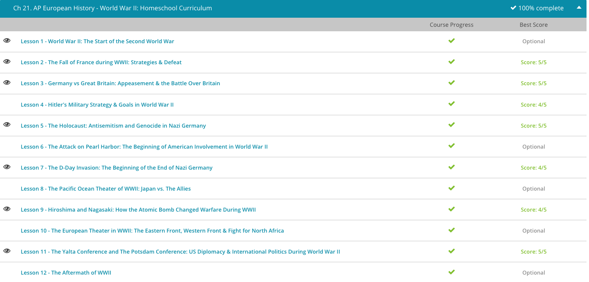

### Andrew Garber
### June 1 2023
### World War Two

#### The start of the war
 - After consolidating fascist power in 1933, Germany's chancellor tested the limits of the League's power. But, nothing had happened when he withdrew his nation from the League that year, or when he announced Germany's rearmament and compulsory military service in 1935. So, when the League of Nations failed to stop Mussolini's expansion, Hitler turned his own attention outward. In 1936, he sent 32,000 troops, with air support, into an area known as the Rhineland, which was a demilitarized buffer zone created by the Treaty of Versailles.
 - What did the League of Nations do? It officially disapproved. Then, Germany and Italy signed a military alliance in 1936, also in violation of Versailles. Silence. Germany and Italy both sent aid to the fascist leader of Spain during that nation's civil war, though the League had forbidden foreign involvement. In 1938, Hitler's Anschluss, the reunification of Germany and Austria, went unopposed. Then, in September of 1938, Great Britain and France, eager to avoid another costly war, signed the Munich Agreement approving Germany's occupation of the Sudetenland, which was a German-speaking region of Czechoslovakia, because Hitler promised he wouldn't try to take any more territory. And then, for a few months, Europe thought that might be the worst of it. He then took the rest of Czechoslovakia, carving it up between Germany, Hungary, and the new client state of Slovakia.
 - But, Europe wasn't the only part of the world dealing with aggressive, ultra-nationalistic leaders. By 1931, China had been embroiled in civil war for four years, and Japan took advantage of this instability. In 1931, they fabricated an excuse to invade Manchuria and seize control of its resources. This reflected Japan's ambitions as a rising imperialist power and mirrored the foreign policy actions repeatedly used by Western powers throughout the era of imperialism. The international community did little to intervene until Japan invaded Shanghai the following year, where a large population of expatriates lived. When the League of Nations protested, Japan withdrew from the organization and sporadic fighting continued.
 - By 1937, China and Japan were in an all-out war, beginning with the recapture of Shanghai. Quickly, Japanese forces moved in on the capital city of Nanking in 1937, and America evacuated its citizens. The U.S. gunboat, Panay, and three corporate-owned oil tankers were leaving Nanking with the last of the civilians when they were attacked by the Japanese navy. Now, in order to avoid a diplomatic crisis with the United States, Emperor Hirohito claimed that the sinking of the Panay was an accident and apologized.
 - However, Americans were further horrified by unspeakable Japanese atrocities carried out upon the Chinese capital in the coming weeks, an event known as the 'Rape of Nanking.' The United States and other Western nations imposed severe economic sanctions against Japan and sent aid to China. These sanctions are what set Japan and the United States on a path toward war - the sanctions were the gasoline, while Pearl Harbor was simply a match. Japan was deeply reliant on obtaining resources vital to its war effort in China and its industries from Western nations. Over half of its oil came from the United States and another 10% came from the Netherlands East Indies. Japan also depended on British Malaya for iron ore while French Indochina was a source of coal and rubber. Losing access to these resources makes the Japanese decision to attack a nation with 9-times its industrial capacity and a technologically superior military make much more sense.
 - By 1939, Japan's war against China was floundering, and the nation, now under the influence of a military mastermind named Hideki Tojo, looked for a way to combat American intervention. In addition, French Indochina, Hong Kong, and Western-controlled treaty ports were all channels used by China to access resources and supplies from the Western powers. For any chance of success in China, Japan needed to close off these supply routes and regain access to the resources necessary for its war industries.
 - Some also argue that opening a war against Western nations would help the Japanese government justify its lack of success in China to the Japanese public. Another factor fueling a willingness to take aggressive action was the Japanese leadership's deep resentment of the racist treatment they received at the hands of the Western powers. This was first seen at the humiliating rejection of Japan's request for a statement about racial equality in the Treaty of Versailles. The United States and even Canada had also implemented racist anti-Japanese immigration policies during the interwar years. Later, Britain nonchalantly abandoned its alliance with Japan in favor of an alliance with the United States. This pact had dated from 1902 and included a clause which would have required Britain to remain neutral if Japan went to war with the United States.
 - Now, let's see how all of this fits together. On September 1, 1939, the fast-moving, well-trained German army stormed across the Polish border from the north, south and west, while Soviet troops moved in on the helpless nation from the east a couple weeks later. Finally, the European democracies had enough. The invasion of Poland prompted Britain and France to declare war on Germany. Within months, Hitler's army controlled most of northern and western Europe, and his air force was keeping Great Britain at bay.
 - Suddenly, General Tojo saw the answer to his supply problems. The European nations were no longer in any position to defend their colonial possessions in Asia. If Japan could get control of the Dutch East Indies, British Malaya and French Indochina, Tojo would have the resources he needed to continue his conquest. Capturing British Hong Kong and other key transport links would block Western governments from supplying aid to China. Japan formally made an alliance with Germany and Italy in September 1940, forming the core of what we call the Axis powers. Soon after France's defeat to Nazi Germany, Japan occupied French Indochina. The former French colony is now composed of the independent nations of Cambodia, Laos, and Vietnam.
 - Still, the U.S. refused to declare war. Instead, the government allowed certain types of arms sales to its European allies and instituted a complete oil embargo against Japan. In 1941, both Germany and Japan wanted to discourage American involvement in their conquest schemes and weaken America's ability to fight just in case it did decide to declare war. Hitler's submarines began targeting U.S. ships approaching England. In December 1941, Tojo, now Prime Minister of Japan, decided to attack several U.S. possessions in the Pacific, including the naval base at Pearl Harbor and the Philippines, an American colony at that time. Simultaneously, Japanese forces began an invasion of British Malaya and an assault on Hong Kong. These were largely predictable moves to support Japan's survival and to have a chance at success in its war with China. The world had already been at war across Europe for three years and in East Asia since the 1930s, but now the United States was forced to take an active role in the war.

#### The Fall of France
 - In anticipation of the German invasion, France set up an elaborate installation of fortified bunkers and defensive positions along the French frontier with Germany. Called the Maginot Line, French commanders assumed the strong position would repel any invading German army and force the Germans to take heavy casualties. The line was set up in a similar fashion to the trenches of World War I (WWI), and the decision to build the fortifications was heavily based on lessons the French learned during WWI.
 - However, there were two holes in the line: one along the Franco-Belgian border (Belgium, in 1940, was a neutral state) and a second on the French side of the Ardennes forest, which French commanders considered impassable for any large army.
 - These two weaknesses proved the French's undoing. On May 10, 1940, Germany began a simultaneous invasion of both the Low Countries and France. In the north, German forces bombed the Netherlands into submission, and the Dutch surrendered only four days later. In response, French and British forces stationed on the Franco-Belgian border advanced into Belgium to fortify the Allied positions there. Despite some initial pushback, British and French forces largely held their ground in the face of the German assault advancing south from the Netherlands.
 - Unfortunately, this advance into Belgium played directly into Hitler's hands. The German attack through the Netherlands and Belgium proved to be only a diversionary attack, and the main German attack pushed through the Ardennes forest a few days later after the initial attack in the Low Countries. The British and French forces were wholly unprepared for this second prong of the attack, and the area was largely undefended.
 - The enterprising German blitzkrieg(a term never used by the Germans, and invented by the British. The Germans much preffered the term, bewegungskrieg - war of movement.) attack, which employed the use of fast-moving columns of tanks coupled with heavy airstrikes ahead of the columns, overwhelmed what few Allied forces existed on the French side of the Ardennes. Before long, the German forces were racing south and west, threatening the relatively undefended French heartland. Moreover, the advance cut off Allied supply lines to the northern forces in Belgium and threatened to encircle the force and cut off any possible retreat.
 - Only ten days after the initial invasion, German tank divisions had reached the English Channel and encircled the Allied forces. Belgium surrendered to the Germans eight days later, leaving the British forces in Belgium exposed. Abandoning the remaining French forces, the British commanders ordered all remaining British forces to abandon their positions and equipment and head for the coast for evacuation. Over a week's time and under heavy German shelling, the British employed virtually every military, commercial, and private ship to evacuate British troops from the French seaside town of Dunkirk.
 - The daring rescue proved a small moral victory(and kept thousands of well trained troops in the fight) for the British, but France remained doomed. The French continued to conduct counterattacks and minor offensives against the advancing German onslaught, but most gains were minimal and short-lived. The Germans advanced south quickly toward the French capital. After several days of shelling, the French government fled the city on June 13. After the surrender of Paris, German tank divisions dispersed throughout the countryside, defeating what few French forces remained. On June 22, France formally surrendered to Germany.

#### The Battle of Britain
 - With the war started, Great Britain was determined to help her allies on the continent. However, British hesitation and the speed of the German blitzkrieg had made Poland a lost cause. Britain then set her sights on aiding France in repelling the German onslaught. What few forces Britain sent to France helped little, and the Germans occupied all of France by the fall of 1940.
 - With most of Western Europe either allied with Germany or under German control, Hitler set his sights on Great Britain. Hitler's advisors stressed that any attempted amphibious invasion of Britain would be military suicide without at first attaining air superiority over southern England. As a result, Hitler told Hermann Goering, head of the infamous German Luftwaffe, to pummel southern England and Britain's Royal Air Force (RAF) into submission through an intense bombing campaign.
 - In mid-July, the Luftwaffe began attacks on British ships in the English Channel and slowly moved north, attacking airstrips and battering coastal cities in southern England. Preparedness proved essential for the RAF's evasion of total destruction by the German attack. Radar was an essential component of the RAF arsenal; as soon as British radar systems picked up German planes crossing the channel, nearby air forces scrambled their forces and got as many planes in the air as they could.
 - Not only were the planes required to beat back the fighters and bombers attempting to bomb ground targets in Britain, but it also stopped the planes from becoming useless ground targets themselves. British readiness and radar proved key, and within a few short months, Goering became frustrated with the Luftwaffe's mixed results.
 - As a result, the Germans switched tactics again in September. Instead of attacking air fields and defensive installations, the German Luftwaffe began an intense bombing campaign against London and other major British cities. Intended to break British morale, the bombing runs killed thousands of British civilians. However, after only a few weeks, Hitler and his German commanders realized that they had failed to achieve air superiority and resolved to focus their attentions elsewhere and stop losing forces over British skies. Though bombing runs on Britain continued throughout the war, the Battle of Britain had been effectively won by the winter of 1940.
 - The bombing of British cities was disastrous in the humanitarian realm, but hugely helpful in the military sphere as it allowed the British air force to concentrate forces mostly unmolested.
