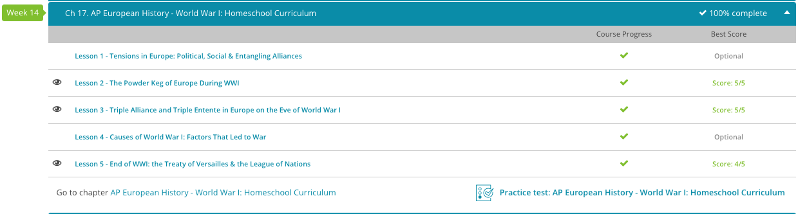

### Andrew Garber
### May 23
### World War I
 
#### The powder keg of Europe
 - The original description of "Europe as a powder keg" is usually attributed to Otto von Bismarck, though it is unclear whether he was actually the first to use it.
 - Enter Germany. Before 1871, the land that is now Germany existed as a loose confederation of independent kingdoms. Under the leadership of Otto von Bismarck, these independent kingdoms were united following the Franco-Prussian War to form the modern nation-state of Germany. Within a remarkably short period of time, the heavily industrialized Germany rose to the status of a world power and sought to exert itself as such. This upset the long-standing balance of power in Europe.
 - Which nations would Germany ally itself with? Which nations would Germany not get along with? This new dynamic, coupled with the fact that Germany was embarking upon a plan of rapid militarization, led to tension throughout all of Europe.
 - Turmoil in the Balkans also contributed to powder keg-like conditions. Just so we are clear, the Balkan region refers to the part of southeastern Europe where countries like Greece, Bulgaria, Albania, Serbia, Yugoslavia, and others are located. Most of these countries had (and still have) high percentages of Slavic people groups. For centuries, many Balkan states had been under the control of the Ottoman Empire.
 - Nationalism and pan-Slavism caused many of these states to rebel against their Ottoman rulers, resulting in chaos throughout the region. What is pan-Slavism? It was basically a movement aimed at uniting various Slavic peoples into one modern nation-state. To exacerbate matters, Imperial Russia, who was sympathetic to pan-Slavism, often encouraged Slavic groups to resist their Ottoman rulers.
 - We absolutely cannot discuss the pre-World War I 'powder keg' without discussing the systems of entangling alliances that European countries found themselves in. In 1882, the Triple Alliance was formed. This was a military alliance between Germany, Austria-Hungary, and Italy. Basically, to put it in our modern-day terminology, it meant these countries had each other's backs.
 - To counter the Triple Alliance, the Triple Entente was formed in 1907, composed of Great Britain, France, and Russia. The implications of these competing alliances basically meant that if any one nation went to war against any other belligerent nation, all the nations would become involved. Now we see why it's called a 'powder keg!'
 - The Triple Alliance is often referred to as the Central Powers, while the Triple Entente is often called the Allied Powers, or just the Allies. When war broke out in 1914, the small country of Serbia aligned itself with the Triple Entente, while the Ottoman Empire aligned itself with the Triple Alliance. As you probably know, the United States joined the Allied Powers late in the war, but that is another lesson for another time.
 - More than any other single event, the assassination of Austro-Hungarian Archduke Franz Ferdinand in June of 1914 was the 'spark' that ignited the Great War. The heir to the throne of the kingdom of Austria-Hungary, Franz Ferdinand and his wife Sophie were shot to death by Gavrilo Princip, a Serb and Yugoslavian nationalist. Princip belonged to a terrorist organization called the Black Hand, whose aim was to overthrow the Austro-Hungarian government and establish a unified pan-Slavic state.
 - The assassination of Franz Ferdinand provided a pretext for Austria-Hungary to invade Serbia, which led to the July Crisis of 1914. The July Crisis was basically the diplomatic crisis in which the major European powers decided what to do about the conflict between Serbia and Austria-Hungary. We don't have time to discuss the specifics here, but basically political maneuvering and posturing ultimately resulted in a world war between the Central and Allied Powers.

#### Triple Alliance and Triple Entente
 - On one side, we have Germany, Austria-Hungary, and Italy, which formed the Triple Alliance. Germany and Austria-Hungary were already allies by 1879 when, worried about a threat from Russia, they formed the Dual Alliance. Italy joined the group in 1882. There was a concern about a possible attack from France and the Alliance needed powerful friends to help defend it. The three countries promised to assist each other if any of them should be attacked.
 - The three countries renewed their alliance in 1887, 1907, and 1912. Each nation, however, seemed more interested in serving itself and gaining power and territory than it was in helping its allies. Austria-Hungary, for instance, was a powerful-looking nation, but it was always struggling to solidify the many nationalities that fell under its domain. It was so busy coping with its internal difficulties that it needed Germany's support to meet its goal of capturing territory in the Balkans.
 - Germany too had ulterior motives in creating and remaining in the Triple Alliance. It was a fairly new nation, only united in 1871, but it was ready to conquer the world. Germany knew that Austria-Hungary was weak and it was perfectly willing to use that fact to its advantage: it would help its ally get some Balkan territory and then, perhaps, snatch a bit for itself and maybe, just maybe, it could maybe control Austria-Hungary as well.
 - Finally, Italy was out to capture territory in Greece, Turkey, and the Balkans, and it needed strong allies to do so. Italy did not, however, trust Germany and Austria-Hungary. In 1902, it made a secret alliance with France, promising to remain neutral if Germany should attack France and essentially making the Triple Alliance, of which it was still a member, ineffective and very, very shaky.
 - Opposing the Triple Alliance, we have the Triple Entente, made up of France, Great Britain, and Russia. The Triple Entente proves the old saying that 'necessity makes strange bedfellows,' for after years of bitterness and conflict, these old enemies became rather reluctant allies as they tried to hold on to their place in the world.
 - France reached out first. It felt very threatened by the Triple Alliance and with good reason. France was no longer the powerful country it once was; it had already lost one war to Germany - the Franco-Prussian War in 1871 - as well as some territory, and it didn't want a repeat performance, so it started looking around for allies. France turned first to Russia and the two nations formed the Franco-Russian Alliance in 1894, promising each other to provide military assistance if members of the Triple Alliance should attack or mobilize for war.
 - Still feeling nervous, France approached Great Britain in 1904. Britain, which for many years had enjoyed a splendid isolation and worked hard to stay out of continental conflicts, was also concerned about developments in Europe. The two old enemies soon formed the Entente Cordiale, which made their new friendship official, opened the door to better communication, and settled some colonial disagreements. France agreed not to challenge Great Britain over Egypt, while Britain, in turn, promised to keep its nose out of Morocco. The Entente Cordiale stopped short, however, of guaranteeing military support from either side.
 - Three years later, in 1907, Britain and Russia created the Anglo-Russian Entente. Both nations vowed to respect Persian independence, which they had been stepping on for years. The Triple Entente was now fully formed, and France, Russia, and Britain placed themselves under a 'moral obligation' to assist each other if war should break out. When it finally did, in 1914, they added the commitment that none of them would make a separate peace with their enemies.
 - By 1914, then, the three nations of the Triple Alliance - Germany, Austria-Hungary, and Italy - stood against the three nations of the Triple Entente - France, Russia, and Great Britain. The spark that would set off a fire of war was about to ignite.

