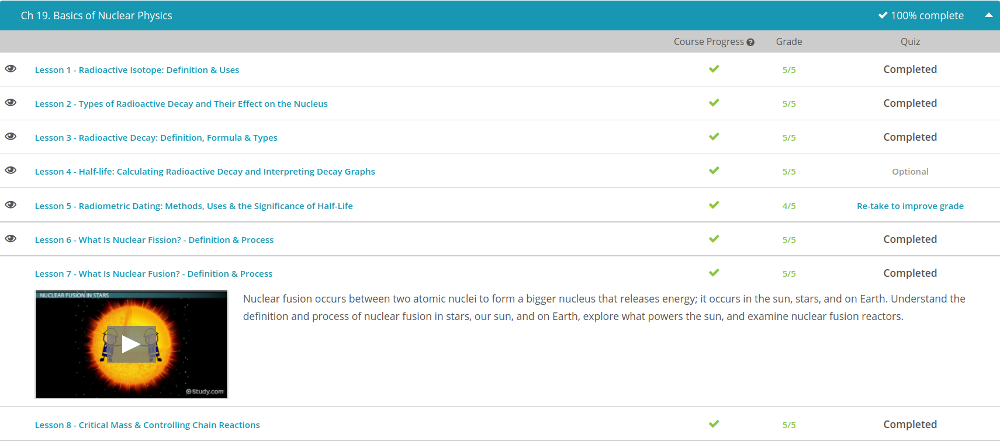

### Andrew Garber
### December 14 2022
### Basics of Nuclear Physics

#### Radioactive Isotopes
 - Before we go into discussing radioactive isotopes, let's recall what an isotope is. Let's look at the picture of an atom below. It has a nucleus made up of protons and neutrons with electrons around the nucleus. All the atoms of an element have the same number of protons, but the number of their neutrons can differ. If this happens, then we can call these isotopes of an element. Isotopes have the same number of protons, but they differ in the number of neutrons.
 - 
 - Radioactive isotopes have an unstable nucleus that decays or emits excess energy or radiation until the nucleus becomes stable. They can be naturally occurring or artificial isotopes of an element.
 -There are many radioactive isotopes that are very beneficial in applications in medicine. For instance, radioactive isotopes are used for radiation therapy and for locating brain tumors.
 - 
 - Nowadays, it is standard for a home to have smoke detectors. These are installed in various areas inside our homes and go off when there is too much smoke. How does a smoke detector detect smoke? It is because inside a smoke detector unit, there is a small amount of a radioactive isotope called Americium-241.
 - Radioactive isotopes also play their part in research. Perhaps you've heard of carbon dating. This uses the carbon-14 radioactive isotope, which is valuable for archaeologists. This is very important in determining when the organism died, so it is very valuable in determining ages of fossils and organisms that are thousands of years old. Radioactive isotopes are also important in other aspects of research like the complex chemical processes of photosynthesis.

#### Types of Radioactive Decay
 - Did you know that less than 1% of all the radiation you are exposed to comes from the nuclear industry? Most of it comes from natural sources like rocks. You are even a little radioactive! Nuclear radiation comes from all kinds of different places. There is natural radiation from the sun, water, and even bananas. There are also man-made sources of radiation, like nuclear reactors, certain types of medicine, and the smoke detectors in your home.
 - As you may recall, the two particles that are found in the nucleus are the protons and neutrons. Because the atomic number of an element is the number of protons its atom has, a proton essentially has an atomic number of 1. It also has a mass number of 1 because its mass is almost exactly 1 amu. These two numbers are so important that sometimes they are included in certain notation. For example, when we are distinguishing the difference between three carbon isotopes, notice they all the sixes on the lower left of the symbol. Those sixes represent the number of protons (or the atomic number). They all have the same atomic number because they're all carbon. The top number is the mass number, which is the number of protons and neutrons, because both protons and neutrons have a mass of 1. Each of these three isotopes has the same number of protons but different numbers of neutrons.
 - 
 - Now let's move on to the most common types of nuclear decay. The first is alpha decay. In alpha decay, the nucleus emits an alpha particle, or a particle containing two protons and two neutrons. The nucleus is said to decay, or change into one that is a little lighter, one with four less particles. An alpha particle can be represented a couple different ways - first, with 4, 2, and alpha symbol, the 4 representing the mass number (the number of protons plus neutrons) and the 2 representing the atomic number (the number of protons). Instead of the alpha symbol, the symbol for helium (He) is sometimes used because it's really just a helium nucleus.
 - Alpha particles are relatively heavy and quite slow-moving. It is for this reason that they can be blocked very easily by air, paper, clothing, and even your skin. Ingesting an alpha-particle emitter would be dangerous because your inner tissues don't provide the protection that your skin does and the alpha particles could cause some tissue damage. One of the main sources of alpha particles is the element radon, which is a gas found in many rocks.
 - Next up is beta decay or beta-minus decay. Beta decay occurs when a neutron turns into a proton and an electron is emitted. It can also be represented a couple of different ways. Both have a 0 and -1, and either a beta symbol or an e is shown. The reason an e is used is because a beta particle is really just a high-energy electron being emitted from a nucleus. Beta decay occurs when the nucleus contains too many neutrons. For example, tritium, the super-heavy isotope of hydrogen, has 2 neutrons and 1 proton (the most common form of hydrogen contains no neutrons). This tritium isotope is very unstable, and it will likely undergo beta decay, turning into a helium atom because one of its neutrons transforms into a proton and releases an electron. Unlike alpha particles, beta particles are high-energy and very light. They can travel through paper and certain types of clothing, but they are usually stopped by the first couple layers of your skin. To shield beta particles, a sheet of aluminum is needed. They can cause tissue damage, which is both good and bad. Damaging healthy cells can cause cancer; however, when beta particles damage cancer cells, they can provide a cure for cancer.
 - Finally, we have gamma decay. Gamma decay occurs when the nucleus of an atom is very high in energy. Just like electrons move out to higher energy levels, protons and neutrons can exist in higher energy levels as well. Also like electrons, when these particles fall back down into lower energy levels, radiation is released. When it is released from the nucleus by having protons and neutrons falling back down, very high energy gamma rays are released. Gamma rays are symbolized by a 0, 0, and a gamma symbol. Notice how both the atomic number and the mass number are 0. This means that this is a particle that contains no mass. It also doesn't change the atomic number of an element because the only thing that changes is that the nucleus loses energy. The structure of the atom is unchanged.

#### Radioactive Decay
 - Radiation is part of our everyday lives. There are natural sources of radiation, such as radiation from outer space, as well as man-made sources of radiation, like nuclear power plants and cell phones. Radiation is given off from a process called radioactive decay. Radioactive decay occurs when the original nucleus, or parent nucleus, of an unstable atom decomposes and forms a different nucleus, or the daughter nucleus.
 - The rate at which radioactive decay occurs is measured using half-life, which is the time it takes for half the amount of the parent nucleus to decay. Each time the half-life of a radioactive material occurs, the amount of the radioactive material decreases to half of the original value.
 - 
    -  N0 is the initial quantity of the substance
    - N(t) is the quantity that still remains and has not yet decayed after a time (t)
    - t1/2 is the half-life of the decaying quantity
    - e is Euler's number, which equals 2.71828
 - The radioisotope strontium-90 has a half-life of 38.1 years. If a sample contains 100 mg of Sr-90, how many milligrams will remain after 152.4 years?
 - 
 - Alpha decay, or alpha emission, is the release or emission of an alpha particle, which is a helium nucleus consisting of two protons and two neutrons. This type of decay usually occurs in larger and heavier atoms. In the figure, you'll see that a helium particle (alpha particle) is emitted from the parent nucleus.
 - Beta decay, or beta emission, occurs when a neutron transforms into a proton or a proton transforms into a neutron inside the nucleus. This conversion results in a beta particle--either an electron or positron--to be emitted, accompanied by either an electron antineutrino (a subatomic particle that is electrically neutral) or electron neutrino.
 - Gamma emission involves a release in energy in the form of gamma rays, very high-energy electromagnetic radiation. This type of emission usually accompanies other decays, such as alpha or beta decay. Gamma rays are emitted because when the nucleus undergoes alpha or beta decay, the nucleus is all shaken up and needs to release energy. Gamma rays have no atomic mass and no atomic number.

 

#### Radiometric Dating
 - The aging process in human beings is easy to see. As we age, our hair turns gray, our skin wrinkles and our gait slows. However, rocks and other objects in nature do not give off such obvious clues about how long they have been around. So, we rely on radiometric dating to calculate their ages. Radiometric dating, or radioactive dating as it is sometimes called, is a method used to date rocks and other objects based on the known decay rate of radioactive isotopes
 - There are different methods of radiometric dating that will vary due to the type of material that is being dated. For example, uranium-lead dating can be used to find the age of a uranium-containing mineral. It works because we know the fixed radioactive decay rates of uranium-238, which decays to lead-206, and for uranium-235, which decays to lead-207. So, we start out with two isotopes of uranium that are unstable and radioactive. They release radiation until they eventually become stable isotopes of lead.
 - These two uranium isotopes decay at different rates. In other words, they have different half-lives. The half-life of the uranium-238 to lead-206 is 4.47 billion years. The uranium-235 to lead-207 decay series is marked by a half-life of 704 million years. These differing rates of decay help make uranium-lead dating one of the most reliable methods of radiometric dating because they provide two different decay clocks.
 - Uranium is not the only isotope that can be used to date rocks; we do see additional methods of radiometric dating based on the decay of different isotopes. For example, with potassium-argon dating, we can tell the age of materials that contain potassium because we know that potassium-40 decays into argon-40 with a half-life of 1.3 billion years. With rubidium-strontium dating, we see that rubidium-87 decays into strontium-87 with a half-life of 50 billion years.

#### Nuclear Fission
 - Nuclear fission is the process in which a large nucleus splits into two smaller nuclei with the release of energy. In other words, fission the process in which a nucleus is divided into two or more fragments, and neutrons and energy are released.
 - This means that any reaction produces or consumes energy due to a loss or gain in mass. Energy and mass are equivalent. Note that because c to the second power is large, a small change in mass results in a large change in energy. When nucleons, or particles that comprise atomic nucleus, combine together to form an atom, the energy is released. Corresponding to the mass defect, the mass of the nucleus is always less than the sum of the masses of the individual protons and neutrons that comprise it.
 - Conversely, energy is needed to break apart a nucleus into its nucleons. Nuclear binding energy can be defined as the amount of energy needed to break one mole of nuclei into individual nucleons. The larger the binding energy per nucleon, the stronger the nucleons are held together, and the more stable the nucleus is. Less stable atoms have lower binding energies per nucleon. In other words, it is harder to break apart a nucleus with a high binding energy than a nucleus with a low binding energy. The binding energy per nucleon is a function of the mass number. Light nuclei gain stability by undergoing nuclear fusion. Heavy nuclei gain stability by undergoing nuclear fission.
 - Nuclear power plants use nuclear fission to generate power. The nuclei of uranium atoms, as well as the nuclei of other large atoms, can undergo nuclear fission naturally. The first nuclear fission reaction discovered involved uranium-235. Nuclear power plants use uranium-235 nucleus to undergo fission by hitting them with neutrons, as shown by the model in the following diagram.
 - Each fission of uranium-235 releases additional neutrons, as shown in this figure.
 - 
 - If one fission reaction produces two neutrons, these two neutrons can cause two additional fissions. If those two fissions release four neutrons, those four neutrons split other nuclei, and could then produce four more fissions, and so on, resulting in a nuclear chain reaction as shown in this figure.

#### Fusion and Fission done last year
