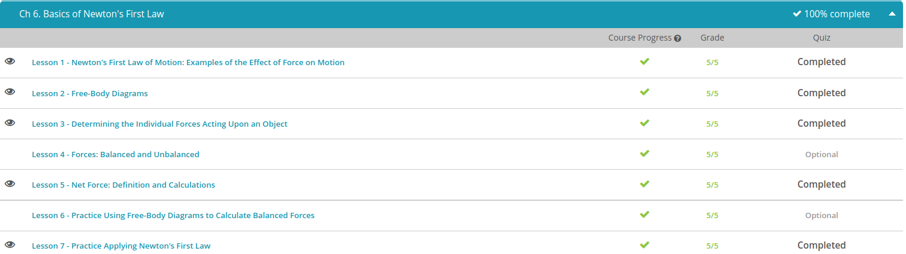

### Andrew Garber
### September 29
### Basics of Newton's First Law

#### Newton's First Law Of Motion
 - What causes an object at rest to move? Furthermore, what causes an object in motion to stop? Well, the short answer to these questions is force, which is any influence that causes an object to change its shape or motion.
 - Newton's first law of motion states that an object at rest remains at rest and an object in motion remains in motion with the same velocity unless acted upon by what we call an unbalanced force. 
 - An unbalanced force is an external force that changes the motion of an object. When an object is at rest or moving at a constant velocity, all the forces acting on it are balanced.
 - Newton's first law of motion is also referred to as the law of inertia. Inertia is simply the resistance to change in motion. In short, objects tend to keep doing what they are already doing.

#### Free Body Diagrams
 - There is the force of gravity pulling the book down, but there is also the normal force pushing up from below. Because the book is at rest, we know that these are balanced forces, meaning that they are equal in magnitude and opposite in direction.
 - 
 - Unbalanced forces are those that are not equal in magnitude, and this causes a change in the book's state of motion. From the person pushing the book, we have an applied force, which is greater in magnitude than the force of friction acting in the opposite direction.

