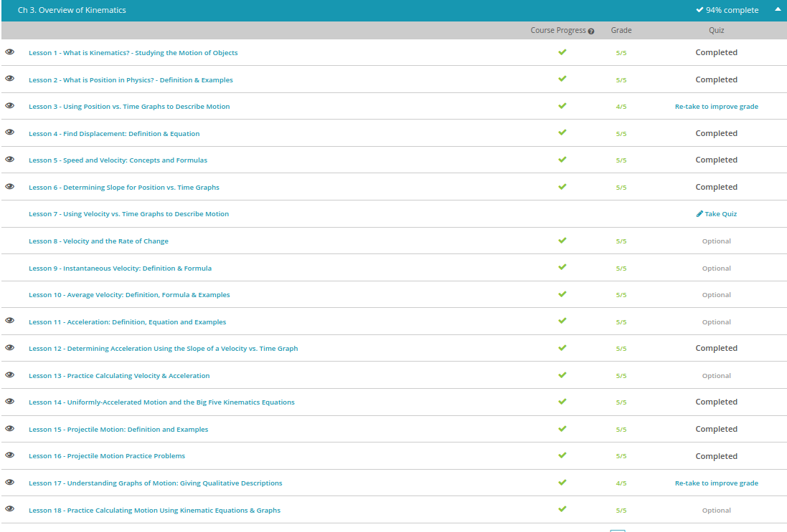

#### Andrew Garber
#### September 15 2022
#### Kinematics Day 1

#### What is Kinematics
 - Kinematics is the study of motion, it deals with the motion of any object. 
 - Kinematics, however, is not the study of WHY something moves the way it does, just the measurement of how far, how fast, and in what direction.

#### What is position
 - Position is a place where someone or something is located or has been put. In physics, position is usually a number on an axis. You can have an x-axis that looks like the one in the section above or a y-axis, also in the section above. You might be at positive 6 meters in the x-direction and negative 3 meters in the y-direction. That is position.
 
#### Position vs Time
 - When describing the motion of something, for example a car, the motion, position and speed is highly variable as different obstructions may present themselves and it may travel at different speeds on different surfaces - thus, graphing it is important.
 - Graphing Position vs Time usually has time on the x asis and position on the y, and easily expresses stops and increases in motion to graphically provide information on where an object is.
 
#### Displacement
 - distance refers to the actual length of the path taken by an object. Even though all three paths begin and end at the same spot, each path covers a different distance. Distance is a scalar quantity, so it is always a positive number with no regard for what direction the object is moving. So, for any path, the distance covered always gets bigger.
 - Displacement, however, refers to the difference between the final position and the initial position of a path taken by an object. all that matters is the distance between the start and end points of the path.
 - Displacement is a vector quantity, it has both magnitude and direction. 
 - The formula for displacement is Δx = x final - x initial. Δ(delta) refers to a change, between the final and starting position of the object.

#### Speed and Velocity
 - Speed is a matter of how fast an object is moving regardless of the direction it's going, whereas velocity is a matter of how fast an object gets somewhere with respect to direction.
 - speed is a measure of how fast an object moves, while velocity is a measure of how fast an object gets somewhere.
 - Speed is defined as the rate of change in distance with respect to time
 - Velocity is defined as the rate of change in displacement with respect to time.
 - Distance refers to the total amount of ground covered by an object in motion, whereas displacement refers to the net change in position of an object in motion. Distance is what we call a scalar quantity because distance is fully described by magnitude alone with no reference to direction. Since speed is a function of distance, speed is a scalar quantity as well. Displacement is a vector quantity because displacement is fully described with both magnitude and direction.
 - The formula for Speed = distance / time - for example, Speed = 20 meters / 60 seconds. Speed would be 0.33 meters per second
 - The formula for Velocity = displacement / time. For example, 5 meters to the right(because it is a vector, it has to include direction) / 60 seconds. This would be 0.08 meters to the right per second.

#### Slope and Velocity
 - Slope = Δy / Δx
 - On a position vs. time graph, y is position, which we can also call displacement (represented by the letter s). Displacement has the unit meters. x is time (represented by the letter t) and has the unit seconds. In this case, Slope would be Δs /Δt - the same as an average velocity equation.

#### Day 1 Quiz Results:
 - 

#### Acceleration
 - Acceleration is the rate of change of an object's velocity. Remember, velocity is how fast an object is moving in a specific direction. So, acceleration measures how fast the velocity changes. We can calculate acceleration if we know the total change in velocity and the time it takes for the velocity to change
 - Average acceleration = change in velocity / change in time or, Average Acceleration = $Δv / Δt$
 - Change in velocity = final velocity - starting velocity
 
#### Calculating Acceleration and Velocity
 - Average Velocity = displace/time
 - Determining instantaneous velocity, or an object's velocity at a specific point in time, is a little more involved. If the position of an object varies with time, we can take the first derivative of the position-time function to determine the instantaneous velocity at any time.
 - 1. Multiply the coefficient of the variable by the exponent on the variable, and write that number as the variable's new coefficient. 2. Lower the original exponent by 1, and write that as the new exponent. C is the coefficient. t is the time variable. n is the exponent on the time variable. 
 - 

#### The Big Five Equations in Uniformly Accelerated Motion
 - Equation 1: $Δx =  avg(v) * t$
 - Equation 2: $v = v_0 + at$
 - Equation 3: $x = x_0 = v_0 * t + 1/2at^2$
 - Equation 4: $x = x_0 + v * t -1/2at^2$
 - Equation 5: $v^2 = v_0^2 + 2a(x-x_0)$
 
 - Practice Problem: A race car sitting on the start line of a straight track accelerates uniformly for 3.6 seconds at a rate of 4.5 m/s2. If the initial velocity is 0 m/s, how far does the car travel during this time interval?
 - $t=3.6s a=3.5m/s^2 v_0 = 0 m/s x_0 = 0m$ This will be solved using equation #3 because it is the only one with all of these variables
 - $x = x_0 = v_0 * t + 1/2at^2$
 - $x = 0m + (0 m/s * 3.6s) + (1/2)(4.5 m/s^2)(3.6s)^2$
 - $x = (1/2)(4.5m/s^2)(12.96s^2)$
 - $x = 29.16 m$

#### Day 2 Quiz Results
 - 