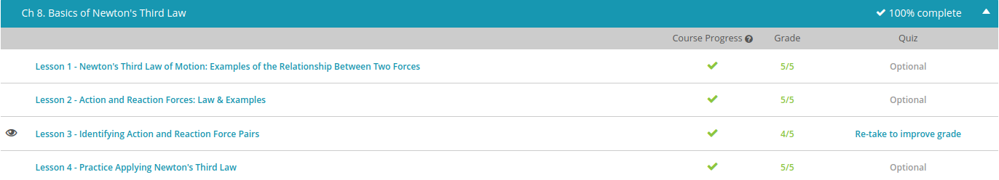

### Andrew Garber
### Oct 10
### Newton's Third Law

Note: Much of this chapter was bypassed by placement test
#### Identifying Action and Reaction Force Pairs
 - It's fairly simple to identify the action and reaction forces between objects. First, it helps to identify the interaction itself. Let's say you are doing a push-up the floor. Or, maybe a tennis racket is hitting a tennis ball. How about a rocket launching off the ground? All of these examples are interactions that result in forces being exerted on the objects involved in the interaction. When you push against the floor, you exert an action force onto the ground, while the ground exerts a reaction force right back on you. In a tennis match, the racket exerts the action force on the ball and, as the ball hits it, it exerts an equal and opposite reaction force on the racket. The rocket launches because it pushes on the gas coming out the back end for the action force, while the gas pushes the rocket upward with a reaction force.
 - In each of these cases, the action is the force exerted by the first object on the second, and the reaction force is the force exerted on the first object by the second. The important thing to notice is that action and reaction forces act on different objects in the interaction. Two equal and opposite forces acting on the same object do not make an action-reaction pair! This is why the two opposing forces don't cancel out. If a football is kicked from both sides at the same time, it doesn't go anywhere, because the two feet kicking it exert equal and opposite forces on the same ball and cancel each other out.
 - Let's take a closer look at this. Think of a cannon firing a cannonball. There is an interaction between the two objects, so there are action and reaction forces. However, the cannon recoils only slightly as it shoots out the cannonball, but the cannonball goes flying through the air. We can look at Newton's second law of motion to see why this happens. This law states that acceleration is proportional to the net force and inversely proportional to the mass of the object. What this means is that when the force increases, so does the acceleration, which is a change in an object's state of motion. But as the mass increases, the acceleration decreases. Since the forces are equal, you can see that mass is really the key player in how an object is affected by the forces acting on it.

