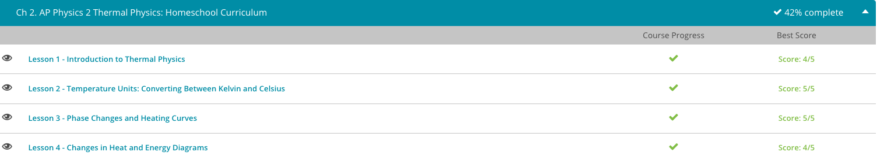
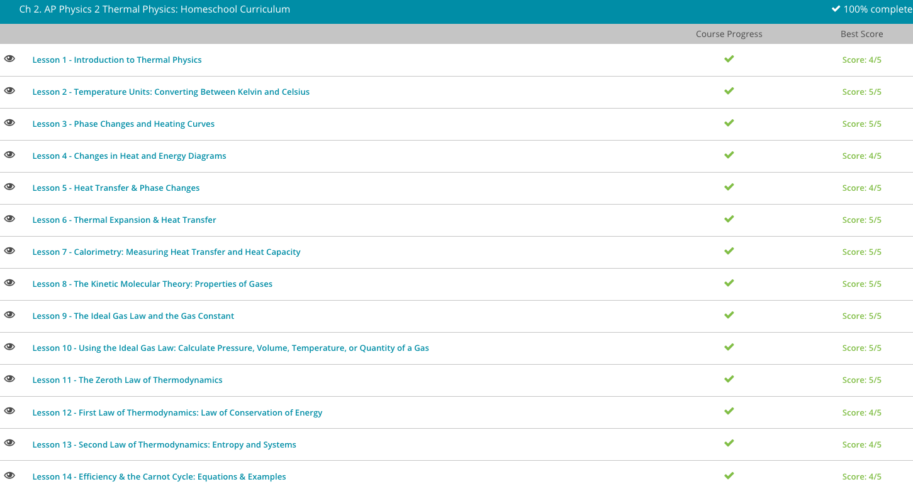

### Andrew Garber
### Feb 22
### Thermal Physics

#### Thermal Physics
 - In a nutshell, thermal physics is the study of heat. Heat energy, or thermal energy, is the energy of a substance or system in terms of the motion or vibrations of its molecules. The faster the molecules in a substance move the more heat energy they have.
 - If you wanted to know how much thermal energy there was in a glass of water, you would have to total up the energy of all the molecules inside it. Not only is this difficult to do, it isn't entirely helpful. A large glass of cold water has more heat energy than a small glass of cold water, but they feel just as cold. Because of this, we introduce a related term: temperature, which is the average kinetic energy of the molecules in a substance. A large and small glass of water might have the same temperature, even though the large glass of water contains more overall heat energy.
 - Thermodynamics is the study of the movement of heat energy. This encompasses the laws of thermodynamics, which talk about how and why heat moves, the types of heat transfer (conduction, convection and radiation), phase (state) changes, and the relationship between energy and work. Studying thermodynamics also means talking about heat engines - how we can extract useful work using a combination of cold and hot reservoirs.
 - Kinetic theory is a simplified description of gases that describes how the molecules move and react to situations, predicting what will happen to the gas as a whole. Or in other words, it uses simple physical laws for the molecules that make up a gas to explain the way gases behave on everyday scales. Kinetic theory also defines terms like temperature (the average kinetic energy of gas molecules), pressure (the force exerted by the gas molecules on the walls of their container) and volume (the space the gas molecules take up). Kinetic theory not only defines these properties, but also their viscosity and thermal conductivity, all using the composition and motion of the molecules.
 - Last of all statistical mechanics takes kinetic theory a step further. It uses statistical probabilities to predict the likely behavior of the molecules in a system. Statistical mechanics rejects terms like temperature, pressure and volume, and shows how they arise from the statistical behavior of molecules. It is more powerful than kinetic theory, but also correspondingly more complex. However for most purposes, kinetic theory is sufficient.
 

#### Heat Transfer and Phase Changes
 - Heat energy, or thermal energy is the energy of a substance or system in terms of the motion or vibrations of its molecules. The faster the molecules in a substance move, the more heat energy they have. You can transfer heat energy from one object to another, and in fact, a heat transfer will occur naturally whenever a hotter object is in contact with a colder one; heat will always move from the hotter object to the colder one. For example, if you were to put your warm hands against a cold metal pole, the skin on your hands would feel cold. That's because the heat from your hands transfers to the cooler metal. Your hands feel colder because some of your heat has been transferred to the metal.
 - When you add heat energy to a substance, one of two things can happen: either the temperature of the substance will increase, or the phase (or state) of the substance will change. Temperature is the average kinetic energy of the molecules in a substance. So it's pretty obvious why temperature might increase - heat is the motion of molecules, so if you get the molecules in a substance to move faster, then they'll have a higher temperature. But what about phase change?
 - Whereas temperature is the average kinetic energy of the molecules, the state is related to the spacing (or potential energy) of the molecules. Molecules that are further apart have more potential energy. Solids are substances with tightly-packed molecules in neat rows that can only move by vibrating. Liquids on the other hand are substances with molecules that can slide past one another and aren't as tightly packed as solids. Liquids do not have a consistent shape, and will change shape to fill the container. And gases are substances with molecules that are free to move in every direction. With a gas, not only does it not have a consistent shape, but it doesn't even have a consistent volume - the space it takes up can change.
 - Every phase change has a name: changing a solid to a liquid is called melting, changing a liquid to a gas is called boiling (or evaporating) , changing a gas to a liquid is called condensing, and changing a liquid to a solid is called freezing.
 - We can plot a graph to show the energy involved in phase changes: a graph of temperature plotted against heat added. It looks like this. As you can see, there are diagonal areas and flat areas. The diagonal areas are where heat is being added to increase the temperature. The flat areas are the phase changes, where heat is being added, but is going into the potential energy of the molecules, not the kinetic energy - the temperature therefore remains the same during these phase changes. These graphs and the equations that go with them are discussed in more detail in another lesson.
 - 

#### Thermal Expansion
 - The rate of heat transfer can be calculated, but there are separate equations for the three types of heat transfer. There's an equation to calculate heat transfer by conduction, one for convection, and one for radiation. But today we're just going to focus on conduction. The rate of heat transfer by conduction varies according to several factors: the thickness of the material through which it's transferring, the length of the material, and the temperature difference at the two ends of the material. In equation form, it looks like this:
 - $(Q / t) = [kA(delta T)] / d$
 - Here, Q over t is the heat transfer per second, measured in Joules per second, Q is the amount of heat energy (Joules), and t is the time in seconds. K (or to be exact, the Greek letter kappa) is the thermal conductivity of the material in watts per meter degrees C. A is the surface area of the material, d is the thickness of the material, and delta T is the difference in temperature between the two ends of the material, measured in either Celsius or Kelvin. Delta T is equal to the difference between the hottest temperature and the coldest.
 - Our understanding of thermal expansion is vitally important. It allows us to measure the temperature, stop bridges from collapsing, and open stubborn jars. Thermal expansion is where materials expand while being heated, causing them to take up more space. Some materials expand more than others - metals expand a lot, for example. But, in general, materials only expand due to the motion of their molecules. When something gets hotter, its molecules move faster. This is, after all, what temperature is: the average kinetic energy of the molecules in a substance. Molecules that move faster use more space. So, materials contract when they cool, and they expand when you heat them up.
 - Okay, let's go back to the conduction equation and go through an example. Heat is being transferred through a metal of thermal conductivity 60 Watts per meter degrees C. The material has a surface area of 0.1 meters squared and a thickness of 0.05 meters. If one end of the material has a temperature of 20 degrees C and the other end has a temperature of 100 degrees C, what is the rate of heat transfer across the material? And how much heat will transfer in 42 seconds?
 - First of all, we should write down what we know. The thermal conductivity, kappa, is 60, the surface area A is 0.1, and the thickness d is 0.05. We can also find delta T by finding the difference in temperature between the two ends, which is 100 minus 20, which equals 80. We also have a time, t, of 42 seconds, but that's part of the second question.
 - The first question asks us to find the rate of heat transfer, which is Q over t, so all we have to do is plug numbers in and solve for Q over t. When we do that, we get a value of 9,600 Joules per second.
 - Then, the second question wants to know how much heat transfers in 42 seconds. Well, if 9,600 Joules of heat transfer every second, and we want to know how much transfers in 42 seconds, we just multiply. Multiplying 42 by 9,600 we get 403,200 Joules. Or, in other words, this is like solving for Q in the original equation, instead of Q over t you multiply both sides of the equation by t.

#### Calorimetry
 - Before we start to measure heat transfer, let me introduce you to two common units of heat or energy you will come across. Firstly, the calorie; this is defined as the amount of energy, or heat, required to raise the temperature of one gram of water by one Celsius degree. The calorie is an old unit, but is still commonly used today. The calorie used to describe the amount of energy in food is actually a kilocalorie (which is 1,000 calories). So, our 500-calorie burger is really a 500,000-calorie burger!
 - The SI unit for heat is called the joule and is defined in terms of the calorie: 1 cal = 4.184 J. So, now our burger is equal to 500 kilocalories, 500,000 calories, and over 2 million joules! 
 - Now, we have already observed that different substances react differently when heated. It is also true that some substances require relatively large amounts of energy to change their temperatures, while others require relatively little. We call these differences 'heat capacity.' Specific heat capacity is the amount of energy required to change the temperature of one gram of a substance by one Celsius degree.
 - Q = s * m * change in temperature, where Q = heat (or energy), s is specific heat capacity, m is mass in grams, and delta T is the change in temperature in degrees Celsius.

#### Kinetic Molecular Theory:
 - These are just a couple of the properties of gases, but how can we explain some of these properties? For example, how does a gas fill its container? Well, when scientists try to explain the world around us, they tend to oversimplify things, and in many situations that is perfectly acceptable. When you were learning about the different planets that orbit around the sun, you probably learned from pictures in a book or three-dimensional models. Those pictures were not 100% accurate (there are not actual rings that the planets sit on), but they didn't have to be 100% accurate. They still served the purpose of providing a simple model so that the average person would get an idea of the make-up of the solar system.
 - Well, on Ideal Island, gases are also simplified. They are all ideal. That's why Johnny likes visiting this place. The gases are perfect. The carbon dioxide, oxygen and nitrogen all behave ideally. So, then, what is an ideal gas? An ideal gas is a theoretical gas that follows a set of principles. These principles are part of a model called the kinetic molecular theory. It sounds very complicated, but this theory is just a description of moving molecules. It explains why gases behave the way they do.
 - One thing ideal gas particles do is move rapidly and randomly. They are constantly flying around, and their direction can change at any moment. This is how gases are able to fill their containers; they fly around in random directions.
 - Ideal gas particles are also so small that they are said to have no volume. This is referring to each individual particle, not the gas as a whole. Another property of an ideal gas is that there are no attractive or repulsive forces between particles. As you may remember, solids and liquids have very high intermolecular forces. The intermolecular forces between gases are extremely small - and in an ideal gas, they are nonexistent.

#### The Zeroth Law of Thermodynamics
 - The zeroth law of thermodynamics says that if system (or object) A is in thermal equilibrium with system (or object) B, and is also in thermal equilibrium with system (or object) C, then B and C must also be in thermal equilibrium with each other.
 - Perhaps that's confusing, so let's break it down. First of all, what is thermal equilibrium? Thermal equilibrium is when two systems or objects have no flow of heat between them despite being connected by a path permeable to heat. When does this happen in real life?
 - Well, heat always transfers spontaneously from hot places to cold places. That, as it happens, is one way of stating the 1st law of thermodynamics. But this means that for heat not to flow when it can, the two objects or systems must be the same temperature.
 - So we can restate the zeroth law of thermodynamics like this: If system (or object) A is the same temperature as system (or object) B, and is also the same temperature as system (or object) C, then B and C must also be the same temperature.

#### Law of Conservation of Energy
 - This phenomenon of conservation is explained by what we call the first law of thermodynamics, sometimes referred to as the law of energy conservation. The law states energy cannot be created or destroyed. Energy can be described as the ability to do work, where work is the movement of matter when a force is applied to it. With the example of burning wood, the energy we see in the form of fire is not created out of nothing but rather comes from the energy that is stored in the wood. Likewise, the wood is not destroyed but rather is converted into ash and soot.
 - In order to better understand the law of energy conservation, we need to consider the fact that it applies to systems. A system is simply a collection of component parts that make up a whole. Burning wood is a system that includes the wood, heat, ash, and soot. The universe is the largest system that we know of, and it includes all matter and all energy, including the burning wood that we're talking about. There are other examples of small systems. For example, you can consider your body as a system. When you're cooking, you can consider a pot of water on the stove as a system as well.
 - Now that we have a good understanding of systems, let's consider the difference between an open and a closed system and discuss the law of energy conservation as it applies to each. A closed system is a system in which no matter or energy is allowed to enter or leave. The first law of thermodynamics tells us that the amount of energy within any closed system is constant - it doesn't change.
 - An open system, on the other hand, allows stuff to come in and go out, like burning wood in a fireplace. Here, you can add wood to the fireplace and light it with a match from, say, your pocket. Heat, ashes, and soot can leave the fireplace as the fire burns. In other words, energy and mass can enter and leave a system as long as they come from a system or leave to go to another system. It's important to note, however, that the total mass and energy in our universe remains constant.
 - So how does the law of energy conservation help us explain why machines will stop working if no energy is put into the system? At first, the law of energy conservation may seem to not apply to machines because we're having to constantly add energy. So it seems as if energy's not being conserved. But, on the contrary, the law absolutely applies, and, in fact, it applies to all machines and all systems.
 - Any time a machine works, some energy is lost to what we call friction. Friction is heat generated by moving objects in contact with each other. No matter how well-lubricated the wheels of a bike, for example, every bike will lose energy to friction as it moves. This energy lost to friction has got to come from somewhere according to the law of energy conservation, and indeed it does. It comes from the energy of the system - in this case, the system is the coasting bike. Eventually, all the energy of the coasting bike is going to be lost to friction and the bike will come to a stop. You see? The law applies.

#### Entropy 
 - Entropy can also be referred to as the amount of randomness or chaos in a system - less organization. As usable energy decreases over time, disorganization and chaos increase. Thus, as stored potential energy is released, not all of it is converted into usable energy. All systems experience this increase in entropy over time. This is very important to understand, and this phenomenon is referred to as the second law of thermodynamics.
 - As you may have guessed, the second law of thermodynamics follows the first law of thermodynamics, which is commonly referred to as the law of energy conservation, and it states that energy can't be created and it can't be destroyed. In other words, the amount of energy in the universe, or any system, is constant. The second law of thermodynamics is commonly referred to as the law of entropy, and it holds that energy becomes less usable over time. Therefore, while the quantity, based on the first law, of energy remains the same, the quality of energy decreases over time, based on the second law.
 - The implications of the second law of thermodynamics are as extensive as the boundaries of our universe. The universe is constantly losing usable energy and becoming more chaotic - less organized. This would suggest that the universe is not eternal but rather has an end, both in space and time.
 - At a much smaller level, the springs of an old clock must be wound in order for the clock to tick and to tock. The wound springs contain a lot of stored potential energy, and that energy is used over time to make the clock work - that's what moves the hands of the clock. However, not all the potential energy is converted into usable energy. Some of that energy is lost in the form of heat - heat is unusable energy. If no one's available to wind up the clock, it won't be able to do any work again.

#### Efficiency & the Carnot Cycle
 - A heat engine is a device that produces motion from heat and includes gasoline engines and steam engines. These devices vary in efficiency. The Carnot Cycle describes the most efficient possible heat engine, involving two isothermal processes and two adiabatic processes. It is the most efficient heat engine that is possible within the laws of physics.
 - The second law of thermodynamics states that it is impossible to extract heat from a hot reservoir and use it all to do work; some must be exhausted into a cold reservoir. Or, in other words, no process can be 100% efficient because energy is always lost somewhere. The Carnot Cycle sets the upper limit for what is possible, for what the maximally-efficient engine would look like.
 - Before we go through the details of the Carnot Cycle, we should define two important terms: isothermic and adiabatic. An isothermic process is a process where the temperature remains constant and the volume and pressure vary relative to each other. An adiabatic process is a process where no heat enters or leaves the system to or from a reservoir and the temperature, pressure, and volume are all free to change, relative to each other.
 - Stage 1 is an isothermal expansion, where the volume increases and the pressure decreases at a constant temperature. This is where heat enters the system from the hot reservoir (i.e., from your power source) to keep the temperature constant. The gas inside the engine is allowed to naturally expand and push a piston.
 - Stage 2 is an adiabatic expansion, where the hot reservoir is now taken away. The gas continues to expand, causing the pressure and temperature to decrease. Stages 1 and 2 are where the engine actually does useful work.
 - Stage 3 is an isothermal compression, where the volume decreases and the pressure increases at a constant temperature. The temperature is kept constant by putting it in contact with a cold reservoir. Here, you actually have to do work by physically pushing the piston to compress the gas.
 - Lastly, stage 4 is an adiabatic compression, where you remove the cold reservoir. The volume continues to decrease but without the cold reservoir, this leads to both the pressure and temperature increasing. Stages 3 and 4 both involve you doing work on the system; you are expending energy to make this happen by pushing down on the piston.
 - The useful work that comes out of the Carnot Cycle is the difference between the work done by the engine in stages 1 and 2 and the work done (or the energy wasted) by you in stages 3 and 4. The Carnot Cycle, with its two isothermal processes and two adiabatic processes, is the most favorable case. In other words, the cycle that produces that largest difference between these values allowed by the laws of physics.
 - 
 - The efficiency of a Carnot engine is entirely a function of the temperatures of the hot and cold reservoirs you use. It can be calculated using this equation, where TH is the temperature of the hot reservoir in Kelvin, and TC is the temperature of the cold reservoir in Kelvin:
 - So, all you do is take the difference in temperature between the reservoirs, divide it by the temperature of the hot reservoir, and then multiply it by 100 to turn it into a percentage. It's important to note that the temperatures must be in Kelvin for it to work. So, if you have a temperature in degrees Celsius for example, you need to add 273 to that value to convert into Kelvin.

