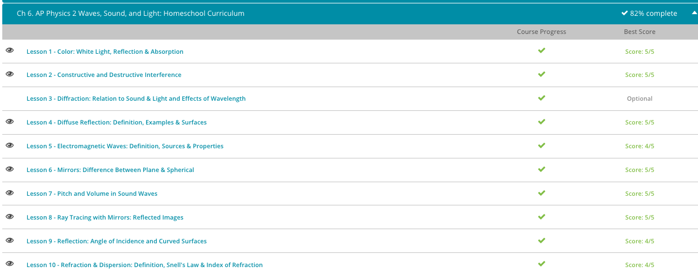

#### Andrew Garber
#### March 20 2023
#### Waves, Sound, and Light

#### Color: White Light
 - If you pass a beam of white light through a prism, you will see the light split into the colors of the rainbow. There's red, orange, yellow, green, blue, and violet all spread out. You can also see a rainbow when sunlight passes through a crystal decoration or even the peephole in your front door. Sunlight and other white lights are actually made of many different frequencies. The sun emits infrared and ultraviolet waves in addition to the full spectrum of visible light. We don't see the infrared and UV waves, but we do see the full range of visible color, all bundled together in the form of white light. White light is the combination of many different frequencies of visible light from all parts of the visible spectrum. The only way we can see these frequencies as separate colors is to separate them into a rainbow.
 - So if sunlight is white light, and sunlight reflects off of objects like plants and birds and oranges, then why don't we see those objects as white? It turns out that the different color frequencies are absorbed and reflected differently in every different object. Let's learn more about selective absorption and how it relates to color.
 - Let's say you've got a nice ripe orange in your hand. You walk outside, and the sunlight beams down on the orange from above. The sunlight is white light, so it contains all the different frequencies in the visible light spectrum. Many different waves of light beam down on the orange, each wave a different frequency. When a light wave strikes any object, it can do one of three things: it can be transmitted, it can be absorbed, or it can be reflected.
 - Absorption of a light wave occurs through resonance. When the frequency of a light wave matches the resonant frequency of an object, then the object vibrates at that frequency. The energy of the light wave stays in that object as thermal or vibrational energy. In other words, you never see that light wave again! Let's take this one little light wave here, which happens to be the frequency of the color violet. When this violet light wave strikes the orange, there are some molecules in the orange which resonate at that frequency. The violet light wave is absorbed by those molecules, so we never see the violet reflecting off the orange's surface. What about green? When a green light wave strikes the orange, it also resonates with some of the molecules in the skin. It gets absorbed, and so we don't see green, either. In fact, most of the frequencies inside the white sunbeam are absorbed by the orange. The only frequency that ISN'T absorbed is that of the color orange!
 - 
 - So what is different about the orange light? Instead of being absorbed into the orange like the other colors, orange light is reflected by the skin of the fruit. In reality there are a range of frequencies for the color orange. Some waves are more reddish-orange and some are more yellowish. But all those frequencies are reflected together, giving the orange the appearance of being orange. The appearance of color is due to the selective absorption of light waves. Orange wasn't the only color to be beamed down on the fruit. But it WAS the only color to be reflected. Selective absorption describes the tendency of an object to absorb some frequencies of light more than others. An object that appears a certain color reflects the light frequency that corresponds to that color, and it absorbs all the other frequencies in the visible light spectrum. An orange absorbs all of the frequencies but orange. A banana absorbs all of the frequencies except for yellow.
 - Selective absorption occurs in just about everything that has color. It happens because of the specific properties of the molecules that make up objects. The molecules in red paint are slightly different from the molecules in blue paint. The molecules in red feathers are different from the molecules in blue feathers. In fact, most living things use special chemicals called pigments to make their bodies appear a certain color. A pigment is a chemical that alters the color of a light wave by selectively absorbing one or more light frequencies. The feathers of a male cardinal are made red by special organic pigments called carotenoids. Birds get carotenoids from the plant materials they eat. They can make red, yellow, or orange colors in their feathers this way. Another pigment they use is melanin, the same pigment that colors human skin. Melanin is used to make the blacks, browns, and tans in the feathers of birds and the hair of mammals. Structures that are totally black absorb all of the frequencies of light. In the case of white structures, there ARE no pigments. So white feathers and white hair appear that way because ALL frequencies of white light are reflected from their surfaces.
 - One very important biological pigment is the plant pigment chlorophyll. Chlorophyll is what gives plants their green color. More importantly, it's what allows them to absorb the sun's energy and make food through the process of photosynthesis. Chlorophyll is found mostly in the leaves and stems of plants. It absorbs a huge amount of energy from white sunlight. It absorbs the waves in the red frequencies, and the blue, and the violet, orange, and yellow frequencies. But it doesn't do a great job of absorbing light in the green frequencies. So the green frequencies are reflected instead! And that's why plants look green.

#### Diffuse Reflection
 - All we have to do is imagine a whole bunch of rays parallel to one another. This picture below could represent a concentrated beam of light waves, say, from a flashlight. Since each ray is hitting the surface at the same angle - the angle of incidence - then each ray reflects at the same angle - the angle of reflection. A person standing in the path of the reflected rays would see a perfect image of the flashlight's beam. It wouldn't be much different from staring into the flashlight itself! This type of reflection, in which a smooth surface causes reflected rays to travel in the same direction, is called specular reflection.
 - 
 - Specular reflection is best known as the type of reflection you get from a mirror. It also occurs off of other smooth surfaces like glossy tabletops, car windows, and very still water. Specular reflection from a calm lake occurs because the surface is so flat that all the reflected rays bounce off in the same direction.
 - But, if a gust of wind disturbed the water, the resulting ripples would cause a different phenomenon called diffuse reflection. Diffuse reflection occurs when a rough surface causes reflected rays to travel in different directions. Most everyday objects exhibit diffuse reflection because of the tiny imperfections on the surface of the material. A piece of paper may look smooth on the surface, but at the microscopic level, the tiny fibers make it rough. Upholstery and clothing exhibit diffuse reflection because of the minute roughness of the fabric. Even a leaf has an element of roughness to it because of the multidimensional nature of the cells on the surface.
 - In diffuse reflection, each individual ray strikes a part of the surface that is oriented in a different direction. The law of reflection still applies, but the normal is different for each ray. So, the reflected rays end up going in all directions. As you can see below, one incident ray reflects over in one direction, another incident ray reflects elsewhere, and another one reflects somewhere else. The effect of all these rays going everywhere is that all of the waves are spread out. Diffuse reflection is the reason why you don't see your image reflected in most everyday objects.
 - 

#### Electromagnetic Waves
 - The electromagnetic spectrum describes a wide range of different electromagnetic waves. Also called EM waves, these are a special type of wave that can travel without a medium. Unlike sound waves and water waves, electromagnetic waves don't need a fluid, or a solid, or even air to help them travel from one place to another. EM waves can travel across the great vacuum of space, which is why we see light from distant stars and planets.
 - Electromagnetic waves are named for the fact that they have both an electric and a magnetic component. They begin when charged particles, like electrons, vibrate due to the various forces acting on them. The vibration of charged particles results in an emission of energy known as electromagnetic radiation. EM waves propagate outward from the source. Just like regular transverse waves, the oscillations of EM waves are perpendicular to the direction of the wave's travel. But, EM waves are more complicated; the electric component oscillates in one plane, while the magnetic component oscillates in a different plane. In a vacuum, EM waves always travel at the same speed - the speed of light, which is roughly 300 million meters per second. We call this value the speed of light, but really, it counts as the normal speed for all of the EM waves.
 - 
 - So, what are the other EM waves besides light? Electromagnetic waves include infrared, ultraviolet, radio waves, and microwaves. They also include X-rays and gamma rays. You've probably heard of all these waves before, but you may not have seen how they relate to visible light. Let's take a look at how these seven groups of waves fit together on the electromagnetic spectrum.
 - The EM spectrum is the range of all possible frequencies of electromagnetic waves. At one end of the spectrum are the waves with the lowest frequencies. At the other end are the highest frequency waves. The spectrum is broken up into regions that define each of the different wave types. At the lowest frequencies, we have radio waves. Then, as we increase frequency, we encounter the microwaves, infrared radiation, and visible light waves. Moving further up the spectrum, we have ultraviolet radiation, X-rays, and gamma rays. Gamma rays have the highest frequencies of all the EM waves.
 - 
 - Electromagnetic waves can also be distinguished by their wavelength. Wavelengths for EM waves can be found by dividing the speed of light by the wave's frequency; this is a modification of the wave equation. Since all EM waves travel at the speed of light, then the spectrum of wavelengths is exactly opposite the spectrum of frequencies. In other words, wavelength and frequency are inversely proportional to each other. We can view our electromagnetic spectrum not only in terms of increasing frequencies but also in terms of decreasing wavelengths. As frequencies increase on the EM spectrum, wavelengths decrease. So, that means radio waves have the largest wavelengths and gamma rays have the smallest.
 - To help you associate these relationships across the spectrum, try to imagine a continuous wave with gradual changes throughout. The wave begins with very wide arcs, indicating the large wavelengths and low frequencies of radio waves. As the wave moves along the spectrum, the crests and troughs get closer together. By the end, the arcs are so close together, you can barely see between them. This represents the high frequencies and small wavelengths of our gamma rays at the end of the spectrum.

#### Resonance
 - Objects, charged particles, and mechanical systems usually have a certain frequency at which they tend to vibrate. This is called their resonant frequency, or their natural frequency.
 - Some objects have two or more resonant frequencies. You know when you drive on a bumpy road and your car begins to bounce up and down? Your car is oscillating at its resonant frequency; or really, the resonant frequency of the shock absorbers. You may notice that when you're riding in a bus, the bouncing frequency is a little bit slower. That's because the bus's shock absorbers have a lower resonant frequency. When a sound or light wave strikes an object, it is already vibrating at some particular frequency. If that frequency happens to match the resonant frequency of the object it's hitting, then you'll get what's called resonance. Resonance occurs when the amplitude of an object's oscillations are increased by the matching vibrations of another object.
 - Resonance for sound works the same as it does for light. When one object is vibrating at the resonant frequency of a second object, then the first object causes the second one to vibrate with a high amplitude.
 - Resonance causes the amplitude of that frequency to increase so much that people hear a loud, single-frequency sound from your trumpet. That sound is only one of many frequencies that you're producing. But, it's the only one we hear because it's the only one that is amplified by its resonance with the air column.
 - Have you ever tried making a wine glass sing? You can do this just by wetting your finger and sliding it around the rim of the glass. The motion causes small vibrations because your finger is actually sticking and slipping on the glass in an alternating pattern.
 - The slip-stick effect creates many frequencies of sound waves, one of which will resonate with the wine glass itself. A clear, ringing tone comes out of the glass, a sound which is the same as the glass's resonant frequency. Some people can use these tones to create beautiful music!

#### The Doppler Effect
 - The Doppler effect explains how we perceive changes in sound when the source of the sound is moving. While the ambulance siren doesn't change pitch at all, we perceive that it changes as the vehicle moves past us.
 - The Doppler effect isn't just about ambulance sirens, though. It's an important phenomenon that occurs in all types of waves: sound waves, light waves and even water waves. Scientists have used the Doppler effect to make some amazing discoveries.
 - In talking about how an observer perceives waves, we have to be clear about the difference between actual and apparent frequencies. Actual frequency is just what it sounds like: it's the true frequency of a wave, irrespective of external factors. The position of an observer does not affect the actual frequency of a wave. On the other hand, apparent frequency is the frequency perceived by an outside observer. It may or may not match the actual frequency.
 - 
 - A shock wave is a very abrupt disturbance in a medium. The airplane creates the shock wave by making the sound waves merge together. Since it's traveling at the speed of sound, each individual sound wave has no time to get out of the way before the next wave comes. The waves compound on top of each other to create one giant shock wave. If you could listen to this wave, what you would hear is called a sonic boom.
 - Sonic booms are extremely loud sounds caused by the buildup of sound waves. You're most likely to hear a sonic boom from a supersonic aircraft; that is, an aircraft traveling faster than the speed of sound. If you're standing on the ground when this aircraft passes you by, you'll get hit with the edge of a wave front that is shaped like a cone. This cone shape is caused by the successive spheres of sound waves coming from the airplane. At the edge of the cone, all of the compressions merge together to make one giant sound. When that high-pressure zone hits you, you experience it as a sonic boom. 
 

#### Transparent and Opaque Materials
 - An object is said to be transparent when light passes through it without being dispersed, or scattered. Clear glass is transparent, and clean water is transparent. Although light travels through these materials, we know that they also block things like wind, sound waves and the movements of people and animals. For example, you can't walk through glass. So, how can a light wave pass through the glass without being changed at all?
 - Light waves are absorbed by an object when the frequency of the light wave matches the resonant frequency of the object. Absorption occurs when none of the light waves are transmitted through the object. Transmission, if you weren't sure, just means the passing of electromagnetic waves through a material. In the case of objects that are transparent, all of the light waves pass through. Transparent objects exhibit complete transmission of the light waves through the object.
 - What really happens inside glass materials when a light wave passes through? We know that there aren't any tunnels connecting one side to the other. So, what's going on? When a light wave strikes the surface of the glass, it sets the electrons vibrating at a certain frequency. This frequency is not the resonant frequency of the glass. The vibrations pass from the surface atoms to the neighboring atoms and then on to more atoms through the bulk of the glass. The frequency doesn't change when the vibrations pass from one atom to another. Once this energy gets to the other side of the glass, it is re-emitted from the opposite surface. The light wave effectively passes through the glass unchanged. As a result, we can see straight through the glass, almost as though it isn't even there. So, now you know: transparency occurs because of the transmission of light waves through the bulk of an object.
 - What about objects that are translucent? What's happening when light is scattered as it passes through an object? The scattering of light is related to a subject called refraction, but we won't be discussing that in this lesson. 
 - Reflection is a change in the direction of a wave when it strikes a surface. Reflection can be specular (as in glossy or smooth-surfaced objects) or it can be diffuse (as in objects with rough surfaces). In either case, reflection occurs because the vibrations of the surface electrons do not pass their energy down through the material. Instead, they vibrate a little bit and then re-emit the energy back, away from the material. When this happens, the object appears to us as opaque. Opaque materials do not allow transmission of light waves. In other words, we can't see through an opaque object. We can only see the surface because the light waves are re-emitted from the surface back to our eyes. Opacity occurs because of the reflection of light waves off the surface of an object.
 - Transparency and opacity are easy enough to understand in the context of visible light. We can see the results of it, can't we? We can see when an object is transparent to a light wave. We can tell when something is opaque. But, the principles of transparency and opacity apply to all the electromagnetic waves. Visible light, remember, is just one of those types. So, here's a question: if glass is transparent to visible light waves, does that mean it's transparent to the other EM waves? The answer, surprisingly, is no.
 - Transmission and reflection happen differently for every type of wave. So, the rules about which objects are transparent and opaque also change. Glass is transparent to visible light but opaque to infrared. Silicon is transparent to infrared but opaque to visible light.
 -X-rays follow different rules. Materials like skin and blood are transparent to X-rays, but bone and metal are not. This is why we can see bone and metallic objects in contrast to skin and soft tissue in radiographic images.
 - The transparencies and opacities of the different EM waves dictate how we use modern technology and materials. Radio waves pass through brick walls, but not through steel. Gamma rays pass through outer space, but not through our atmosphere. Just imagine the strange things you would see if you could perceive light in the other regions of the electromagnetic spectrum! What if you could see through the walls of a building and still be unable to see the skin of your hand? In the end, I guess I'm glad that I can only see with visible light.
 - 

 