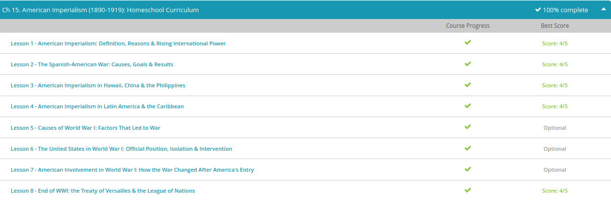

### Andrew Garber
### November 16, 2022
### American Imperialism

DONE SIGNIFICANT PORTIONS LAST YEAR: [label](../../Q3-Q4_10TH/History/Completed%20Work/A_New_Century/american_imperialism.md)

#### American Imperialism
 - Why imperialism for America in the latter 19th century? Well, we need to look back. Initially the U.S. was warned against foreign entanglement. President Washington warned against it in his farewell address. Of course, he also warned against political parties; nobody listened to him on that one either. Looking at the 19th century, the U.S. had a major civil war to keep its focus on home, and it managed to become the dominant industrial power without imperialist ambitions. So what changed? There are several factors, including something that anyone in today's world can understand. In 1893, a financial panic led to Americans experiencing a major economic depression. The government had been run by conservatives and riddled with corruption for years. After 1890, the Progressive Movement got a foothold in the government.
 - Alfred Thayer Mahan was a highly influential military historian and strategist. He argued that a modernized navy and greater world naval presence were necessary for America to holds its place in the world. Without a great navy, how could the U.S. get all of their goods to all the possible customers in the world? Mahan's writings sparked a naval arms race, which included Europe, the U.S. and Japan. Mahan even suggested building a canal through Central America.
 - The armistice that ended World War I went into effect at 11 a.m. on November 11, 1918. After four and a half years, the war was finally over, but the results remained. Devastation was everywhere. People's homes and lands were destroyed. Large areas of France had been reduced to rubble. Cities, like Flanders and Ypres in Belgium, were nearly wiped off the map. The war's human toll was even more devastating. Millions of soldiers for the Allied Powers of Great Britain, France, and the United States were killed, wounded, or missing. The Central Powers of Germany, Austria-Hungary, Turkey, and Bulgaria lost even more men. Countless civilians also lost their lives or loved ones. Now, in 1918, the Allied Powers emerged victorious, and they were ready to make Germany pay.
 - The Paris Peace Conference opened on January 18, 1919, with the goal of developing a treaty that would punish Germany and meet the goals of the various Allied Powers. Negotiating the treaty, which would be known as the Treaty of Versailles, was a long and complex process. At first, the Council of Ten, consisting of the heads of state and foreign ministers of ten Allied Powers, tried to hammer out a deal. The Council soon proved to be too large, and its members had too many conflicting opinions. By March, the treaty negotiations were being handled by the Big Four, namely, the United States, Great Britain, France, and Italy. Italy soon dropped out of the process when its representative became angry that his demands for more territory were rejected.
 - After months of debate and lots of hard work, the Big Three created a treaty with the following provisions:

    - German responsibility - According to the treaty's 'War Guilt Clause,' Germany had to claim total responsibility for starting the war.
    - Reparations Germany was required to pay damages for wartime destruction. The treaty does not specify a sum, but rather gives the Allied Powers a blank check, allowing them to decide on an amount later on.
    - Territory Parts of German territory were transferred to France, Poland, Czechoslovakia, Belgium, and Denmark. Germany also lost control of its overseas colonies.
    - Military restrictions - The German military was restricted to 100,000 soldiers. The Germans were not allowed to have tanks, armed aircraft, or poison gas. They could not import or export weapons. The German navy was also limited to 15,000 men and a few ships.
    - Occupation of Rhineland - Rhineland, in southern Germany, would be occupied by Allied troops for fifteen years.
    - The League of Nations - The treaty created the League of Nations as an international organization to maintain world peace in the future by mediating disputes between nations. It would also tackle other global issues like drug trafficking, world health, and labor. The Allied Powers were tired of war, and they wanted to avoid it completely in the future. They hoped the League of Nations would be strong enough to help them do so.  - 
 - Germany was not allowed to take part in the treaty's development. Its delegation left the Paris Peace Conference early on, knowing that their concerns and goals would never be taken into consideration. When German officials learned the terms of the treaty, they were horrified. The 'War Guilt Clause' was especially distasteful, for it brought dishonor upon their country. German Foreign Minister, Ulrich Graf von Brockdorff-Rantzau, best expressed the German view when he said, 'we know the full brunt of hate that confronts us here. You demand from us to confess that we were the only guilty party of war; such a confession in my mouth would be a lie.'

