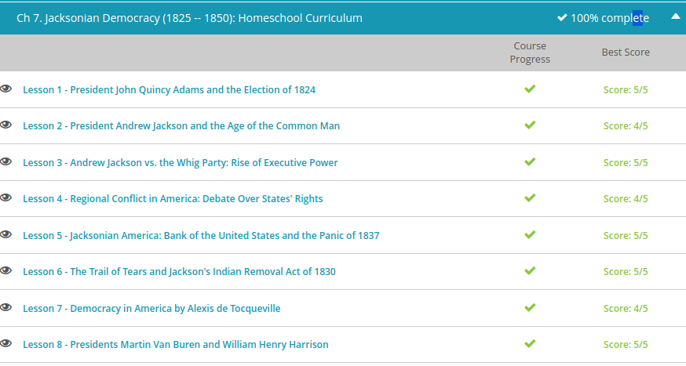

### Andrew Garber
### October 20
### Jacksonian Democracy

#### John Quincy Adams
 - Living in his father's shadow was never easy but John Quincy Adams managed a distinguished career as a lawyer, a diplomat, and eight years as secretary of state. Indeed, John Quincy Adams was one of the most influential secretaries of state in our nation's history, helping author one of the most important foreign policy decisions of our young nation, the Monroe Doctrine. But, would that be enough to make him president?
 - This meant that endorsements and political experience were important. Because of the support of two former presidents, Madison and Jefferson, the early favorite was Crawford. However, as the campaign got underway, it became clear that this was going to be very different than any other election. 
 - By the time the dust cleared on election day, none of the five candidates had secured enough electoral college votes to win the presidency. For the first time in our nation's history, there was no clear presidential winner after the election. Jackson secured 99 electoral votes and Adams 84. However, neither captured a majority of the votes.
 - Well, the failure of any candidate to get a majority of the electoral votes kicked in one of the most unique features of our presidential election system—the 12th Amendment of our Constitution. The new president would now be chosen not by the people or the Electoral College, but by the House of Representatives
 - As the time for the vote in the House neared, Clay used his considerable influence to block Jackson's ascent to the office. Clay did not like Jackson. While he had no real love for Adams, he at least felt he could strike a deal with him. He'd help get Adams's elected president only if Adams would name Clay secretary of state. Clay believed that the job of secretary of state was the perfect launching pad for his future presidential ambitions.
 - The deal concluded behind the scenes soon came to be known in the Jackson camp as the Corrupt Bargain. And, they went on the political offensive almost immediately. Because of the vibrant opposition of Jackson supporters, Adams never enjoyed a honeymoon period in the White House, and he would have to endure the political assaults for the next four years.
 - They accused Adams of being a 'big government' president who wanted a larger role for the federal bureaucracy to meddle in economic affairs.
 - No doubt the attacks hurt Adams personally and affected his ability to lead as president. While a remarkable secretary of state, John Quincy Adams was unremarkable as president. He was unable to bring his considerable diplomatic acumen to bear on any real crises or problems facing the U.S. at the time.

#### Andrew Jackson
 - Changes in state constitutions also led to more people being allowed to vote. For example, you no longer had to be a wealthy landowner. You still had to be a white male, however, so no women or non-whites were allowed, but it was progress. This change in voter qualifications would lead to record-breaking voter participation in the election. Up to 80% of qualified voters voted.
 - If 1824 was a watershed moment in American politics, the campaign of 1828 set the standard for mudslinging among the candidates. And this was no ordinary mudslinging: Adams was accused of misusing public funds, gambling in the White House, and splurging with tax money for his extravagant lifestyle. The attacks on Andrew Jackson were no less vicious. He was accused of being uneducated, reckless, and, well, a murderer! True, he had engaged in a duel years before in 1806 to protect the honor of his wife, but in those days, duels were not so unusual.
 - The candidates couldn't have been more different. Adams stayed off the campaign trail, preferring instead to remain in the White House and govern. Jackson was quite the opposite. A war hero, vaunted 'Indian fighter,' and a 'man of the people,' Jackson enjoyed the campaign trail and sought the support of the common folk, campaigning hard in the South, Mid-Atlantic, and Western states.
 - The hard work paid off. Andrew Jackson routed John Quincy Adams in the popular vote and the Electoral College, coasting to victory with 178 electoral votes to 83 and winning the popular vote by over 140,000.

#### Jackson vs Whig Party
 - 'Old Hickory' Andrew Jackson had little time to bask in the victory of 1828. He had implored the common man for their support, he got it, and now it was time to deliver. Surely the loss of his wife Rachel left an indelible mark on Jackson's first years in office, but it did not damper his popularity or his penchant for populist politics.
 - His inauguration became the first that was open to the public, and the public came in droves. It became a wild party for some of his supporters, who drank, ate, and celebrated the election of someone they viewed as one of their own.
 - Jackson did little to dissuade this perception. He took a meandering 3-week journey from Tennessee to D.C., greeted by joyous supporters all along the way, before finally emerging in front of an estimated 21,000 supporters at his inauguration on the Capitol steps.
 - While he criticized John Quincy Adams for cronyism, Jackson swept out many long-serving and high-ranking government officials in order to fill the seats with his own supporters. He rejected the accusations that this was cronyism; instead, it was more of a spoils system, where the victorious party dutifully filled important posts with ideological kin, and this was done, of course, as Jackson argued, to ensure efficiency and accountability.
 - Jackson's summary dismissing of so many career bureaucrats in the executive branch led to considerable opposition. These men he was dismissing and replacing were men of means; elites, men of status, as it were, and they would be quick to oppose Jackson on every front. Gradually, these men joined other dissatisfied factions and coalesced into a political party all their own; an opposition party, an anti-Jackson party with the strangest of names: the Whigs.
 - To the opponents of Jackson, the name was a perfect fit, as they saw Jackson's strengthening of the executive branch's power as monarchical and even mockingly labeled the new president as 'King Andrew.'
 - Both at home and abroad, President Jackson was solidifying his power. He would prove to be the most powerful president in U.S. history up to that time, largely through the force of his personality, his iron will and the support he enjoyed from the common people.
 - In the area of international affairs, Jackson couldn't hold a candle to Adams, but he was no less insistent on having the presidency lead the way in foreign policy. In one instance, a growing dispute with France in 1831 almost led to war. France refused to pay the United States agreed upon reparations for damaged shipping during the Napoleonic wars. By 1835, ambassadors were recalled on both sides and preparations were being made for a military confrontation. Ultimately it was France who blinked, and the reparations were paid.
 - Jackson, with a wink and a nod, allowed American settlers to pour into Texas, and once they arrived, trouble began. These new American settlers disobeyed Mexican law by practicing slavery, refusing to learn Spanish and disrespecting the Catholic Church, long dominant in Mexico since the time of the Spanish. Trouble was brewing.
 - By 1835, emigrants to Texas, led by Jackson's old friend Sam Houston, launched a revolt against Mexico, declaring Texas free and sovereign. Needless to say this came as a surprise to Mexico, who sat and watched as a small group of illegal immigrants in their territory declared independence!
 - Back in Washington, Jackson's executive power was expressed in his use of the veto. In a previous lesson, we saw how the veto of the Maysville Road bill shifted the balance of power away from Congress, and he would use the veto again in opposing the second charter of the Bank of the United States. These and other issues are discussed in greater detail in other lessons.

#### Regional Conflict
 - Throughout the administration of Andrew Jackson, sectional tensions were pulling at the young nation. The Northern states, with their base in heavy industry and capital, contrasted dramatically with the agricultural base of the South, a region primarily fueled by slave labor, sharecroppers, and a small-but-powerful landed gentry. Thrown into the mix were the Western states, which, like the South, had economies built on agriculture and raw materials and needed to expand in order to grow economically. To facilitate this growth, land was needed, but buying land from the federal government wasn't cheap, and Western interests sought an alliance with Southern states to reduce the cost of government land and lower protective tariffs - both moves that would strengthen their respective economies.
 - A native of South Carolina, Calhoun had designs on the presidency since his time as Secretary of War under President James Monroe, his time as a senator, and his time as Vice President under John Quincy Adams. Since 1818, there had been personal animosity brewing between him and Jackson, but they were quite close ideologically. Had it been any other time in our nation's history, the two might have got along fine in public and private life. But given the tension rising among the sections of the country, the one area they differed on, states' rights, just happened be the biggest crisis of Jackson's presidency and the one that would ultimately doom the nation to civil war: nullification.
 - Slavery was seen as necessary to the economy of the American South. And in South Carolina, where in parts the slaves outnumbered whites 2 to 1, such an idea was unthinkable. They believed, if given freedom, or at the very least, given hope of freedom, slaves would threaten the lives and livelihood of Southern plantation owners.
 - Things came to a head in November 1832, when South Carolina passed an ordinance of nullification refusing to obey the federal government's tariffs. The ordinance also gave the South Carolina legislature the power to raise an army and equip it. Jackson immediately acted; he made it clear he would send troops if necessary, and punish any act of treason by any man, any legislator, and any state. And make no mistake about it, nullification was treason.
 - Calhoun, eager to control the crisis and keep it from spinning out of control, resigned the office of Vice President and returned to the Senate for South Carolina. With Calhoun back in the Senate and Jackson not backing down, cooler heads prevailed. A compromise tariff bill was passed, promising to lower the tariffs over a period of ten years. That, and the fact that Southern radicals knew Jackson was serious about military actions, calmed the storm, at least temporarily.

#### Bank of America
 - For its part, the bank felt it provided a service to the American people and the young nation as a whole. Led by Nicholas Biddle, the bank served as a rudimentary central bank of the United States. Privately owned to be sure, but due to its size and wealth, it could effectively regulate the availability of credit throughout the nation by controlling the lending policies of state and other small banks. At the same time, banks issued paper notes, and their only concern was if the owner of these notes wished to cash them in, so to speak, and retrieve hard currency. Since most of the paper notes eventually made their way to the Bank of the United States, the bank could effectively pressure smaller banks to keep their lending policies in check.
 - Biddle's bank oversight served to reign in excessive borrowing and lending policies - policies that were all too common in Jacksonian America when the economy was booming and speculation was the rule of the day. People were looking for quick investments, quick cash and quick returns, and for much of Jackson's years in office, they were succeeding. But the Bank of the United States had enemies on many fronts. There were those who distrusted paper currency on the whole, no matter which bank was issuing it, feeling anything other than gold and silver (known as hard currency) was a disaster waiting to happen.
 - some local bankers felt Biddle was too restrictive on their own lending policies, hurting their business. New York bankers also did not like or trust a Philadelphia-based bank and felt it unfair that New York City did not have the nation's central bank in its own city limits. They would ask themselves, 'Why turn over such immense profits to Biddle?' Finally, there were those who simply distrusted the monopoly the bank had. One institution having so much power, invested in the hands of one individual, just seemed like too much.
 -  showdown was inevitable. Clay and his allies believed that the bank was too important to the United States and that voters would realize this too. What is more, Congress would seek to force Jackson to sign the bank's bill of re-charter in the months prior to the election - a move that was unnecessary since the first charter did not expire until 1836. Unnecessary, but it was politically expedient. Should Jackson fail to sign the bill, Clay and his allies believed it would clearly show how out of touch Jackson was to the interests of the country and to the realities of finance.
 - Jackson promptly vetoed it. His reasons for vetoing the bank's charter were simple: it was dangerous. It was a private monopoly. And in his view, that made a few rich and powerful people more rich and more powerful. Furthermore, many of the stockholders were foreigners (gasp!), and any bank of the U.S. should be a 100% purely American bank. It turned out that Jackson's veto was a popular move, and Jackson coasted to reelection. 
 - The war over the bank did have consequences, including the financial panic of 1837. The panic had many causes, and like most financial crises, was the result of a complicated series of events. First and foremost, 'killing' the Bank of the United States meant that there was a vacuum to be filled by state banks and other private banks. New banks rapidly sprang up, offering money to finance American expansion on every front. Banks wildly speculated on American growth, hoping for quick and large returns on projects.
 - With so much money floating around, inflation skyrocketed. The government noticed and ordered that all government lands had to be bought with gold or silver, but the hard currency never came. Banks called in their loans; many couldn't pay. Property went into foreclosure, prices collapsed, businesses shuttered, individuals went bankrupt and panic set in.

#### The Trail of Tears
 - In his dealings with Vice President Calhoun and the legislature of South Carolina, President Andrew Jackson had sided distinctly with the federal government. He was the president of all the people, had fought hard to keep the Union intact, and did not believe states had the right to nullify federal law as they saw fit. In his America, the Union came first; states' rights had to take a back seat
 - During his years in the White House, there happened to be one issue of particular importance to Jackson and the states, allowing for a close cooperation in its resolution. That issue? The removal of indigenous people from their ancestral lands and displacing them westward on to reservations. There, it was believed, they would be out of the settler's affairs. What is more, Native American people's lands could then be seized and exploited as the American people saw fit.
 - To modern eyes, the policy to remove the Native American people may seem heartless, but to those living at the time, they saw it as a humane way to solve a nagging problem. To facilitate this, Jackson introduced to Congress what was known as the Indian Removal Act of 1830. The act promised that the federal government of the United States would pay a fair price to the tribes for their lands, and the government would also be responsible for paying any costs associated with tribal relocation. Moreover, the new land to be given to the tribes west of the Mississippi would be inviolate, and the government promised to protect them against all encroachment and conflict.
 - Several tribes who inhabited lands in the South took the government up on their offer and voluntarily moved westward. For they knew, especially after the Jackson landslide victory of 1832, that resistance was futile. One tribe, however, did not budge but decided to stay and fight through legal channels. These were the members of the Cherokee tribe.
 - It didn't help their cause that gold was discovered in Dahlonega, Georgia, also an area that members of the Cherokee tribe claimed. The first gold rush of the United States simply added to the insistence that Cherokee members move out so the settlers could move in.
 - With mounting pressure from all sides, the Cherokee members tried to appeal their case to the United States Supreme Court in 1831 but were denied a hearing. In another court case, Worcester v. Georgia (1832), the Supreme Court held that Cherokee members were entitled to legal protection from encroachments by the state of Georgia on their lands.
 - The problem was the Supreme Court gave opinions with no power to back them up. When it came time to enforce the ruling, Georgia and President Jackson simply ignored it and continued preparations for the removal of Cherokee members.
 - Jackson's administration reached out to this malleable lot and brokered the Treaty of New Echota. The treaty, signed in 1835, caused a rift in the tribe. Many felt betrayed by the treaty and urged the Senate not to ratify it, but it was in vain. The Senate ratified the treaty in 1836, and the clock was ticking for the Cherokee nation.
 - Jackson's successor in the White House was Vice President Martin Van Buren, who ordered General Winfield Scott to round up Cherokee members into concentration camps and prepare them to be force-marched west. Scott carried out his duties without delay.

#### Alexis de Tocqueville
 - In the 1830s, Europe was reeling from war, revolution, and a decaying aristocracy. The old world was hampered by old ideas, and many Europeans did not hesitate to criticize their societies and cultures and look abroad for better models of government.
 - Two Frenchmen, Alexis de Tocqueville and Gustave de Beaumont, signed on to study the United States on behalf of the French government, which by then had suffered through the wars of Napoleon, the rule of the mob, and now was again in the hands of a monarch. America, to them, seemed special, and they wanted to know why.
 - Traveling to America aboard a steamer, the two men had come to take a look at American prisons - yes, prisons - but their real purpose was withheld from officials in France, and that was to study what made America special. For you see, America was an experiment, a young country full of Europe's cast-offs, its ne're-do-wells, its dreamers, its Puritans, its pious - all of those who sought a new life and opportunity in the new world.
 - Over the next nine months, the two men did their best to study America's prisons, but de Tocqueville was more interested in the society around him, and kept careful, detailed notes of what he found. Upon returning to France, de Tocqueville published Democracy in America in 1835, and it has become a classic of history, cultural studies, and American studies.
 - Quite a few things, but what struck him most was the American expression of equality, not merely in the ability of Americans to elect those who governed them, but in their income, living conditions, and personal liberty.
 - But beyond the sadness and the destitution of these two races, de Tocqueville found much to admire in the American union. He spent a great deal of time chronicling its strengths in agriculture, industry, and government. He praised America's strong judiciary, its free press, and diversification of government powers from state, to local, to federal. He appreciated how citizens could move through the social classes, marrying at will, without wealth, religion, or even regional identity being an obstacle. And most of all, he saw a force growing in America that would likely keep it stable, responsible, and out of the unnecessary wars of foreign powers. What was this force? The middle class.

#### Van Buren & William Henry Harrison
 - By 1836, Van Buren had been involved in politics for over 37 years. He knew how to win elections, he knew how to run campaigns, and he knew how to govern. He had seasoned himself politically in state and local politics early in his life, was elected to the senate, and served in Jackson's cabinet - and as his vice president. Things had fallen into place nicely for Van Buren, so much so that by 1836, he was well-positioned to ride Andrew Jackson's coattails all the way to the Oval Office.
 - By 1835, it had become obvious to political observers both inside Jackson's political party and to potential Whig opposition that Van Buren was to be the successor to the old war hero, not John C. Calhoun. Van Buren had served Jackson well, and the party handily nominated him as their candidate for president. It was the shared belief of the party that while Van Buren was his own man, he would continue Jacksonianism without Jackson.
 - Try as they might, the old anti-Jackson forces aligned against Van Buren in the Whig party had no viable candidate to stand in the election. Their strategy was to be one of divide and conquer, hoping to split the electoral vote with multiple candidates and force the election into the House of Representatives. But they were no match for the experience of Van Buren or the gravitas that Jackson lent to the ticket.
 - While an able president, Van Buren's administration was not marked by any great accomplishment or event that would set him apart from his predecessors. In many ways he kept Jacksonian policies alive, but he did seek to branch out on his own in directions differing from Jackson. It won him no great accolades from his contemporaries or in our history books.
 - As for the issue of Texas independence, which had erupted during the Jackson administration, Van Buren shocked many when he denied their petition to join the United States in 1837, seeking to ease tensions with Mexico and search for a diplomatic solution to the problem.
 - On the issue of slavery, he held it to be morally wrong but believed the Constitution justified its existence and that unless the Constitution could be changed, slavery would - and should - continue. He felt it his solemn duty to be uncompromising on this issue, adhering to the notion that the letter of the law came before personal feeling.
 - By 1840, the Whigs were better organized and prepared to deal with Van Buren. The economic depression that began as soon as he took office hurt Van Buren substantially, and the Whigs laid the blame squarely at the feet of Van Buren and at that of his party.
 - What they needed was a decent man, a good man, a war hero at the top of their ticket - someone the masses would respect and accept as tough, uncompromising, and patriotic, embodying all of the American spirit. A man such as this at the top of the Whig ticket would, they hoped, secure them the White House. To that end, they nominated General William Henry Harrison for president.
 - His wealthy, slave-owning family past was largely ignored, and instead Harrison was portrayed as a humble man of the people, born and raised in hardship, even adopting a log cabin as a symbol of his campaign.
 - Hyperbole abounded on both sides as candidates were awash with color, flags, and slogans, such as 'Tippecanoe and Tyler Too,' meant to rally the base for the former Indian-fighter Harrison in much the same way the people rallied behind Jackson. It worked. Van Buren's party could not match this rhetoric, and what is more, they had a record that could be criticized at will. No amount of slogans could erase the four years of economic woes, and Harrison coasted to victory by winning 234 electoral votes to Van Buren's 60.

