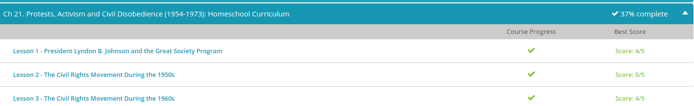
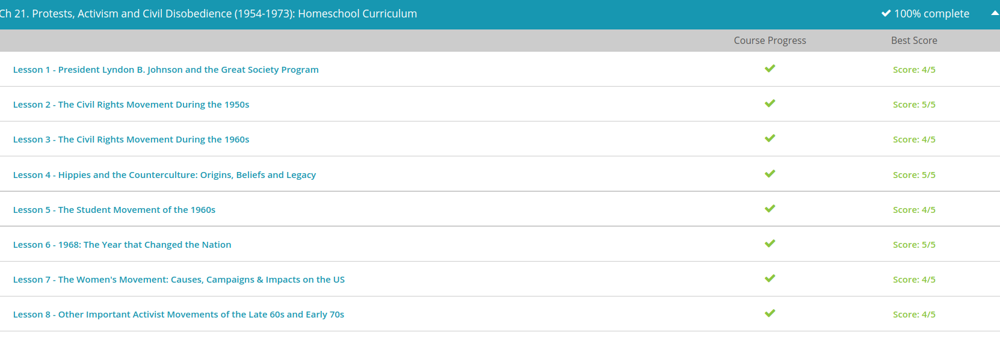

### Andrew Garber
### Protest and Activism (1954-1973)
### Dec 20-21

#### Johnson's Great Society
 - Upon assuming the presidency in 1963, President Lyndon B. Johnson was tasked with the monumental assignment of continuing the initiatives of not only President John F. Kennedy's New Frontier, but of the welfare state that was created under President Franklin Roosevelt in the 1930s.
 - Johnson was successful in implementing New Frontier goals, such as a major tax cut, the creation of VISTA (which was the domestic version of the Peace Corps) and ensuring the passage of the Civil Rights Act of 1964, which officially prohibited racial discrimination in the United States. Yet, that was only the beginning.
 - After securing a resounding victory in the 1964 presidential election over conservative rival Barry Goldwater, Johnson embarked on a mission to permanently end poverty and racial inequality within the United States. Johnson named his program of sweeping legislation (close to 400 pieces) to combat the national societal ills the Great Society. The legislation of the Great Society aimed at tackling poverty, racial injustice, urban decay, unemployment, national beautification and education reform, just to name a few.
 - Another powerful piece of anti-discrimination legislation sought under the Great Society was the Immigration Act of 1965. This Act prohibited discrimination against immigrants from the Middle East, Asia and Latin America. Improving life for Americans did not stop at anti-discrimination legislation. Johnson pursued sweeping legislation that focused on water quality, the environment, park renewal and beautification, highway safety and child safety among others.
 - The Department of Housing and Urban Development (HUD) was created in order to begin the revitalization process within the inner cities.
 - Johnson began with revamping the healthcare system. The Great Society created two programs that would be nationally funded and benefit two groups of individuals: Medicare, which supplied coverage for the elderly, and Medicaid, which provided healthcare for those with a low income. Johnson also increased the welfare program in the United States.
 - The expansion of welfare included the beginning of the Food Stamp Program and aid to those families who could claim dependents. Additionally, the Model Cities Program helped provide cleaner, safer and cheaper living conditions for low-income families.
 - Many conservative politicians believed that the Great Society had surpassed its legal right to federal power. The argument against the program rested on the notion that the federal government did not have the right to intervene in all aspects of American society. The federal government had become too involved, and the conservative fear was that this kind of intervention could not be sustained.
 - Second, the Great Society, with its 400-plus pieces of legislation, could not be continuously funded. While aspects of the program did receive funding, taxpayers became hesitant to continue funding a program that did not benefit them personally. Lastly, another major funding issue was due to the Vietnam War. The conflict had severely drained the appropriations reserved for the Great Society, which meant that many programs were left underfunded or unfunded completely

#### Civil Rights Movement
 - Simply put, the war exposed the plight of African American people in the United States as no better than the tactics used by that of Adolf Hitler. Think of a fishbowl: the United States was the figurative fish and the world was watching its every move. At that point, the United States realized it could not continue a practice of gross inequality and discrimination.
 - Now, you must remember that this was still the Jim Crow Era, which was a period where Black people were segregated from white people under the concept of ''separate, but equal.'' Therefore, many American leaders had to tread carefully to prevent causing social and political backlash from white Southerners. The Brooklyn Dodgers successfully introduced Jackie Robinson, the first Black player to play Major League Baseball in 1947. Faced with a difficult political battle, President Harry Truman successfully desegregated the armed services in 1948.
 - Yet the largest accomplishment, and maybe most significant in terms of jumpstarting the civil rights movement, was the Supreme Court decision in Sweatt v. Painter, 1950. The ruling nullified the notion of ''separate, but equal'' when the Court ordered the University of Texas to admit a Black law student into an all-white law school.
 - Nineteen fifty-five was another pivotal year for the civil rights movement for two reasons. First, Rosa Parks challenged segregation on public transportation in Montgomery, Alabama when she refused to vacate her seat to a white rider. Parks was eventually arrested for her defiance, which touched off a major bus boycott. Eventually, in June 1956, the Supreme Court ruled in Browder v. Gayle that bus segregation was unconstitutional under the equal protection clause of the Fourteenth Amendment.
 - Second, Martin Luther King Jr. gained national notoriety as a prominent voice and leader within the civil rights movement. This was largely attributed to his assistance in creating the Montgomery Improvement Association, which encouraged a massive bus boycott in Alabama following the Rosa Parks incident.
 - There are numerous additional events that were associated with the civil rights movement in the 1950s. Let's take a look at just a few. In 1956, two important organizations were created: the Inter-Civic Council in Tallahassee, Florida, and the Alabama Christian Movement for Human Rights in Birmingham, Alabama. Speaking of important associations, the formation of the Southern Christian Leadership Conference (SCLC) under the leadership of Martin Luther King in 1957 was a nationally important organization that focused on desegregation and registering the votes of Black people. The Crusade for Citizenship, launched in late 1957, was the SCLC's first major effort in enfranchising Black people.
 - Equality for African American people has always faced a form of severe opposition, but the 1950s (and 1960s) epitomized the effort of whites to enforce second-class citizenship on Black people. Throughout the 1950s, segregationists and white supremacists acted with reckless abandon throughout the South. White people forced African American citizens to flee to northern and western cities. Southern politicians in Congress passed the Southern Manifesto, which pledged support for states that resisted integration due to its questionable legality. Many states adopted anti-NAACP laws.

#### Hippies and Counterculture
 - The counterculture that developed during the 1960s was an alternative lifestyle chosen by individuals who would eventually become known as hippies, freaks or long hairs. Members of the counterculture held convictions similar to that of the New Left movement in that they wanted to overhaul domestic policy within the United States. Hippies were generally dissatisfied with the consensus culture that had developed after the Second World War and wanted to distance themselves from American society (hence the term counterculture).
 - So, how did the counterculture begin? Unlike the New Left, the origins of the counterculture had deeper roots in American society. The movement that was recognized in the 1960s as the counterculture was known a decade earlier as the Beat Generation or Beats.
 - Dissatisfied with American society, the Beats alienated themselves into a small underground movement. These individuals rejected American standards, introduced new concepts of societal norms, shunned materialism and spawned a new drug culture. Prominent leaders included Jack Kerouac, Allen Ginsberg and Lucien Carr. The Beats generally maintained a low-profile and attempted to stay away from the burgeoning political issues of the decade.
 - The Beats struggled to maintain their inconspicuousness, especially when more and more members of the Beat Generation began to tackle political issues.
 - Long hair, vibrant colors and peace signs are typically the most associated characteristics of the hippies and counterculture. However, the lifestyle was dramatically more interesting. Hippies tended to set up living quarters or communes within bigger cities. These areas were known as hippie villages or districts. Locations such as Haight-Ashbury in San Francisco, Greenwich Village in New York City and Old Town in Chicago became prime locations for hippie living. All of these locations witnessed the erection of gardens, head shops, restaurants and music venues that provided cheap and alternative ways of living.
 - Hippies encouraged the experimental use of psychedelic drugs, such as peyote and LSD (acid) to alter the mind. Individuals, such as Ken Kesey and Timothy Leary, promoted acid tests, which allowed individuals to consume acid in a peaceful environment surrounded by friends, music and good vibes. Leary campaigned for experimental drug use through his 'turn on, tune in and drop out' advertisements.
 - Hippies supported the free use of prolific drugs, sexual experimentation, gender and racial equality and a freedom from the United States federal government. However, the most important political issue of the period was the war in Vietnam. The counterculture rejected the war on two fronts. First, the hippies supported the idea of peace and harmony throughout mankind. Second, since many hippies were young adults, the males rejected the idea of registering for the draft and being sent to war.
 - Second, the idea of free drug use and sexual experimentation caught up to the hippies. Those within the counterculture began abusing drugs and eventually turned to more illicit narcotics, such as heroin and cocaine, by the 1970s. Additionally, sexual promiscuity led to an increase in rape and the spread of sexually transmitted diseases.

#### Student Movement of the 1960s
 - The beginning of the student movement, which arose during the 1960s, can be traced back to the post-Second World War era of the 1950s. The older generation, those who survived the depression and war years, viewed the 1950s as a period of security. It was a time of peace and relative prosperity for the nation.
 - Yet, the youth culture of the period viewed the era in vastly different terms. Many believed that the 1950s represented a period of complacency, stagnation and authoritarianism. The younger generation was largely dismayed with the notion that little was being done by authorities to prevent future wars from taking place. They rebelled against the notion of conspicuous consumption, which is spending in order to show off one's wealth. Additionally, the plight of African Americans was seen as an incredible social injustice that was being ignored by their elders.
 - At the beginning of the 1960s, disillusioned college students banded together to form a new and greater political movement known as the New Left. It was called this because its members separated themselves from the Old Left, which rejected change in favor of the status quo, while rejecting the extremist conservative right. The most recognizable political organization that developed within the New Left movement was Students for a Democratic Society (SDS). It is important to note that the antithesis to the New Left and organizations like SDS was the Young Americans for Freedom; while not as large as the SDS, it projected a conservative approach.
 - Members of the New Left rejected a government led by a few elected officials in favor of participatory democracy, which called for decision-making by all Americans. The belief was that this type of grassroots effort was the only way to address the growing societal ills of the United States. 
 - The first major initiative of the New Left was to address the largely ignored racial injustice and poverty within the United States. Members from SDS joined other student groups, such as the Student Nonviolent Coordinating Committee (SNCC) in 1960 and the Freedom Riders in 1961, in an attempt to eliminate the deep-seated racism and discrimination found in the Deep South. These same individuals from SDS would also join prominent equal rights groups, such as the Congress on Racial Equality (CORE) and the Southern Christian Leadership Conference (SCLC)
 - Aside from addressing racial discrimination, the student movement attempted to engage in a highly idealist program of improving American cities. In the spring of 1964, students marched into urban ghettos, Newark and Detroit to name a couple, under the Economic Research and Action Project (ERAP) in order to revitalize the area and find meaningful work for those who were impoverished.
 - The student revolt against the intransigence of the Berkeley administration became known as the Free Speech Movement (FSM). The FSM was led by student activist Mario Savio, who organized dozens of sit-ins, public protests and issued the infamous 'Bodies Upon the Gears' speech in order to protect the student's right to free speech and the ability to recruit for the civil rights movement. The student-led Free Speech Movement became a catalyst for additional protest on college campuses throughout the United States.
 - At first, students gathered to protest the war in general. They chided the war as an unnecessary display of imperialism by the United States. Students rejected the notion of protecting Southeast Asia from communist aggression, especially when there were unresolved issues within the United States that were more important. Protests generally occurred via sit-in (March 24 and 25 was the first nationally recognized anti-war sit-in at the University of Michigan) and mass gathering (the largest antiwar gathering at the time occurred on April 17, 1965 in Washington, D.C. where 25,000 students protested).
 - Protests against the war continued throughout the rest of the decade. Draft card burnings continued, defiance to induction ran rampant and large-scale displays of dissatisfaction took form, including the protests at the Chicago Democratic National Convention in 1968. The culmination of student activism against the war came in May 1970 when thousands rallied to protest the Kent State shootings, which were haphazard killings of students protesting aspects of the Vietnam War by members of the Ohio National Guard on the Kent State University campus.

#### 1968
 - Johnson was faced with a minor hiccup halfway through January of 1968. An American battle ship, the U.S.S. Pueblo, was captured by North Korea on January 23. Johnson attempted to enter into negotiations with the North Koreans, but the crew of the Pueblo was held hostage until December 23, 1968.
 -  On January 21, the North Vietnamese launched an attack against American Marines stationed at Khe Sanh. This siege witnessed extreme fighting with the siege lasting until April 8. However, this was only the beginning.
 - On January 30, the North Vietnamese, along with the Viet Cong, launched a massive offensive, known as the Tet Offensive, against major cities in South Vietnam. Saigon, Hue and Pleiku saw heavy fighting between American and North Vietnamese forces. Fortunately, American servicemen and their South Vietnamese allies were able to repel the attack and issue a staggering defeat to North Vietnam.
 - Americans at home witnessed the vicious fighting against an enemy that they were told was close to defeat. The general American discontent concerning the war was summed up by famed journalist Walter Cronkite when he concluded that the war was a stalemate and that a negotiated settlement was the only real solution left for the United States. President Johnson noted that losing Cronkite meant that he lost the American public and ultimately the war. While the Tet Offensive was an American military victory, the North Vietnamese had won the psychological battle.
 - By March, Johnson curbed troop requests in favor of turning more of the war effort over to the South Vietnamese. Simultaneously, members of the Democratic Party openly criticized Johnson for the war effort and encouraged an intraparty challenger to contend for the presidency. Democratic Senator Eugene McCarthy of Minnesota answered the call by winning the New Hampshire Primary on March 12 with 42% of the vote. Johnson, demoralized by the Tet Offensive, announced on March 31 that the bombing of North Vietnam would be halted, and, more importantly, that he would not seek re-election as president of the United States.
 - The months spanning from April to June proved to be the most violent and deadly of 1968. In April, famed civil rights leader Dr. Martin Luther King Jr. traveled to Memphis, Tennessee to support a sanitation strike led by black sanitation workers and to begin organizing for the Poor People's Campaign to bring about economic justice to poor Americans. Sadly, King was assassinated on April 4 at the Lorraine Motel in Memphis by white Southerner James Earl Ray. 
 - The horror of Dr. King's assassination still loomed large within the United States during June. New York Senator Robert Kennedy, brother of former President John F. Kennedy, decided to campaign for the democratic nomination for the 1968 presidential election. After providing a moving speech just before midnight on June 4 in Los Angeles, California, Kennedy was shot several times in the early morning hours of June 5 by Palestinian immigrant Sirhan Sirhan; Kennedy was pronounced dead on June 6. It has been suggested that the conspirator took offense to many of Kennedy's proposed Middle Eastern policies. Notwithstanding, the United States once again entered into mourning.
 - Prior to the Democratic National Convention, the Republican Party held its nominating convention for the republican challenger. Former Vice President Richard Nixon and Alabama Governor George Wallace squared off to win the nomination. Both individuals strategy for racial equality was somewhat ambiguous; however, Nixon's policy for honorably ending the Vietnam War propelled him to the top. On August 8, in Miami, Florida, Nixon won the republican nomination for the Presidential Election of 1968.
 - The presidential election of 1968 in November was extremely important in that it symbolized the beginning of a new era. After all of the war, domestic destruction and chaos and loss of leadership during the early stages of 1968, the United States needed a leader to put out the fires and restore America to greatness.
 - Republican contender Richard Nixon campaigned on a 'secret plan' for ending the war, one that included turning the war over to the South Vietnamese and gradually removing American troops. Nixon, Humphrey and George Wallace (running as a third party candidate) battled one another throughout the United States. Each individual had pockets of support throughout the nation; however, Nixon was able to pool the most support. On November 5, Richard Nixon won the presidential election by obtaining 301 electoral votes to Humphrey's 191 and Wallace's 46. While the numbers appear to be significantly spaced, the popular vote was much closer. In fact, Nixon only won the popular vote by less than one percent.

#### The Women's Movement
 - After a brief period of inertia, the women's movement gained momentum with the onset of the 1960s. Betty Friedan's book, The Feminine Mystique, helped pave the way for the new phase of women's liberation. President John F. Kennedy organized the Presidential Commission on the Status of Women, which helped usher in change such as the Equal Pay Act of 1963, making wage discrimination a federal crime, and the end of gender discrimination in the federal workplace. Moreover, women were included in the Civil Rights Act of 1964 when gender discrimination was outlawed in addition to race discrimination. However, it was not until the late 1960s-1970s that women of color were factored into the issue of feminism and women's rights.
 - The liberal feminists, sometimes known as social feminists, attempted to promote liberation and address the inequality between men and women through political tact and diplomacy.
 - The organization called for women to achieve an equal socioeconomic status with their male counterparts. NOW supported the notion of organizing small chapters for women to meet and discuss the issues of the period. The discussion of issues surrounding women became known as consciousness raising, which is the ability for women to relate the issues of their personal lives with larger national issues of gender discrimination.
 - The radical feminists of the era supported a more revolutionary and militant agenda in regard to women's liberation. Radical feminists, such as Shulamith Firestone and Judith Brown, believed that men, and the institutions created by men, had oppressed every aspect of the woman. The radical feminists overwhelmingly rejected the liberal feminist's pursuit of socioeconomic and gender equality. Instead, radical feminists called for a total revolution against men. The ultimate goal was the complete reversal of the social hierarchy where women would be above men.
 - The antithesis to the liberal and radical versions of the women's liberation movement was the conservative feminist movement. Phyllis Schlafly's writings in A Choice, Not an Echo became a leading platform for the conservative movement. The conservative movement rejected the idea of radical change in regard to socioeconomic and gender equality. Instead, the conservatives believed in two principles: maintaining the status quo of female societal roles and self-fulfillment, which was considered more of a moderate approach.
 - Women who supported the conservative idea of maintaining the status quo believed in the virtue of family. These women accepted the role as matriarch within the domestic setting and were not interested in equality because it did not affect them since they were not curious about increased roles outside of the home. Conservatives believed that women accepted their role in raising children and maintaining a dependency upon the husband. 
 -  The other aspect of the conservative women's movement was the moderate conservative goal of self-fulfillment. Developed by Helen Gurley Brown, renowned editor of Cosmopolitan, the idea centered on the basis of women achieving personal success and satisfaction. Instead of becoming bogged down in the movement to secure equality, women were encouraged to seek personal achievement and to obtain their goals without a revolution. The grey area, which makes self-fulfillment more moderate in stance, is the encouragement of women to seek personal sexual satisfaction before entering into the bonds of marriage.
 - By 1972, the legislation had reached Congress and was subsequently approved. The Equal Rights Amendment then had to be ratified by the states. Unfortunately, a major anti-ERA campaign was launched by conservative feminists, as well as anti-feminist groups. The major argument centered on the idea that the passage of the ERA would severely damage the benefits of women who were dependents. Additionally, by providing equal rights to women, the possibility of being forced to register for the Selective Service became a reality.
 - [Ainsley Hayes On the ERA](https://www.youtube.com/watch?v=2_j8du6fkQ4)
