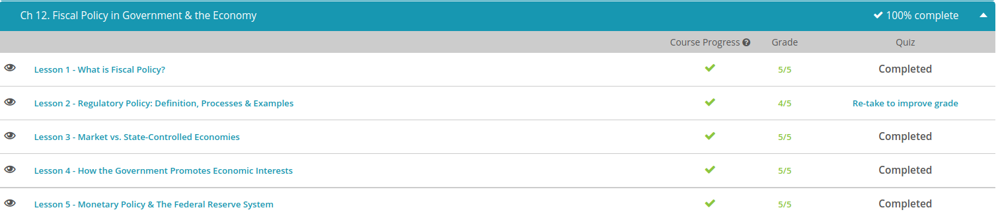

### Andrew Garber
### October 17
### Fiscal Policy

#### Fiscal Policy: Definitions and Real World Application
 - Fiscal policy is the federal government's use of taxation and spending policies to affect overall business activity.
 - In times of deflationary fiscal spending, when the government wants to decrease overall demand for goods to prevent a boom and bust scenario, the government will likely cut government spending and/or increase taxes. Having to shoulder more of the economic burden because the government isn't spending any of their revenue while also having to pay more in taxes, citizens will reduce their spending because they don't have as much money. This type of policy, however, does help the government because it allows itself to keep more of its own money, and it also generates more revenue through higher taxes.
 - In times of expansionary fiscal spending, when the government wants to increase demand for goods and get the economy out of a recession, the government will likely increase spending and/or cut taxes. Spending more and lowering taxes makes it more likely that consumers will spend more money themselves because they have more disposable income. However, this type of use increases the budget deficit, or when the government spends more money than it takes in because tax revenue is lower.
 - The government may have poor information about the state of the economy and struggle to have the best information about what the economy needs. Finding this information takes time, and so by the time the government does identify the problem, it then needs to take time to formulate a solution - not to mention the time it would take Congress to approve of the plan once one was figured out. So because of all these time lags, any implemented plan may be too late because by then the economy may have changed. Secondly, many also argue that government spending is inefficient. In theory, it sounds nice for the government to spend more and take the burden off its citizens to pay for things, but oftentimes many feel that the spending will be wasted on inefficient spending projects. This is because interest groups put political pressure on their particular spending projects that may or may not have the best interest of the economy as a whole in mind.

#### Regulatory Policy
 - The government's restriction and control over business practices is called its regulatory policy.
 - Regulatory policy is designed to achieve efficiency and equity, which requires the government to intervene, for example, to maintain competitive trade practices (an efficiency goal) and to protect vulnerable parties in economic transactions (an equity goal). Many of the regulatory decisions of the federal government are also made largely in the context of group politics. Business lobbies also have an especially strong influence on the regulatory policies that affect them.
 - A monopoly is an unfair restraint of trade, and while it is fun to have one during a game, in real life, monopolies really can hurt the economy. Thus, one of the main goals of the government in its regulatory policy is to maintain competitive trade practices for all, called an efficiency goal.
 - The government now regulates a wide array of business practices, including the elimination of competition and fraudulent product offerings. This regulation comes mostly in the form of laws and government oversight agencies. Some laws that prevent unfair trade practices include the Sherman Antitrust Act and the Clayton Antitrust Act, which were created during the Progressive Era. Government oversight agencies that oversee government regulation of business are the Interstate Commerce Commission, the Federal Trade Commission, and the Securities and Exchange Commission.
 - Another main goal of the government's use of regulatory policy is to protect the vulnerable parties in economic transactions, otherwise known as an equity goal. The government has attempted to do this many times throughout history and most notably during the Progressive Era. Acts, such as the Pure Food and Drug Acts, kept people safe when buying and ingesting consumable goods, while the Fair Labor Standard Act of 1938 set regulations regarding minimum wage, maximum work hours, and safer working conditions.
 - While regulation has done a great job in our nation's history, too much regulation can lead to overregulation, in which businesses waste resources in an attempt to comply with regulatory policy. This cost of compliance often gets passed on to the consumer in the form of higher prices. Nevertheless, governments usually over-regulate out of a desire to increase equity or promote social justice.
 - As regulatory policy has become more numerous and farther reaching, there has also been a greater push for more deregulation, or a push to repeal or reduce regulations. Deregulation usually occurs in the name of boosting economic efficiency. Although it can increase competition, deregulation can sometimes lead to chaos and hurt consumers. For example, the commercial airline industry in the United States was deregulated in the 1970s and 1980s.

 #### Market vs Planned Economies
  - Stated very simply, a market economy is one in which economic decisions, such as pricing and what to produce, are based on supply and demand. Within a market economy, it is the buying habits of the people that govern the production and pricing of goods. 
 - In a market economy, the government does not step in and tell producers what needs to be made, nor does it walk around carrying a big pricing gun. Instead, prices and production ebb and flow as the people decide what they want to see on store shelves and how much they are willing to pay for it. With this in mind, it's important to note that market economies are driven by profit. The more producers and sellers can get for a product, the more they will take.
 - Opposite of the market economy that most of us are familiar with are state-controlled economies. A state-controlled economy is referred to as a command economy. In a command economy, the government, and not the free market, controls all economic activity.
 - When speaking of command economies, communism is usually the first system to be mentioned. Again stated very simply, communism is a system of governance in which all property, resources, and productions are publicly or state owned. In other words, like a puppet master, the government pulls the economy's strings, commanding the decisions of what gets made, who makes what, who gets what, and who gets paid what.
 - With this in mind, goods within a command economy are often rationed for, what is promoted as, the good of the people. In other words, the government will decide who gets what and who needs what when. Putting it into concrete terms(which is ironic because concrete was a fixture of the rationing), a government commanding the production of bread might say it is unfair for one person to be able to buy bread everyday while others only get to buy it once a week. Therefore, they ration the bread out. Thus, the famous bread lines of the former Soviet Union, whose communist ideology saw its men, women, and children standing in winding lines, waiting for bread.
 - Although these two terms look like polar opposites on paper, in the real world, the lines between them are usually a bit blurred. With this in mind, most economists and cultural geographers leave room for what is called a mixed economy system. As the name implies, these economies are a combination of the market and the command system.

#### Protecting and Promoting Economic Interests
 - Business is the major beneficiary of the government's efforts. However, labor and agriculture also receive support as well. Let's go ahead and take a look at how the government promotes the economic interests of these three areas.
 - First, the government can provide any number of programs, such as loans and research grants, to help businesses prosper. When businesses prosper, it's win-win for our government as well because those loan repayments also boost the economy(and increase GDP, which increases tax revenue)
 - Second, the government also gives incentives to businesses in the form of favorable tax laws. Nobody likes to pay taxes because that just means having to pay more for something. However, taxes are a necessary burden. In order for the government to give out loans and provide programs for people to partake in, it needs money, and that money comes in the form of the tax revenue that it collects.
 - A tax credit is a dollar-for-dollar subtraction off a tax bill's total. For example, if a business commits to investing in something that might help the economy - say, a car manufacturer that promises to build more energy-efficient cars - then that company may get a portion of their tax bill forgiven. For example, if a company received a tax credit of $1,000, it would be a straight subtraction from the company's total tax bill. So if that bill started at $3,000, the company's new tax bill would only be $2,000 after receiving the credit.
 - Conversely, a tax deduction limits the amount of taxable income a company has. Deductions often come in the form of partial debits for certain things that a company has to pay for in order for their business to operate efficiently
 - Little by little, the government started to aid labor over the years by legislating minimum wage, maximum work hours, unemployment benefits, safer working conditions, and the ability for unions to form and collectively bargain for their wages and working conditions. Some key pieces of legislation that enacted important labor benefits were the National Labor Relations Act of 1935, the Fair Labor Standards Act, and the Walsh-Healey Act.
 - Agriculture is another economic sector that depends substantially on the government's help, particularly in the form of programs that provide subsidies and price controls. In the long run, the income of many primary producers has fallen because the global supply of food has risen. This is the result of a greater use of new technology and better crop yields, and because of new entrants into the global marketplace, such as the entry of Vietnam into the coffee market.
 - One way that the government protects agricultural interests is price control in the form of guaranteeing a price to producers in order to stabilize prices and income. A guaranteed price is a price that a government or authority commits to paying, irrespective of the output produced.
 - Another support for farmers comes in the form of a price floor, or a minimum amount that a product could be sold for. Price floors are minimum prices set by the government for certain commodities and services that it believes are being sold in an unfair market with too low of a price, and thus, their producers deserve some assistance. However, some countries may retaliate by imposing high tariffs, or import taxes, on those goods if they disagree with the price that the floor was set at.
 

#### The Federal Reserve System
 - Current Chair of the FED
 - 
 - The amount of money that is circulating at any given point must be carefully monitored. Controlling the growth rate of the money supply is called monetary policy. You may be surprised to also find out that it's not the U.S. government that controls the money supply. Rather, it's an organization called the Federal Reserve.
 - The Federal Reserve, which is the nation's central bank, has total control over the money supply. It is also an independent body. The president can attempt to influence the board most directly by being the person who appoints the chairman of the Federal Reserve. Congress can also exert its influence by threatening to merge the Fed into the Treasury Department, but as long as the Fed retains its independence, its chairperson and governors can do what they please. Hence, any talk about the 'president's monetary policy' or 'Congress's monetary policy' is inaccurate.
 - When you buy a U.S. treasury bond, you are lending money to the federal government for a specified period of time. When the Fed buys these bonds, it gives the federal government money that it can use to help the economy by providing things like healthcare, public works projects, and educational initiatives. Thus, the Fed controls the money supply with treasury bonds by continually buying and selling them. Buying the bonds puts more money into the system and selling them takes more money out of it.
 - As an incentive for allowing them to use your money, they offer you an additional percentage on your money, called an interest rate.
 - One of those safeguards is controlled by the Fed through setting a reserve requirement. A reserve requirement is the amount of money a bank must keep on hand for withdrawals at all times. Thus, the Fed controls the money supply in this regard by either increasing or decreasing the amount of money banks are required to keep on hand. If the Fed raises the reserve requirement, banks have less money to lend, which restrains the growth of the money supply. On the other hand, if the Fed lowers the reserve requirement, banks have more money to lend and the money supply increases.
 - Sometimes banks need to take out loans themselves, just as you might if you wanted to buy a house or car. The interest rate that the Fed charges banks who wish to borrow directly from it is called the discount rate. Credit, like any good or service, has a cost. When the cost of borrowing, or discount rate, falls, businesses can undertake more investment projects because they don't have to pay as much money back, as they would if interest rates were high. When it rises, businesses will undertake fewer projects.

#### Fiscal Policy
