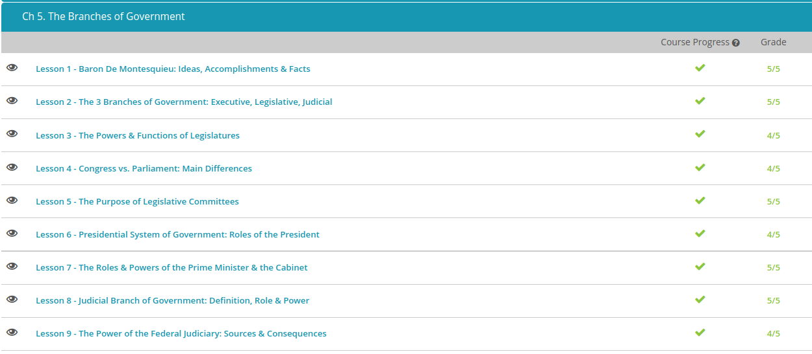

### Andrew Garber 
### September 30 2022

#### Baron De Montesquieu
 - Baron de Montesquieu was a French political analyst who lived during the Age of Enlightenment. He is best known for his thoughts on the separation of powers.
 - Born Charles-Louis de Secondat, Baron de La Brede et de Montesquieu, Montesquieu was born in France in January, 1689, and died in February 1755. His mother and father both had noble histories, and his mother had a large monetary fortune.
 - After getting a job in the Bordeaux Parliament following his Uncle and guardians death, he heard criminal cases and supervised prisons - his interest in the workings of government started at this time. He eventually sold his job so that he could focus on being a writer, and published a satirical work called *Persian Letters* and over a decade later published *Considerations on the Causes of the Grandeur and Decadence of the Romans* and then more than a decade after that published his great work, *The Spirit of the laws*.
 - In *The Spirit Of the Laws* he said that French society was divided between the monarchy, aristocracy and the commons and that the administrative power of the state should be split between the executive, judicial and legislative for maximum government efficiency and the most righteous system.
 - His radical theories introduced what would later be known as the separation of powers, one of the most fundamental frameworks for modern nations.
 - Spirit also detailed his definitions of what were, in his opinion, the three main forms of government: monarchies (which had a king and queen), republics (headed by an elected leader) and despotisms (ruled by dictators.) He wrote at length about the danger of despotisms and the detrimental effect they have on society as a whole. He surmised that governments that left the power with the citizens were the most successful. He also gave his opinions on slavery reform and the idea that women could head a state.
 - Ironically, due to the radical nature of his text it was actually banned by the Catholic Church, which in doing so actually popularized it and made it a foundational text for the leaders of the American Revolution which later led to the French Revolution and the wholesale decapitation(literally and metaphorically) of much of the Catholic Church in France.
#### The 3 Branches of Government
 - In 1787, 11 years after state representatives signed the Declaration of Independence, representatives once again met at the State House in Philadelphia. Fifty-five representatives met over the course of four months in order to draft our United States Constitution. The framers drafted the Constitution to purposely divide governing powers between several administrative branches. This way, no one branch holds too much power, and each branch holds checks and balances over the others. The framers instituted this system of government with hopes that it would last into 'remote futurity.'
 - The legislative branch was thought by many of the framers to be the most important (important dissenters to this theory include Alexander Hamilton, perhaps the greatest advocate for a stronger executive) and the most fair system that the framers could come up with, and get passed, was a bicameral legislature seats in the lower house given according to population and an upper house with equal representation regardless of state size. This leads to the not so rare case(7 states) have one representative in the lower house and two in the upper house.
 - Laws are drafted, discussed and enacted through congress, they have the power to pass legislation, approve treaties, approve the budget, approve presidential nominations and appointments and a variety of other powers. 
 - The U.S. vice president serves as the head of the Senate but doesn't vote unless there is a tie. This is one example of how the executive branch can 'check' congressional powers. As of writing(2021-2022) the senate is currently split by party-line 50-50, and Vice President Kamala Harris has broken a number of ties to secure the passing of critical legislation to her party's agenda.
 - Article II of the United States Constitution created and empowered our executive branch of government. The United States president leads the executive branch, which also includes the president's advisors, the 15-member cabinet and all federal agencies. Our president serves as our chief executive, or commander-in-chief.
 - This branch is responsible for carrying out laws. Among other significant duties, the executive branch enforces and recommends federal laws, proposes a federal budget, directs our foreign policy, commands the Armed Forces and nominates and appoints federal government officials. The president may veto or approve legislation, which serves as a check on Congress' authority. The president may also grant pardons and amnesty, which serves as a check on the judicial branch.
 - Article III of the United States Constitution created and empowered our judicial branch of government. The United States Supreme Court leads the judicial branch, which also includes all lower federal courts. The U.S. Supreme Court serves as the highest court in the nation and has the final, or supreme, say. Judicial powers include interpreting federal laws and the U.S. Constitution, deciding cases on appeal from lower federal or state courts and deciding cases involving a state-vs.-state issue or a branch-vs.-branch issue.
 - But the Supreme Court's most significant power is that of judicial review. This authority doesn't come directly from the Constitution. Instead, the power of judicial review comes from the 1803 Supreme Court case of Marbury v. Madison.
 - The judicial is perhaps the least checked branch, as there is major debate as to whether congress actually has the authority to pass rules and procedures(such as a term limit for supreme court justices) as the court could theoretically rule it unconstitutional and maintain their power.
#### Congressional vs Parliamentary
 - Legislators make up a legislature, which is the law-making body of a government. Their main purpose is to make and pass laws. However, while this may be their primary function, they may have other powers as well. Not only does a legislature have other powers, but there may also be multiple groups with similar powers all within the same legislature.
 - Some nations have what is known as a unicameral legislature, where there is one house of the legislature normally with proportional representation though there are exceptions to this.
 - In a Parliamentary system Political party makes a decision whether or not to put your name on the ballot. Most political decisions in parliamentary democracy are made by people following their party line and making very few individual decisions. Then the public votes on the candidate to officially elect them to Parliament.
 - In sharp contrast, political decisions in congressional democracy are mainly made by the people - even though support by a political party is common. Candidates for Congress have their careers, ambitions and plans looked at individually by the people and are elected mainly based on these attributes.
#### The Purposes of Legislative Committees
 - Committees are subdivisions within a legislature meant to provide a division of labor. Since thousands of bills are introduced in every session of our own U.S. Congress, no single member can possibly be adequately informed on all issues that arise. Thus, there needs to be subgroups to divide the amount of labor required to address all issues that arise.
 - In short, specialization is why committees exist - if you are particularly well-informed or interested in a specific topic, for example energy, if you were elected to the US House of Representatives you would try and join the Committee on Energy and Commerce which is one of the oldest in US history.
 - Standing committees are permanent committees in a legislature that consider bills within certain subject areas. Examples of areas for which there might be standing committees include bills that deal with the national budget, education, agriculture, or finance.
 - Select committees are temporary committees made for a singular purpose and time period, an example would be the Select committee investigating the insurrection on January 6 2021. 
 - There are also times when different parts of a legislature have to work together to ensure the passage of a bill. When different parts of a legislature work together on a committee - so, in our government, the House of Representatives and the Senate - it is known as a joint committee. These committees can be permanent or temporary.
#### Presidential System of Government
 - The president is the focal point of our federal government so much so that it is called the presidential system, where the head of the government leads an executive branch that is separate from a legislative branch, and who also serves as the head of state. This is quite different than a parliamentary system of government, where the parliament or a legislative body is elected by the people, and then the parliament names their head of government, or prime minister. The President of the United States is elected by the American people and is accountable directly to them.(Only technically, as the concept of "faithless electors" kind of destroys that system.)
#### Judicial Branch of Government
 - The judicial branch is one of three branches of the federal government. The judicial branch includes criminal and civil courts and helps interpret the United States Constitution. The judicial branch is able to do this through its special power known as judicial review and as part of the process of checks and balances between the three branches of government.
 - There are nine justices who sit on the Supreme Court. The odd number of justices is meant to reduce the chances of ties during cases, and thus for the Supreme Court to decide a case, they simply need a majority of justices to agree. Being a justice on the Supreme Court is a prestigious and powerful position. Not only is their job important, but once they are officially appointed and confirmed, they serve for life. Supreme Court justices never have to run for re-election or seek re-appointment. This gives them a lot of freedom to do the job as they see fit without consequences.
 - When the United States was just getting started as a country, the role of the judicial branch was uncertain. It wasn't until a dispute between a president and his predecessor reached the Supreme Court that the judicial branch's role became defined. This case, Marbury v. Madison, held that the Supreme Court's role was to settle questions about the interpretation of the Constitution. The way judicial review works is that the judicial branch interprets the Constitution to determine if the Constitution allows these laws and policies. Simply, the judicial branch determines whether the Constitution allows certain laws to be passed. If the Supreme Court decides that a law passed by Congress is not allowable, then the law is considered unconstitutional and is erased.

