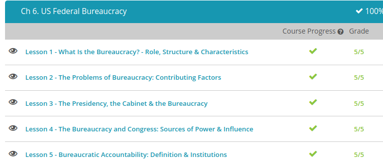

### Andrew Garber
### October 3 2022
### US Federal Bureaucracy 

#### What is the Bureaucracy 
 - The word 'bureaucracy' literally means 'government with a small desk,' and it originated in France with reference to the little desks used by the king's officials as they went about the king's business. Today a bureaucracy is a large administrative organization that handles the day-to-day business of a government or society.
 - Bureaucracies have four key characteristics: a clear hierarchy - a firm chain of command so that scale and scope of operations increases as you go up the chain - specialization, everyone in a bureaucracy has a specific job and they become an expert at it, having lots of specialists controlled by higher ranking generalists means that tasks can be completely very efficiently - a division of labor: if you break a task into its most basic component parts, those specialists can complete a "defeat in detail"(to borrow a military term) where everyone applies themselves to that which they know best - a set of formal rules. These are standards for the completion of any task and allow the specialists to work within a set of guide posts to complete tasks to a uniform standard.
 - The function of the bureaucracy is to implement the laws and policies made by elected or appointed officials, they are the ones who keep the wheels of government turning and make sure that the different functions of government are completed in concert with other agencies and departments. They also complete the administrative functions of a government, like examinations, permits, censuses and other such tasks. Finally, they regulate government activities by acting as a self-enforcing watchdog on government activities. 
 - The bureaucracy can seem harsh and faceless to many Americans, who often get fed up with its strict rules and time-consuming procedures, but in fact, most bureaucrats, people who work in the bureaucracy, are simply their neighbors and fellow citizens. Politicians, who are in fact part of the bureaucracy frequently rail against it to widespread support from the American people.

#### The problems of Bureaucracy 
 - What's the first thing you think of when you hear the word 'bureaucracy'? Red tape? Waste? Inefficiency? Excess rules? Paper pushing? It's true that America's bureaucracy, the administrative organization that is supposed to help keep the government running smoothly and efficiently by implementing laws, administrating daily business, and writing rules and regulations, isn't perfect.
 - While such thoroughness helps make sure that things are done properly, it can also make even minor tasks seem daunting. Take, for example, the process of getting a home loan through a government agency. Applicants have to fill out pages and pages of forms, and the house in question must pass a myriad of inspections. The whole procedure can take months.
 - Sometimes the goals of various bureaucratic agencies just don't match up, and they end up working at cross purposes. For instance, one agricultural service helps farmers learn how to raise crops more efficiently, while another one actually wants to pay them to leave their fields empty.
 - Sometimes government agencies seem to be doing the very same thing. Both the Drug Enforcement Administration and the Customs Service, for example, try to prevent illegal drug smuggling. There is always a chance that their agents will get in each others' way in the process.
 - The bureaucracy is supposed to promote the good of society, but sometimes agencies just keep getting bigger and start to take on a life of their own. Then they become little empires with the tendency to rack up costs, pursue vague goals, and outlive their usefulness
 - Sometimes government agencies spend more than necessary to purchase services and products. We've all read the horror stories of the bureaucracy buying $300 hammers that would probably cost $9.99 at the local discount store and of agencies building bridges to nowhere.

#### The Presidency, Cabinet & Bureaucracy
 - The Cabinet is composed of 14 secretaries and one Attorney General who head up 15 different executive departments and who advise the president on the state of the country and on matters of policy. The president appoints his own cabinet members, but the Senate must confirm his choices by a majority vote.
 - The executive departments led by cabinet members are complex, far-reaching, and powerful organizations that have their own hierarchies, bureaus, offices, divisions, and agencies. They handle matters as diverse as foreign relations (the Department of State), transportation (the Department of Transportation), public schools (the Department of Education), law enforcement (the Department of Justice), natural resources (the Department of the Interior), the military (the Department of Defense), and the economy (the Department of Commerce).
 - Independent regulatory agencies are governmental bodies that create and enforce rules and regulations for a wide variety of activities supervised by the government. These agencies implement the laws passed by Congress, establishing policies that apply the laws on a daily basis in all the various situations and circumstances of human life. Although the president appoints the heads of these agencies (with the Senate's approval), he has no direct control over them.
 - The First of these was the Interstate Commerce Commission, set up in 1887 to regulate the nation's railroads. Since that time, the ICC has been joined by such familiar organizations as the Food and Drug Administration (FDA), the Federal Communications Commission (FCC), the Environmental Protection Agency (EPA), the Occupational Safety and Health Administration (OSHA), and the Consumer Product Safety Commission (CPSC). 
 - The Office of Management and Budget, which was established in 1939, performs the critical task of implementing the president's policies throughout the executive branch and into every area of the government. The OMB, as it is usually called, is responsible for five primary activities: It develops and executes the government's budget. It manages executive agencies and departments and their finances. It coordinates and reviews federal policies and regulations to make sure they are in line with the president's goals. It assists executive agencies in communicating and coordinating with the legislature. It passes on and carries out presidential orders. The OMB, then, is essentially the president's mouthpiece and assistant in financial matters and in making sure that the executive branch runs smoothly and effectively and communicates well with the rest of the government. It is responsible directly to the president.

#### Bureaucratic Accountability  
 - America's federal bureaucracy, the administrative organization that handles the day-to-day business of the government, is huge. By some estimates, it employs about four million people. When it gets rolling, it can be hard to stop.
 - Bureaucratic accountability, which is the ability of the government, especially the president, Congress, and the courts, to hold the bureaucracy responsible for its performance and its actions.
 - The president has the power to rein in the bureaucracy in several ways. First off, he is authorized to appoint about 4,000 higher-level bureaucrats, including cabinet secretaries, top officials in bureaucratic agencies, and some assistants. These bureaucrats have the president to thank for their jobs, and they are often committed to his vision and goals.
 - Further, the president can reorganize bureaucratic agencies and departments as he sees fit. In doing so, he can get rid of duplication (agencies doing pretty much the same thing), cut down on conflict and waste, and basically keep the bureaucracy from getting too big for its britches. 
 - Finally, the president's Office of Management and Budget helps him keep a close eye on the bureaucracy. It frequently monitors and evaluates the performance of various agencies and departments, taking a close look at their efficiency, growth, budgets, and organization. Based on the Office's recommendations, the president makes decisions about budget allocations, appointments, and reorganization.
 - Congress also has the ability to pass laws that affect bureaucratic procedures. The sunshine laws, for instance, require bureaucratic agencies to be open to the public by holding regular meetings. The sunset provisions, on the other hand, set expiration dates on bureaucratic programs and the agencies that implement them, making sure that no part of the bureaucracy outlives its usefulness. Finally, Congress's watchdog, the Government Accountability Office, keeps a close eye on the bureaucracy's finances, performing audits, creating reports, and establishing standards to make sure that bureaucratic transactions are fair and aboveboard.
 - One more institution assists Congress and the president in holding back the bureaucratic team. The courts, or judicial system, make sure that the bureaucracy follows the law and protects citizens from bureaucratic abuses. The bureaucracy typically has an internal process for handling complaints, but if citizens aren't satisfied, they can appeal to the courts by suing the agency in question. The courts then decide if the agency is operating in a legal manner and in compliance with its limits and set procedures. If not, the court can impose punishment and reparation, tightening the reins of the bureaucracy even more.

