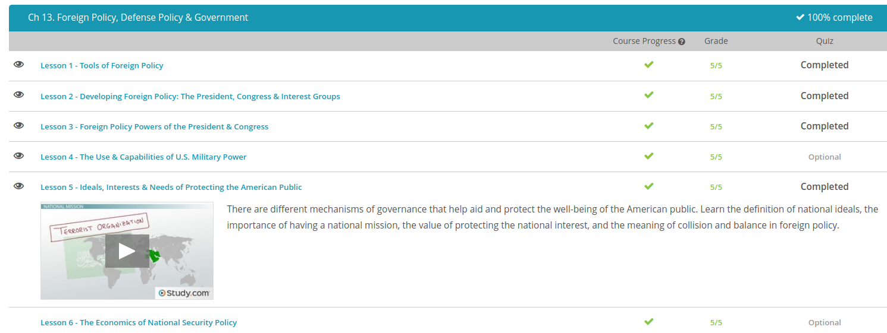

### Andrew Garber
### Defense Policy
### October 19

#### Tools of Foreign policy
 - Stated very simply, diplomacy is dealing with other nations though dialogue and negotiations. We see this all the time as leaders of countries get together for summits and then stand at a podium smiling as they tell the world all they hope to discuss and accomplish. With this scene in mind, it's important for us to know that the president is America's chief diplomat.
 - Sanctions are official orders to stop all commercial activity and trade with another country in an effort to coerce them into making political changes. In other words, if diplomacy is failing, a country will decide to hit 'em where it hurts: their wallets. Probably some of the most famous examples of this are the U.S. government's refusal to trade with Cuba or most of the world's heavy hitters refusing to do business with South Africa until they put an end to their racist apartheid policies.
 - Aside from sanctions, there are numerous other non-violent methods how a country can achieve foreign policy goals. One such way would be through propaganda. By influencing public opinion in a particular country, it can make another country less stable or it can promote opinions that benefit a certain phase of diplomatic negotiations. The goal of propaganda can also be to weaken the bargaining position of a leader who has to negotiate some kind of treaty or agreement. If a leader doesn't have popular support for his positions because he may not be in power much longer, his bargaining position is significantly weaker. Negotiating agreements is perhaps the most important modern foreign policy tool.
 - Along with sanctions, a government may also choose to employ containment. Containment is a foreign policy, adopted in 1947 by President Truman, that asserts that a nation and its ideologies will fall apart if they are prevented from spreading their influence.
 - As the name pretty much implies, collective security is countries making alliances with each other to strengthen the security of each member nation. A great example of this is the United States' special relationship with Great Britain. To put it in everyday terms, if someone messes with them, they're also messing with us.
 - Another tool within the foreign policy toolbox is deterrence. Again, as the name implies, deterrence denotes the building up of military force as a threat to warn another state against taking action. 
 - military force is authorized use of lethal force and weapons to support or protect the interests of a state. Sort of like my mom only choosing to spank us as a last resort when we'd ignored all other forms of discipline, military force is usually considered the last resort in foreign policy. 
#### The use and capabilities of US military power
 - You have conventional forces at your disposal. Conventional forces include the U.S. Army, Navy, Air Force, and Marines. They are typically deployed in the open field against similar forces, just like in World War II. When finesse is required more than brute force, you have special forces, which are highly trained units that are used to engage in unconventional missions. An example of a special forces operation is the Navy SEAL team operation that captured Osama bin Laden. These forces sometimes coordinate with covert operational teams from the Central Intelligence Agency.
 - America is  member of an exclusive club with possession of weapons of mass destruction. Weapons of mass destruction (WMDs) are so powerful that they have the ability to destroy entire populations. WMDs include chemical, biological, and nuclear weapons. Most states consider the use of WMDs as unthinkable and deter others from using them. 
 - In response to the perception that the world is a more dangerous place, the U.S., under the George W. Bush Administration, instituted a Preemptive Defense Doctrine. This doctrine basically states that the U.S. will no longer be merely reactive to acts of aggression but may commence use of force against threats as they emerge. In other words, if you are president and you believe that there is credible evidence of a threat to the security of the country, you may utilize military force before force is used against the U.S. This doctrine formed the basis of the U.S. action against Iraq in the Second Iraq War, based on the assumption, later proved to be erroneous, that Iraq possessed WMDs.
 - Military force can also be used to protect trade and American economic interests abroad. The projection of U.S. naval power helps ensure relatively safe shipping lanes. Some have even argued that the two Iraq Wars were undertaken to protect access to oil. 
 - Military force can also be used to advance political objectives. The most obvious example of use of military force for a political objective is the acquisition of territory. Historical examples of U.S. force used to acquire ground include the Mexican War and use of military force against Native Americans during the westward expansion to the Pacific coast. Use of military force has more recently been used for less controversial and perhaps nobler purposes.
#### Ideals, Interests  and Needs of protecting the american public
 - Ideals are beliefs, values and principles that guide conduct. Fundamental principles of the United States include:
    - Individual rights, including life, property and freedom of speech, press, political association and religion
    - Tolerance for different groups and different ideas
    - Democratic representation
    - Equality before the law
 - A foreign policy mission is the long-term objectives that a country wants to pursue abroad. A country's foreign mission usually closely aligns with its values.
 -  national interest is a country's pragmatic political, security, economic and ideological objectives. It's important for you to understand that the national interest, just like the overall national mission, is an end, not a means.
 