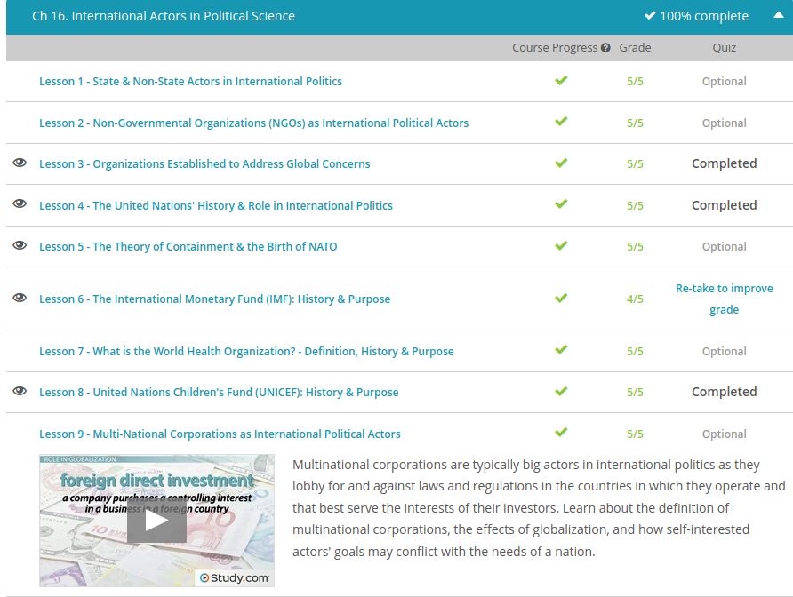

### Andrew Garber
### Nov 3
### International Actors in Political Science

#### Organizations Established for Global Concerns
 - The most basic form of international regulation is through intergovernmental organizations, or organizations comprising several different governments, working together in international cooperation.One of the most well-known intergovernmental organizations is the United Nations, or the UN. The UN was founded in 1945 after the end of World War II to prevent such a violent international conflict from ever occurring again. The strength of the UN comes from the number of nations who participate in it. When it was first founded, there were 51 members, today there are 193. By uniting nations in a common goal of peace, the UN is able to put significant economic, political, and social pressure on non-compliant nations.
 - In the last few decades, the UN has substantially grown in size and power, and it is now the leading intergovernmental organization in the world. It has six branches, each tasked with a different aspect of international administration. These oversee international security, peace efforts, economic cooperation, human rights, and environmental issues. The UN also houses dozens of specific agencies focused on specific concerns, such as global heritage, famine relief, and medicine.
 - There are many international organizations who are, frankly, trying to save the world. Many of them are not composed of cooperating nations but are instead private groups with an international focus. These are called non-governmental organizations or NGOs. International NGOs are primarily focused on advocacy, meaning that their goals are to influence policies or laws of certain countries. This can be achieved through campaigning, raising awareness, developing local support for a cause, fund-raising or presenting data to lawmakers.

#### The United Nations
 - The United Nations is an intergovernmental organization that was formed shortly after World War II. It was to become the successor to the League of Nations, which was established by the Treaty of Versailles in 1919 to promote international cooperation, peace, and security. The League of Nations ceased its operations after it was unable to stop World War II.
 - The General Assembly is the deliberative and policy-making body of the United Nations. Each member state has a seat in the General Assembly. Each member of the Assembly is entitled to one vote - it doesn't matter if you are the most powerful state on the planet or the weakest.
 - Considering and approving the United Nations' budget and setting membership financial assessments
    - Electing non-permanent members of the Security Council, members of other UN councils, as well as appointing the Secretary-General with the recommendation of the Security Council
    - Deliberating and making recommendations on general principles of international cooperation for the maintenance of peace and security
    - Conferring on any question relating to international peace and security and making recommendations, unless the Security Council is discussing the issue
    - Conferring on any issue that is within the scope of the United Nations Charter and making recommendations regarding the issues, unless the Security Council is discussing the issue
    - Conducting studies and making recommendations related to issues of international law, human rights, and international cooperation relating to economic, social, humanitarian, cultural, educational, and health fields
    - Providing recommendations for peaceful settlement of issues that may mar friendly relations between states
    - Deliberating on reports submitted by other United Nations organs

#### Nato
 - To combat the spread of communism, U.S. foreign policy functioned on the idea of Containment immediately after the war and through the Truman administration. According to the policy, the United States would do everything it could to stop the spread of communism anywhere in the world, be it through diplomacy or military intervention. This policy also inherently intended to avoid open conflict with the Soviet Union, as any military confrontation with the Soviets could possibly lead to World War III.
 - A complimentary and contemporary theory that helped spur this policy was the Domino Theory. The Domino Theory stated many U.S. government analysts' greatest fears: that if countries in Southeast Asia were allowed to develop communist governments, as China had in 1949, one-by-one the neighboring countries would also become communist, eventually shutting the U.S. out of the region and threatening the U.S. presence.
 - In 1948, with the spread of communism in Eastern Europe in mind, the United Kingdom, France, and the Benelux countries formed the Western Union Defense Organization for mutual military protection against future invasion. 
 - Almost immediately, the United States began negotiating with the Western Union and other countries in Europe and North America in the hope of creating a lasting, larger alliance opposed to the spread of communism. After a year of negotiations, the Western Union countries joined the United States, Canada, Iceland, Italy, Norway, Denmark, and Portugal in signing the North Atlantic Treaty, creating the North Atlantic Treaty Organization, or NATO, in April 1949.
 - The participating countries famously agreed that an attack on any country within the organization would be considered an attack upon them all, with a strong military response from the coalition immediately following. Within a few short years, the organization's military brass began to integrate command structures more seamlessly, breaking up the area covered by NATO into five regions. They further created region-specific plans in case of Soviet invasion and developed military installations to meet any threat, discreetly placing its headquarters in a small suburb of Paris.

#### IMF
 - The International Monetary Fund, commonly referred to as the IMF, is an intergovernmental organization that focuses on maintaining international economic stability. It consists of nearly all sovereign states in the world today and is headquartered in Washington, D.C.
 - The International Monetary Fund was legally established in 1945 and started with 29 members. More members joined as time passed, but the Cold War did prevent potential membership growth, as the Soviet Union, many of its allies and its client states did not join. In the 1970s, the IMF started to assist poor countries with concessional financing, offering financing terms more favorable than what the private market offers. The fall of the Soviet Union and dissolution of the communist bloc resulted in the ability of more states to join the IMF, and it achieved nearly universal membership in the 1990s. Today, the IMF is attempting to help create stability during the ongoing globalization process. Let's see how.
 - The IMF also engages in surveillance at the regional and global level. In conducting regional surveillance, the IMF examines polices of regional currency unions. For example, members of the European Union use a regional currency, the Euro. Aside from monitoring regional currencies, the IMF also monitors the economic outlook for specific regions and important economic issues. Regions include Asia Pacific, Europe, Middle East and Central Asia, Sub-Saharan Africa and the Western Hemisphere. Global monitoring is based on three reports: the World Economic Outlook reports, Global Financial Stability Reports and the Fiscal Monitor reports.
 - The IMF also provides technical assistance to middle-and low-income countries, which involves help with macroeconomic policies. Macroeconomic policies are concerned with the big economic picture of an economy, such as a state's unemployment, growth rate, GDP and inflation. Technical assistance is also provided to help create and implement programs to reduce poverty, manage and reduce debt and spur economic growth.
 - The IMF also serves as a lender to its members. Members go to the IMF for loans when they can't find favorable loan terms through other avenues. Two general types of financing are available to Quame's country. The IMF provides loans to help restore stability to countries with struggling economies. The funds may be used to rebuild a country's cash reserves, stabilizing an erratic currency or pay for imports. All these things will help Quame's country grow economically. The IMF also loans funds to low-income countries to help them develop economically and reduce poverty. 

### UNICEF
 - The United Nations International Children's Emergency Fund (UNICEF) was created by the United Nations in 1946 to provide food, clothing, and healthcare to the children of post-World War II Europe. In 1953, UNICEF became a permanent part of the United Nations. While its name was shortened to United Nations Children Fund at that time, it is still is referred to as UNICEF.
 - UNICEF expanded the scope of its activities in the 1960s to include advocating for and advancing children's rights to education, healthcare, and nutrition. UNICEF won the Nobel Peace Prize in 1965. UNICEF eventually expanded its scope to the struggle of women, especially mothers, in the developing world. For example, it launched its 'Women in Development Programme' in 1980. In 1982, UNICEF commenced a new children's health program that focused on monitoring growth, oral rehydration therapy, advocating breastfeeding, and immunization. 
 - UNICEF is governed by an Executive Board consisting of 36 members that are elected to terms of three years by the United Nations' Economic and Social Council. Each region that UNICEF serves is allocated a number of seats on the Executive Board, so all regions are represented. UNICEF is headquartered in New York City in the United States. There are also 36 national committees across the globe, which are nongovernmental organizations that help promote the rights of children and fundraise.
 - UNICEF takes a human rights-based approach to its activities. According to this approach, it's not a lack of resources that is primarily to blame for poverty, but rather discrimination and political choices made by those that hold power. This approach uses recognized human rights as a reference point for achieving its mission of serving the needs of children and women. It relies upon the Convention on the Rights of the Child and the Convention on the Elimination of All Forms of Discrimination Against Women as its guiding principles

 