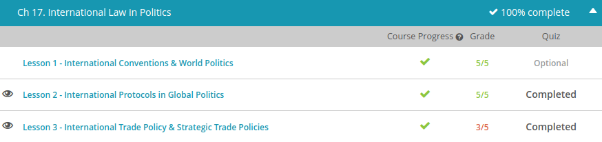

### Andrew Garber
### Nov 4
### International Law

#### international protocls in global politics
    - Hitting on the definition most of us think of when we hear the word, when speaking politically, protocol can be defined as the rules of etiquette surrounding diplomacy. Further defining this, diplomacy is dealing with other nations though dialogue and negotiations. Stating it really simply, protocol is a set of international and political courtesy rules. For instance, just like my mom taught my siblings and me to stand and greet an elderly person when they enter a room, American protocol dictates that people should stand when the President enters the room as well.
    - Alongside being a set of courtesy rules, protocol also denotes an international pledge or agreement in which countries agree to proceed or act in a certain manner. Stating things very simply, a protocol can be defined as something nations or states join together and commit to doing. With this definition in mind, protocols are often added to treaties. An example of this is the Bio-chemical Warfare Geneva Protocol, denouncing the use of chemicals in warfare. This protocol was added to the very famous Geneva Convention.
    - When speaking of this type of protocol, probably the most famous of these in recent history is the Kyoto Protocol. Having very much to do with the environment, the Kyoto Protocol is a formal and binding agreement in which industrialized countries agreed to reduce their emission of greenhouse gases. Negotiated in Kyoto, Japan, the Kyoto Protocol seeks to halt what are considered the threats of global warming. With over 190 parties taking part in this process (although lots of them haven't officially ratified it), the Kyoto Protocol is one of the best examples of countries coming together and voluntarily placing themselves under a binding agreement.

#### International Trade Policy
    - There are actually two reasons for government in international trade: political and economic. The political arguments for trade intervention are plentiful. So, let's take a look at each one.
    - The first political reason is to protect jobs and overall industries from international business. For example, if countries were able to flood the U.S. market with their sugar, then domestic producers would lose business. Jobs, along with the entire sugar industry, could be lost if the sugar was able to be purchased cheaper in continuous amounts.
    - Another key political reason for government intervention in trade is the protection of national security. Sugar would not be classified in this example, but any defense-related industries, such as semiconductors or aerospace, would garner protection.
    -A more vengeful reason for intervention would be due to political retaliation as part of a foreign policy. For example, when the U.S. develops tension with a foreign country over terrorism support or the handling of an international crisis, one weapon in the government's arsenal is to set up trade restrictions to potentially hurt the country's economy.
    - One of the biggest reasons is to protect new industries from fierce competition. This matter is especially important to the industries in developing countries who might not survive up against larger nations. One problem with this ideology is that protecting infant industries can sometimes create inefficient organizations that are not suited to eventually enter the global business arena. For example, due to protectionism means, Brazil was able to develop the world's tenth largest auto industry, due to tariff barriers and quotas. Unfortunately, when those protectionary means were removed, Brazil's foreign imports dramatically increased, and the auto industry could not compete with their competition's products.
    -The last economic reason for government intervention is based on the strategic trade policy, which cites that, due to scale economies, only a few large global firms would survive if not for government intervention. Many economists are concerned with this type of intervention, in that it hurts companies that are early entrants into a new product. Also, many economists feel that a government that pushes to have their domestic firm remain in control of an industry is acting selfishly and will end up hurting global competitors and the global economy.
    - 