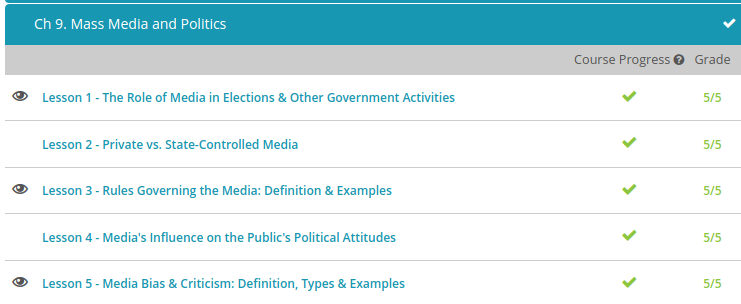

### Andrew Garber
### October 7 2022
### Role Of Media in Politics

#### The role of Media in Elections & Government Activities
 - The mainstream media, sometimes referred to as the Fourth Estate, plays an important role in elections and in monitoring government activities. Increasingly, social media is becoming an active player in this role.
 - Mainstream media has been referred to as a ''watch dog'' that protects democracy and citizen rights and holds politicians and government accountable for what they say and do.
 - Mainstream media (MSM) has been traditionally referred to by society as the Fourth Estate, an entity that acts as a check on government and holds politicians and government agencies accountable to the public.
 - More recently, social media has become increasingly relied upon by the public for news and information. This has led to social media being dubbed by society as the Fifth Estate, a source for information and news outside of mainstream media with the same role of watchdog.
 - MSM and social media are both imperfect conveyers of fact because they decide what to share with the public and what political issues to emphasize, therefore limiting available information on other topics of equal importance. However, social media has been more vulnerable to abuse by their owners and by those who use them to advocate for their point of view.
 - Government agencies and politicians use social media to connect directly with the public instead of relying on debates, news releases, and mainstream media reporting. Using social media, especially the platforms provided by social media giants Facebook and Twitter, allows them to frame their own message without going through a fact-checking process.
 - Dog whistles, which are coded communications that a politician uses to rile up their base, have become normalized and when media covers these types of communications it gives the politician the ability to reach a wider audience of supporters. This insidious form of communication is supported by the First Amendment except when it can be proven that has incited violence (a high bar to clear, as proven by fmr President Trump's actions on Jan 6)
 - In 2020, the Congressional Subcommittee on Antitrust, Commercial, and Administrative Law, which is part of the Judiciary Committee, published its recommendations for regulating social media in a paper titled ''Investigation of Competition in Digital Markets.'' The recommendations outlined in the paper included breaking up large social media platforms, requiring social media to give equal, unbiased time and coverage of issues, prohibition of mergers for dominant platforms that already take up a large share of the market, and strengthening of antitrust laws.

#### Rules Governing the Media
 - The U.S. Constitution's First Amendment guarantees freedom of the press. The press doesn't have absolute freedom, but there are only a handful of laws and regulations that limit the media. There are even laws in place to guarantee openness of information and media freedom, such as the Freedom of Information Act, or FOIA. The FOIA is a federal law that gives you the right to access information from the federal government. The media makes many FOIA requests to gather information for news reports and articles.
 - The Freedom of Information Act is a powerful tool for citizens and the media to get information on the workings of government, and investigate supposed corruption at the source.
 - The main restriction on the print media comes in the form of defamation. Defamation occurs when someone prints or broadcasts information that is untrue and harmful to someone else. Claims of defamation are usually civil cases governed largely by state law. However, there are some counties and some U.S. states with criminal defamation laws.
 - Defamation includes both libel and slander. Libel is defamation of character in print, audio, or video publications. Slander is defamation of character through unrecorded gestures or oral remarks. When someone is defamed through libel or slander, that person can sue the media outlet directly for damages.

#### Media Bias & Criticism
 - Media criticism is the act of closely examining and judging the media. When we examine the media and various media stories, we often find instances of media bias. Media bias is the perception that the media is reporting the news in a partial or prejudiced manner. Media bias occurs when the media seems to push a specific viewpoint, rather than reporting the news objectively. Keep in mind that media bias also occurs when the media seems to ignore an important aspect of the story. 
 - Bias by omission means the media leaves out one side of a story, or one aspect of a story.
 - Bias by omission is often associated with political news stories. Sometimes the media reports a story from a liberal political viewpoint, neglecting to include facts that support a conservative point of view. Or perhaps the media reports a story from a conservative political viewpoint, without including facts that support a liberal point of view.
 - This type of media bias is often used to describe entire newspapers or networks. For example, FOX News has been heavily criticized for having a conservative bias, meaning the network reports stories from a largely conservative point of view without including other political viewpoints. CNN, on the other hand, has been accused of having a liberal bias. A common nickname was once the 'Clinton News Network.' 
 - This is similar to bias by selection of sources. Bias by selection of sources means a media outlet leaves out sources that support an opposing point of view. For example, the media might quote conservative sources without including a proportional number of liberal sources.
 - Now let's take a look at bias by story selection. This is a pattern of reporting news stories that coincide with a specific agenda. This type of bias occurs when a media outlet regularly reports stories that support only one political point of view. For example, a newspaper might print a story or study released by a liberal group while passing on similar stories and studies released by conservative groups. Or, a television station might cover an allegation of corruption against a liberal political candidate while neglecting to cover a similar allegation against a conservative candidate.
 - This is similar to bias by placement. Bias by placement occurs when a news outlet prominently places news stories that coincide with a specific agenda while 'burying' those that represent an opposing point of view. Unlike bias by story selection, the news outlet reports on differing political viewpoints. However, one viewpoint is highlighted, with opposing views receiving less time or print space.
 - That brings us to bias by labeling. This type of media bias occurs when a news outlet uses critical labels to identify politicians or groups or fails to label biased points of view. For example, during the 2012 presidential election, several news outlets picked up news stories that labeled candidate Mitt Romney as an 'elite,' a 'snob' or 'not one of us.' Common coverage included Romney's finances and lifestyle, without including the elaborate lifestyles of other candidates. Additionally, Romney was often labeled according to his Mormonism religion and as 'ultra-conservative,' which can certainly connote identification with the extreme right, when Romney himself claimed to be a moderate Republican.
 - Lastly, let's examine bias by spin. This type of media bias occurs when a media outlet interprets a story in one way, to the exclusion of other interpretations. Unlike other forms of media bias, bias by spin involves a reporter's tone and subjective comments about objective facts.
 - Spin is also what members of a communication team do on a campaign, for example Lis Smith, communications director for Pete Buttigieg's Presidential Campaign became famous for having a talk to everyone policy such that any news story could have their campaign's comment first.

