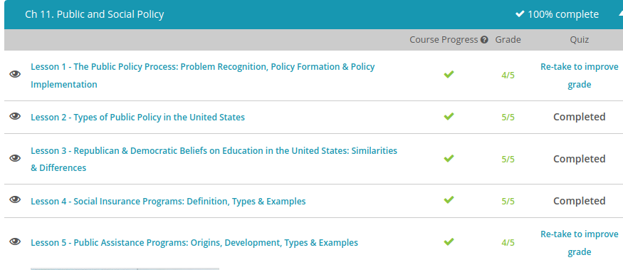

### Andrew Garber
### October 13 2022
### Public Policy

#### The Public Policy Process
 - Public policy is government-set objectives relating to the general health and welfare of the public, and actions taken to accomplish these objectives. It can range from providing for a national defense to ensuring the safety of our food supply.
- The public policy process is the manner in which public policy is formed, implemented and evaluated. Mary will use the rational-comprehensive model of policy making articulated by political scientist Charles Lindblom to formulate and implement her policy. The rational-comprehensive model breaks the policy process down into four distinctive phases:
    - Problem identification
    - Identification of policy options
    - Selection and implementation
    - Evaluation

- The rational-comprehensive model requires that policymakers do their due diligence before they decide on a course of action. This is because policy is just like any other tool; some policies work well for some problems, but not for others . Proper problem identification includes defining the root cause of the problem so you can apply the right tools to fix it. 
#### Types of Public Policy
 - Domestic Policy: policies that are generally confined to problems and issues inside the country. They generally address the health, safety and welfare of the citizens of the country. Domestic policy can be further broken up into several sub-categories, including:
    - Social policy, which relates to issues that affect the general welfare of everyday citizens.
    - Public health policy, which focuses on the health of the population and includes both efforts to promote and protect the health of the population.
    - Education policy, which is concerned with the education of citizens.
    - Environmental policy, which focuses on regulating the manner in which we interact with the environment, such as clean water and air regulations.
    - Criminal justice policy, which is concerned with law and order.
    - Economic policy, which attempts to create and maintain a strong economy. 
    - For an example of economic policy, see (video)[https://www.youtube.com/watch?v=P4h0_bz2Qew&list=RDLVEmdRVcChzCA&index=2]
 - Foreign policy is the strategic plan of a government in dealings with other countries and international actors on the world stage, ranging from the United Nations to a terrorist cell. Execution of foreign policies involves several activities, including:
    - Diplomacy, which is the management of relations between foreign countries through peaceful means, including negotiation, treaties and foreign aid.
    - Defense policy, which involves providing for the international security of the country through the projection of military power.
    - Intelligence involves gathering information concerning potential international threats to a country.
    - Trade relations, which involve managing economic relations with another country.
#### Republic & Democratic Education Beliefs
 - A political ideology is a system of beliefs and values that is used to justify political actions. 
 - Conservatives generally value individual freedom and individual responsibility. Republicans believe that individual effort through fair competition justifies socio-economic inequality in society. Winners deserve to win because they work hard and play by the rules society sets. Losers deserve to lose because they did not put forth sufficient effort and may have even broken the rules, such as social, moral or legal rules. *
 - Another important part of the conservative ideology regarding education is the role of government. Conservatives tend to want a limited government, where most government action is undertaken at the state and local levels. This is especially true with education, where conservatives, pretty much want to extremely limit, if not eliminate, the role of the federal government in education policy.
 - Progressives believe that a significant amount of inequality today is a result of socioeconomic conditions that are out of the control of individuals, such as privilege and discrimination. According to Progressives, winners and losers are not always determined by individual effort and choices. For example, it's a lot easier for the white son of a millionaire to succeed than it is for the black daughter of a single mom living in the inner city of a large urban area with poor schools and a high crime rate. Progressives argue that the respective resources and environments of these two kids gives an advantage to the white boy and a disadvantage to the black girl. These circumstances, of which neither child has much, if any, control over, creates an uneven playing field where success is not based solely on individual effort. *
 - While conservatives want to see a limited role of government in education, Progressives believe in an expansive role of government in education. According to Progressives, the government serves an important role in ensuring equality of opportunity by leveling the playing field through eliminating unfair advantages due to privilege or discrimination. Progressives believe the federal government's role is important to ensure equality for all citizens regardless of their state of residence.
 - Progressives support federal funding for education, including special programs targeted to at-risk students. One such program is Head Start, which, among other things, provides early childhood education to children from low-income families that can't afford preschool education that middle and upper class children often receive.
 - They also supports uniform academic standards to ensure that all students are educated to a minimal level of competencies in core educational areas, such as reading, writing, math and science. One recent example of this is the Common Core developed by the National Governors Association Center for Best Practices and the Council of Chief State School Officers.

 *This is a generalization, and more moderate or extreme factions of both parties sometimes have greater policy differences between themselves than the other party 
#### Social Insurance
 - Social insurance is a set of insurance programs that are administered by a government. Just like private sector insurance, they provide benefits upon the occurrence of certain insured events. For example, unemployment insurance provides benefits if an insured person becomes unemployed. Additionally, just like private sector insurance programs, only citizens that contribute to a social insurance program are eligible to receive benefits from the program. Social insurance benefits are funded in the United States through payroll taxes.
 - In fact, you'd be hard pressed to find an individual who is not covered by at least one of these programs at one point in their lives. The federal government's social insurance programs are authorized pursuant to the Social Security Act of 1935, as amended. Programs include Old Age, Survivors, and Disability Insurance (OASDI); Medicare; and unemployment insurance. The programs are often collectively referred to as the Social Security program. 
 - The Social Security Act provides for Social Security Old Age, Survivors, and Disability Insurance benefits (OASDI). These benefits consist of monthly payments to qualified beneficiaries who have retired upon reaching a minimum age, are disabled and unable to work, or are qualified families of deceased wage earners. Benefits are not needs-based. Instead, a wage earner and her family is qualified so long as the wage earner has been employed for a minimum amount of time and made contributions to the Social Security system through payroll taxes.
 - Medicare is a social insurance benefit added to the Social Security program in 1965 and is funded by a payroll tax. Medicare provides healthcare benefits for eligible participants. Most people who are at least 65 years of age are eligible, as are younger people suffering from certain disabilities, such as kidney failure.
    - Medicare benefits are divided into four parts:
    - Medicare Part A covers inpatient hospital care, hospice care, and skilled nursing facilities.
    - Medicare Part B is a supplemental insurance program that can be purchased by Medicare recipients to cover physician services, outpatient hospital services, lab tests, physical and occupational therapy, and home healthcare. It's funded by premiums paid by beneficiaries as well as general tax revenues.
    - Medicare Part C, which is also called Medicare Advantage, is an optional alternative to Medicare Parts A and B. Part C involves private sector Medicare plans, such as health management organizations, preferred provider organizations, or traditional fee-for-service plans. The government pays a fixed fee to the plan for each Medicare participant enrolled.
    Medicare Part D is the newest addition to Medicare. It provides coverage for prescription  - drugs.

- During the tenure of President Barack Obama, numerous expansions have been made to Medicaid program. This expansion was made through the Affordable Care Act (ACA), commonly known as Obamacare. One of the key goals of the ACA was to make sure that as many people as possible had access to affordable healthcare. Prior to the ACA being implemented, there were roughly 46.5 million people without health insurance. The ACA tried to make healthcare more accessible by providing subsidies for health insurance premiums and by implementing cost-sharing reductions.
- As a result of the ACA, more than 20 million people received health insurance in the period between 2010 and 2016. The law was considered highly controversial due to the individual mandate. The individual mandate enforced that you had to pay a fee equal to 2.5% of your annual household income in case you had the money to pay for healthcare, but choose not to do so. For most households, this meant paying almost $700 annually. While Congress repealed the individual mandate when Republicans won control of Congress after the 2016 election, the attempt to repeal the ACA was not successful.
 - Unemployment benefits offer temporary payments to eligible people who have lost their jobs. Each state administers its own program subject to federal standards and approval from the Secretary of Labor.
#### Welfare programs
 - Public assistance programs, commonly called welfare, are government programs that seek to provide aid to certain classes of individuals who are poor. Not everyone is eligible for public assistance, even if they meet the poverty requirement. This is because the traditional philosophical view of American public assistance is that it should be provided only to the deserving: those people who are not responsible for their own poverty, such as children, the aged, and disabled. Fit, working-aged adults without children tend to be out of luck and deemed undeserving of most public assistance. 
 - Before the 20th century, public assistance was pretty much left in the hands of local government and private charitable organizations. However, the Industrial Revolution and urbanization of the United States outpaced the ability of these local efforts. State governments started public assistance programs, but their efforts collapsed under the weight of the Great Depression. The federal government stepped in at this point. The current federal public assistance programs can be traced back to the Great Depression of the 1930s and the Social Security Act of 1935.
 - You can break public assistance down into two categories: cash and in-kind assistance. Cash assistance is the transfer of money from a government-funded program to an individual, such as a welfare check. In-kind assistance, on the other hand, is the transfer of a benefit to a recipient not involving cash. Food Stamps and health care are examples of in-kind benefits.

