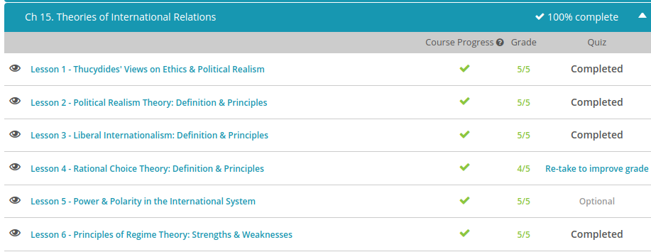

### Andrew Garber
### Nov 2
### Theories of International Relations

#### Thucydides
 - Thucydides lived in the Greek city-state Athens, the indisputable center of philosophy and education in the ancient world. Many Athenian philosophers are remembered as the founders of specific areas of study, and Thucydides is no exception. He was one of the first to devote serious attention to the political theory of international relations and established important philosophical precedents in this field. Seriously.
 - To understand Thucydides' ideas about politics and international relations, we first need to understand his stance on ethics, the philosophy of morality. Now, when we think of morality, we tend to think of philosophies that strictly define right and wrong. But Thucydides had a slightly different take. Throughout his writings, this philosopher meticulously examined the cause and effect of actions, but only as they could be observed. His focus was on observable data, which actually makes him a very early precursor of the scientific method, although he never would have used that term. So, instead of seeing morals as some universal, natural force, Thucydides saw them as the effect caused by a person's physical and social environment.
 - To Thucydides, ethics was a study of how various factors in a person's life influences their morality. So, he actually had a fairly skeptical viewpoint on morals. Right and wrong were therefore not simply universal truths, but something slightly different to each person, depending on your experiences. Other factors, such as social influences and basic needs like hunger, also influenced each person's beliefs about right and wrong. Now, Thucydides does not specifically say that there are no universal truths in terms of morals, but again, he is much more skeptical than other philosophers. 
 - Thucydides' main focus as a philosopher and historian was the politics of international relations. And he lived at a great time for this - Athens had recently become so powerful that it started conquering the other Greek city-states, resulting in the Peloponnesian War between Athens and Sparta during his lifetime. From his observations and research, Thucydides came to the conclusion that political behavior is driven by fear and self-interest. Modern intellectuals call this idea political realism, and Thucydides is considered one of the founders of this school of thought.
 - According to political realism, and according to Thucydides, this process means that states are most concerned with their own security, so priorities become things like collecting resources and building armies. This leads to the assumption that the international community is always naturally antagonistic. States can, of course, learn to work together, but the default setting is fear and rivalry.

#### Political Realism Theory
 - You can think of realists as the cynics of international relations. Realists make the following assumptions about the world:
    - Humans by nature are selfish. We don't do things to be nice; we do things because it serves some sort of selfish need - even if that is to make us feel good about ourselves.
    - The international system is one of anarchy. It's a dog-eat-dog world where might makes right.
    - The most important actors in the world are states and conflict is the natural state of relations among states.
    States act in rational ways for the purpose of serving their self-interest.
    - The only check to a state's power is another state or group of states. In the anarchy of international relations, anything goes unless someone is powerful enough to stop you.
    - Morality in the international system is to be treated skeptically and can be counterproductive to successful political action. The overriding goal is survival by any means, and the ends justify the means.
 - Like many theories, realism has evolved over time. Neorealism, also called structural realism, focuses on the structure and distribution of power in the international system rather than on the power characteristics of individual states. A key concept in neorealism is that of polarity, which describes the power structure in the international system.
 - A multipolar system is one in which there are several different centers of power and each state in the system pretty much acts independently of each other. Europe in the 19th century is an example.
 -  - A bipolar system is one in which there are two states serving as power centers of relatively equal strength. Other states in the system gravitate to one of two power centers in alliance and are dominated by it. The Cold War between the Soviet Union and the United States is an example of a bipolar system where the world was pretty much divided between those in alliance with the USSR and those in alliance with the United States.

#### Liberal Internationalism
 - 
 - (Not this kind of liberal)
 - Liberal internationalism is a set of related concepts on how to best organize international relations between states and non-state actors that emphasizes a belief in international progress, interdependence, cooperation, diplomacy, multilateralism, and support for international political structures and organizations. 
 - liberal internationalism is optimistic about the world and actors engaged in international relations. The theory assumes that we can move past the violence and anarchy of the international system through cooperation. Liberal internationalists believe that humans by nature are good, or at least, not naturally aggressive. They also have faith in the good that both domestic and international organizations and institutions can do.
 - International liberalism believes in the power of cooperation and interdependence. Violence should be a tool of last resort. Instead, states should cooperate through diplomacy with a focus on multilateralism where all countries work together on an issue that affects them to reach a solution. For example, the Kyoto Protocol on climate change was a multilateral effort attempting to reduce greenhouse gas emissions to stem man-made climate change.
 - Proponents of international liberalism also believe that international law and international commerce are tools that will help create peace and order in international relations. The idea is that trade creates interdependence; if you must rely on a trade partner for important goods and services, then you are less likely to get into a war with them. International law is also seen as a source of stability and a force for peace.
 - Like any theory, liberal internationalism has both strengths and weaknesses. Critics argue that liberal internationalism is utopian, naive and ignores the cold, hard realty of the international system where powerful states act unilaterally to advance their national interests. Proponents can point to examples of successful cooperation, such as the growing international consensus on human rights. Critics also correctly assert that there are no formal enforcement mechanisms that can compel states to follow international law because of state sovereignty. Proponents note that the vast majority of time the vast majority of states honor international law.

#### Regime Theory
 - Regime theory argues that power in the international system is distributed across different states and non-state actors, such as nongovernmental organizations, intergovernmental organizations, and multinational companies, that cooperate on specific issues based upon a set of international regimes. Regimes are the manifestation of cooperation among actors in the international system.
 - International relations scholar Stephen Krasner defines an international regime as 'principles, norms, rules, and decision-making procedures around which actors' expectations converge in a given issue area.' You can kind of think of a regime as a rulebook that covers a specific area of international relations upon which most of the players agree to abide with general areas of cooperation
 - Our current system of international trade can be viewed as a regime. The principles, rules, and norms of our international system of trade revolve around free trade, globalization, diplomacy to resolve trade issues, and the creation of international trade organizations, such as the World Trade Organization. Most states participate and cooperate within this trade regime.
 - Hegemonic-stability theory (HST) is one of the most well-known power-based approaches in international regime theory. In a nutshell, HST suggests that a hegemon, a country that dominates all others, will encourage the development of regimes that are consonant with its interests to develop support for its policies without the expense of forcing its will on other states using more costly means, such as economic sanctions or force. For example, the United States has played a large role in fashioning a global financial and economic system that aligns with its interests and values. Of course, the hegemon will not permit the formation of any regime contrary to its interests. In our example, the U.S. will not permit an economic regime that discourages free trade.(Even though some leaders *Tim Ryan* are not total free traders, they largely support the principles of it)
 - The knowledge-based, or cognitivist, approach looks at the formation of preferences among states. Unlike the power-based or interest-based approach, the knowledge-based approach does not assume that state's preferences are fixed and choices are rational. Instead, the knowledge-based approach takes into account things such as values, perception, and the current state of an actor's knowledge. Regime formation is thus a product of the distribution of knowledge among actors, dominant and emerging norms and values of actors, interaction among actors, as well as socialization and learning among the actors in the international system. The theory's assumption that preferences are not fixed and its focus on the powerful impact of ideas on actors means that the role of non-state actors can be taken into account to a much greater degree. 
 - Like the power-based approach, the interest-based approach also assumes that actors are rational. However, according to the interest-based approach, rational states will engage in long-term cooperation to achieve absolute gains. Importantly, this means that a state may give up a short-term advantage to cooperate with another state or group of states to maintain cooperation with each other for a larger, long-term gain. For example, a country that has a lucrative trade relationship with another country may agree to participate in sanctions against its trade partner, thus foregoing short-term gain, in order to maintain cooperation with other states for long-term security and long-term trade growth cultivated by cooperation.

