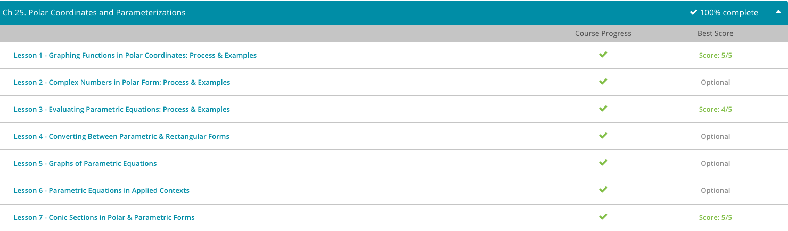

### Andrew Garber
### October 24
### Rational Functions & Difference Quotients

#### Finding Slant Asymptotes of Rational Functions
 - rational functions, which are functions made up of the division of two polynomials. This means that your graphs now consist of several curves. You also have unseen lines that divide your curves. These unseen lines that divide your curves are referred to asymptotes. Recall that, to find your vertical asymptotes, you find at what points your denominator equals 0. To find your horizontal asymptotes, you look at the degrees of your numerator and denominator polynomials. If the degree of your denominator polynomial is larger than the degree of your numerator polynomial, then your horizontal asymptote is y = 0. If the degrees are the same, then your horizontal asymptote is the division of the leading coefficients.
 - For example: 
    - $f(x) = x / x^2$
    - $f (x) = 2x^4 - 3x^2 / 3x^4 + 5x - 9$

 - The first rational function has a horizontal asymptote of y = 0 because the degree of the denominator polynomial is greater than the degree of the numerator polynomial. Also, this function has a vertical asymptote of x = 0 because, if we set the denominator equal to 0 and solve, we will get x = 0.
 - The second rational function has a horizontal asymptote of y = 2/3 because the degree of both the numerator and denominator polynomial are the same. We got y = 2/3 by isolating the leading coefficient of the numerator polynomial and the leading coefficient of the denominator polynomial.
 - For example, if you see a function like this. $y = x^2 + 3x +2 / x - 2$ What happens then? We get what is called a slant asymptote, an asymptote that is neither horizontal nor vertical but slanted.
 - To find a slant asymptote when the degree of the numerator polynomial is exactly one more than the degree of the denominator polynomial, you need to perform the division that is shown by the rational function. The slant asymptote is then your answer, not including the remainder if there is one. Remember that dividing polynomials is very similar to dividing large numbers. We take each term with its coefficient and variable and treat it like a place value when dividing numbers. For example, the constant is treated like our ones place, the term with the x variable is treated like the tens place, the term with the x^2 variable is treated like the hundreds place, and so on.
    - Example: $f (x) = x^3 - 5x / x^2 + 1$
    - Performing the polynomial division, we get: $x^3 + 0x^2 - 5x + 0 / x^2 + 0x +1$
    - Subtract out the first result $(x^3 + 0x^2 + x)$
    - $-6x + 0 R$
    - Our answer is x with a remainder of -6x. Our slant asymptote is the answer without the remainder part, so y = x is our slant asymptote.

#### Geometric Interpretation of Difference Quotient
 - The difference quotient takes two points from our function, points (x, f(x)) and (x + h, f(x + h)), and plugs them into this formula
 
 - Because we have moved beyond algebra now, we leave the x and h variables as they are. When we plug these points into our formula, we keep them as they are. We won't be replacing them with numbers. We will expect to get an answer that most likely will have these variables in it. Sometimes, our answer will work out so that we get a nice number, but most times you will get an answer with variables in it. So, as long as you keep your like terms together, you will be okay.

