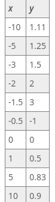

### Andrew Garber
### October 27 2022 
### Graphing Rational Functions

#### Graphing Rational Functions that have linear polynomials: Steps + Examples
 - First, rational functions are simply fractions of polynomial functions. A linear polynomial is a polynomial whose highest exponent is 1. So a rational function with linear polynomials is a fraction of two polynomials whose highest degree is 1. Polynomials are those expressions that combine terms consisting of variables and their coefficients with pluses and minuses.
 - An example of this would be $y= x / x+1$
 - A shortcut to identifying this type of function is just to look at the x. If both the numerator and denominator have an x with no exponent shown then you are looking at a rational function with linear polynomials. This is the type of function we will be graphing in this lesson.
 - The first step in graphing these functions is to look for asymptotes. We need to look for vertical asymptotes, the x values that make the function invalid, and horizontal asymptotes, the y value that the graph reaches for at the far left and far right of the graph.
 - To find our vertical asymptotes, we need to ask ourselves, what situation will make our function invalid? In other words, what situation causes the function to produce an error? Let's think about this. Our function is essentially a fraction. What do we know about fractions? What is the one number that we can never divide by? It's 0. So that tells us that if our denominator equals 0, then our function will produce an error.
 - So, at what x value does our denominator equal 0? How can we figure that out? We find this value by setting the denominator equal to 0. Our function is f(x) = (x) / (x + 1), and our denominator is x + 1. Setting this equal to 0, we get x + 1 = 0. Solve for this by subtracting 1 from both sides, we get x = -1. So our vertical asymptote is the vertical line at x = -1. We can draw this on our graph with a dashed line at x = -1.
 
 - The next thing we look for is our horizontal asymptote. To find our horizontal asymptote, all we need to do is to look at our coefficients next to our variable x. In our case, the coefficients are 1 for the numerator and 1 for the denominator. So that means our horizontal asymptote is y = 1/1 = 1.
 - To know exactly how our graph will look, we are going to plot some points on either side of the vertical asymptote as well as further away. To calculate these points, we plug in some x values and then just evaluate them to find our y. We will write these in table form so that when we are done, we can easily plot them on the graph.

#### Analyzing the graph of a a rational functions with linear polynomials
 - he domain of a function consists of all the allowable values for the independent variable x. Similarly, the range of the function consists of all the possible values for the dependent variable y. If we look more closely at our graph, we see that it approaches, but never actually arrives at, certain values in x and y. In this case, both portions of the graph function are asymptotic to those values. Any asymptote that crosses the x-axis parallel to the y-axis can be referred to as a vertical asymptote of the function. Similarly, any asymptote that cross the y-axis parallel to the x-axis is referred to as a horizontal asymptote.
 - Not all asymptotes found in the graphs of rational functions are parallel to the x- or y-axis. They can occur at any angle. These asymptotes are referred to as slant asymptotes, or sometimes oblique asymptotes. In fact, slant asymptotes arise in the last case mentioned for finding horizontal asymptotes. This is the case where the largest exponent found in the numerator is one degree larger than the largest exponent found in the denominator

 