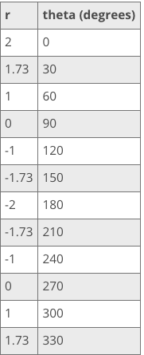

### Andrew Garber
### February 21 2023
### Polar Coordinates and Parameterizations

#### Polar Coordinates
 - Now that you are very familiar with your Cartesian coordinates of (x, y) points on a grid with an x-axis and a y-axis, it's time to introduce you to another way of plotting points. We call this the polar coordinates. Instead of (x, y) points, we now have (r, theta) points.
 - If you are picturing a circle in your head, then you are on the right track. The r stands for radius, or distance from the origin of our grid, and theta stands for the angle the radius makes with the horizontal axis. On the Cartesian coordinate grid, the horizontal axis is the positive x-axis. The grid for the polar coordinate system looks a bit different. We still have our x- and y-axes. But instead of vertical and horizontal making little squares, we now have circles for each radius step and different lines coming out from the origin marking different angles.
 - For our polar coordinate (r, theta) point, however, we go about plotting differently. We begin at the origin of our grid. The r tells us how far away to go from the origin. Now, the theta tells us how far to swing our radius in a counterclockwise direction from the positive axis. For example, the point (1, 20) in our Cartesian coordinate system is plotted by going 1 step to the right on the x-axis and then 20 steps up. However, the point (1, 20 degrees) in our polar coordinate system is found by going a distance of 1 step away from the radius and then swinging this radius 20 degrees from the positive x-axis.
 - To find the r value from a Cartesian point, we use the Pythagorean theorem, a^2 + b^2 = c^2, where c is the hypotenuse. In the triangle that we drew, side c is equivalent to the radius side, the r side. The a and b sides are then the x and y sides. If we solve the Pythagorean theorem for c and then substitute in our equivalent values, we get r = sqrt(x^2 + y^2). Our theta comes from the definition of tangent as opposite over adjacent. The side opposite our angle is the y side, and the side adjacent to our angle is the x side. So, we have theta = the inverse tangent of y over x (theta = tan^-1 (y/x)).
 - Let's graph r = 2 cos (theta) to see what we get. We will make ourselves a table of values for r and theta. We choose various angles and then calculate to see what we get for r. We then plot these polar coordinates to see what kind of shape develops. We get this table of values:
 - 
 - 

#### Evaluating Parametric Equations
 - Parametric Equations. Recall that these are equations that define a rectangular equation in terms of just one parameter. Parametric equations take a rectangular equation with two or more variables and defines each variable in terms of just one parameter. So if we have a rectangular equation with x and y variables, then we could have a parametric equation such as x = 4t - 3 and y = 3t. Our parametric equation includes one equation to define each variable. So, if we had one equation with three variables, such x + y + 3z = 2, then our parametric equation will consist of three defining equations, one for each variable.
 - How do you evaluate parametric equations? It is very similar to evaluating the rectangular equations that we are so used to seeing. For example, to evaluate y = 5x + 4, we plug in values for x to find our values for y. To evaluate a parametric equation, we plug in a value for t into both equations to solve for x and then y. Then, we can make a note that for a given parameter, the parametric equation gives these values for our rectangular variables. For example, for x = 4t - 3 and y = 3t, if t = 1, then x = 1 and y = 3. We simply plugged in our value for t into the equations of our parametric equation, and we found our x and y values.
 - Example: Evaluate t^2 and y=t-5 for t=2
 - To answer this problem, we plug in our value for t into both of our equations. We get x = 2^2 and y = 2 - 5. We then solve each equation to find our answers of x = 4 and y = -3. We can say that for t = 2, our answer is the point (4, -3) or x = 4 and y = -3.

#### Conic Sections in Polar & Parametric Forms
 - Let's first look at the standard form of these equations. These are the equations we are all used to seeing. You know, the ones with x's and y's. So, in standard form, the one equation that covers all our conic sections is this one:
 - 
 - Yes, from this one equation, we can get all the different shapes. Our coefficients will just be different for each shape. We won't go into the math involved in transforming this equation into the specific equations of each of our shapes, but this equation transforms into the following equations for each shape:
 - 
 - All of these equations have both an x^2 and a y^2. The little a and b determine how big or small our shape is. You will more often than not come across the individual equations for the shapes. You will hardly come across the general equation. But when you get to higher math, it will be good for you to know where your individual equations came from. Look for patterns to these equations when you are trying to memorize them.
 - Next, let's go into parametric form. Recall that in parametric form we take our standard equations and then define each of our variables in terms of just one parameter. We will call this one parameter t for this video lesson. We have the following for our parametric form equations:
 - 
 - The key to remembering these equations is to link our individual standard form equations with various trig identities because that's where these parametric form equations are derived.
 - Now, let's look at our final polar form of our conic sections. This one is the simplest. Remember that in polar form, we write in terms of our radius and our angle. When we graph, we first graph the radius, how far away our point is from the origin, and then we find the angle our radius makes with the positive x-axis. So instead of having equations in x and y, we have equations in r and theta. In polar form, we have just one equation for our polar form that covers all of our shapes. It is this one:
 - 
 - The little e here stands for the eccentricity of our conic section and the little l stands for half the latus rectum. We call it the semi-latus rectum. Again, e is 0 for a circle, between 0 and 1 for an ellipse, 1 for a parabola, and greater than 1 for a hyperbola.

