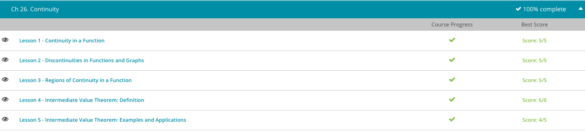

### Andrew Garber
### Feb 24
### Continuity

#### Continuity In A Function
 - Some functions are continuous, while some are discontinuous. There are polynomials, like f(x)=x^4 + x^3, plus so on and so forth. These are continuous paths; you can trace the entire function, the entire f(x) without lifting your finger from the paper.
 - If we look at another example, like the absolute value of x, it's the same thing. Even at x=0, you can trace the entire path without lifting your finger from the paper. So f(x)=|x| is another continuous function.
 - Let's say that f(x)=round(x). So for values of x=0.4, if I round 0.4, I get zero. If I round 1.2, I get 1. If I round 3.7, I get 4. Well here, if I graph f(x) as a function of x, I have to pick my finger up. In fact, I need to pick my finger up an infinite amount of times the further and further I go out. Because every time I go from 0.4999999 to 0.5, I need to lift my finger up. So round(x) is discontinuous. It's not a continuous function.
 - Let's look at f(x)=1/(x - 1). Now If I graph this out, I actually have an asymptote at 1. So as x approaches 1 from 0 lets say, f(x) goes to negative infinity. Well at some point, I'm going to have to lift my finger up, put it back down at positive infinity once I get to the other side of 1 (just greater than 1), and I can trace the rest of the function. So again, this is discontinuous because I have to lift my finger up from the paper.
 - 

#### Discontinuities in Functions and Graphs 
 - Each point is a single point in time. I keep saying the word point, so I should call these point discontinuities or, if you want to get a little more formal, removable discontinuities.
 - Now, for example, what about f(x) where f(x)=1 when x<1 or x>1, and f(x)=2 for x=1. So at that single point, x=1, our function has the value 2, but everywhere else, the function has the value 1. So this is a point, or removable, discontinuity at x=1.
 - 
 - Let's look at a mathematical example. Let's look at a function where f(x)=1 for x less than or equal to zero, and when x>0, all of a sudden, f(x)=x. We're looking at the right side of the graph now, and at the point x=0, we have a jump in our function.
 - Another example is the function of the floor of x, f(x)=floor(x). So floor(x) rounds down, such that the floor of 4.1 is 4 and the floor of 4.9 is 4 and floor of 4.999999 is 4. You can also think of this as cutting off everything to the right-hand side of the decimal point. If I graph floor(x), then I get a stair-step pattern. If x<5 but x is greater than or equal to 4, the value is 4. If x=2.3, then f(x)=2. Now, at every integer, the function jumps, so you can think of it as having an infinite number of jump discontinuities.
 - Okay, we have point discontinuities and jump continuities, so what happens if the UFO takes a nosedive and actually goes into the Earth, maybe toward the center of the Earth. And, all of sudden you see him way up out in space and flying back down to check out crops again. Maybe there's some kind of wormhole. At that moment in time, we have a vertical asymptote. So this type of discontinuity, where we're lifting up our finger and putting it down somewhere else, is called an asymptotic discontinuity.
 - Let's look at a mathematical example. Say f(x)=1/x, and we know that the graph looks like this. At x=0, we have a vertical asymptote, and we have an asymptotic discontinuity. What about the function f(x)=x^-2? Well, this is really saying that f(x)=1/(x^2). We have the same problem; this is not defined at x=0.
 - 
 - Let's look at something a little more complex. This graph looks very busy. I don't know what this function is, but let's just analyze the graph. At x=1, there's a point discontinuity, or removable discontinuity. At x=2, we have a jump discontinuity, because the function jumps at that particular value of x. At x=3, there is no discontinuity. Sure, there's a kind of corner in the graph, but I can trace this line without lifting my finger up, so this is continuous. And, at x=5, we have an asymptotic discontinuity, where the function approaches minus infinity and then reappears at infinity. So we have all three kinds of discontinuities: points, jumps and asymptotic.

#### Regions of Continuity
 - 
 - Let's take a look at an example. Say you have some function: y=f(x). That function equals 1 when x < 1, it equals 2 when x=1 and for all values of x greater than 1, the function f(x)=3. So this is as if you have your UFO and all of a sudden at time t=1, it jumps up to the Moon and then to Mars, instantaneously. Then he just hovers out at Mars for a while. In this case, we say that f(x) has two regions of continuity. One for x < 1 and one for x > 1. Because if I'm tracing the line f(x) for all values less than 1, I don't have to lift my finger up from this graph. The same thing after 1. For any x greater than 1, I can trace this line without lifting my finger from the graph.
 - Let's look at another example. Say you're given f(x) equals:
    - x when x < 2
    - 1 when x=2
    - x when 2 < x < 3
    - 3 when x > or equal to 3
 - 
 - I don't know where the regions of continuity are, so I'm going to graph this out. First, I'm going to graph x for all values of x less than 2. At x=2, f(x)=1. That's a jump, so I know that I have a region of continuity for x < 2, but not at x=2. From 2 to 3, my function f(x) equals x again. At 3 and values greater than 3, my function f(x)=3. I can trace the entire function without lifting my finger from the paper. So for all values greater than 2, my function is also continuous. I've got two regions of continuity here: x < 2 and x > 2. At x=2, there's this point or removable discontinuity.

#### Intermediate Value Theorem
 - As another example, let's say you have some f(x) that's continuous for all values of x. And you know that f(1)=9, and f(3)=52. Because f(x) is continuous, somewhere between 1 and 3, f(x) is going to equal every number between 9 and 52. So if I ask you, does f(x)=47, you can say f(x) will equal 47 for some x value between 1 and 3, simply because f(x) is continuous, and because of the intermediate value theorem.
 - Let's review. The intermediate value theorem says that if you have a function that's continuous over some range a to b, and you're trying to find the value of f(x) between f(a) and f(b), then there's at least one solution, x, between a and b. In the case of our jets, we have our function - our altitude as a function of time - that's continuous between 0 and 20 minutes. We know that if f(a), our altitude at time zero, is sea level, and f(b), our altitude at time 20, is 30,000 feet, then there's going to be some point in time where we're going to pass between every single altitude between 0 and 30,000 feet. At some point in time, we will go through 6,000 feet. At some point in time, we will go through 12,000 feet, and so on.
 