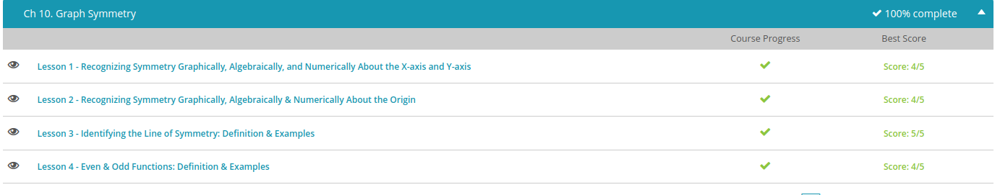

### Andrew Garber
### October 7 2022
### Graph Symmetry

#### Recognizing Symmetry
 -In mathematics, symmetry is a perfect replica of a line or shape, only it is reversed. When looking at symmetrical lines in algebra, there are different ways that symmetry can occur. For right now, let's look at symmetry across the x- and y- axes.
 - A point on a line is also known as an ordered pair and is identified by the x- and y-coordinates. Similar to map coordinates, no two coordinates are exactly the same. The x-coordinate is the first number in the ordered pair, and the y-coordinate is the second number in the ordered pair. You can use these numbers to identify symmetry.
 - Okay, so what about equations? Can you tell if an equation will produce a symmetrical graph? Yes! Let's use the following equation as an example: x^3 + y^2 = 4. In order to see if the equation is symmetrical along the x-axis, replace the positive y with a negative y. We know that y squared is the same thing as y times y, and negative y times negative y gives us a positive y. Therefore, these equations will give us the same numbers. If you end up with the same equation that you started with, then the equation is symmetrical across the x-axis.
 - The axis or line of symmetry is an imaginary line that runs through the center of a line or shape creating two perfectly identical halves. In higher level mathematics, you will be asked to find the axis of symmetry of a parabola.
 - We can identify the line of symmetry graphically by simply finding the farthest point of the curve of the parabola. This is called the vertex, the point where two lines connect. If the parabola were a hill, the very highest point on that hill would represent the vertex of the parabola, or if the parabola were a valley, the very lowest spot in the valley would represent the vertex of the parabola.
 - Even and odd functions can help you quickly identify the graphs of functions and vice versa. A function is an equation that shows a unique relationship between the x and the y values.
 A function cannot have the same x value for a y value. For example, if you were shipping several packages that were the same size and weight, you would probably pay more money for the distance the package has to travel. In this case, the x value would be the distance the package has to travel, and the y value would be the cost of the package. Since the package can only travel one distance at a time and can't be in two places at once, this would be an example of a function. You would only pay one price for one package to go a certain distance, no more. In this case, the cost would be the y-axis and the distance would be the x-axis. The further the package would have to travel, the more you would have to pay. You have a unique x value for a unique y value. You wouldn't have to pay two different prices for the same distance traveled.
 - An even function is when the left half of the graph exactly reflects the line or shape on the right half of the graph, as shown in this graph.
 - 
 - An odd function is when the left half of the graph exactly reflects the line or shape on the right half of the graph, except it is upside down, as shown in this graph.
 - 
 - 