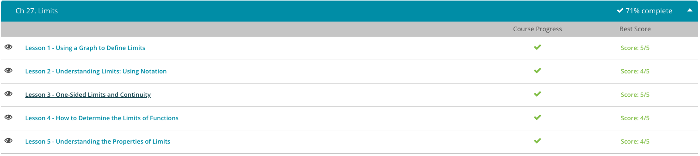

### Andrew Garber
### March 2 2023
### Limits

#### Defining Limits with Graphs
 - So a pendulum, let's say your watch (you're trying to hypnotize somebody) is swinging back and forth along a string. Now I can take a look at the location along x as a function of time, and maybe when I release it from zero, the time here is zero. The pendulum goes through and makes one swing, and on the other side the time is about 6. So if I graph the location of the pendulum and mark out the time that it's at a particular location, I might get something that looks like this:
 - 
 - As we move forward in time, we know that the location of the pendulum will follow this line, and at t = 4, we expect it to approach and reach this point. If we start at 5 seconds in, say here, we can reverse time, and if we reverse time, we see that the pendulum will approach the same point where it was at t = 4. The limit of the pendulum location is right here at t = 4.
 - I can graph that another way. If I graph the location as a function of time, my graph approaches the location at t = 4 from both the left-hand side where time is increasing and the right-hand side where time is decreasing. I could say that the limit of the position as we approach the time of 4 is here:
 - Let's look at the function |x|. The graph of |x| looks like a V, and you know that as you approach the value x = 0, f(x) will equal 0. Say f(0.1) = 0.1, f(0.01) = 0.01, f(0.001) = 0.001, f(0.00000001) is. . . well, you get the idea. If we approach it from the other side, we get the same behavior. f(-0.1) = 0.1, f(-0.01) = 0.01 and so on and so forth. In both cases, the value of this function is approaching zero as we go to x = 0.
 - 
 - What about a function that is defined piecewise? So for a piecewise function, such as f(x) = x for x less than or equal to zero, and f(x) = 1 for x greater than zero, as we approach x = 0 from the left-hand side, our function approaches the value of zero. As we approach x = 0 from the right-hand side, our function approaches the value of 1. This might be something to consider a little later on. What about the function, f(x) = 3(x)2? Well, there's a limit at, say, x = 2.
 - As we approach x = 2 from the left-hand side, f(x) goes to the value of 12. As we approach it from the right-hand side, the value of f(x) also goes to 12.

#### Understanding Limits using Notation
 - 
 - Limits in math are just like in the real world. They're what happens as you approach something. Say you want to find the limit of f(x) as x approaches 2. One way you can do it is to look at what happens to values of x as you approach 2. Let's say that at 2, f(x) is undefined. But what happens as we approach 2 from, say, the left-hand side? As we approach 2 from the left-hand side, f(x) seems to be moving toward 4. If we approach it from the right-hand side, for this particular function, it also approaches 4. So we might write that the limit of f(x) as x goes to 2 is 4.
 - 
 - You can do this for a lot of functions. For example, f(x) = 10(7 + x)^(1/3) for x does not equal 1 and f(x) = 1 when x = 1. What is the limit as this function approaches 1? Let's write this out in a horizontal table. At zero, f(x)=19.13. As we increase x, f(x) is also increasing. It looks like f(x) is approaching 20.
 - On the other side of the line, it also seems like the value of f(x) is going to be 20 at x=1. So here we would say the limit as x goes to 1 of f(x) is equal to 20.

#### One sided limits and continuity
 - What can we learn from our tree line? First, limits can be different when you approach a point from the left- or right-hand side. These are called one-sided limits. A mathematical example of this might be the function f(x) where it equals x for x < 1 and it equals x + 1 for x ≥ 1. This is a lot like our earthquake example. For values less than 1, f(x) = x. At 1, this line jumps because f(x) = x + 1. At this point here, we have a limit approaching 1 on the left-hand side that's different from the limit approaching 1 from the right-hand side. So let's look at the limit from the left-hand side.
 - Before the earthquake, the path was continuous, and before the earthquake, the limit as x approached some number, let's call it C, was independent of which side you took the limit. So you could approach the tree line from the left-hand side and get to 100 feet, and you could approach the tree line from the right-hand side to get to 100 feet. This was true across the whole path. After the earthquake, we had a discontinuous path. In particular, the limit of the elevation as we approached the tree line was undefined. Instead, we had to approach the tree line from either the riverside or the tree side, and those two limits were different by about 20 feet.
 - We're now ready to give a formal definition of continuous. First, we will define a function f(x) to be continuous at a point a if the limit as x approaches a equals f(a). This implies both a is in the domain of f and we approach the same value f(a) as x approach a from the left-hand side and the right-hand side. We have already seen that one-sided limits might not be equal. It is also possible that one-sided limits are equal but f(x) is still not continuous at a. For example, suppose f(x) = (x2 - 4)/(x - 2).
 - 
 - At a = 2, the limit as x approaches a from the left-hand side and the right-hand side both equal 4. So the limit exists and is 4. However, a = 2 is not in the domain of f because we cannot have 0 in the denominator. On the graph, we see a hole akin to a pothole in the middle of the road. So f(x)' is not continuous at a = 2. This is called a removable discontinuity.

#### How to determine the limits of functions
 - So let's talk for a minute about calculating limits. Let's look at the function f(x) = (x - 3)sin(x) + 10. Let's find the limit of this function as x approaches 3.7. To do this, let's first recall properties of limits. We have an addition property that might be useful here. This says that the limit as x approaches C of some sum of two functions is equal to the limit of each one of those functions taken separately and added together. This is our divide and conquer property. We have another divide and conquer property when looking at products. This says that if you want to take the limit of two functions that are multiplied together, you can take the limit of each one of those functions separately and multiply the answer together. Again, this is divide and conquer.
 - Why is it that sometimes you can write the limit as x goes to some number like C of f(x) is equal to f(C)? And more importantly, when can you not use this rule? Well, the trick is in continuity. All of these functions (the trig functions that are defined, the square roots when they're defined, polynomials, rational functions) are continuous functions. When you have a continuous function, the limit of that function, as you approach some number like C, equals the value of that function at C. So this is just what we said before: the limit as x goes to C of f(x) equals f(C). There's no jumping here. If you graph it, your finger always stays on the paper. So it makes sense that as you approach some number, you're going to hit that number; there's no discontinuity.
 - If I look at a function like f(x) = x3 * (cos(x+3))2, I know that this is a continuous function. I can graph it. I also know that everywhere this function is defined. So I know that if I want the limit of f(x) as x goes to 9.1 of this function, I can just plug in 9.1 for x (remember to switch your calculator to radians). When I do that, I calculate that the limit of f(x) as x goes to 9.1 is roughly 601.2.
 - Let's now look at continuous functions as x gets bigger and bigger or smaller and smaller. This is called finding the limit as x approaches infinity or finding the limit as x approaches negative infinity, respectively. For many continuous functions, like f(x) = x3, as x approaches infinity, f(x) might just keep getting larger or smaller. In these cases, we say the limit either equals + ∞ (positive infinity) or equals − ∞ (negative infinity). For other functions, like f(x) = 1/x, as x approaches infinity (or negative infinity), the function f(x) approaches 0. We then have a horizontal asymptote at y = 0. 
 -
 - In fact, for any natural number n, the limit of f(x) = 1 / (xn') as x approaches infinity (or negative infinity) is 0. Let's save this fact for later.
 - One more important example is the function f(x) = arctan x. The graph of arc tangent (a.k.a. inverse tangent) has two horizontal asymptotes, namely y = π/2 and y = - π/2. This means the limit of f(x) = arctan x as x approaches + ∞ does not equal the limit as x approaches − ∞.

#### Understanding the Properties of Limits
 - Let's say that we need to find the limit of f(x) as x goes to some number, like 3. Recall that a limit is what f(x) is going to approach as x goes to 3. This limit can be one- or two-sided. If you go from the left side and it's equal to one thing, and if you go from the right side and it's equal to something else, then it's a one-sided limit. If these two values are the same, then it's a two-sided limit.
 - Before we actually get into finding the limit, let's take a look at some of the properties that might help us find limits. The first properties of limits are fairly straightforward. These are the addition property and subtraction property. They say that the limit of some sum, like f(x) + g(x), as x goes to some number, like 3, is equal to the limit, as x goes to that number, 3, of f(x) plus the limit, as x goes to 3, of g(x). You've got the first function plus the second function. So this means that we can find the limits separately and just add them together.
 - Let's consider our function h(x) = x + 3. What is the limit, as x goes to 3, of h(x)? I can use the property of addition to say that the limit of x + 3 as x goes to 3 is equal to the limit of x as x goes to 3, plus the limit of 3 as x goes to 3. In this case, I'd find that the limit is 6. 
 - The second property of limits is the product property. This says that the limit, as x goes to some number, like 3, of a product or a multiplication of two functions, like f(x) * g(x), is equal to the limit as x goes to 3 of f(x) all times the limit as x goes to 3 of g(x).
 - The final property is the division property. Here, if you're trying to take the limit of one function divided by another function, it's equal to the limit of the top function divided by the limit of the bottom function. So if you have the limit as x goes to 3 of f(x)/3, that's like saying the limit as x goes to 3 of x, divided by the limit as x goes to 3 of 3, which is just 1.
 - Let's now use these properties to examine rational functions. A rational function looks like f(x) = p(x) / q(x) where p(x) and q(x) are both polynomials. Because polynomials are continuous, the division property implies f(x) is continuous at every point that q(x) ≠ 0. The limit as x approaches any point a will therefore equal f(a).
 - For example, let f(x) = (2x2 + x - 1) / (3x2 - 2x + 4). By the division property, the limit as x → 3 equals f(3):
 - But what about the limit as x approaches infinity? In this example, both p(x) = 2x2 + x - 1 and q(x) = 3x2 - 2x + 4 diverge to ∞ and ∞ / ∞ makes no sense. Here's what we can do to get a definite answer: We will use the property.
 - We can find the limit as x approaches infinity by first multiplying the numerator and denominator by 1/x2. Then we can use the above properties to evaluate the limit. This clever trick can be used to find the limit at infinity of any rational function. It also demonstrates how the above properties combine to calculate more complicated limits.

