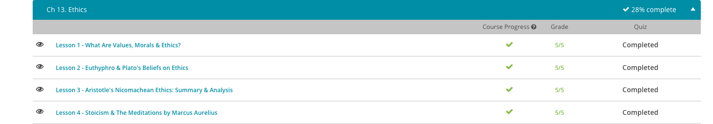
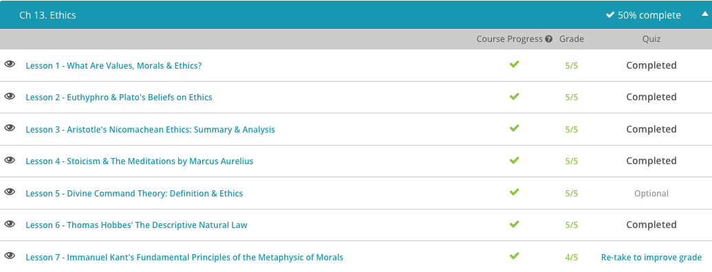
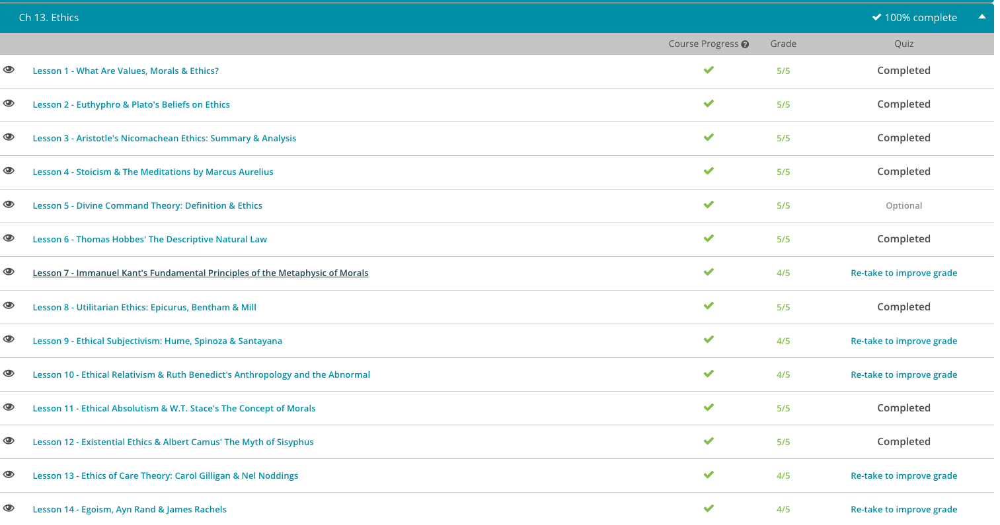

### Andrew Garber
### Feb 6 2023
### Ethics

#### Values, Morals, and Ethics
 - Morals are understood as the ways people should act or how they believe they should act. Morality can be either descriptive or prescriptive, depending on how one approaches the topic. Descriptive morality is focused on describing how people believe they should behave, without necessarily agreeing or disagreeing with their actions. Prescriptive morality, on the other hand, is focused on prescribing how a person should behave.
 - Outside of the academic field of philosophy there are other ways of describing ethics and morals. What most approaches have in common, however, is that they take an interest in our values, or aspects of life that we consider important and worthwhile. The field of ethics acknowledges tough moral decisions and aims to understand them better.

#### Euthyphro & Plato's Ethics
 - Euthyphro is a dialogue written by Plato describing a man being prosecuted for causing another man's death. In the dialogue, Socrates has a conversation with Euthyphro's son who is prosecuting his father to determine what the man sees as virtuous and pious.
 - In his writings on ethics, Plato could have looked at this topic from a variety of angles. He could have focused on the positive and negative consequences of a person's actions, such as what impact Euthyphro's prosecution would have on his family. Or, he could have focused on whether a particular action follows the rules or not, such as the question of whether his father violated a law. These are some approaches of other philosophers.
 - But, these were not Plato's main interests; Plato was eager instead to consider, what actions are most beneficial for the human soul? As a result, Plato is known for his focus on virtue ethics, an approach to ethics that places emphasis on one's moral character.
 - The Greek word aretê can be used to describe the kind of excellence and virtues that Plato saw as so important(the word has a much larger meaning than can be readily translated into English, but in this context it mostly means "Excellence of Character"). But, why live a life of aretê, a life of virtue and excellence? Well, Plato views human life as an opportunity to aim for eudaimonia, translated as human well-being, happiness, or flourishing. 
 - According to Plato, well-being, or eudaimonia, is our highest aim as human beings, and virtue, or aretê, is our way to achieve this. In other words, the best way to live life is in pursuit of virtue. As a result, Plato's text Euthyphro has Socrates repeatedly coming back to the topic of how precisely to define what is pious and virtuous.

#### Aristotle's Ethics
 - Aristotle, quite logically, believed that life as a philosopher was the best life. The two fields that seem the most opposite to that, Politics and Gluttony were not reviled by him however but rather were seen as important by themselves. 
 - Like others before him, such as Socrates and Plato, Aristotle was a Greek philosopher who was interested in the best way to live a good life and to cultivate virtue. In particular, he believed virtue to be something that a person not only needs to understand but that a person also needs to live out in their actual lives.
 - He didn't view ethics as a purely intellectual pursuit to understand what it means to live a better life. Instead, an understanding of ethics is both intellectual and also a way to actually become better. Aristotle aimed for ethics to be both an intellectual and a practical pursuit, with the ultimate goal of human well-being and happiness.
 - Aristotle believed that being raised with a focus on the development of virtue was important, and considering that one of his students was Alexander the Great, it's hard to object to his approach.
 - When we do something that others would view as immoral or unethical, such as taking money that's not ours, we expect that some type of blame would be placed on us when others find out. Likewise, if we do something especially virtuous, such as risking our life to save another's, we might expect praise for this. Our moral responsibility for a particular action, therefore, is the blame or praise that our actions deserve. For Aristotle, a person only deserves blame or praise for their actions when they're acting voluntarily. His two conditions for this consideration are whether the person is acting freely, and whether the person is aware of what they're doing - these two are the basis of intent in criminal law.
 - Spending one's life focused on questions of what actions are worthy of blame or praise might sound bland at first. Yet, Aristotle was ultimately aiming to understand what is the purpose of our lives and how to be the best version of what we are capable of becoming. This led to his belief that Philosophy was the best basis of life, but he also knew that a society of ONLY philosophers wouldn't last very long - so he noted that politics was also important for the health of the community. 
 - Similar to this, pleasure isn't something that is inherently bad - in Aristotle's view, if it was associated with something positive, it could just be. If a great conversation with a friend gave you pleasure, why would you not want to have that conversation?
 - He also notes that a political life is also important to the health of the community. If no one engages in political debates and investigation, how will cities get created that help human beings in developing good habits? Who will create opportunities and provide resources to help people understand the purpose of their lives? So, not only does pleasure have a place, but politics do as well.

#### Meditations by Marcus Aurelius | Stoicism
 - "Meditations" is a collection of notes that Marcus Aurelius, the emperor of Rome, wrote to himself. In fact, no one really knows where the term "Meditations" comes from - the original work was titled Ta eis Heauton, which means "To Himself" and is probably a better title for the work.
 - Marcus Aurelius was a busy man, but every day he made time to write in a journal that survives to us today as a guide on how to live a balanced life from a man who dealt with challenges far beyond what most of us will ever face.
 - If you asked Marcus if he was a "Stoic" it is more likely that he would respond that he was just a student of philosophy, not indebted to any specific school. However, he did have a strong interest in Stoicism from a young age and was influenced greatly by the Stoic philosopher Epictetus, and his teacher and mentor, the Stoic philosopher Junius Rusticus.
 - In modern times, "stoic" is used to describe someone with few emotions and superhuman self control - but this is not what the Stoic school set out for. On the contrary, they believed that natural emotions were more than acceptable: they were undeniable and healthy. However they believed that the emotions should be controlled and dissected such that those built on false judgement and irrational beliefs could not be allowed to control the person.
 - While a Stoic(uppercase, as in the school) would appear to be a poor friend, who would not be able to empathize with you this is not the case. The Stoics believed that they were membered of a community, a cosmic community, (frequently referred to as a Cosmopolis, and the root of the word "cosmopolitan") and that there was a base love of other humans built into every person. 
 - In Stoicism, Virtue is defined as the ability to act in accordance with Nature, or more specifically the Logos, the order and reason of the universe. This is not to be confused with THE four stoic VIRTUES, which are Wisdom, Justice, Courage, and Temperance. Any action can and should be derived from these four virtues, and any action that is not is not virtuous.
 - To a Stoic, the base human kindness that exists in all of us is diverted and corrupted by irrational passions that push us away from the Logos. They weren't trying to be emotionless, passionless robots, but rather to enjoy the things they had but not be controlled by them. Seneca, a Stoic philosopher and advisor to Nero, widely considered one of the worst Emperors of Rome, was one of the richest men in Rome but he was not controlled by his wealth. He was able to enjoy it, but frequently lived in poverty of his own choosing to prove to himself that he was not controlled by it.
 - For a Stoic, it doesn't make sense to overindulge in pleasures or complain too long about pain. These are not significant elements of life compared with the happiness that can result from living virtuously. Today, you can still see the legacy of stoic philosophy in our culture. A phrase like 'it's no use crying over spilled milk' reminds us that it's ultimately not helpful to focus on circumstances you cannot change or events that are minor in the grand scheme of things.

#### Divine Command Theory
 - Belief in God could be viewed as a belief about the very nature of the universe and the nature of morality and existence itself.
 - So, how would a theist view morality? Divine command theory is an approach to ethics that views God as the source of moral laws. You can remember the name by thinking of how 'divine' refers to 'God' and 'command' refers to 'laws': divine commands are God's laws.
 - The approach taken by divine command theorists is not about proving without a doubt that God exists. Instead, they argue that a person does not have to believe in god in order to behave morally, in such that the divine comamnds exist but people can follow them due to their own reasoning.

#### Thomas Hobbes
 - Thomas Hobbes also saw natural law in this light but with a bit of a twist. While Saints Augustine and Aquinas had thought of natural law as fixed and unchanging, Hobbes saw this differently.
 - Hobbes agreed that morality is what we can observe through reason, but he also thought it may change over time. He took a descriptive approach to natural law, meaning that he observed what morality appears to be in the present and past without insisting this would be the same throughout time. You can remember the term 'descriptive' by thinking about how Hobbes was willing to describe what he saw in different time periods.
 - This contrasted with the prescriptive view of Augustine and Aquinas, who also thought that morality is what we can observe through reason. But in their view, natural law involves the unchanging, fixed rules that continue throughout time. You can remember the term 'prescriptive' because of how they felt that this moral code was prescribed and inflexible.
 - In the view of Augustine and Aquinas, in this state of unlawfulness, natural law is still the same as far as what is right and wrong. Following God's law means behaving in the same ways that you would in a lawful society because natural law is unchanging across time and situation. Just like all human beings eat food and digest it, natural law is a set of moral rules that operate consistently and without variation.
 - In Hobbes' point of view, on the other hand, the moral code can depend on the circumstances. If there's no human law in place, and you have to defend yourself by hitting someone with a baseball bat to stay alive, this is not an unreasonable thing to do. Why? Hobbes argues that it's easy to see that an important aspect of human life - a fundamental good - is self-preservation.

#### Immanuel Kant
 - To Kant, saying to yourself 'I should watch this video, so I can learn the information' is an example of a hypothetical imperative. This means it's a statement about what a person would need to do to achieve a desired aim. You have a reason you want to learn this information. This compels you to take action and watch it because it gets you something you want.
 - But according to Kant, there are some 'shoulds' that are for everyone. These moral rules don't just apply to you if you desire a certain result, like being a singer or taking college classes. They are rules that apply to us simply because we are born.
 - These are examples of a categorical imperative, or a statement about what a person needs to do because it is a rational moral obligation. Remember the phrase 'categorical imperatives' by thinking of how the word 'categorical' means 'absolute.' These rules are universal.
 - Kant finds the categorical imperative through multiple formulations. The first two are the most well-known and the two that Kant wrote the most about. The first formulation is: 'I should never act in such a way, that I could not will that my maxim should be universal law'
 - The first formulation addresses the duties that we have to ourselves versus the duties we have to other people. For example, let's say you really need a loan to pay for a necessary medical procedure for your child, but to get the loan, you'd have to lie on your loan application. Is the maxim, or reason, for your lie moral? Kant would say no, because if everyone did what you did and lied to secure a loan, the whole lending system would fall apart, and the maxim would then become impossible. In other words, your maxim cannot be universalized.
 - The second formulation says: 'Act in such a way that you always treat humanity, whether in your own person or in the person of any other, never simply as a means but always at the same time as an end'.
 - The second formulation address the duties we have to other people, not to treat them as objects but as ends in themselves with inherent value.
 - Kant's reasoning has been challenged my numerous critics throughout the years, including French philosopher Benjamin Constant, who challenged Kant's view that it is always wrong to lie and that no maxim for lying can pass the universalization test. Constant presented a scenario known as the 'The Inquiring Murderer'.
 - In this scenario, there is someone who is intent on killing your friend. You hide your friend in your home. When the would-be murderer knocks on your door and asks if your friend is in your house, you could lie or tell the truth. Your maxim of lying is to protect your friend, but your duty is to tell the truth.

#### Utilitarian Ethics
 - Epicurus was an ancient Greek philosopher who considered the topic of how to make decisions that lead to the greatest amount of happiness. He was known as a hedonist because he was a person who focuses their life on maximizing pleasure.
 - In his text, 'Letter to Menoeucus', Epicurus writes about pleasure in different terms than we might normally think. He says that pleasure can be described as the absence of pain in the body and of trouble in the soul. You can aim to remember the name of Epicurus by thinking of how he was curious about human pleasure.
 - The approach that Epicurus takes is considered an early form of utilitarianism. In this philosophy, the best action is the one that increases pleasure for the greatest number of people. You can remember the term utilitarianism by thinking of the utility or usefulness of an action and whether the action increases pleasure and human happiness.
 - About 2,000 years after Epicurus, Jeremy Bentham was continuing a utilitarian hedonist approach in his own work, An Introduction to the Principles and Morals of Legislation. Sounds exciting, right? Well believe it or not, this sleepy-sounding title actually starts out with a bold statement about human beings.
 - He kicks off his text by writing, 'Nature has placed mankind under the governance of two sovereign masters, pain and pleasure. It is for them alone to point out what we ought to do...' He's saying that people are ruled by pain and pleasure and that this helps us to know what is moral. Bentham then makes the case that it's not just our own pain and pleasure that should matter, but the pain and pleasure of all human beings. Everyone's pain and everyone's pleasure are of equal importance.
 - A follower of Jeremy Bentham, John Stuart Mill ultimately saw pleasure in a different way than Bentham. He pointed out that while everyone's pleasure is of equal importance, all pleasures are not equal. To Mill, some pleasures are more valuable than others. Some pains are more troubling. While Bentham might argue that enjoying an ice cream cone is the same pleasure as a conversation with a loved one, Mill saw variations in the importance of one pleasure over another.
 - He also was especially eager to highlight the rights of individuals and focused on this in his text, On Liberty. Mill wanted to emphasize that, 'Unless an action hurts someone else, others do not have a basis for regulating what a person should do. Our own internal feelings also help regulate our actions.'

#### Ethical Subjectivism: Hume, Spinoza, Santayana
 - What Hume points out is that a person may start a moral argument by expressing statements they know to be accurate based on their experience in life, such as the pain you feel in your foot if someone stomps on it. But, often a person will then move to a statement of something that cannot be known as a fact: that a person simply should not do it. Hume doesn't argue that it's a positive thing to go around injuring other people. He just wants to point out that we can't know it is wrong in the same way we know that it hurts to be stepped on. We can only know our own personal version of what is and cannot claim to know what ought to be.
 - Another thinker, Baruch Spinoza, considered similar issues about a century earlier. Like Hume, he noticed how we think we can determine what should be, even though we don't have enough information to know this for sure. Spinoza recognized how imprecise our feelings are and how our senses can only get a partial idea of what human experience is like. He pointed out that the senses alone are only good for picking up information about what we experience in the moment.
 - The insights of philosophers, like Spinoza and Hume, are often classified as ethical subjectivism. This is the view that what we call ethical statements are just expressions of that which we disapprove, and that there is no actual objective standard for what is ethical. For Spinoza, we cannot know that foot stomping is objectively wrong. We can only know what we feel subjectively in our own minds.
 - More recently, in the early to mid-20th century, thinker George Santayana added to the conversation with his own thoughts on ethical subjectivity. Santayana recognized the great variety of human perspectives, based on individual experience. Like Spinoza and Hume, he noticed how there is no objective good that can be understood by a human being through reason. There are many forms of morality, and to Santayana, all are equal.
 - You might wonder, then, if all versions of morality are equal, what's to stop a person from assaulting another person, for instance? Here's where subjectivist thinkers often turn to the role of government, which can be used to decide how society will function. Rather than saying, 'assault should be punished because it is wrong,' instead one might say, 'assault is not allowed by law because we have decided we want less of it in our society.' If enough people share similar views about morality, their agreement can form the basis for what is allowed and what is not in that community.

#### Ethical Relativism
 - Benedict uses this and other examples to demonstrate that cultures have different ethical standards, and that no one outside of a culture can possibly claim to know what is moral and good in that culture. For her, ethical relativism means that a person's morals are completely shaped by culture. In this view, a normal action is one which falls well within the limits of expected behavior for a particular society and is not based on any universal moral code.
 - You can remember the term relativism by thinking about how Benedict considers cultural values as relative to the particular situation. She argues that what we think of so firmly as normal and abnormal categories are actually variable depending on a culture. If you think of human cultures as encountering various forks in the road along the way in their development, you can imagine how a particular culture could vary more and more until so few of our categories of what is normal actually overlap.

#### Ethical Absolutism
 - When Stace published The Concept of Morals in 1937, he was participating in a conversation among philosophers about whether good and evil really are absolutes, or universal. Absolutism, in the way Stace described the approach, is the view that certain, specific morals should be applied to every human being regardless of their situation or culture. This could include beliefs like whether it's always wrong to steal and many other areas of life.
 - Religions have commonly thought of good and evil in absolute terms, with God as the authority determining what is right. Ancient Greek philosophers, like Socrates and Plato, were absolutists who tried to understand the nature of 'what is good?' through the use of reason rather than religious methods. An absolutist way of thinking was ingrained in earlier forms of government, such as the idea that a monarch receives the right to rule from God and therefore knows what is right and wrong.
 - You can remember the concept of absolutism by remembering that it's a way of saying something is absolutely right or absolutely wrong, not taking into account cultural circumstances. Absolutes are one set of ethical standards that apply to everyone, everywhere, throughout time.
 - Stace described relativism as the view that no one universal moral standard can be applied to every human being, in every culture. This viewpoint was becoming more accepted as more was understood about different cultures in the 20th century. Imagine, for instance, if an anthropologist describes the terrifying conditions of an impoverished society for the first time, and you start to relate to the plight of someone who might steal to survive. You can remember the term 'relativist' by thinking of how this approach sees different situations as relative to one another where you can take culture and circumstances into account.
 - Stace pointed out that absolutists and relativists agree that different groups of people have different ideas about right and wrong. This is a commonplace statement, a platitude. It's something that no one really debates because it is simply a basic observation and can be seen in the various norms and customs of societies.
 - He argued that relativists of his time were going further than this accepted observation by arguing that what is thought to be morally right in other cultures is morally right. Stace saw this relativist approach as not simply a commonplace platitude but a very startling assertion. He points out that just because a culture believes that something is morally right, this doesn't make it moral behavior, even within that community. If a culture believes that enslaving or killing another ethnic group of people is the right thing to do, should the world accept that as their moral value?
 - Yet, even with flaws in relativism, Stace was not in favor of absolutism either. He questioned how there could ever be any one authority who could ultimately determine what the ethical absolutes should be, making absolutism a flawed approach in his eyes as well.
 - Stace felt that this human moral spirit inspires people to act in ways that increase human happiness. If you want to be happy, he argued, it's best to cultivate your own morality. He held the hopeful view that all sane and intelligent human beings are able to tap into a universal moral spirit to guide their behavior.

#### Existential Ethics & Albert Camus: Sisyphus
 - the Greek mythological character of Sisyphus has a mundane task to do every day. In his case, he's been condemned by the gods for all eternity to push a heavy rock up a hill.
 - What's worse, when the rock reaches the top, it always rolls back down and Sisyphus is forced to start from scratch and start rolling it back up again. How does Sisyphus spend his Saturday nights? Rolling the rock up the hill. Where will he be 50 years from now? Rolling the rock up the hill. You get the picture.
 - What value do you see in the lives of Joshua, toiling in mundane factory tasks, and Sisyphus, toiling on the hill? Some philosophers have viewed these types of scenarios as examples of the absurdity of life. Absurdity, from an existential point of view, is desiring to find meaning when there is no meaning to be found.
 - Camus suggests that Sisyphus can be happy because of his capacity to be free. He can be free not by escaping his task, but by accepting the absurdity of it. Once he knows he is in this situation where no meaning can be found, Sisyphus is freed to create his own meaning.
 - The philosophy of existentialism includes the concept that there is no meaning in our existence except for the meaning we give it. You can remember this term by thinking of how existentialists focus on our individual human existence.
 - Camus responds by saying, 'I have seen people behave badly with great morality and I note every day that integrity has no need of rules.' He's suggesting that those who claim to be moral may still act in lousy ways, and those without a standard rulebook for their actions may actually act well. Existentialist philosophers tend to focus on how an individual needs to take responsibility for their own experience.
 - Ironically, even though Camus is used here in our examples of existentialism, during his own life, he distanced himself from the label 'existentialist'. In spite of Camus' denial of the label, he is often associated with this philosophy. His description of Sisyphus repeatedly rolling his rock up a hill continues to be used as a fitting example of futility in the lives of human beings.

#### Care Theory:
 - So, were the girls really morally stunted in their growth? Gilligan argues that it wasn't the girls who were insufficiently moral but that the scale itself had flaws. One question to ask is how the particular scale of ethics was even developed. How did the creators of this ethical test come to their understanding of ethics? Philosophers often use an approach Gilligan calls the ethics of justice. According to her, this concept is focused on the decisions people make when coming up with rational solutions to abstract moral problems.
 - Think of this approach as mainly involving concepts such as fairness, equality, rights, and freedom. The ethics of justice is primarily interested in universal moral rules that can be applied across the board. An example would be the principle that cheating on a test is wrong. It's a universal rule because it's not just wrong in some situations; it's always wrong.
 - Gilligan argues that the girls have likely learned another way to look at ethics. They have typically learned an ethics of care instead of justice. The ethics of care is focused on how to respond to the needs of others in complicated real-life scenarios. Think of this approach as mainly involving concepts such as responsibilities, compassion, and relationships.
 - The ethics of care recognizes context rather than universal rules. The context of a situation is very important in determining how we should respond. For example, think of a situation where you have to decide how to address too many family obligations in your life. Is there any universal principle for this? Not likely. You have to consider the context of the specific situation, your needs, and the needs of others. Rather than focusing on the consequences of actions or our duties, this theory considers our response to other people in various circumstances.Gilligan points out that women have historically been excluded from discussions on ethics. As a result, she claims that the field of ethics tends to focus on abstract justice rather than caring. Caring has been undervalued.
 - So, would little girls tend to perform better on a test that focuses on the ethics of care rather than the ethics of justice? That's what Gilligan claims. She's not saying little girls are born more caring than boys, or that they will always act more caring. She just wants to point out that girls in general are often taught from a young age to be more caring, while boys are taught different values. As a result, girls and women tend to relate to an ethics of care approach when making ethical decisions.
 - The ethics of care theory is often described as feminist ethics. This is because it aims to integrate the experiences of women into the study of morality. Those like Gilligan and Noddings want different voices to be heard in a field historically dominated by men. Rather than focusing on individuals as independent from one another, the ethics of care thinks of human beings as quite interdependent. We care for one another, and others care for us. This affects our understanding of what is moral and right to do.

#### Egoism
 - In the first corner of our imaginary boxing ring, we have Ayn Rand, a writer famous for both her novels and her philosophical views. Even the title of one of her books sounds controversial: The Virtue of Selfishness. You might immediately wonder, how can selfishness be proposed as a good thing? How can being selfish be ethical?
 - In the other corner, we have James Rachels, who's ready to fight Rand on her views. His essay Egoism and Moral Skepticism describes the view of those like Rand's as a disturbing doctrine. 
 - Ayn Rand writes something that might sound shocking. She makes the case that altruism, also known as selflessness, is actually a cause of moral corruption and resentment. She says that it is not an ethical way to live. This is a bit like a punch to the face of most moral philosophies, which claim that selfless acts, like helping others, are the very definition of moral behavior.
 - Rand points to how a person acting always in the interests of others can end up having little guidance for what to do in life aside from trying to meet the needs of others. She says altruism permits no view of men except as sacrificial animals. Instead, her approach of rational egoism offers an alternative, in which a person's self-interest must be uncovered by the guidance of rational principles and a person must then act in this self-interest. You can remember the term egoism by thinking of how ego refers to a person's own self.
 - Rand has another philosophical punch to land as well: just because a person acts in their own self-interest doesn't mean they do whatever they want, regardless of the consequences. An egoist who thinks through their actual interests rationally can see that they want to live in a society that is stable. This requires that they behave in ways consistent with a stable society. So, going out and stealing, destroying property, or otherwise causing problems in society is therefore not in one's self-interest.
 - But wait. Ready to fight back against this perspective is James Rachels with his own powerful combination of rational arguments. In his essay, Egoism and Moral Skepticism, Rachels rejects the idea that an egoist will behave in ways that ultimately benefit society and keep it stable. He points out that an egoist will know that others are not egoist. This knowledge affects their behavior.
 - In a strange way, it's actually in the egoist's best interests that others are not egoists, too. For instance, an egoist could easily take advantage of someone else's kindness or weaker position if they're altruistic in their approach. This could lead to some very questionable behavior, says Rachels.
 - He rejects the idea that people should focus on always acting in their own self-interest. Here comes another powerful punch from Rachels: he points out that human beings are wired in more complex ways than just looking at their own needs. When we see a situation that includes other humans suffering, we have a response that goes beyond looking out for ourselves. Rachels says it is easy to forget just how fundamental to human psychological makeup the feeling of sympathy is.

