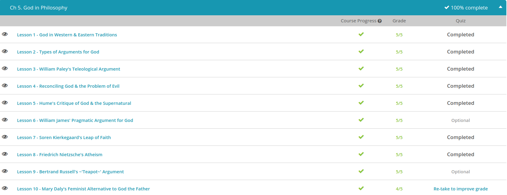

### Andrew Garber
### January 17 2023
### God In Philosophy

#### God In Western And Eastern Philosophy
 - dualism has been a defining trait of most Western religions. For example, Western Christianity teaches a clear distinction between the natural and the supernatural, or in simpler terms, God and man.
 - To illustrate this, take a look at these words from the Bible: 'For all have sinned and fall short of the glory of God, and all are justified freely by his grace through the redemption that came by Christ Jesus.' (Romans 3:23-24)
 - Notice how these words say we humans have fallen short of the glory of God. In other words, God is a separate being from us. He's God in all his glory, and we are not.
 - Further highlighting this dualistic belief, do you notice the remedy for our shortcomings? It does not lie within us. It is separate from us, found in the grace offered by Jesus Christ. Not only is it separate from us. Many places in the Christian New Testament tells us we don't even earn it. According to the book of Ephesians, 'God saved you by his grace when you believed. And you can't take credit for this; it is a gift from God. Salvation is not a reward for the good things we have done, so none of us can boast about it.' (Ephesians 2:8-9)
 - Adding to these dualistic philosophies, the Western concept of the Divine holds to monotheism. This is belief in only one god. Despite their many differences, Islam, Judaism and Christianity all hold to the belief in one standalone supreme being who is separate from humanity. Keeping these dualistic concepts in mind, let's turn our eyes to the East and its monism.
 - Standing in stark contrast to dualism is monism. Monism, not to be confused with monotheism, denies any distinction between the physical world and the unseen world. Rather than there being a separate God in the sky, everything is one, and we are a part of that everything.
 - Probably one of the best examples of Eastern monism is the Hindu belief in Brahman. Again working to keep things simple, Brahman is the great unchanging reality that makes up everything. Although a very vague idea, it's seen as the highest reality of which we are all a part. It is an energy that governs the seen and the unseen world.
 - Adding to this, Eastern faiths are often polytheistic. In other words, they believe in more than one god. However, these gods are usually still seen as part of the divine whole. For instance, Hinduism has Shiva and Vishnu.
 - Also adhering to the concept that we are all part of a whole, Eastern faiths tend to put great emphasis on our treatment of each other and the natural world. This is seen as a way to achieve true glory. For instance, the teachings of Buddha, known as the Dhammapada, read, 'Ever grows the glory of him who is energetic, mindful and pure in conduct, discerning and self-controlled, righteous and heedful.'
 - Bringing things full circle, notice how this Buddhist proverb attaches glory to the person, while the Christian text we discussed earlier attributes glory to God alone.

#### Arguments for God
 - Also called the design argument, the teleological argument asserts creation is so intricately and purposefully designed there must be a creator. Anytime you hear someone say something to the effect of 'Wow, look at the sunset God made for us today,' they are using the teleological argument.
 - As one of the main proponents of the teleological argument, the 18th-century philosopher, William Paley, asserted that believing the universe came to be by chance is as nonsensical as believing the watch we wear on our wrist just one day poofed into being. Putting it in terms to help us remember, Paley purported the pretty plants and planets prove that God exists.
 - Another argument that uses nature is the cosmological argument. This one espouses that everything that is has been caused by something else. Having its basis in the works of Thomas Aquinas, and being very linked to the teleological camp, the cosmological argument asserts that all of nature must have been caused by something.
 - Yes, humans have made lots of things, but who caused humans? Yes, plants make oxygen, but who caused the plants? Stretching things a bit more, what about the Big Bang Theory? Maybe there was a Big Bang, but it needed to be caused! With this, cosmological campers would say, 'God is the final and ultimate cause of the cosmos!'
 - Moving a bit away from the natural world, we come to our last two arguments. They are the moral and ontological arguments for God. Being the easier of the two, we'll start with the moral argument.
 - Again having its roots in the works of Aquinas and being easy to understand, the moral argument for the existence of God declares that humans understand morality because God is the ultimate measuring stick.
 - To drive this home, let's do a little exercise. I'm going to say a thing, and you decide whether it's good or bad. Don't over think it; just say the first thing that pops into your mind. Good or bad. Here we go…
 - Feeding starving children. Good or bad? . . . I'm guessing you said, 'good.'
 - A king taxing starving people . . . I'm guessing you said, 'bad!'
 - Now here's the question that the moral argument begs. If I've never met you, how did I guess what you were going to say? Why do we both have the same ideas of good or bad? To this, the moral argument proponents would answer, 'God!' We understand morality because, whether we admit it or not, we use God's perfection as the gauge for everything else. We recognize evil because it so sharply contrasts his perfection.
 - The ontological argument asserts God, being defined as most great or perfect of all beings, must exist, since a God who exists is greater than a God who does not. Like I said, it's pretty heavy stuff! Let's break it down.
 - When Saint Anselm of Canterbury authored the ontological argument, he defined God as an unmatched Supreme Being. He asserted that all humans share this concept of God. For instance, even atheists who don't believe in God are busy trying to prove that this definition of God doesn't exist. They're not arguing against a tiny little inconsequential being; they're arguing against the idea of the Supreme.
 - Now, this is where it gets really tricky. Anselm made his point that all humans share the same concept of God. In other words, we all think of God as some sort of Supreme Being. Now, since we're all able to think of God as a Supreme Being, then there must be something greater than the idea of this Supreme Being. In other words, reality is always better than thought or idea! So, if we humans are able to grasp the idea of God, then there must be a real God that is better than the idea, since only a real Supreme Being can be greater than the idea of a Supreme Being.
 - Stating it as simply as possible, the ontological argument asserts that since we all share the idea of a Supreme Being, there must be a real Supreme Being that is greater than our idea. If not, where did we all get the idea from in the first place?

#### Reconciling God and Evil
 - It's a theme that's played out in books and on the big screen. Man's life is going well; man believes in God. Same man faces horrible tragedy; same man rejects God. Like I said, it's a refrain that's played out for generations, and it stems from one question, 'How can there be a God when there's so much evil in the world?'
 - Today's lesson will explore this age-old conundrum of reconciling God and the problem of evil. It's a problem that some atheists, or those who refute the existence of God, use to validate their disbelief.
 - Now, before we go any further, there is one thing we must admit. Today's lesson will not even come close to solving this problem. Coming to an answer requires self-study and reflection. Instead, we're going to lay out the parameters of the problem as it pertains to philosophy. Then we'll go over a few answers postulated by some rather famous scholars.
 - First, let's start with the problem. Stating it very simply, it goes like this: How does one rectify the existence of God with the obvious existence of evil? In other words, if there really is an all-powerful God, why wouldn't he wipe out things like evil and disease? Also, if he is supposed to be good, why doesn't his compassion stop the world's suffering?
 - Now that we've laid out the problem, let's look at some answers. For starters, the practice of trying to rectify God and evil is known as theodicy. With this in mind, let's look at three rather famous philosophers who practiced it. They are Augustine, Irenaeus, and John Hick.
 - As probably the most famous, we'll start with Augustine. To sum up his views, Augustine believed evil was a product of man, not God. Linking his ideas back to the Garden of Eden, Augustine asserted that God created perfection, but the free will of man, of Adam and Eve, messed it up. Putting it in modern terms, Augustine might say evil is a work of the children and not the parent.
 - Our next philosopher is Irenaeus. Interestingly, Irenaeus believed evil exists to accomplish soul making. In other words, evil is a tool used to make us better people. It's a means to an end on our journey toward maturity.
 - This brings us to our last philosopher, John Hick. Unlike the other two, Hick asserted that humans are still in the process of being created. To use a famous kids' song, God's not finished with me, yet! Sort of like a baby, humanity is still in the growing process. Earth is a workshop where souls are still being formed. When the product is finally perfected, evil will disappear.

#### Hume's Critique of God
 - Let's start with a brief bio of David Hume. Hume is famous for being an 18th-century Scottish empiricist. An empiricist is someone who holds to empiricism, the theory that all knowledge is derived from human senses. Stated simply, the only way we can know something is through sight, sound, touch, taste, and smell. Making him even more of a tough nut to crack, Hume also held to skepticism, the belief that true knowledge is unattainable(different from uppercase Skepticism, which was a Greek philosophical school focused largely on intentional poverty).
 - With this belief, Hume made a distinction between impressions and ideas. To him, impressions are everything we derive from our senses. For instance, our sense of touch tells us fire is hot. This is an impression. However, ideas are just faint images of thinking and reasoning. Going back to our fire, our impressions tell us it's hot. From this impression, we form the idea that it's dangerous. However, since the concept of dangerous can't really be defined or actually seen, touched, tasted, etc., it's an idea, which can't be rationally proven. Using this sort of argument, Hume argues that ideas are always inferior to impressions.
 - This of course, brings us to Hume's assertions on the ideas of God and religion. To put it as simply as possible, Hume felt the concept of God is unattainable through the senses, and therefore believing in God is pretty much nonsensical. God is not an impression; he is an idea.
 - Of course, this sounds a whole lot like atheism, or the lack of belief in the existence of God. However, since this would have been a pretty dangerous thing to espouse in the 18th century, Hume never went as far publicly claiming this.
 - He did, however, write his Dialogues Concerning Natural Religion. In this work, he investigated whether or not religious beliefs can be rational. In short, he explores whether humans can really draw any valid conclusions about the existence of God.
 - In order to do this, Hume used three characters. They are Demea, Cleanthes, and Philo. Throughout the piece, these three give their arguments for or against man's ability to really know anything about God.
 - Cleanthes agreed with Demea: There is a god. However, he says man can prove the existence of God through empirical reason. In other words, our senses can lead us to believe in God. All we have to do is open our eyes and look at nature. Its complexity leads us to the conclusion there must be an intelligent creator. Things like the intricate human eye or a rainbow didn't just 'poof!' into being. They were created by a very ingenious, supernatural being. To put it simply, Cleanthes says, 'Humans certainly can reason out the existence of God.' (The name may be, but the thoughts of the character Cleanthes are not the same as the thoughts of the second leader of the Stoic school, Cleanthes of Assos.)
 - Last, there is Philo. Now, this guy isn't buying it. He purports that our senses cannot lead us to knowing God at all. In fact, he says the idea that God created the universe is as faulty as saying it just sprang into being. There's no empirical proof.
 - Bringing the argument full circle, he says our senses, our impressions, let us see, touch, taste nature, but any conclusions we form about a creator are mere ideas.

#### William James' Pragmatic Argument 
 - One of the most famous no-votes came from W.K. Clifford, author of Ethics of Belief. In this work, Clifford actually referred to belief without evidence as immoral. Seriously, this guy wasn't messing around. To put weight behind his declaration he used the story of a boat owner. Here's a paraphrase:
 - Suppose a boat owner has a rickety old boat complete with holes and ripped sails. Notwithstanding this, the boat owner BELIEVES his boat can sail. Acting on his belief, the owner invites his friends out to sea. However, despite his faith in it, the boat sinks and all his friends die. Wouldn't he be guilty of their deaths? While this obviously isn't comparable 1-1 with a belief in God, Clifford's point is that belief without evidence is immoral. It's a belief that's not based on facts, but on faith. And faith, he says, is a dangerous thing.
 - Enter William James! Unlike W.K. Clifford, James asserted belief without evidence is permissible. In fact, in his famous writing, The Will to Believe, he argued belief without evidence can be beneficial. To him, belief, regardless of evidence, helps us get through life. 

#### Soren Kierkegaard's Leap of Faith
 - For starters, Soren Kierkegaard is a 19th-century philosopher who argued the merits of faith in God. In fact, he asserted life is only worth living if you have total faith in God.
 - Now, notice I am saying faith in God and not belief in God. This is very much on purpose. According to Kierkegaard, belief is reserved for things that can be supported or proved with evidence. 
 - Moving away from belief, Kierkegaard argued faith is reserved for things that lack evidence. Since he also agreed God is beyond logic, proof, or reason, he had no problems admitting it takes a leap of faith to believe in God. After all, lack of logic, proof, and reason are the very things necessary for faith to be faith!
 - In order to reach this type of faith, which Kierkegaard deemed nigh unto impossible, he argued that one must be constantly busied with self-evaluation and analysis. Rather than just sitting around saying 'I have faith,' one must take a good long look at themselves.
 - Expounding on his views of self-analysis and faith, Kierkegaard gave the world his Philosophical Fragments. These are writings in which he explains the three stages of human existence. 
 - Kierkegaard's first stage is the stage of the aesthetic. According to Kierkegaard, a person in this stage seeks pleasure above all else. To Kierkegaard, this is the most immature stage. Yes, it might help fight boredom, but in the end, it will prove empty and meaningless. In order to really grow, a person must move on.
 - Kierkegaard's second stage is the ethical one. In this stage, a person lives life based on rules. Rather than pursuing bliss, he pursues the greater good. Rather than chasing blindly after pleasure, he considers how his actions affect others. Although an ethical person obeys rules, his obedience doesn't always come from the heart. For this, one must pass into Kierkegaard's third stage, the religious life.
 - To Kierkegaard, the stage of religious life is the highest form of existence. In fact, it's so high he admits very few, if anyone, really attain it.
 - It's a stage where religion is personal. It's not defined by church attendance or the rhetoric of organized religion. In fact, Kierkegaard really had no tolerance for such things.
 - Instead, this last stage requires total abandon to the hope of God. Without reason, logic, or evidence, it requires the ultimate leap of faith.
 - This is similar to what the Stoic's would describe as someone who has achieved the highest form of virtue, becoming a "sage".

#### Nietzsche's Atheism
 - 'I condemn Christianity; I bring against the Christian Church the most terrible charge any prosecutor has ever uttered. To me it is the extremest thinkable form of corruption; it has had the will to the ultimate corruption conceivably possible. The Christian Church has left nothing untouched by its depravity; it has made of every value a disvalue, of every truth a lie, of every kind of integrity a vileness of the soul.' - Friedrich Nietzsche
 - Actually the son of a German priest, Friedrich Nietzsche is arguably the world's most famous atheist. Ironically, Nietzsche despised this term and what it meant, so taking any of his quotes without understanding of the man himself is a bit of a mistake.
 - To him, common atheists share the same fallacies as Christians. They both follow rules, and they both put their faith in something. Christians put their faith in their religion. Atheists put their faith in the non-existence of God. Either way, they both impose rules of what should and shouldn't be believed. Since Nietzsche espoused existentialism, the idea that men are free from artificially imposed rules, he thought both the atheists and the Christians were fools.
 - With this in mind, why do so many people brand Nietzsche an atheist? The answer - because he fervently railed against the Christian God. In fact, if you asked Nietzsche if God exists, I bet he might have answered, 'I don't care!' However, if you asked him about the Christian God, who imposed rules like don't envy or hate, he'd give you a mouthful. For instance, in several of his works, including Thus Spoke Zarathustra and The Will to Power, Nietzsche postulated that Christianity, its God, and its rules are irrelevant.
 - Rather than being a slave to religious nonsense, Nietzsche came up with his own guidelines for life. He believed so strongly in them, he said they were the only way to become an Übermensch, or a 'Superman' in the English tongue!
    - 1. Own up to envy.
    - 2. - And this one is really blatant - don't be a Christian.
    - 3. Don't drink alcohol.
    - 4. God is dead. In other words, he didn't rejoice in the idea. Although he thought the Christian God flawed, he did admit people used him as a crutch. Since crutches are sometimes helpful, Nietzsche admitted that God's supposed death would leave a void that must be filled. His solution to the God hole in all humans was academics, philosophy, and the arts. 
 - Nietzsche was also the one who came up with the phrase, "Amor Fati" - love of fate. In other words, he believed that life is what it is and that we should embrace challenges and hardships. This fits nicely with much of Stoic philosophy as well(and has been embraced by modern stoics, notably Ryan Holiday, Tim Ferriss, and Robert Greene as well as many others.).

#### Bertrand Russell
 - For starters, although he studied math, politics, and science, Bertrand Russell is best known for his role as a 20th-century philosopher who argued against the evidence for the existence of God.
 - Now, when I say argued, I really mean argued. He didn't mince words. In fact, he went as far as to assert the universe has no purpose or creator. It just is. To those who thought the universe was created with a purpose, he asked questions like, 'What type of god would create things like cancer, pain, and war?' He'd then answer with something akin to, 'That would be an evil monster, not a god.' Like I said, he didn't pull any punches! One of Bertrand's biggest pet peeves came from those who argued God is real because he can't be disproved. In other words, you can't prove to me that God isn't, therefore he is.
 - To combat this one, he came up with his famous teapot argument found in his essay, 'Is There a God?' To sum it up, and of course I paraphrase, he simply asked, 'Well, what if I told you there was a China teapot orbiting in the solar system but it's so small no telescope can find it?' He then answered, 'Of course you wouldn't believe me. You'd think I was crazy!' However, Russell tells the true-if-not-disproved campers if their logic is sound, then so is his teapot. Using their own rationale against them, if you can't prove me wrong, I must be right.
 - He then went on to assert that the argument that God exists because he can't be disproved is as flimsy as the idea of an orbiting teapot. The only difference is the God myth seems valid because it's been around for generations.
 - So, to sum it all up, Russell believes his idea of a flying teapot is just as valid as the belief in God. As he said (and I directly quote this time), 'My conclusion is that there is no reason to believe any of the dogmas of traditional theology and, further, that there is no reason to wish that they were true.' To say the least, many would call those fighting words.

#### Mary Daly's Feminist Alternative
 - Since the 18th and 19th centuries, the feminist movement has inspired women to advocate for themselves, speak out against inequality, and fight for a level playing field in society and culture. Feminism comprises a range of social movements led by women and some men who advocate for equality for women in social, political, economic, and cultural spheres. There have been a number of very influential leaders in the feminist movement, but there are relatively few that have caused as much controversy as Mary Daly.
 - Mary Daly was a feminist philosophy professor and theologian (notably, the first female theologian at the Jesuit-run school) who taught at Boston College until she retired in the late 1990s. Despite a long tenure at Boston College (1967-1999), Daly's career was marked with numerous controversies and a handful of lawsuits. Her retirement in 1999 followed her repeated refusal to admit men into some of her feminist and women's studies classes because of her concern that some of the women might not feel free to speak openly with men there. However, Daly did tutor them privately on occasion. Regardless of her reasons, it's against the law to segregate classes, and eventually Daly was forced into retirement.
 -In a general sense, Mary Daly's perspective is not uncommon among feminists of her era. For most of her career, Daly spoke out against inequality and focused much of her attention on patriarchal systems that have marginalized women for centuries. Patriarchy, a social system in which men are dominant authorities, is a theme that's constant in nearly all of her work and was the focus of her activism for her entire career.
 - In her first book, *The Church and the Second Sex* (published in 1968), Daly's position on religion is that of an insider. Her intention for the book was to raise awareness of the oppression which exists in and is promoted by the Catholic Church while also advocating for women to have a more equal role in the religion. Though the book focuses on Catholicism and the Church, Daly's larger message for the book was to emphasize how women had been forced into being second-class citizens in nearly every aspect of society. Part of the title, in fact, is derived from Simone de Beauvoir's seminal feminist work The Second Sex (published in 1948).
 - When compared to her later work, The Church and the Second Sex was somewhat passive in that it made a solid case for equality and offered suggestions to create change. Her second book, on the other hand, was less of a suggestion and more of a demand. In Beyond God the Father, Daly's 1973 follow-up to The Church and the Second Sex, she moves from trying to integrate women into Christian practices to positing that religion is one of the biggest contributors to the oppression of women.
 - The foundation of Beyond God the Father is the argument that Christianity is an entirely patriarchal institution. Among the more prominent arguments in the book, Daly focuses a great deal of attention on the language of Christianity, particularly the ways in which it celebrates men. For example, Daly offers a compelling argument that God is constructed using almost entirely masculine language. This, according to Daly, is problematic because, ''...if God is male, then the male is God.''

