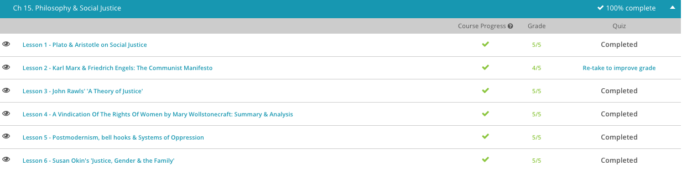

### Andrew Garber
### March 10 2023
### Philosophy and Social Justice

#### Plato and Aristotle
 - In his text, The Republic, Plato explores how to create a more just society. For Plato, justice is a condition of the soul, a virtue. To him, justice wasn't necessarily a framework that we use to create laws that are fair. For Plato, justice was something that came largely from the inside of a person. If you were a just person, you could help create a just society.
 - What would motivate a person to live justly, as he describes? Plato considered the virtue of justice to be a key part of living the good life. If you imagine Plato coming up with a list of the essentials for livin' large, justice would definitely be one of his responses. In his ideal society, philosopher kings would rule, preventing an emotional populace from having too much control.
 - Hmmm, sounds something like a certain Roman Emperor. Perhaps named:[Marcus Aurelius](Writing/marcus_aurelius.md)
 - Well, Plato thought that a monarch acting in the best interests of everyone was much better than citizens who are acting on their own private whims. He was concerned too about division within societies, and so part of his hope was that private property and family would be held in common. Instead of my family and my things, a society would be one big family without the need to own our own things.
 - Even among classes of people, like craftsmen, warriors, and rulers, he proposed that there are appropriate divisions and responsibilities for each to keep the society harmonious and just. Doesn't sound particularly equal, right? Though not necessarily progressive to our modern ears, The Republic is still considered by many to be an important exploration into Plato's beliefs about the ideal society.
 - Portions of Aristotle's Politics also strike us as less than just. For instance, he promoted the existing view that men were more natural leaders than women. He also found a way to justify the slavery of his time. These are both topics we would find in opposition to our current understanding of justice and equal rights.
 - He didn't view a philosopher king as the ideal solution like Plato did. Instead, he outlined various true forms of government. According to Aristotle, the true forms of government are those in which the one, or the few, or the many, govern with a view to the common interest. He was opposed to governments that rule based on private interest or the accumulation of wealth. He believed that the true forms of government could deteriorate into less just forms of government if rulers didn't govern with the common interest in mind.
 - He disagreed with Plato about issues such as eliminating the family unit and private property. Still, he did not believe that justice is about everyone getting what they want. Instead, he wanted a society where everyone gets what they deserve. He believed that virtuous behavior deserves reward and wrongdoing deserves punishment. That may sound more familiar, since our current system of court justice uses this approach to punishment.

#### Marx and Engels
 - In the middle of the 19th century, a group of socialist reformers known as the Communist League convened in London. Seeing the impoverished working class created by the Industrial Revolution, these reformers called for change. In order to summarize their beliefs, they charged two German philosophers with special interests in the economy, Karl Marx and Friedrich Engels, to write a mission statement of sorts on their behalf. Little did they know, they were witnessing the birth of one of the most famous political ideologies of all time - Marxism and its Communist Manifesto.
 - Both Marx and Engels were opposed to the abuses of their industrialized society. To them, the Industrial Revolution was to blame for the oppression of the working-class poor who lived in slums and faced dangerous working conditions. Making matters worse, while the poor suffered, the wealthy thrived. Marx and Engels felt this exploitation of the poor was the basis for all social and political conflict. The only way to end this conflict was through social-class revolution and the abolishment of private property. This belief, which has come to be known as Marxism, would be touted by Marx's and Engels' followers for years to come.
 - In order to end this travesty of social justice, where the rich got richer while the poor got poorer, the Communist Manifesto declared that it is inevitable that the working-class proletariat will rise up in revolution against the property-owning bourgeoisie. However, unlike most revolutions where the rebels win and take over the wealth and political power of those ousted, the Communist Manifesto also declared that the victorious proletariat should abstain from this temptation. Instead, they must use their new power to abolish, not keep, all private property. This would completely level the playing field, therefore ridding society of the evils of social class. Only in doing this would conflict end and society stabilize. 
 
#### John Rawls
 - John Rawls was an American philosopher who focused his attention on the political domain of society in his work, A Theory of Justice. Like other philosophers before him, he considers the concept of a social contract, an agreement among people to live under a system of government. In particular, Rawls emphasized justice as fairness.
 -  In his thought experiment, you would imagine that you have a representative that will meet with the representatives of every other citizen in a society to come up with principles of justice.
 - This meeting is not a literal election or vote like in our example earlier about the tax structure. Rawls meant these representatives in the thought experiment to be hypothetical only and not a situation that would happen in real life.
 - There's something very unique about this particular imaginary gathering. Those who are involved in this get-together are part of what Rawls describes as the original position, or an impartial point of view used to establish the principles of justice.
 - What makes the original position of the participants so impartial and fair? Well, they've been given a strange characteristic. Each citizen's representative knows nothing about the actual social or economic standing of the person they are representing. They don't know your income, or whether you are the wealthy business owner, or the lower-income parent, for instance.
 - They don't know your ethnicity, your gender, or your age, either. They don't even know what political or economic situation has been established in your society. This lack of information about the relative situation of those they represent is called the veil of ignorance.
 - What do they know? They know you have a certain plan for life. They know you have an interest in having enough for yourself. They also know that not everyone in the society will get everything they want. Although resources are adequate for the society in our thought experiment, resources are not infinite. Part of developing principles of justice is considering how to share these resources fairly.
 - Rawls argued that using this thought experiment highlights the importance of equal basic rights and access to opportunities like employment and education to help each person compete in the world. After all, if you don't know what your status is in society, you would want to be sure to create a political system that did not penalize or favor one group over another out of the gate.

#### Wollstonecraft
 - A Vindication of the Rights of Women is a book-length feminist essay by British writer Mary Wollstonecraft, published in 1792. A Vindication of the Rights of Women called for female equality, particularly in the area of education. Wollstonecraft dismissed the cultivation of traditional female virtues of submission and service and argued that women could not be good mothers, good wives and good household managers if they were not well-educated. She claimed that women were expected to spend too much time on maintaining their delicate appearance and gentle demeanor, sacrificing intelligence for beauty and becoming flower-like playthings for men.
 - The book is divided into thirteen chapters, in which Wollstonecraft addressed topics such as the importance of educating women equally, treating women with dignity and providing women with the proper training to be good wives and mothers and intelligent companions for their husbands:
 - How, Wollstonecraft argued, could women teach and raise children and run a household if they focused only on their own appearance and on minor accomplishments like speaking French prettily, playing the piano and drawing? Such accomplishments made a woman desirable to a man as an amusement, but not as an equal companion.
 - Wollstonecraft recognized that for many women of her time, raising a family would be their primary responsibility, but she insisted that a husband and wife whose relationship was founded on reason and equality would parent happier and more well-rounded children than in families governed by strict discipline and inequality between parents. To that end, she proposed a system of national education in which boys and girls would be educated together, and education would be open to all classes. Though written during the period of Romanticism, a movement known for celebrating sensibility/feeling over sense/rational thinking, Wollstonecraft warned against false sensibility, a tendency of women to become too overtaken by emotional sensitivity.
 - The French Revolution greatly inspired Wollstonecraft's writing on female equality. Following the revolution, France proposed to replace church-controlled education with a system of free education - the basis for Wollstonecraft's call for a gender-equal national education system in England. Yet Wollstonecraft noted that despite the democratic ideals of French revolutionaries, they made no mention of education for girls. In an effort to bring this to France's attention, as well as to encourage the English not to make the same mistake, she wrote A Vindication of the Rights of Women.
 - The book's initial reviews in magazines like The General Magazine, The Literary Magazine and New York Magazine were positive, and it was published in America as well as translated into French. However, there was also negative backlash associated with the work, especially after Wollstonecraft's death in 1797. Her husband, William Godwin, published a memoir of her life in 1798, in which he revealed previously unknown facts about her, including her love affairs, her illegitimate child and her attempts at suicide. Though holding many of the same beliefs, female writers, like novelist Maria Edgeworth, hesitated to mention or reference her in their own work because her philosophies were becoming associated with her scandalous lifestyle. Nonetheless, A Vindication of the Rights of Women was, and remains, perhaps the foundational text of modern feminism.
 - Unrelated to Wollstonecraft, Cleanthes of Assos - A Greek Stoic who lived about 2000 years before Wollstonecraft, wrote a book entitled "On the Thesis that Virtue is the Same in a Man and a Woman". 

#### Postmodernism
 - bell hooks is an American author, scholar and activist who has written and spoken about issues of race, gender, class and sexuality in the late 20th century and today. One reason she has chosen to have her name written with lowercase letters on purpose is to place importance on the text of what she has written rather than on herself.
 - From the perspective of hooks, we all live with the legacy of a system that has historically been dominated by those who are privileged, such as those who are rich, who are white and who are male. These systems of oppression affect all that we experience, from how each of us view ourselves to how we treat others, she says.
 - This willingness to grapple with what we see in pop culture is one feature of postmodernism, a movement that questions previous modes of practice in a variety of fields and in particular questions whether one set of truths exists.
 - To better understand what she was trying to say about Beyoncé, let's consider how hooks understands postmodernism.
 - In her work Postmodern Blackness, hooks does want to acknowledge that the identities of black people are varied. There is not a uniform black experience, and no single experience of being female either. There is no one set description for what it is like to be a particular gender, class, ethnicity or sexuality.
 - But she doesn't believe that systems of oppression are a thing of the past. For instance, she says the women we see portrayed in media images often have little to no control of how they are presented. Instead, those with money and power are in control and choose which images are promoted.

#### Susan Okin
 - In this context, gender roles are the way we are taught to behave in society, based on our gender. Gender roles are based in part on society's attitudes, such as the belief by some that women are better able to care for children simply because they are women. Gender roles are also reinforced by historical patterns in society, such as a past history of women being deliberately excluded from certain types of work, for instance.
 - When we think of politics and power, we typically think of the public sphere, such as the legislature and the workplace. Okin and other philosophers point out that the dynamics within a family itself, the private sphere, also involve issues of power.
 - This perspective is sometimes summed up by the phrase, 'the personal is political,' which refers to the idea that what happens in the family and in relationships are directly related to the issues of larger society. The private and public spheres are both relevant when talking about power, fairness, and justice.
 - Okin argues that it is unjust for a person's gender to determine what opportunities are available to them. A person's gender identity should not determine what a person should do in their life. In addition, no matter who is home with the children, more value should be placed on this form of contribution to the family.
 - Okin views a just society as one that is essentially free of expectations based on gender. A decision like whether to quit one's job to care for children would be made based on factors that have nothing to do with gender.
 - This extends beyond the children to society as a whole. Limiting opportunities within the family affects opportunities in the public sphere as well. For instance, the children will grow up and bring their views of gender into the public world with them. Think of gender roles as encouraging a cycle from one generation to the next, a cycle that Okin would argue is bad for both individuals and society.

