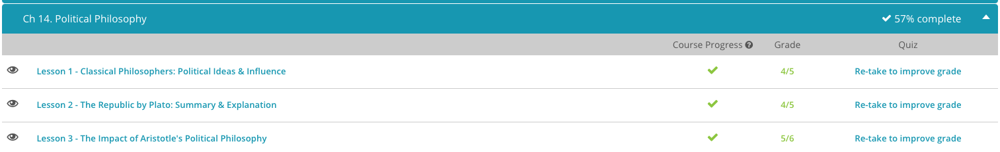

### Andrew Garber
### 11th Grade
### Political Philosophy
### March 6 2023

#### Classic Philosophers 
 - Much of Socrates' philosophy related to human activity, as opposed to the physical universe. His views on politics are hotly debated. In Plato's famous Republic, Socrates is presented as opposing democracy, and many scholars argue Socrates favored a government in which wise philosopher-kings rule. Unfortunately for Socrates, his views were not accepted by all.
 - Arguably the most influential philosopher of all time, Plato, who lived from the 420s to the 340s B.C.E., was a pupil of Socrates and was concerned with understanding the true, objective nature of reality, a branch of philosophy called metaphysics. It has been said by prominent scholar Alfred North Whitehead that the whole of Western philosophy consists of 'footnotes to Plato.' Plato is known for developing the Theory of Forms, in which he argues the true 'essence,' or form, of material objects exists in another non-material realm. His most famous work is his Republic. Plato's Republic is a Socratic dialogue concerning issues of politics, justice, and the role of philosophy. In Republic, Plato seems to suggest the ideal society is one ruled by just philosopher-kings, as opposed to a democracy.
 - In regard to politics, Aristotle conceived of the city as being the natural political entity and the center of political activity. The purpose of the city was to enable citizens to lead a good, fulfilling life.
 - Cicero, who lived from 106 B.C. to 43 B.C.E., was not a Greek philosopher. He was a Roman and is primarily known not as philosopher, but as an orator and politician. Cicero warned that indulgence, greed, and selfishness would lead to the destruction of Rome. He viewed the Roman Republic as the ideal political institution and believed it could only be preserved through the virtue of its people. Cicero wrote volumes, and his work was particularly influential among Renaissance thinkers. When political chaos and civil war swept Rome, Cicero found himself the enemy of Mark Antony, and under the orders of Mark Antony was executed. While not a formal member of the school, Cicero was a highly influential Roman Stoic philosopher and made heavy use of their philosophy and ethics in his arguments.

#### The Political Philosophy of the Republic by Plato
 - One of Plato's most famous works, which can be attributed to the lessons he learned from Socrates, was The Republic. This is also considered to be the first book on political science or government and uses the Platonic method to reason through ideas on justice. In the book, a group decides to create an imaginary city to define what justice looks like. The city is divided into classes: the Rulers who have an understanding of right and wrong, the Guardians who protect the city and care for its people, and the Producers who provide goods and services for the people.
 - As the men banter, they begin to discuss the meaning of justice, and what it means to be just, like being honest and following the law. Socrates takes each idea apart and this sets the theme for the rest of the book. The primary questions the men try to answer are what justice is, and does it make someone happier if they are just?
 - In Book Two, Glaucon attempts to define the good. He goes on to explain that good can be organized into three categories:
    - Good for the sake of being good
    - Good for the sake of being good and because people get something out of it
    - Good only because people get something out of it
 - Socrates introduces the idea that they should first define a just city, and this will help them to then define a just individual. The group then begins to argue for what makes a city just, and they imagine the ideal city and what it would look like and how it would function.
 - Book Three involves a discussion about the Guardians, who Socrates calls the 'heroes of the city.' This conversation evolves into one about the education of the Guardians by elder men in the city, and the group argues about what Guardians must be taught to want to protect a city.
 - In Book Four, Socrates finally gives his answer to what constitutes a just society:
     - A city that doesn't use money so that there is no poverty or rich,
     - A city that has the wisest Rulers uncorrupted by wealth, and
     - A city with the best Guardians who value their education more than anything else
 - Book Five is a deeper discussion, where the social constructs of the city are broken down. Socrates believes women should belong to the Guardian class as well and should receive the same education. He also thinks sex should be regulated so the best breeds with the best.
 - In Book Six, Socrates tries to convince the others that philosophers are wise and just in that they search for the truth as a way of life. However, Adeimantus argues that most philosophers are not like this and, in reality, are useless in that they hold ideas that are opposed to popular traditional beliefs. Socrates counters that all a city needs to be just is a Ruler who is also a philosopher or a philosopher King, being that they are of the right mind and soul, always searching for truth.

#### Aristotle's Impact
 - For many, Aristotle's writings and teachings are the foundation of modern political science. What are the exact purposes of politics and government? What are the moral duties of the state? What is the ideal relationship between government and citizens? Aristotle was amongst the first to really address these questions in a practical, logical manner, and to describe the state as existing to nurture human morality.
 - Aristotle's theories were the foundation for moral and political debates in Western philosophy, and they influenced scholars from ancient Rome to the medieval Catholic Europe and Islamic Middle East. Our modern ideas about government have evolved from this to include the idea that governments exist to protect us and our liberties. Still Aristotle's writings continue to be amongst the most studied and cited texts in human history. This is especially impressive considering that less than a third of his estimated writings have survived, and those that did are mostly lecture notes. So, it's no surprise that medieval Muslim scholars called him the 'first teacher,' or that Cicero referred to his works as a 'river of gold.' Aristotle was, quite simply, 'The Philosopher.'
 - Aristotle's impact is unquestionable and significant, but there are aspects of his thinking that have reinforced some of the darker practices in human society. While he helped produce one of the earliest taxonomies of plants and animals, Aristotle also sought to categorize human beings. In his book titled 'Politics', Aristotle described how some individuals are natural slaves, which was later used by anti-Abolitionists to justify continuing slavery in the United States prior to the Civil War. Aristotle's position on natural hierarchies existing in human society has been used to reinforce systems like feudalism with serfs, castes systems, as well as the race-based slavery of the United States.

