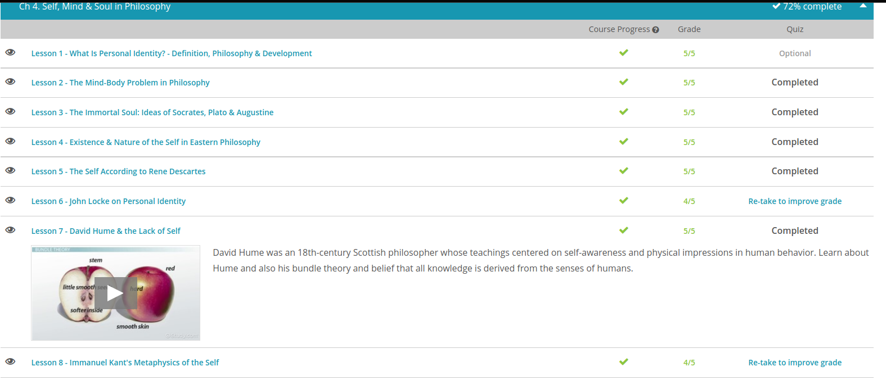
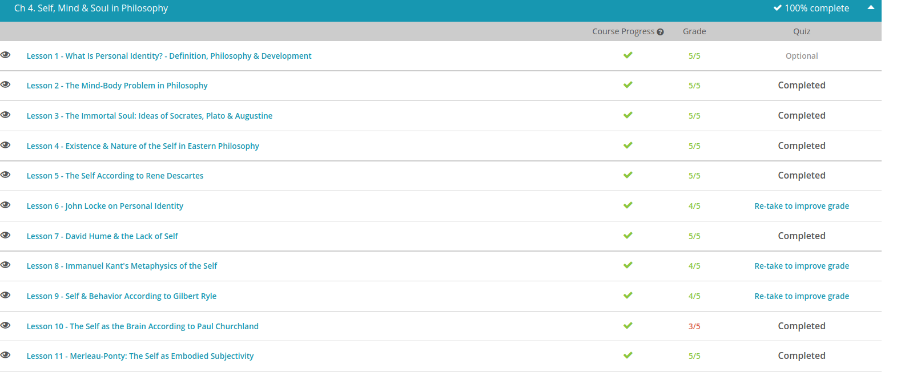

### Andrew Garber
### Self, Mind, and Soul
### December 23

#### Personal Identity
 - Personal identity is the concept you develop about yourself that evolves over the course of your life. This may include aspects of your life that you have no control over, such as where you grew up or the color of your skin, as well as choices you make in life, such as how you spend your time and what you believe. You demonstrate portions of your personal identity outwardly through what you wear and how you interact with other people. You may also keep some elements of your personal identity to yourself, even when these parts of yourself are very important.
 - When you ask yourself how you know you are the same person you were as a baby, this is a question of persistence. In this context, persistence means our existence across time and how we can prove it. In other words, we perceive that our self 'persists' through our life as the same human being, but how do we know for sure? The philosophers Plato and René Descartes, as well as many religions, have proposed that we persist because we have a soul, a timeless essence that continues in some form even after the death of our living, breathing human body.
 - Personal identity develops over time and can evolve, sometimes drastically, depending on what directions we take in our life. For instance, a person who at 25 identifies himself as part of a particular political party, of a particular faith, and who sees himself as upper-middle class, might discover that at 65, he's a very different person. Perhaps he's no longer interested in politics, he's changed his religion, and he's living on less money than when he was 25. Any variation is possible during a person's life span.
 - According to the philosopher David Hume, living life as a human being leaves only impressions, rather than one stable identity or sense of self. These impressions are the changing, shifting elements of our existence. Think of the various ways you have looked at the world throughout your life. You've had a set of experiences and have changed because of them. Hume argued that due to the unstable nature of impressions, personal identity cannot be said to persist through time. We perceive a sense of self because of the way our mind put impressions together and makes sense of them as 'me.'
 - Hume challenged earlier ideas about persistence and the psychological and physical continuity theories that had come before him. Physical continuity theory had looked at how we have the same human body we have had during our life and that this helps us know we are ourselves. Psychological continuity theory had focused on how the mind and memories seem to tie a person's identity together. Hume questioned these theories that talked of an enduring personal identity. Instead, he pointed to the fleeting nature of our experiences and how we are ever-changing.

#### The Mind-Body Problem
 - Dualism is the concept that reality or existence is divided into two parts. When speaking philosophically about humans, these two parts are often identified as the mind and the physical body. According to dualism, the mind is somehow separate from the physical attributes of the body.
 - In dualism, the mind is part of the unseen world. Being a bit gross, if you opened up a human skull you could see, touch, and smell the human brain. However, try as you might, you would not find a mind. According to dualism, it is a separate entity or reality. Using this idea, the very famous Descartes asserted the mind is the seat of our consciousness. This mind is where we find our emotions, our will, our intellect, and our passions. For this reason, our identity comes from the mind. Summing this up, Descartes would say, 'I think, therefore I am!'
 - Standing opposed to dualism in the mind-body argument is materialism. Materialism is the belief that nothing but matter exists. In other words, if you can't experience it with your senses, it's not part of reality. Using these parameters, materialism holds that the mind does not exist. We can't see, touch, or taste it so it's on the same plane as myth.
 - For many who espouse materialism, what we call the mind is really just a collection of physical processes. For instance, materialism would argue that when a person is depressed, it has nothing to do with what's going on in some mystical mind. It's just brain chemicals misfiring.
 - One proponent of materialism who really challenged the concept of dualism was Gilbert Ryle. He actually thought the idea of a mind controlling the physical body to be as absurd as ghosts operating machines.
 - Paul Churchland, another philosopher who espouses materialism, uses traumatic brain injury to argue against the mind as the seat of identity. Summing up his arguments, he asks, 'If the mind is the seat of identity, why does brain injury alter a person's personality?'
 - If the mind was a bona fide separate thing, wouldn't it preserve a person's sense of self, regardless of damage to a physical organ? However, since brain injury often does modify a person's personality, Churchland asserts everything we call self does not originate in the mind. It comes from the physical working of a very physical brain.

#### The Immortal Soul: Socrates, Plato, Augustine
 - Being the earliest of the three, we'll start with Socrates. Admittedly, much of what we know about Socrates is conjecture. Keeping our summary of his views rather general, he believed the soul is immortal. For this reason, he asserted that death is not the end of existence. Death is simply the separation of the soul from the body.
 - As a supposed student of Socrates, Plato agreed that the soul is immortal and separate from the body. However, he upped the ante a bit. He believed the soul was eternal. According to Plato, the soul doesn't come into existence with the body; it exists prior to being joined to the body.
 - Sounding a whole bunch like reincarnation, Plato believed the soul exists within a body until that body dies. It then sets up house in another body. For this reason, Plato called the body the prison of the soul.
 - As our last dualistic thinker of the day, Augustine also believed the soul to be immortal. However, he believed the soul AND the body make up a human. The body isn't just a prison for a soul that jumps from body to body. Instead, one body and one soul make up one person. Yes, he agreed that the soul is immortal; he just didn't buy into the idea that it hops from body to body.
 - Being a bit cryptic and heady, Augustine asserted the soul is immortal because it possesses truth. Stating it as simply as I can: Augustine argued the human soul is capable of scientific reason and truth.
 

#### Existence
 - There are many different branches of Hinduism with varying beliefs, sort of like there are many different branches of Christianity. The Brahman is essentially the sacred, the god spirit or the universe. In contrast, the Atman is the human soul, or the self. Hinduism teaches that the Atman is essentially part of the Brahman, or universe. 
 - As with Hinduism and Christianity, there are many different branches of Buddhism, and they can believe vastly different things. Two concepts that are agreed on in most Buddhist branches are the ideas of interconnectedness and a lack of a self. Think about a book as an example of interconnectedness. The book is made up of many parts: the paper, the ink, the binding, the ideas, and so on. Each of those parts individually doesn't make up a book, but together they are one being, and thoughts are shared from the writer to the reader.
Interconnectedness basically just means that everything is connected
 - Many Buddhists believe that humans are just a stream of consciousness, not a separate entity. Because we are so interconnected, they argue, there is no real distinction between us and others. Norah's book is made up of many parts: the paper, the ink, the binding, the ideas, and so on. Each of those parts individually doesn't make up a book, but together they are one being

#### The self according to Descartes
 - "I think, therefore I am." - René Descartes
 - As one of the most famous philosophers of all time, Rene Descartes is considered by the West to be the 'Father of Modern Philosophy.' Along with his contributions to math and the sciences, Descartes is firmly linked to dualism, a concept he discusses in his work, Meditations on First Philosophy. (Not the same thing as Meditations by Marcus Aurelius, which is a different book entirely - though with some overlap in ideas.)
 - To explain, dualism is the concept that reality or existence is divided into two parts. When discussing dualism in the context of humanity, this division is between the mind and the physical body. In other words, the mind is separate from the empirically studied, physical attributes of the body. To state it differently, dualism tells us that the mind is part of the unseen world. You can't prod it with a needle or hear it with a stethoscope, but it still exists. It's just a separate reality.
 - For instance, a guy named Gilbert Ryle came along in the 20th century and called dualism a category mistake. Trying to explain it succinctly, a category mistake occurs when something is illogically placed in the wrong category. To explain, Ryle's argument went something like this: 'Thinking the mind stands apart from the physical body is like visiting a college, seeing the classrooms, shaking hands with the students, and then at the end of the day asking when you get to see the university.' In other words, the abstract concept of the mind is really just made up of physical processes, in the same way that a university is made up of students, buildings, etc.

#### John Locke
 - For starters, let's define identity. Although there are many definitions, many philosophers agree identity means being one thing and not another. It's what makes you you and me me. Of course, this leads to all sorts of questions. For instance, if time seems to change all of us, how can you know that you're still you and how can I know that I'm still me?
 - To answer this one, we have Locke's principle of individuation, the idea that a person keeps the same identity over time. In other words, I'm still the same tomboy who petrified my parents.
 - When discussing this topic, Locke would go to great lengths to discuss what identity is not. For instance, identity is not made up of material substance. In other words, our physical being does not give us our identity. If it did, what would happen to those who lost an arm or a leg? Would they be a different person simply because their physical body had been altered? Locke would answer, 'Of course, not!'
 - Rather than being tied to our physical bodies, Locke believed our identity was tied to our consciousness. In one of his works, he stated consciousness is the perception of what passes in a man's own mind. To boil this down, most philosophy teachers or students agree this rather verbose quote simply means consciousness equals memories.
 - Taking the importance of memory even further, Locke's day man and night man theory asserted a person is only the same person if he remembers being that person.

#### Hume
 - David Hume is a renowned 18th-century Scottish empiricist(and good friend of Adam Smith). Breaking him down a bit more, empiricism is the theory that all knowledge is derived from human senses. Stated simply, we only know what we know through our physical experiences - things like sight, sound, touch, taste, and smell.
 - Giving us our first clues into his lack of self beliefs, Hume made a distinction between impressions and ideas. This topic is covered in his An Enquiry Concerning Human Understanding. According to its pages, impressions are everything that originate from our senses. For instance, our sense of touch tells us a porcupine is sharp. This is an impression. However, many philosophers assert that impressions are the actual physical objects themselves.
 - On the other hand, ideas are just feeble images of thinking and reasoning based on our impressions. Going back to our porcupine, our impressions tell us it's sharp. From this impression, we form the idea that it's dangerous to the touch.
 - However, since the concept of 'dangerous' can't necessarily be defined precisely, nor can it be seen, touched, or tasted, it's just an idea, which can't be rationally proven. Using this sort of argument, Hume argues that ideas are always inferior to impressions.
 - Keeping his notions of impressions versus ideas in mind, let's get to his views on lack of self. For this we turn to his bundle theory. In this rather esoteric assertion, Hume argued that properties we can sense are the only real parts of an object. To illustrate this, the physical properties of an apple are often used, or in Hume's words, we'll use the impressions that make up the idea of an apple.
 - Without over-thinking things, if this were a real apple, we'd say its properties were red, smooth skin, hard, softer inside, stem, little smooth seeds, etc. All of these impressions give us the idea of an apple.
 - Now, suppose we removed each of these properties. We take away its stem, we take away its color. We take away its smooth skin, we take away its soft inside. We even take away its seeds. With all this removed, we're left with nothing. Without its physical properties, we have absolutely nothing left to give us the idea of an apple. As the bundle theory states, the properties or impressions of our apple were the only real things we could experience about the apple! Without them, we have nothing to prove there ever was an apple!
 - while most Western philosophers were going with the 'I think, therefore I am' mantra, citing one's mind as one's source of self, Hume showed up and said, 'Well, maybe you're not! Maybe the idea of self we've made up is just a bunch of physical impressions!'
 - In other words, maybe the mystical idea that we exist beyond our bodies is wrong. Maybe the idea that there is some sort of soul or essence existing independently of our physical workings is a fallacy. To Hume, we'd find that you and I are just faint ideas that are built on physical impressions. Therefore, take away the body and you have a complete lack of self!

#### Immanuel Kant
 - For starters, metaphysics can be summed up as the branch of philosophy that deals with being, substance, and identity. Relating this to our lesson, let's take a look at what Kant thought of self and being. Stated simply, how do we get our knowledge of self?
 - To begin, Immanuel Kant was an uber-famous 18th-century Prussian philosopher. During his era, much of philosophy centered on self-knowledge. In other words, how do we know what we know and where does this knowledge come from. Is it internal or external?
 - Working to find a middle ground in this debate on self-knowledge and perception was Immanuel Kant. According to him, we humans have both an inner and an outer self which unify to give us consciousness. The inner self is comprised of our psychological state and our rational intellect. The outer self includes our sense and the physical world.
 - Kant argued that apperception occurs in the inner self. In a nutshell, apperception is how we mentally assimilate new ideas into old ones. Occurring through rational reasoning, it's how we make sense of new things.
 - Moving on to representation, Kant argued it occurs through our senses. As part of the outer self, representation can be simplified as mental imagery based on past sensations and experiences.
 - According to Kant, empiricists who only rely on the sensory world and representation miss the mark on self by negating the effects of apperception. On the other hand, rationalists who cancel out representation miss by just as much. Rather than self being one or the other, Kant believed the inner and outer self combine to give us our consciousness.

#### Gilbert Ryle
 - So, if the mind doesn't exist, where do we get our sense of self? Summing up Ryle's answer in three words, he'd say, 'From our behaviors'. While many philosophers espouse, 'I think, therefore I am,' Ryle sort of said, 'I act, therefore I am!' In other words, we're all just a bundle of behaviors. In other words, someone thinks she is intelligent because she acts intelligently. Someone thinks he is kind because he acts kindly.
 - It's our behaviors and actions that give us our sense of self. There is no mystical magic. It's just a bunch of chemicals, muscles, and electric impulses causing behaviors. From these behaviors, we get our sense of self.

#### Paul Churchland
 - In dualism, Because the mind is the seat of our consciousness, it's what gives us our identity. No, we can't see it, taste it, or touch it, but it does exist. Not only does it exist, but it is what makes self, self.
 - To this assertion, Paul Churchland has come along and pretty much said, 'I don't think so!' Tossing aside the concept of dualism and the brain, Churchland adheres to materialism, the belief that nothing but matter exists. In other words, if it can't somehow be recognized by the senses then it's akin to a fairy tale.
 - Applying this argument to the mind, Churchland asserts that since the mind can't be experienced by our senses, then the mind doesn't really exist. Based on this assertion, Churchland holds to eliminative materialism. Stated simply, eliminative materialism argues that the ordinary folk psychology of the mind is wrong. It is the physical brain and not the imaginary mind that gives us our sense of self.
 - First, why should we believe in a mind when science is proving that mental health is connected to the physical brain? For instance, depression is strongly linked to brain chemicals.
 - Adding to this, Churchland challenges the concept of the mind by using the misfortune of traumatic brain injury. With this, eliminative materialism asks 'if the mind is the seat of self, why does brain injury alter a person's personality?' If the mind was a real separate entity, wouldn't it retain a person's sense of self despite damage to a physical organ? Since brain damage alters a person's personality, Churchland asserts that the concept of self originates in the physical brain, not an invented mind.
 - Adding to this, Churchland espouses that the idea of the mind is incongruent with the theory of evolution. Working to keep this simple, evolution purports that humans evolved from purely physical material. There was nothing mystical or imagined about it. Therefore, since evolution is purely physical, why would anyone impose the non-physical mind concept into a completely physical picture?

#### Merleau-Ponty
 - Before diving into our lesson on Maurice Merleau-Ponty and his ideas on self as an embodied subjectivity, we're going to need to explain what we mean by 'subjectivity.' We're also going to need to understand rationalism and empiricism. With so much to cover, today's lesson will definitely be a bit of a shallow dive into a very deep pool.
 - To jump in, let's define what we mean by subjectivity, or subject. For our purposes, we'll think of a subject as something that has being. A subject is a real thing that can take real action and cause real effects. In short, it exists. Keeping this in mind, Maurice Merleau-Ponty believed the physical body to be an important part of what makes up the subjective self.
 - Almost in a Goldilocks this-porridge-is-too-hot-and-this-porridge-is-too-cold sort of way, Merleau-Ponty stepped on the scene and declared rationalism and empiricism both miss the mark. To him, rationalism elevates the importance of the mind and perception too much, while empiricism too strongly negates them.
 - Rather than seeing the perceiving mind and the acting body as separate, Merleau-Ponty argued that they are interconnected. They both are our seat of knowledge, and they both give us our sense of self.
 - He argued the mind is part of the body and the body is part of the mind. Yes, we may have some sort of stand-alone mental faculty that perceives, but it needs the body to communicate with the world. It needs the body to act on its perceptions. Disagreeing with Plato and his prison idea, Merleau-Ponty argued the body is not just an object that imprisons the mind, it is a subject. It is not just a slave to the mind's consciousness. It is part of consciousness. The perception of the mind and the actions of the body are unified as one.

