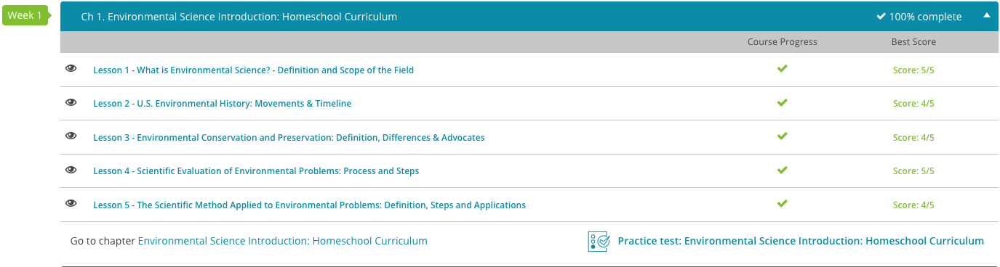

### Andrew Garber
### AP Environmental Science
### September 7 2023
### Chapter 1: Introduction

#### 1.1: What is Environmental Science?
 - Environmental science is the field of science that studies the interactions of physical, chemical, and biological components of the environment and the relationships between these components and humans.
 - There are three fundamental goals of environmental science:
    - Learn how the natural world works.
    - Understand how we as humans interact with the environment(both positively and negatively).
    - Determine how we affect the environment, and how we can deal with these effects.
 - Environmental science is an interdisciplinary field, incorporating cocnepts from biology, chemistry, geology, but also economics, political science, and ethics. (*My Favorite Kind of Science!*)
 - The Importance of Environmental Science is that it helps us understand the world around us, and how we can interact with it in a way that is sustainable for the future. With the world's population growing greatly, though the rate of growth is slowing which is a complicated topic, the demand for natural resources, land, water, and food is ever-increasing. In addition, as the world becomes wealthier - without a doubt, a good thing -, all of these demands will increase even more.
 - Natural resources are materials and energy sources found in nature that humans take to use. 
    - Renewable resources are resources that are replenished over short periods of time, such as sunlight, wind, wave energy, and timber(though timber is not renewable if it is used faster than it can be replenished).
    - Nonrenewable resources are resources that are in finite supply, such as oil, coal, and natural gas. While these technically renew, it takes far too long for it to be renewable on a human timescale, which is truly the effective timescale for this discussion.
 - Ecosystem services are the natural processes that provide all of these resources, such as water and air purification, nutrient cycling, climate regulation, polination of plants, and many, many more.
 - Environmental Science and Environmentalism are far from the same thing. Environmentalism is a social and political movement to help preserve Earth's resources, and minimize the negative effects of human activities on the environment. How effectively they do this, is a different discussion(https://investwithimpact.substack.com/p/busting-nuclear-power-misconceptions). 
 - Environmental Science is the rigorous study of the interactions of the environment, chemical, physical, and biological. This is a science, and as such, it is not a political movement, but rather a field of study.

#### 1.2: Environmental History of the U.S.
 - The environmental movement(both environmentalist, and environmental science) truly began in the late 19th century, speareheaded by a man named John Muir(for whom the Muir Woods are named, one of the most beautiful places I have ever been). He was a preservationist, and believed that nature should be kept in its pristine state, and that humans should interfere with it minimally while availing themselves of its beauty, and splendor. He helped to found an organization known as The Sierra Club, which is still around today, and is one of the most influential environmental organizations in the world. 
 - Many civilian organizations were founded in the early 20th century, such as the Nation Audubon Society, and the Ecological Society of America. In addition, the U.S. Government began to take a more active role, with the creation of the U.S. Forest Service, and the U.S. Fish and Wildlife Service.
 - The 1970s were a pivotal decade for the environmental movement, with the creation of the Environmental Protection Agency(EPA), the Clean Air Act, the Clean Water Act, and the first Earth Day being celebrated in 1970.

#### 1.3. Environmental Conservation and Preservation
 - Conservation is the belief that the environment(and its resources) should be used in a responsible way, so that there is enough for future generations. This was spearheaded by Gifford Pinchot, who was the first head of the U.S. Forest Service under Theodore Roosevelt when he was President. He believed that the environment should be used in a responsible way, but that it should be used.
 - Preservation on the other hand is the belief that it should be kept exactly as it was, and that humans should not interfere with it at all. As mentioned above, this was spearheaded by John Muir, and the Sierra Club.

#### 1.4. Scientific Evaluation of Environmental Problems
 - The main tool of environmental science is the scientific method, which is a process of making observations, proposing ideas to explain those observations, and then testing those ideas through experiments. This is then applied to the environment, for whatever purpose is needed.
 - A major purpose would be an environmental risk assessment, which is the process of determining potential adverse environmental effects of a project. While these are not perfect, they are a good way to determine the potential effects of a project, and how to mitigate them. In modern times though, they have become a beauracratic nightmare, and are often used to stop projects that are not actually harmful to the environment, but rather are just opposed by the people who live in the area or political opponents.

### Screenshot
 - 