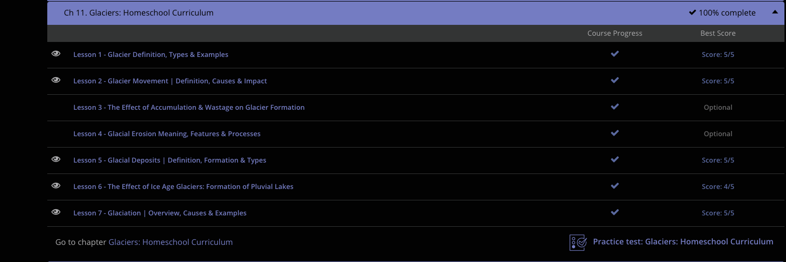

### andrew garber
### december 22 2023
### CLEP Western Civilization 1
### chapter 11 glaciers
 

#### 11.1 glaciers
 - Most of the earth is covered with water, and most of that is salty and in the oceans. In fact, about 97% of Earth's water is ocean water. The remaining 3% is fresh water, and two thirds of that is frozen in glaciers. Glaciers are large masses of ice that can take many forms, from huge sheets to jagged blocks of slow-moving ice and rock. For billions of years, glaciers have carved the earth's surface and fed rivers and oceans with water. Their presence is still felt even millions of years after melting away to create valleys, lakes and even mountains.
 - Glaciers are formed from the accumulation of ice and snow. But in order for this to become a glacier, it has to move under its own weight. An accumulation of ice isn't considered a glacier until it starts moving. Once it does start moving, though, it acts like a giant plow that scrapes and scours the earth. As glaciers move across the land, they loosen and pick up rocks along the way, dragging them across the earth's surface and creating striations, which are just large scratches that are formed in the direction of glacial movement.
 - A glacier can move in two ways, internal flow is when the pressure and gravity from the sheer mass of the glacier causes it to slide. The other way is Basal Sliding, when it moves becuase of a slight melting of the ice at the bottom of the glacier. This creates a thin layer of water that allows the glacier to slide across the ground. This is the most common way glaciers move.
 - Continental glaciers are also known as ice sheets because they envelop everything in sight with a layer of - you guessed it - ice. These are the kind of massive, all-consuming glaciers that might bring to mind images of ice ages and polar bears, and they currently cover the earth's poles and very cold places, like Greenland. Because they are so massive, continental glaciers smooth the earth's surface as they move. 
 - Alpine glaciers are created from the densely packed snow and ice found on top of mountains as well as in the valleys between them. Once alpine glaciers begin their downhill descent, they start their slow-moving havoc on the terrain around them.
 - Hanging valleys are also caused by alpine glaciers and are formed when a glacier carves out a deep valley and then melts, leaving the valley suspended in the mountain range.
 - Tidewater glaciers are alpine glaciers that move downhill and meet the ocean. Chunks of the glacier can break off in a violent process called calving, which causes large ice chunks to fall into the ocean and form icebergs.

#### 11.2. glacier movement
 - Now, all glaciers start with snowfall that accumulates faster than it melts. As the years pass, layers of snow pile up, compressing the layers below into dense ice. This process continues until the mountain of ice becomes very heavy. It starts to move when the weight becomes too heavy to maintain the glacier's shape. Of course, if you stand next to a glacier, you probably would not see this movement because most glaciers only move a couple of centimeters to a couple of meters per day.
 - The movements they do make are typically a combination of processes, but the most common process is internal plastic deformation, or internal flow, in which the glacier's weight becomes too much to support itself. This results in the slippage of ice layers within the glacier, so the glacier moves downhill, as if it is being spread like a deck of cards with the top layers moving more quickly than the bottom layers. This spreading happens because the lower layers are subjected to friction due to contact with the land, which slows their movement.
 - The other process is basal sliding, which is when the glacier moves because of a thin layer of water that forms at the bottom of the glacier. This water is created by the pressure of the glacier's weight, which causes the ice to melt. The water acts as a lubricant, allowing the glacier to slide across the ground. This is the most common way glaciers move.
 - The lowest levels of the glacier are under huge pressure due to the weight of the ice above them. This means that the top layers of ice are more brittle, and can crack causing crevasses. These crevasses can be hundreds of feet deep and are very dangerous to hikers and climbers.
 - Glaciers move at varying rates. We mentioned earlier that the slowest glaciers only move a couple of centimeters a day. The fastest can move upwards of 30 meters a day, which is a little more than the distance between bases on a baseball field. There are factors that increase glacial flow rates. These include a steeper slope, which accelerates the movement thanks to the added pull of gravity. The rate also increases with increased size and thickness of a glacier due to the added weight and pressure. Warmer temperatures allow for more melting of ice at the base of the glaciers, which acts as a lubricant to speed flow. And glaciers that sit on smoother rock surfaces will flow with more ease because there are not as many rocky structures to impede their movement.

#### 11.5 glacial deposits
 - glacial deposition is simply the settling of the sediments that moving glaciers pick up - with such huge mass and surface area, they are bound to pick up a lot of stuff. When it melts, glacial till is dropped in piles called moraines. Moraines are generally dropped in fairly straight lines, such that we can track the movement of glaciers by looking at the moraines they leave behind. Moraines can be lateral, medial, terminal, or ground.
 - sometimes, glaciers will pick up gigantic boulders and drop them in places that they don't belong. these are called erratics. erratics are often found in places that are very different from the rock that makes up the erratic itself. for example, a glacier might pick up a boulder of granite and drop it in a place where the bedrock is limestone. this is a good way to tell that a glacier has been there.
 - a drumlin is a long, smooth hill that is formed by sediment left behind by a glacier - Bunker Hill in Massachusetts is a famous example.

#### 11.6. the effects of ice age glaciers
 - glaciers are gigantic mountains of moving ice that dig, scrape, and plow their way across the earth's surface. they are responsible for many of the features we see on the earth today, including valleys, lakes, and even mountains. once they melt, they leave behind trails of sediment and rocks that we can use to trace their approximate movements and explain nearby features.
 - an indirect effect of glaciers is the creation of pluvial lakes, which are lakes that were gigantic due to excessive rainfall caused by glaciation in the past, they are now empty or near empty. the great salt lake in utah is an example of a pluvial lake.
 - isostatic depression is another indirect effect of glaciers. isostatic depression is the sinking of the earth's crust due to the monumental weight of a glacier. eventually, once the glacier melts and the weight is removed, the crust will rise back up but this can take thousands of years. the great lakes are still in their rebound phase.
 - the most obvious effect of glaciers is their impact on sea levels - when a gigantic amount of water is stored in glaciers, sea levels drop - once they melt, sea levels rise. this is why the earth's sea levels are rising today - because of melting glaciers caused by climate change.

#### 11.7. Glaciation
 - the constant moving of continents, and cyclic changes in the earth's orbit have caused periods of glaciation in the past.
 - there are two main theories as to the causes of ice ages: one is the changing of continental posiitons via plate tectonics, and the other is the changing of the earth's orbit around the sun.
 - the first theory is that due to plate tectonics, the continents movement actually shifts water and weather patterns, when these patterns shift, the earth's climate changes, and this can cause ice ages or drastic warming periods - or, the changes can be fairly minor.
 - the second theory is a cyclic one put foward by a scientist named Milankovitch, which points to variations in the Earth's orbit(3 variations) that result in long term changes to the earth's climate. the first is eccentricity, which is the shape of the earth's orbit around the sun. if it is more oval, the earth will be closer to the sun at some points in its orbit, and farther away at others. the second is obliquity, which is the tilt of the earth's axis. the third is precession, which is the wobble of the earth's axis. all of these variations can cause changes in the earth's climate, and can cause ice ages or drastic warming periods. (all of these terms should be familiar from your obsession with space - eccentric orbits, axial til in rockets, satellites and planets, and precession in vehicles and gyroscopes.)

