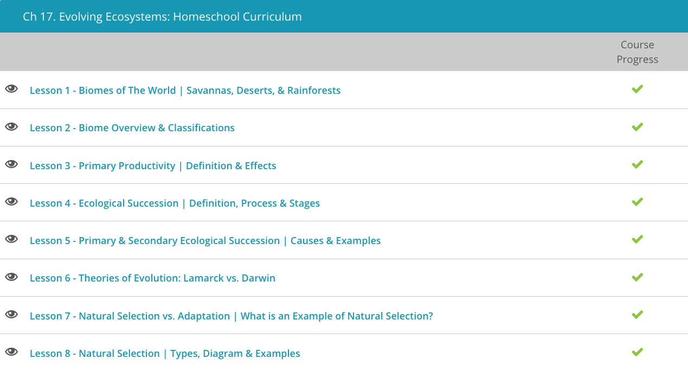

### Andrew Garber
### March 26 2024
### Chapter 16: Evolving Ecosystems

### 16.1.
 - Temperate deciduous forests are forests in temperate climates that are characterized by broad-leaved deciduous trees. These forests are found at mid-latitudes in areas that get significant rainfall in the warm summer months, which can support fast-growing species like birch, hickory, maple, and sycamore trees.
 - Tropical rainforests are forests in the tropics that receive over 100 inches of rainfall per year. Most types of forests can support large populations of plants and animals; however, tropical rainforests support the greatest number of species of any other type of biome on the planet. This incredible species richness is due largely to the combination of a tropical climate and high, year-round rainfall, which provide optimal growing conditions for the largest number of plant species. In turn, the high number of plant species can support a high number of animal species
 - Savanna is essentially grassland interspersed with trees. It is sometimes found in temperate climates, usually in areas that are transitional zones between grassland and forests. However, savanna is mostly found in tropical regions of the world where the climate changes in a seasonal pattern from cool and dry to hot and dry and then to warm and wet before starting the cycle again the following year. This is the type of savanna found in the Serengeti National Park, which is famous around the world for supporting so many large animals such as giraffes, elephants, rhinos, zebras, wildebeest, cheetahs, leopards, and lions.
 - Lakes, ponds, streams, and rivers are all examples of freshwater aquatic biomes. Since lakes, ponds, streams, and rivers are often naturally isolated from each other in many ways, species of freshwater fish are often found only in one particular lake or river system or even in a single stream. These species are said to be endemic, or only found in one particular area.
 - Desert biomes are characterized by very little rainfall, so any landscape that gets less than 12 inches of rain per year can be considered desert. They occur at all latitudes, and although the popular depiction of deserts is a vast expanse of nothing but sand for miles, deserts can have a variety of soils, plant life, and animal life. In the Australian Outback, drought-resistant plants with small, leathery leaves are common, and some plants, like the desert bloodwood tree, store large quantities of water in their roots to survive prolonged periods of drought.

### 16.3. Primary Productivity
 - The plants that conduct photosynthesis are known as autotrophic because they produce their own food. These types of plants are also referred to as primary producers because the food they create is the main source of energy that is consumed by other organisms. Primary production is the term used to describe the amount of new organic material, or biomass, created by the primary producers in an ecosystem. It is important to understand primary production and the amount of organic materials produced because all organisms, including humans, rely on this material that plants produce to survive.
 - Biomes are large terrestrial or aquatic regions on Earth that are characterized by a unique climate and community of plants and animals. Due to the fact that the descriptions of biomes are changing and new biomes are being identified, the number of different biomes on Earth is not a set number.
 - There are many biomes on Earth that have high levels of primary productivity. These highly productive areas have an average annual net primary production of over 1,000 grams per square meter per year. The aquatic biome with the highest level of primary productivity is the coral reef biome with around 2,500 grams of biomass per square meter per year. The biome that includes swamps and marshes and the estuary biome are the other aquatic biomes that have high levels of primary productivity. These biomes have higher levels of primary productivity than other aquatic biomes because, in these regions, there is an increase in nutrient availability.
 - Biomes that are considered moderate in their primary productivity produce between 500 and 1000 grams of biomass per square meter per year. All three biomes in this category are terrestrial and include tropical savannas, boreal forests, and temperate grasslands. These biomes receive less rain than the biomes that produce high levels of primary productivity and are more prone to long periods without water.
 - The biomes that have low levels of primary productivity produce less than 500 grams of biomass per square meter per year and include deserts, the tundra, the open ocean, and the lakes and streams biome. The desert and tundra biomes have low levels of primary productivity, 90 and 140 grams per square meter per year, respectively. These low levels are due to the very small amounts of rainfall and extreme temperatures. Although there are plants adapted to live in these biomes, they are slow growing and do not produce a large amount of biomass. The aquatic biomes with the lowest levels of primary productivity are the open ocean and lakes and streams. These biomes have low production because of the limited amount of nutrients available. In addition, the open ocean also has low primary productivity because the sunlight is not able to penetrate the deep water and photosynthesis can only occur in more shallow areas.

### 16.4. Succession
 - If an environmnental change is severe enough to strip away the existing vegetation or expose a new landscape, species will colonize the disturbed area and then likely be replaced by other species. Over ecological time, the area may experience several transitions in species composition. This process by which the species structure of an ecological community changes over time is called ecological succession.
 - There are two basic types of ecological succession, which are categorized mainly based on how many nutrients - or lack thereof - are already present in the soil after the disturbance. For instance, primary succession is succession that begins in an area where the soil has not yet formed. Examples of events that precede primary succession would be the formation of a new island by a volcanic eruption or the retreat of a glacier. Secondary succession is succession that begins after an event clears the community but leaves the soil intact. Examples of events that precede secondary succession would be wildfires and deforestation by clearcutting. Because the soil is intact when secondary succession begins, it often progresses much faster than primary succession, and, in fact, certain types of natural events, such as wildfires and floods, can add nutrients to the soil.
 - A good example of secondary succession can be seen after a fire in a chaparral ecosystem, which is a type of ecosystem characterized by dense, evergreen shrubs; mild, rainy winters; and hot, dry summers. Actually, chaparral is a type of biome, or one of the world's major ecosystem types, that is classified according to its predominant vegetation and climate. The predominant vegetation in a chaparral ecosystem consists of woody evergreen shrubs. Small annual plants are also common but can only grow and survive during the rainy winter months. When the weather becomes dry, the annual plants dry up and die, which leaves only the woody shrubs and the occasional evergreen tree as the only live plants in the summer. Typical animals found in chaparral ecosystems include deer, small rodents and birds, lizards, snakes, and, of course, insects. The soil in chaparral ecosystems is very poor and often very rocky.
 - The combination of the hot, dry summers and abundance of dry vegetation makes chaparral ecosystems prone to fires. In fact, chaparral plants and animals are typically adapted to periodic fires. Most of the animals retreat to underground burrows that are deep enough to be insulated from the extremely hot fires that burn the dense shrubs that typically contain very flammable oils in their leaves.
 - Unlike secondary succession, primary succession is never a fast process. Because primary succession always starts from scratch without a significant amount of soil or nutrients (and certainly without dormant roots or large numbers of seeds waiting for their chance to sprout), it takes a special type of organism to colonize and survive in the new habitat.
 - Let's use the example of a retreating glacier in Alaska to look at how primary succession occurs. When the glacier retreats from an area, it leaves mostly rocks and nutrient-poor dirt behind. The first organisms that colonize the new habitat and make up the pioneer community are mostly lichens and mosses.

### 16.5. Primary and Secondary Ecological Succession
 - Ecological succession can happen in any type of environment, including both terrestrial and freshwater ecosystems. Although succession occurs in both of these types of ecosystems, the stages of change are very different due to the variation in the species and community structures of the two different types of ecosystems. Terrestrial succession is better understood and is often divided into primary and secondary succession.
 - Primary succession is the type of succession that occurs when an area experiences a disturbance so severe that none of the original species survive. During the process of primary succession, the disturbance causes the exposure of bare rock and the ecosystem is rebuilt from scratch due to the lack of organisms that remain. Primary succession is often a slow process because it requires many steps to convert bare rock to a functional ecosystem. The process normally starts with the invasion of lichens and mosses, which create soil, and then the process moves on to allow for the establishment of larger vegetation.
 - In contrast, secondary succession is the type of succession that occurs when an area experiences a disturbance that alters the existing ecosystem but does not destroy all of the original species. During secondary succession, the soil and species that remain after the disturbance are used as the building blocks that help facilitate the recovery of the ecosystem.
 - Secondary succession is often quicker than primary succession because the process does not have to start from scratch. The soil and organisms that remain establish a healthy ecosystem and larger plants and animals can begin to reestablish the environment more rapidly.
 - Ecological succession in freshwater ecosystems has not been studied as much as terrestrial succession, and therefore, more is unknown about freshwater succession. It is known that succession in freshwater ecosystems, such as lakes and streams, happens when a disturbance occurs that results in the aquatic area filling with sediment or organic matter.
 - Common disturbances that result in freshwater succession are floods, droughts, erosion and the construction of dams. These types of disturbances often cause land around the freshwater ecosystem to erode and sediment settles into the water. Disturbances can also cause organisms in the water to die, and the organic matter then settles to the bottom of the water.

#### Lamarck vs Darwin
 - The idea that characteristics an organism acquires during its lifetime can be passed on to its offspring is attributed to the scientist Jean-Baptiste Lamarck. This theory is called heritability of acquired characteristics or Lamarckian inheritance.
 - Under this theory, a giraffe that stretches its neck to reach leaves in higher branches of trees would pass on stronger necks to its offspring, which would enable longer reach and eventually result in the evolution of giraffes with longer necks.
 - Similarly, the theory proposes that the disuse of the small toe in mammals, such as pigs, caused it to disappear over time. We might say that the theory of acquired inheritance is akin to the adage Necessity is the mother of invention. The need for a trait drives the evolution of that trait.
 - Darwin disagreed. He reasoned that populations rather than individuals evolved. This evolution is possible because genetic variation already exists within a population. Individuals with different genotypes in the population survive and reproduce at different rates. The agent that determines a differential rate of reproduction is called natural selection.
 - Note the difference between Darwin's and Lamarck's theories. Lamarck believed that the need for a new trait would promote the evolution of that trait. Darwin proposed that evolution occurred through the selective pressure for a preexisting trait in a population. Both are reasonable, **and both can be reasoned a priori**. How can we prove a posteriori? As it turns out, a scientist known as August Weismann conducted a similar experiment to disprove Lamarck's theory. Weismann repeatedly cut off the tails of mice over several generations. He found that the tails of mice in subsequent generations neither disappeared nor grew appreciably shorter.
 - The experiment showed that acquired characteristics are not inherited. The experiment also showed that the genetic material in the germ cells is separate from the genetic material in the somatic cells. The germ cells are the cells that give rise to the gametes

#### Natural Selection vs Adaptation
 - When we speak of evolutionary fitness, we're really talking about a measurement of the ability of a trait to increase or decrease the relative contribution of offspring by an individual to the next generation. That's a fancy way of saying that a phenotype that improves the fitness of an individual will improve its viability or reproductive success relative to other individuals in the population. This is necessarily a slow process because it requires the accumulation of many small changes over many generations, and even an individual with a trait that is beneficial to its survival may get eaten by a predator or die of disease before it has a chance to reproduce.
 - Any structures which are shared by two or more different organisms and are inherited from a common ancestral structure are called homologous. Homologous structures develop from a common ancestral origin but may have diverged in appearance and function over time. For instance, different selective pressures altered the appearance and primary function of a human arm and a bird wing, but both limbs possess similar bones, as depicted by the colors in this diagram.
 - 
 - Contrast this homologous relationship to the relationship between the wing of a bird and the wing of an insect. Both structures allow the organism to fly, so you might think they are homologous as well. However, if you consider the anatomy of the structures, an insect wing is clearly different than that of a bird wing. For instance, the bird wing possesses bones while the insect wing doesn't. Traits or structures that are similar in appearance or function but that evolved separately are called analogous.
 - The ability of insects and birds to fly is an example of convergent evolution, because selective pressure resulted in the independent evolution of flight in each of these organisms.

#### Natural Selection
 - When characteristics that fall at one end of the phenotypic spectrum are favored over the others, the selection is directional. Directional selection is a common force in an evolutionary trend, like longer beaks or shorter legs.
 - However, directional selection is not the only type of selection. A second type of selection is known as disruptive selection. 
 - Consider the example of peppered moths living outside London. Oddly, the moths living near the urban areas were dark gray while the moths in rural areas were light gray. Scientists hypothesized that the dark moths were more fit in the urban areas and the light moths were more fit in the rural areas. But why?
 - An examination of the habitat provided the answer. In the rural areas, tree bark was covered with lichen that was a light-gray peppered color; therefore, darker colored moths would be easier for birds and other predators to identify and eat. However, coal-burning factories covered the trees near urban areas with black soot. Now, the lighter colored moths are at a disadvantage while the dark colored moths are camouflaged.
 - Thus, those at either end of the color spectrum there were more fit than those in the middle. This creates a bimodal distribution of the trait, which is characteristic of disruptive selection.
 - A third type of selection is known as stabilizing selection. Whereas directional selection favored a trait on one end of the trait spectrum and disruptive selection favored either end of the spectrum, stabilizing selection favors the middle of the spectrum or those individuals with an average measurement of the phenotype. Human birth weight is an example of stabilizing selection. Babies born at either extreme of the weight spectrum are less likely to survive than those born at an average weight.

