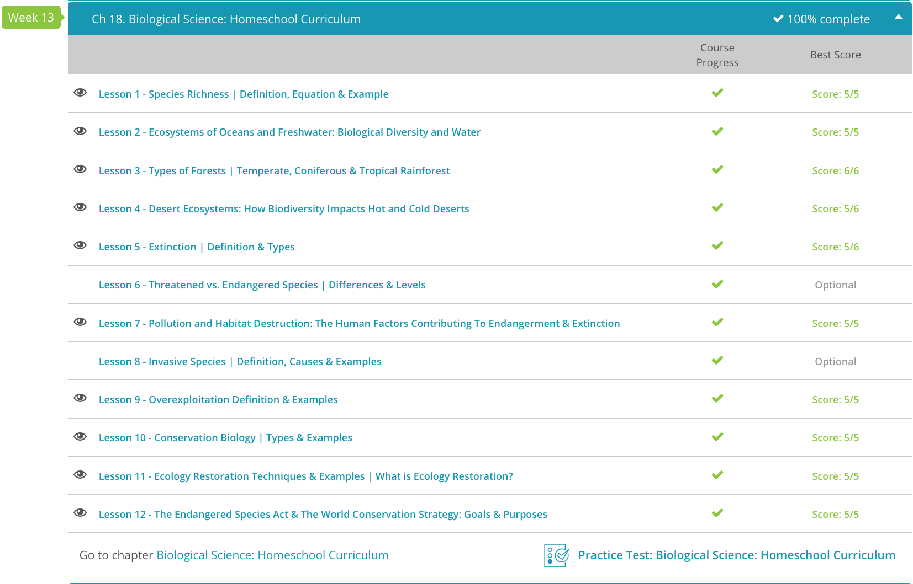

### Andrew Garber
### AP Environmental Science	
### Chapter 18: Biological Science

# 1. Species Richness
 - Species richness, very simply, is a count of the different species in a given ecosystem, region or particular area. 
 - One important thing to keep in mind is the difference between species richness and species diversity. Species diversity takes the abundance, or number of individuals, of different species into account, while species richness does not.
 - This means that 1 turtle and 1 frog would have the same species richness as 1 turtle and 100 frogs, but the species diversity is 100x greater in the second scenario.
 - Species richness is an important index when thinking about conservation of a given habitat. Areas or habitats with rare species are considered to be a conservation priority. An accurate species richness index can help determine what conservation measures need to be taken to provide a habitat where species can survive and thrive.
 - Another consideration when determining species richness is taxonomy. Taxonomy is the science of classifying things. In biology, we classify things in a certain order, which is: kingdom, phylum, class, order, family, genus and species. The mnemonic phrase 'King Phillip Crossed Oceans For Good Spices' can help you remember the order.
 - Our kingdom is Animalia, our phylum is Chordata, our class is Mammalia, our order is Primates, our family is Hominidae, our genus is	Homo
 - The same ecosystem can be sampled and very different species richness indices can be counted, depending on how you sample and how specific you are when counting different species. If you sent two scientists out to sample our lake community and only told them to count species, you could end up with a species richness index of three or nine. However, if you told these scientists to standardize their sampling practices to a specific taxonomic level, you should get the same species richness index from both scientists (to within whatever margin)

# 2. Oceans vs Freshwater
 - We can break water-based ecosystems into three categories. These are: marine (or saltwater), freshwater and those that are both. Marine ecosystems are habitats like the open ocean, coral reefs and intertidal zones. Freshwater ecosystems include lakes and rivers. Ecosystems that are considered both marine and freshwater are areas where the salinity (or saltiness) of the water fluctuates between fresh and saltwater due to river input or outgoing tides. These include places like estuaries and salt marshes. These are some of the most complicated ecosystems on Earth, as they have to deal with the challenges of both freshwater and saltwater environments(and lead to some binarization of species).
 - While it's strange to think about, the open ocean, which makes up about 70% of the planet, has one of the lowest biodiversities we see in an ecosystem! This is because, just like humans, organisms in the ocean need nutrients to grow. The oceans get these essential nutrients from water that has run off from land. So, the further away from land you get, the less diversity you see in the ocean! Another factor that contributes to the biodiversity of the open ocean is light. Light penetrates water in the ocean to about 200 meters, or 600 feet, a region known as the photic zone. Most of the ocean has very little caloric value to support life, so the photic zone is where most of the ocean's biodiversity is found.
 - The larger animals that live in the open ocean eat plankton in order to survive. For example, a whale shark, which can reach over 50 feet long, eats millions of plankton each day! Other organisms that make up the biodiversity of the open ocean are large fish such as tuna, swordfish and sharks; mammals such as whales and dolphins; and invertebrates such as jellyfish and squid.
 - The majority of organisms found on coral reefs are invertebrates, or animals that don't have a backbone. The list of invertebrates found on reefs is huge! Corals and sponges make up the largest group of invertebrates found on coral reefs; these are the organisms that make up the structure of the reef itself.
 - Here, primary producers are also the backbone of biodiversity, but not necessarily because of phytoplankton. You may look at a coral or a sponge and think it looks more like a plant, but these are actually considered to be animals! Corals have a special type of algae that live in them called zooxanthellae. Zooxanthellae photosynthesize and provide nutrients for the coral to grow.
 - Unlike the open ocean and coral reefs, there are several environmental factors that influence the biodiversity of the intertidal zone, all of which are centered on a tidal cycle, or when the tide is in or out.
 - When the tide is in, the intertidal can be completely covered with water or waves can splash this zone, possibly harming the organisms that live there. When the tide is out, organisms are exposed to air or live in small pools of water called tide pools. This means these organisms are exposed to predators and direct sunlight and can desiccate, or dry out.
 - Just like the open ocean, light is very important to the biodiversity of a lake. Lakes also have a photic zone, but the depth to which this zone extends is more dependent on the depth of the lake than on anything else.
 - Another factor that affects biodiversity in lakes is temperature. Because these bodies of water are stagnant, or don't move, there is always the possibility they will freeze when the weather gets cold. If the lake freezes, no oxygen can get into the water, which makes the lake become anoxic, or oxygen-poor. If you cover your mouth with your hands and keep breathing, after a minute or so, it becomes hard to breathe, right? Now think about doing that for a few months!
 - Most lakes are higher calorie/meter^3 for carnivore/omnivore, this is because it is so much shallower and so many more organisms can live in the photic zone as well as being very close to land, so they get a lot of nutrients running off from the land. 
 - Rivers are a bit like the intertidal zone. Because they are constantly moving, organisms that live in them must either be able to swim well or attach to the bottom or sides of the riverbank. Again, we see the biodiversity of a river dependent upon the primary producers in the river. Fish are, of course, in rivers, as well as macrophytes, which are aquatic plants. As with lakes, you can find amphibians and reptiles in areas where the water moves slowly, and a number of mammals and birds depend upon rivers for feeding grounds.

# 3. Types of forests
 - Already did this in a previous chapter, got 5/5 on quiz.

# 4. Desert Ecosystems
 - When you say the word 'desert,' typically the first thing that springs to mind is a hot, dry, sandy area, which is an accurate picture. However, an interesting fact that you may not think about is that the southern polar region, Antarctica, is also considered to be a desert! For a habitat to be listed as a desert, it must receive very little precipitation (rainfall or snowfall) throughout the year. This means that the southern polar region is, by definition, a desert. Regardless of whether the temperature is extremely hot or extremely cold, there is very little biodiversity in the desert because it is a harsh climate.
 - One of the best-known deserts in the world is located in the United States: the Mojave Desert. This area encompasses a large part of California, Nevada, Arizona and Utah. This desert receives less than 13 inches of rain each year, and summer temperatures can exceed 120°F! Winter temperatures can drop into the 20s. Given these conditions, the Mojave Desert is considered one of the harshest ecosystems on the planet, and this is reflected in its biodiversity, or the amount of animal and plant life in a particular habitat.
 - Plants that live in hot deserts must be specialized to deal with high temperatures and very little water. This typically means cacti. Cacti don't have true leaves; rather, they have spines, which help protect them from being eaten. The chloroplasts, or specialized cells that perform photosynthesis (or derive energy from the sun) of cacti have been modified to store water.
 - The animals found in desert ecosystems are also highly specialized to this unique environment. Animals that have evolved to live in the desert are called xerocoles. The main reasons these organisms can survive in the desert is because they don't sweat and can retain water. Camels can survive in temperatures up to 120°F without breaking a sweat! However, these large mammals are a rarity. Most animals found in hot deserts are much smaller, such as rodents, rabbits and coyotes.
 - Like warm deserts, cold deserts also have very little precipitation each year. The annual average snowfall in Antarctica is 6.5 inches a year. This continent is also quite large, and the temperature can vary between around 32°F in summer to almost -130°F in winter! Another factor that makes this climate unique is light. Unlike hot deserts, which have a typical light/dark cycle, Antarctica has 24 hours of daylight during the austral summer and complete darkness during the winter. This affects the biodiversity of its ecosystem even further.
 - As a result, there is very, very little plant life in Antarctica - much of the animal life here focuses on being semi-aquatic, especially in the summer. 

# 5. Extinction 
 - There are actually two different types of extinction. Background extinction refers to the normal extinction rate. These are species that go extinct simply because not all life can be sustained on Earth and some species simply cannot survive. Mass extinction is a widespread event that wipes out the majority (over 50%) of living plants and animals. The asteroid that hit Earth and, according to many scientists, killed off the dinosaurs is a great example of a mass extinction event.
 - A crazy statistic to think about is that as many as 98% of the documented species on our planet are extinct. That means that all the plants and animals that you know about only comprise 2% of the animal and plant life that once inhabited the Earth. The majority of animals and plants we know about from previous times are because of fossils.
 - Extinctions are a normal part of evolution. Background extinctions are simply a measure of how often they naturally occur. Background extinction rates can be measured in three different ways, and each measurement provides a different natural extinction rate estimate. The first way is to examine the number of species that go extinct over a given period of time. Geologists like to call these periods of time 'eras.'
 - The second way is to approximate the extinction rate over a million years. Some scientists estimate that it takes one million years for a species to go extinct, so if there are one million species on the planet, on average, there will be one species extinction per year. The third way is to look at species survival rates over time. If you know that a bird species similar to a sparrow has been around for 10 million years, you can estimate that the background extinction rate for that species is one in 10 million years.

# 7. Pollution and habitat destruction
 - When humans alter the environment, there are consequences for the animals and plants that utilize that particular environment. When we break an ecosystem into smaller chunks by building structures or roads, this is termed 'habitat fragmentation' (fragmentation means to break into smaller chunks). When building, humans also inevitably pollute the environment as well. The term used to describe pollution that is caused by humans is 'anthropogenic.'
 - When habitats are fragmented, the animals and plants in that habitat must in essence, relearn how to survive. Food resources that were once there may be gone, or their homes may have been destroyed. In some cases, the areas where young were once hatched or raised may be gone. This may cause many species to die off quickly, affecting the biodiversity, or variation of life, in a given habitat. 
 - The majority of pollution we see on a daily basis is the direct result of humans, and human actions contribute to pollution both on land and in water. Burning of non-renewable resources, or resources which are not easily regenerated, such as fossil fuels (oil), and throwing massive amounts of garbage into landfills are ways in which humans alter the atmosphere and land. Run-off from farms, which is filled with fertilizer, drastically changes both fresh and oceanic waters, which has direct implications for organisms which live in the water.
 - So how do these processes affect ecosystems? If we follow run-off from an agricultural farm to the ocean, we see that sediments from that farm are carried into the water, as well as fertilizers. The sediments block sunlight and inhibit the growth of organisms, which photosynthesize, or get their energy from the sunlight, such as corals and algae. These animals and plants provide food for grazing fish, which in turn provide food for larger predators, such as barracuda and sharks.
 - However, these problems are *fixable*, which the article didn't feel the need to mention. Doomerism is a real problem in environmental science, and it's important to remember that we can fix these problems with innovation.

# 9. Overexploitation
 -  Humans often take too many of one species from their natural habitat. Typically, this involves a species used as a food source. When a species is harvested, or taken at a rate faster than the population can compensate for, the population is listed as overexploited, or overharvested. Think of this like a full cookie jar in a room full of hungry people. The more people that take cookies, the fewer are left in the jar. It takes time to bake more cookies, and if the cookies in the jar are eaten faster than they can be made, soon you run out of cookies! This is what happens when the population of a species is overexploited.
 -  The best example of overexploitation of a resource is overfishing. Humans have caused the population decline of hundreds of species by overfishing or overharvesting them. When certain species of animals are considered especially tasty, or are considered a delicacy, the demand for those species goes up. Unfortunately, this typically means that those species are overharvested or overfished without regard to population numbers or how it will affect the ecosystem if they no longer exist. Two examples of fish species which have been overfished are bluefin tuna and sharks. Bluefin tuna are prized for their meat for sushi (the record is a single fish selling for over $1 million!), and sharks are harvested for their fins to make shark fin soup. Without their fins, the sharks cannot swim, and they drown.
 - While the possible extinction of a species is a major concern, the loss of a species can also have a cascading effect on the ecosystem. When a critical part of a food-web(or even a minor part) is removed, the entire ecosystem can collapse. This is why it is so important to monitor the populations of species that are harvested and to ensure that they are not overexploited.

# 10. Conservation biology
 - While ecology is a broad field, the science of ecology often provides insight into environmental problems such as the disappearance of keystone species. One field of ecology that looks at environmental problems caused by human actions is conservation biology. This is a goal-oriented science that focuses on reversing and understanding the causes of the loss of biodiversity, or the different types of organisms within an ecosystem.
 - Unfortunately, humans are directly responsible for the decline in population numbers of thousands of species. This is mainly due to the fact that we degrade or destroy their natural habitat to clear land for buildings, roads and agriculture.
 - Conservation biologists usually work towards protecting a focal species, or a specific species, which, if conserved, will help the ecosystem as a whole. A focal species is typically endangered, which means in danger of going extinct (or ceasing to exist) in the near future, or threatened, which means likely to become endangered in the near future. Protection of a focal species includes learning about the behavior of the focal species, its habitat and resource requirements, what roles it fills in the ecosystem and how it is threatened by human activity.
 - In-situ, or on-site, conservation is the conservation of a species in its natural habitat. This is beneficial because it means the species in need of protection can maintain its day-to-day life without being disturbed. For this to occur, a conservation plan, or plan for how the species will be protected from future harm, and how biologists plan on bringing population numbers back if they are low, must be created. To create a conservation plan, biologists must first decide what will be most helpful for protecting the target species.
 - There are a wide number of mechanisms here, but just a few are de-fragmentation, restoration, and establishing protected areas. 
 - Sometimes, conservation in an organism's natural habitat isn't possible. In this case, ex-situ, or off-site, conservation is the best option. This includes either taking a species completely out of its habitat and putting it into a new habitat, such as a zoo or botanical garden, or transplanting the entire population to a new area that is not threatened (this is called colony relocation).

# 12. Conservation Strategy
 - The planet Earth is not static; it is constantly changing. Humans are responsible for a lot of those changes. We clear forests for land to build on, till the ground to grow crops for food and animals, and decimate acres of land so we can build roads and highways. One of the things that we don't tend to think of is where the animals and plants go when we destroy their habitat. Many of these species cannot simply migrate, or move to another area. Therefore, they go extinct, or cease to exist.
 - In order to prevent animals and plants from going extinct, the Endangered Species Act , or ESA, was enacted in 1973. The act was designed to protect species from going extinct as a 'consequence of economic growth and development untempered by adequate concern and conservation.' The act's purpose is to protect species as well as 'the ecosystem on which they depend.' This means that organisms that are in danger of going extinct because of humans destroying their natural habitat for development need to be monitored, and their habitats need to be conserved.
 - The ESA is administered by two federal administrations, the United States Fish and Wildlife Service (FWS), as well as the National Oceanic and Atmospheric Administration (NOAA). NOAA manages the marine, or seawater, species that are protected under the ESA, and FWS monitors the freshwater fish and all other species.
 - There are two main categories under the ESA: threatened and endangered. A threatened species is one that faces endangerment in the near future. An endangered species is one that is in danger of becoming extinct in the near future. Under the ESA, a species is classified as 'endangered' if it meets one of the following criteria:
	1. There is a current or possible threat of modification or destruction to the habitat of the species.
	2. The species has been over-used for scientific, educational, commercial or recreational purposes. This typically means the species has been over-hunted or over-fished. In some cases, scientists collect far too many individuals of a species for research, and the populations cannot bounce back.
	3. The population numbers of the species are declining due to disease or predation.
	4. There is no or inadequate regulation of the species. This means that we have no true idea of how many individuals exist; we just know that the population numbers are declining and need to be monitored.
	5. There are other natural or man-made factors affecting its continued existence. A perfect example of this is the after-effects of hurricanes or tornadoes. These natural disasters are quite destructive, and species other than humans are affected by that destruction.
 - If the species is found to be in need of protection from the ESA, a one-year study is performed, which is then followed by a hearing to vote on the species' placement on the Endangered Species List. If the species is granted protection under the ESA, the public is notified in the area where the species resides. Remember that if a species is granted protection under the ESA, so is its habitat. This can have large effects on farmers, miners and loggers, who all work in areas with hundreds of species. So, you can see that getting an animal listed as 'endangered' or 'threatened' is quite a process!
 - After an organism is put on the Endangered Species List, the FWS and NOAA are responsible for creating a Species Recovery Plan: in short, how they are going to keep the species from going extinct, and how they are planning on increasing the population number. These plans typically involve labeling a habitat as a 'protected area,' so the species can survive in their native environment and can also include breeding programs through captive individuals of endangered species in zoos.
 - Since the ESA's enactment in the 1970s, hundreds of species of plant and animal have been listed as threatened or endangered. Once on the list, the protection of the ESA can make it possible for a species to re-populate, and either be de-listed or removed from the Endangered Species List entirely.
 - There are also cases of down-listing, where a species is moved from being 'endangered' to being 'threatened.' Some well-known success stories of the ESA include the bald eagle, whooping crane, gray wolf, grizzly bear and gray whale. As of 2012, a total of 56 species have been removed from the Endangered Species List, and 25 have been down-listed from endangered to threatened.

